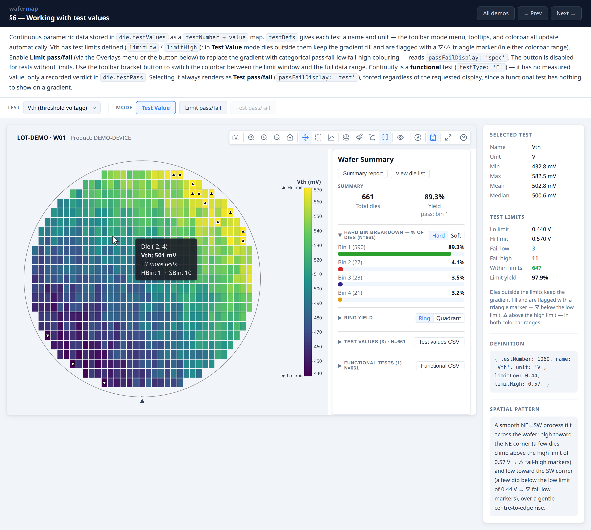

# wafermap


[](https://github.com/wafertools/wafermap/actions/workflows/ci.yml)
[](https://www.npmjs.com/package/@wafertools/wafermap)


[](./LICENSE)



Browser-first wafer map visualization for semiconductor test data.

**Zero runtime dependencies · ~40 kB min+gz (core entry).** Pure ES modules with TypeScript types — works in React, Svelte, Vue, plain HTML, or a Web Worker.

**[Project Portal: Docs & Interactive Demos →](https://wafertools.github.io/wafermap/)**

## Community

Questions, ideas, or want to show off a wafer map you built? Use [GitHub
Discussions](https://github.com/wafertools/.github/discussions).

## Overview

wafermap renders interactive wafer maps from semiconductor prober output. Hard bins, soft bins, test values, retest runs, edge exclusion, and spec limits are native inputs.

- Geometry inference — pass full physical dimensions or raw prober step positions; die pitch, wafer diameter, and coordinate origin are resolved automatically
- `renderWaferMap` — interactive canvas map with toolbar, zoom/pan, tooltips, die selection, and summary panel
- `renderWaferGallery` — lot-level card grid with shared controls and click-to-expand
- Insights tab (`insights: { enabled: true }`) — an in-toolbar chart suite (yield, bin pareto, capability, boxplot, histogram, correlation, scatter) computed from the same wafer/lot data, for one wafer or the whole gallery
- `analyzeWaferMap` / `analyzeWaferLot` — spatial analysis across rings, quadrants, sectors, and reticle positions; failure cluster detection; lot trend series
- Pure ES modules, no server, no runtime dependencies — works in React, Svelte, Vue, plain HTML, or a Web Worker

## Quick start

```bash
npm install @wafertools/wafermap
```

```ts
import { buildWaferMap } from '@wafertools/wafermap';
import { renderWaferMap } from '@wafertools/wafermap/render';

const result = buildWaferMap({
  results: rows.map(r => ({ x: +r.x, y: +r.y, hbin: +r.hbin })),
});

renderWaferMap(document.getElementById('map'), result);
```

Note the two import paths. The renderers (`renderWaferMap`, `renderWaferGallery`,
`toCanvas`) live **only** at `@wafertools/wafermap/render`, so importing them from the
root package will fail. That keeps the root entry DOM-free — usable in Node for a
build-and-analyse pipeline, and tree-shakeable when you only need the geometry, data
and stats layers.

## Docs

**Building an app with wafermap** (developers):

- [Quick start](https://wafertools.github.io/wafermap/quickstart/)
- [Developer Guide](https://wafertools.github.io/wafermap/guide/)
- [SvelteKit](https://wafertools.github.io/wafermap/sveltekit/) · [React](https://wafertools.github.io/wafermap/react/) · [Vue 3](https://wafertools.github.io/wafermap/vue/) integration guides
- [API Reference](https://wafertools.github.io/wafermap/api/)
- [Using wafermap with an AI coding agent](https://wafertools.github.io/wafermap/agents/) — rules to paste into Claude Code / Codex / Copilot / Cursor, also shipped as `AGENTS.md` in this package
- [Architecture](https://wafertools.github.io/wafermap/architecture/) · [Performance](https://wafertools.github.io/wafermap/performance/) · [Troubleshooting](https://wafertools.github.io/wafermap/troubleshooting/)
- [Live examples](https://wafertools.github.io/wafermap/examples/) — or [download them](https://wafertools.github.io/wafermap/wafermap-examples.zip) to run and edit locally, offline, with the library bundled in

**Using an app built with wafermap** (test / device / yield engineers):

- [Application User Guide](https://wafertools.github.io/wafermap/user-guide/) — also embedded in apps via the toolbar help button
- [Glossary](https://wafertools.github.io/wafermap/glossary/)

## Built with wafermap

- **[tsmap](https://github.com/wafertools/tsmap)** — desktop and browser app for loading STDF, ATDF, CSV, JSON, and Parquet wafer data

## Local preview

```bash
npm install
npm run dev
```

Serves the documentation site locally from `docs/`, including the
example pages under `docs/examples/`.
