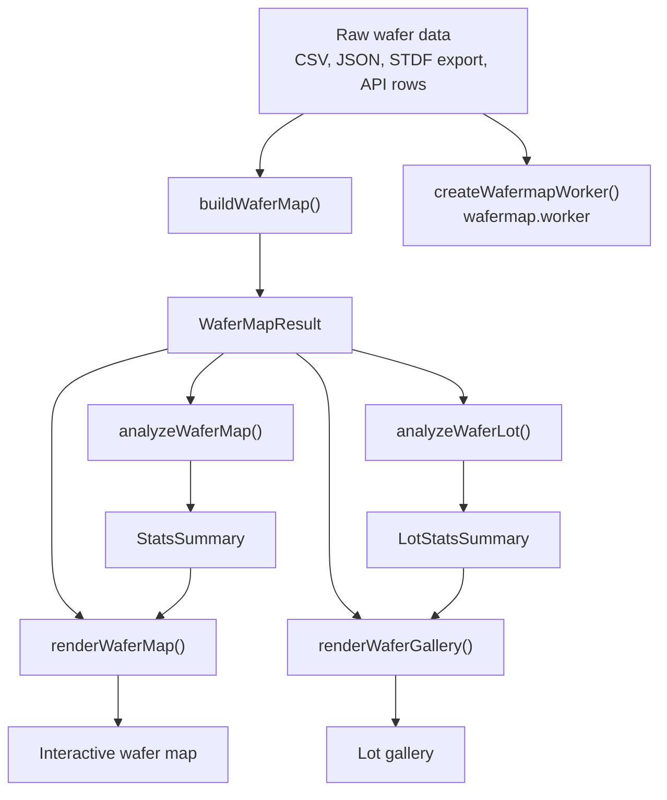
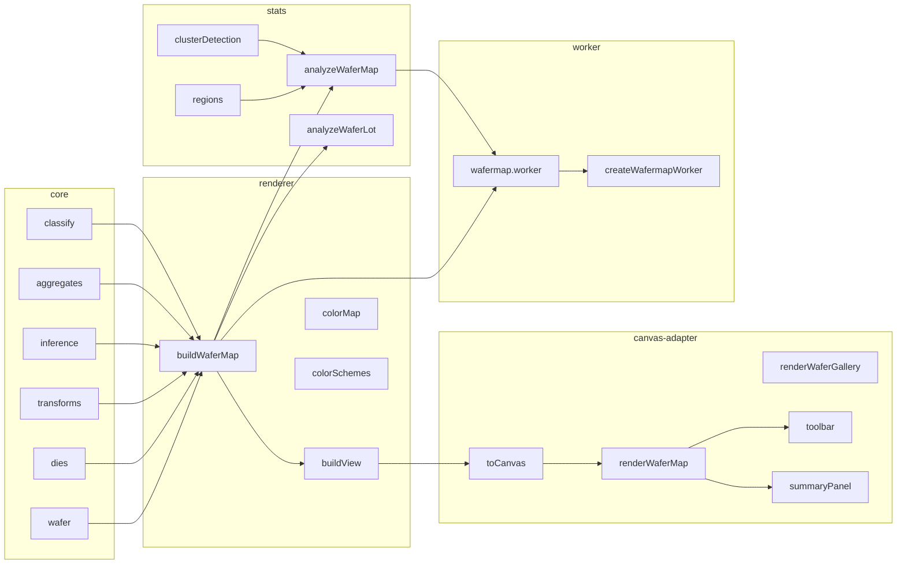
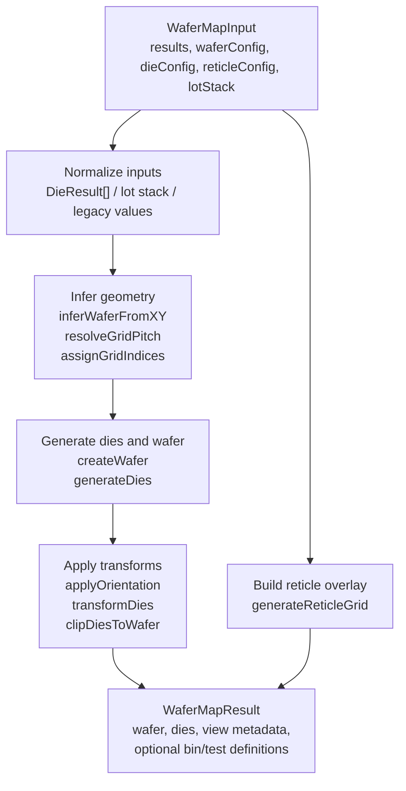
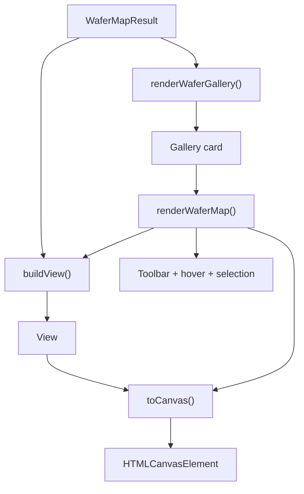
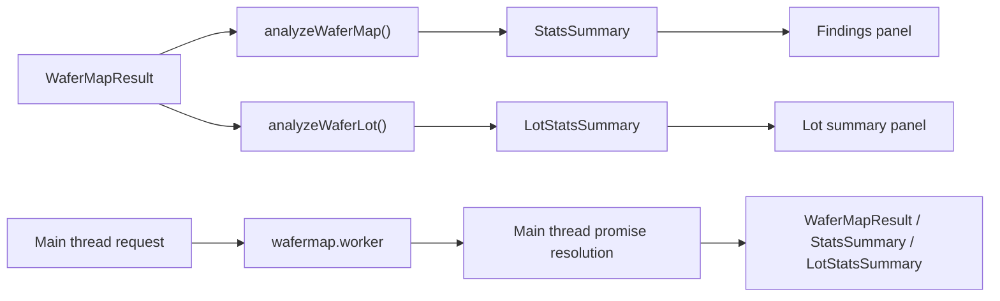

# Architecture

This page explains the structure of `wafermap` from the outside in:

1. what a user passes in,
2. which public entry points handle each job,
3. how the internal modules transform data, and
4. how the rendered and analyzed outputs come back to the UI.

The short version is:

- `buildWaferMap()` turns raw wafer test data into a reusable `WaferMapResult`
- `renderWaferMap()` and `renderWaferGallery()` turn that result into interactive UI
- `analyzeWaferMap()` and `analyzeWaferLot()` turn that result into findings and summaries
- `createWafermapWorker()` lets you move the expensive work off the main thread

## 1. Top-level architecture



**What this shows**

`buildWaferMap()` is the central data constructor. Once you have a `WaferMapResult`, you can render it directly, analyze it, or ship it to a Web Worker wrapper. In normal usage you do not recompute geometry for every display action; you build once, then reuse the result across rendering and analysis.

## 2. Package layers



**What this shows**

The codebase is organized as a stack. `core` is the pure foundation, `renderer` builds the data model used by the UI, `canvas-adapter` owns DOM and interaction, `stats` builds findings, and `worker` mirrors the expensive paths behind message passing. If you are deciding what to import, start with the highest layer that matches your task and drop lower only when you need more control.

## 3. Data construction pipeline



**What this shows**

This is the part of the library that turns loose wafer test data into a structured result. You can provide as much or as little geometry as you know: explicit wafer and die sizes, or just raw `x`/`y` step coordinates. The pipeline infers the missing pieces, generates the die model, applies orientation and clipping, and attaches any reticle overlay that should travel with the map.

## 4. Rendering pipeline



**What this shows**

`buildView()` converts the map result into a drawable scene: rectangles, overlays, labels, colors, and hover targets. `toCanvas()` renders that scene onto a canvas and returns hit-testing and viewport information. `renderWaferMap()` wraps both steps with the interactive toolbar, selection, tooltips, and optional summary panel. `renderWaferGallery()` repeats the same display model across multiple cards and opens a card into the full map renderer when a user clicks it.

## 5. Analysis and worker flow



**What this shows**

The analysis layer consumes the same `WaferMapResult` that the renderer uses. That keeps the UI and the statistics in sync. `analyzeWaferMap()` produces a wafer-level summary, while `analyzeWaferLot()` adds cross-wafer patterns and trend information. If those computations are too heavy for the main thread, the worker entry point packages the same operations behind `postMessage` and `Promise`-based calls.

The worker helper mirrors that shape: you send in a `WaferMapInput` or a batch of `WaferMapResult` objects, and the promise resolves with the computed `WaferMapResult`, `StatsSummary`, or `LotStatsSummary` depending on the request.

## 6. How to choose an entry point

Use these imports as your default decision tree:

```ts
import { buildWaferMap } from '@paulrobins/wafermap';
import { renderWaferMap, renderWaferGallery } from '@paulrobins/wafermap/render';
import { analyzeWaferMap, analyzeWaferLot } from '@paulrobins/wafermap/stats';
import { createWafermapWorker } from '@paulrobins/wafermap/worker';
```

- Use `buildWaferMap()` when you have raw die rows and need a reusable result
- Use `renderWaferMap()` when you want one interactive wafer map
- Use `renderWaferGallery()` when you want a lot-level overview with per-wafer cards
- Use `analyzeWaferMap()` when you need spatial findings for one wafer
- Use `analyzeWaferLot()` when you need cross-wafer lot statistics
- Use `createWafermapWorker()` when the same work should happen off the main thread

If you want the deeper API surface, the [API Reference](API.md) lists every public type and option.
