# Developer Guide — wafermap

This guide walks through building wafer map visualisations in a real application,
from a single interactive map up to a multi-wafer gallery with statistical findings.
It focuses on practical patterns; for the full type reference see [API Reference](API.md).


## 1. Installation and setup

Install the package:

```bash
npm install @paulrobins/wafermap
```

The preferred canvas renderers (`renderWaferMap`, `renderWaferGallery`) have no
external dependencies. Plotly.js is only needed if you use the optional
`toPlotly()` compatibility path.

### With a bundler (Vite, webpack, etc.)

```ts
import { buildWaferMap } from '@paulrobins/wafermap';
import { renderWaferMap } from '@paulrobins/wafermap/canvas-adapter';
import { analyzeWaferMap } from '@paulrobins/wafermap/stats';
```

### Plain HTML (CDN / script tags)

```html
<script type="module">
  import { buildWaferMap } from 'https://cdn.jsdelivr.net/npm/@paulrobins/wafermap/dist/index.js';
  // renderWaferMap, renderWaferGallery, and GalleryItemFactory all come from the same canvas-adapter URL:
  import { renderWaferMap, renderWaferGallery } from 'https://cdn.jsdelivr.net/npm/@paulrobins/wafermap/dist/packages/canvas-adapter/index.js';
</script>
```


## 2. Your first wafer map

The minimal path is two function calls: `buildWaferMap` to process your data, then
`renderWaferMap` to draw it.

```html
<!-- Fixed size: -->
<canvas id="map" style="width:500px; height:500px;"></canvas>

<!-- Responsive square (fills its container, always square): -->
<canvas id="map" style="width:100%; aspect-ratio:1;"></canvas>
```

```ts
import { buildWaferMap } from '@paulrobins/wafermap';
import { renderWaferMap } from '@paulrobins/wafermap/canvas-adapter';

// Minimum input: x/y die grid positions. The library infers everything else.
const { wafer, dies } = buildWaferMap([
  { x:  0, y:  0, hbin: 1 },
  { x:  1, y:  0, hbin: 2 },
  { x:  0, y: -1, hbin: 1 },
  { x:  1, y: -1, hbin: 1 },
  // ... more dies
]);

renderWaferMap(document.getElementById('map'), wafer, dies);

// Optional: react to die clicks. The Die object has x, y, hbin, sbin, testValues.
// renderWaferMap(canvas, wafer, dies, {
//   onClick: (die) => console.log(die.x, die.y, die.hbin),
// });
```

`renderWaferMap` returns immediately and mounts a self-contained interactive map.
A toolbar appears on hover, giving users access to all display controls — no extra
HTML or JavaScript required.

> **`x` and `y` are always die grid positions (prober step coordinates) — integers
> like −7, 0, 5.  They are NOT millimetre values.**  The library converts to physical
> mm internally when you supply a die size.

**→ [Demo: Your first wafer map](examples/01-first-map.html)**


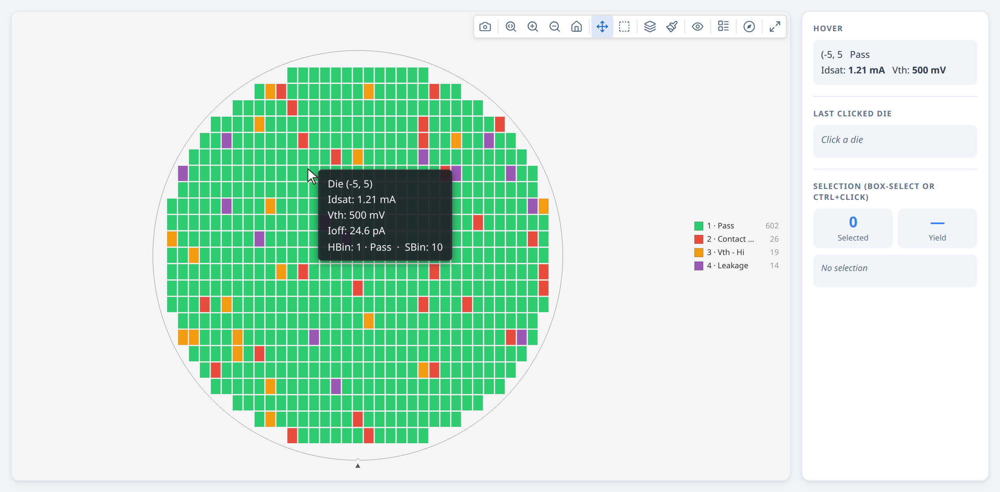

## 3. Loading real data from a CSV

In practice your data comes from a wafer prober log, STDF export, or a CSV pulled
from your database.  A typical row has a wafer ID, die grid position, and one or
more test results.

```
lot,wafer,x,y,hbin,sbin,testA,testB,testC
LOT123,W01,-7,-2,3,45,1.098,0.773,5.758
LOT123,W01,-7,-1,1,10,1.099,0.772,5.966
...
```

Parse the CSV and map each row to a `DieResult`. **All numeric fields must be cast to `number` — CSV parsers return strings, and passing string `"3"` where an integer is expected will silently produce wrong geometry or NaN values.**

```ts
import { buildWaferMap } from '@paulrobins/wafermap';
import { renderWaferMap } from '@paulrobins/wafermap/canvas-adapter';

async function loadAndRender(csvText: string, canvas: HTMLCanvasElement) {
  const rows = parseCsv(csvText);  // your CSV parser of choice

  const results = rows.map(r => ({
    x:          Number(r.x),       // must be number — not string "3"
    y:          Number(r.y),
    hbin:       Number(r.hbin),
    sbin:       Number(r.sbin),
    testValues: { 1010: Number(r.testA), 1020: Number(r.testB), 1030: Number(r.testC) },
  }));

  const { wafer, dies } = buildWaferMap({
    results,
    testDefs: [
      { testNumber: 1010, name: 'TestA' },
      { testNumber: 1020, name: 'TestB' },
      { testNumber: 1030, name: 'TestC' },
    ],
  });
  renderWaferMap(canvas, wafer, dies);
}
```

`x` and `y` are the prober step positions from your equipment — pass them directly,
no unit conversion needed.

**→ [Demo: Loading real data from a CSV](examples/03-csv-data.html)**

Here we have toggled some toolbar options on: XY Axis indicator and Ring boundaries. 


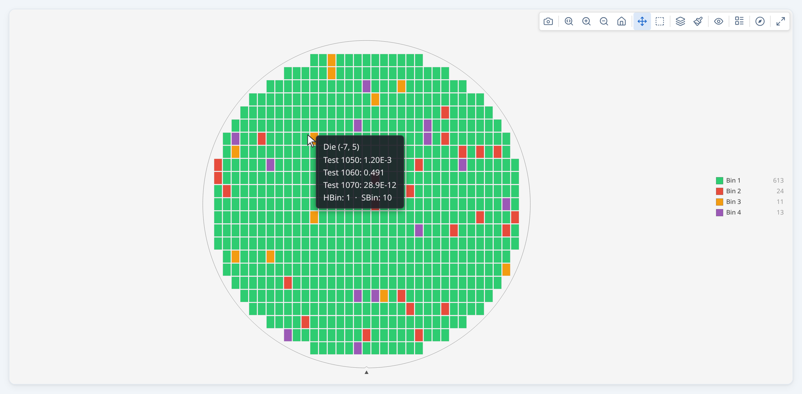

For a real-world dataset, see [Demo: Real wafer defect data (WM-811K)](examples/19-real-data.html), which loads a sample from the WM-811K public dataset and lets you explore the spatial findings engine across known defect pattern types (Center, Donut, Edge-Loc, Scratch, etc.).

## 4. Adding die size and wafer geometry

When you supply physical dimensions, `die.physX` and `die.physY` are in millimetres and the wafer boundary is drawn to scale; `die.x`/`die.y` remain die grid positions (prober step coordinates).

```ts
const { wafer, dies } = buildWaferMap({
  results,
  waferConfig: {
    diameter:  300,                       // mm — 200 or 300 are most common
    notch:     { type: 'bottom' },        // physical alignment notch direction
  },
  dieConfig: {
    width:  10,                           // mm — die X pitch
    height: 10,                           // mm — die Y pitch
  },
});
```

The notch renders as a V-notch on 200 mm+ wafers and as a flat on smaller wafers —
you don't need to specify which.

### When you don't know the geometry

Omit any field you don't know — the library infers what it can:

```ts
// Die size known, diameter unknown → diameter inferred from grid extent
buildWaferMap({ results, dieConfig: { width: 10, height: 10 } });

// Diameter known, die size unknown → die size estimated from diameter ÷ grid extent
buildWaferMap({ results, waferConfig: { diameter: 300 } });

// Nothing known → proportionally correct layout in normalised units
buildWaferMap({ results });
```

Check `result.units` to know which case applied: `'mm'` means physical millimetres;
`'normalized'` means grid-relative units.

### Edge exclusion

```ts
const { wafer, dies } = buildWaferMap({
  results,
  waferConfig: { diameter: 300, edgeExclusion: 3 },  // 3 mm exclusion band
  dieConfig:   { width: 10, height: 10 },
});

console.log(result.yield.yieldPercent);  // excludes edge dies from numerator and denominator
```

Dies within the exclusion band have `die.edgeExcluded = true` and are shown dimmed
on the map.

### Coordinate origins

If your prober uses a non-centred origin, tell the library:

```ts
// All x,y ≥ 0 → auto-detected as lower-left origin (no explicit config needed)
buildWaferMap({ results, dieConfig: { width: 10, height: 10 } });

// Row-based prober: origin at upper-left, Y increases downward
buildWaferMap({
  results,
  dieConfig: { width: 10, height: 10, coordinateOrigin: { type: 'UL' } },
});
```

**→ [Demo: Die size and wafer geometry](examples/04-geometry.html)**


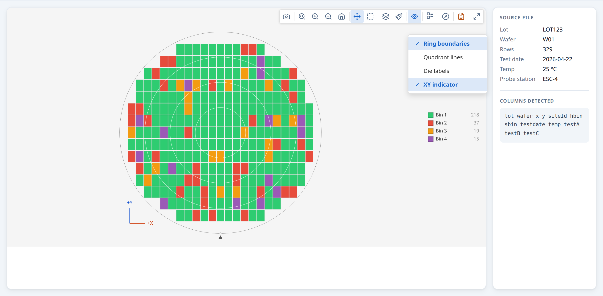


## 5. Working with bins

Bins are the primary pass/fail classification from wafer test equipment.  Hard bins
are the physical sort result; soft bins are the failure category assigned by the
test program.

### Basic bin map

```ts
const results = rows.map(r => ({
  x:    Number(r.x),
  y:    Number(r.y),
  hbin: Number(r.hbin),
}));

const { wafer, dies } = buildWaferMap({ results });
renderWaferMap(canvas, wafer, dies);
// Opens in 'hardBin' mode by default
```

### Named bins with custom colours

Without names, bins are labelled "HBin 1", "HBin 2", etc.  Supply `hbinDefs` for
readable labels and optional colour overrides:

```ts
const { wafer, dies } = buildWaferMap({
  results,
  hbinDefs: [
    { bin: 1, name: 'Pass',          color: '#2ecc71' },
    { bin: 2, name: 'Contact Open',  color: '#e74c3c' },
    { bin: 3, name: 'Vth - Hi NMOS', color: '#e67e22' },
    { bin: 5, name: 'Continuity',    color: '#9b59b6' },
  ],
});

renderWaferMap(canvas, wafer, dies, {
  sceneOptions: { plotMode: 'hardBin', hbinDefs: wafer /* carries through */ },
});
```

> **Tip:** Pass `hbinDefs` into `buildWaferMap`, not just `renderWaferMap`.  The
> stats engine and tooltips both read them from the built result.

### Hard bin and soft bin together

```ts
const results = rows.map(r => ({
  x:    Number(r.x),
  y:    Number(r.y),
  hbin: Number(r.hbin),
  sbin: Number(r.sbin),
}));

const { wafer, dies, scene } = buildWaferMap({
  results,
  hbinDefs: [ { bin: 1, name: 'Pass' }, /* ... */ ],
  sbinDefs: [ { bin: 10, name: 'Vth - Lo' }, { bin: 11, name: 'Vth - Hi' }, /* ... */ ],
});

renderWaferMap(canvas, wafer, dies, {
  sceneOptions: {
    hbinDefs: scene.hbinDefs,
    sbinDefs: scene.sbinDefs,
  },
});
// User can switch between Hard Bin and Soft Bin in the toolbar Mode menu
```

### Pass bins and yield

The library counts yield against `passBins` (default `[1]`).  Change this if your
pass bin isn't 1:

```ts
const { yield: yld } = buildWaferMap({
  results,
  passBins: [1, 100],   // bins 1 and 100 are both counted as pass
});

console.log(`${(yld.yieldPercent * 100).toFixed(1)}%`);
```

**→ [Demo: Working with bins](examples/05-named-bins.html)**


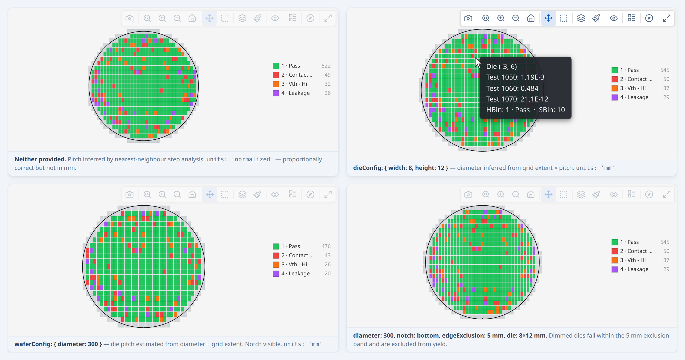

## 6. Working with test values

Three related terms appear together throughout the API — here is how they fit:

| Term | Where it appears | Purpose |
|------|-----------------|---------|
| `testValues: { 1010: 0.95 }` | `DieResult` (input to `buildWaferMap`) | Per-die measurement; key is the integer test number |
| `testDefs: [{ testNumber: 1010, name: 'Vth', unit: 'V' }]` | `buildWaferMap` options | Connects test numbers to human-readable names and units; optional but recommended |
| `testNumbers: [1010, 1020]` | `analyzeWaferMap` options | Filter — limits which tests the stats engine analyses; required only when the data has more tests than you want to analyse |

The integer key in `testValues` and `testDef.testNumber` must match exactly — the library uses these to link measurements to names and to drive the stats engine.

Continuous test measurements (leakage current, threshold voltage, etc.) go in
`testValues` — a map keyed by a stable integer test identity.  `TestDef` is
optional: without it the library uses `Test {N}` (the testNumber) everywhere a
name would appear — mode dropdown, tooltip, colorbar axis, summary panel.  Add
`TestDef` when you want human-readable names, units, and SI prefix formatting:

```ts
const results = rows.map(r => ({
  x:          Number(r.x),
  y:          Number(r.y),
  testValues: {
    1050: Number(r.idsat),
    1060: Number(r.vth),
    1070: Number(r.ioff),
  },
}));

const { wafer, dies, scene } = buildWaferMap({
  results,
  dieConfig: { width: 8, height: 12 },
  testDefs: [
    { testNumber: 1050, name: 'Idsat', unit: 'A' },
    { testNumber: 1060, name: 'Vth',   unit: 'V' },
    { testNumber: 1070, name: 'Ioff',  unit: 'A' },
  ],
});

renderWaferMap(canvas, wafer, dies, {
  sceneOptions: {
    plotMode:  'value',
    activeTest: 0,          // show Idsat first
    testDefs:  scene.testDefs,
  },
});
```

The `testValues` key is any stable integer that uniquely identifies the test — for
example an STDF TEST_NUM, a database test ID, or an application-defined constant.
The key must match the `testNumber` field in the corresponding `TestDef`.

Always pass the SI base unit in `TestDef.unit` (e.g. `'A'`, `'V'`, `'Ω'`, `'F'`).
The formatter applies SI prefixes automatically — `0.03` with unit `'Ω'` displays as
`30 mΩ`. Passing a pre-scaled unit like `'mA'` would produce incorrect labels
(e.g. `30 µmA` instead of `30 nA`).

With `testDefs` in place:
- The toolbar Mode dropdown shows one entry per test by name ("Idsat", "Vth", …) — without `testDefs` it shows "Test 1050", "Test 1060", etc.
- Hover tooltips show "Idsat: 1.23 mA" — without `testDefs` they show "Test 1050: 1.23 mA"
- The colorbar axis label includes the name and unit — without `testDefs` it shows "Test 1050"
- The summary panel Test Values section uses test names — without `testDefs` it uses "Test 1050", etc.

`TestDef.logScale: true` enables log₁₀ scale for that test by default (silently falls back to linear when any die value ≤ 0). The user can also toggle log scale at any time via the toolbar Log scale button, which overrides the per-test default.

### Spec limits on test parameters

Add `limitLow` and/or `limitHigh` to a `TestDef` to specify the engineering specification window. Both are optional independently — one-sided limits are valid. Once limits are defined, two things happen automatically across all plot modes:

**In `value` mode** — out-of-spec dies are highlighted immediately:
- Dies **below** `limitLow` render in <span style="color:#3498db">**blue**</span> instead of the gradient colour
- Dies **above** `limitHigh` render in <span style="color:#e74c3c">**red**</span> instead of the gradient colour
- In-spec dies continue to use the normal colour gradient

The toolbar also gains a **bracket button** (⌥) that toggles the colorbar range between the spec window `[limitLow, limitHigh]` and the actual data range. The default is the spec window so the colorbar always shows where the limits are relative to the data.

**In `specLimit` mode** — a dedicated categorical view:
- Pass (in spec): green (`#2ecc71`)
- Fail low (below LSL): blue (`#3498db`)
- Fail high (above USL): red (`#e74c3c`)
- No data: grey

```ts
const testDefs = [
  { testNumber: 1050, name: 'Idsat', unit: 'A' },
  {
    testNumber: 1060, name: 'Vth', unit: 'V',
    limitLow:  0.44,  // LSL — below this is a spec failure
    limitHigh: 0.57,  // USL — above this is a spec failure
  },
  { testNumber: 1070, name: 'Ioff', unit: 'A' },
];

const { wafer, dies, scene } = buildWaferMap({ results, waferConfig, dieConfig, testDefs });

// Start in specLimit mode for Vth to see pass/fail/direction at a glance
renderWaferMap(canvas, wafer, dies, {
  sceneOptions: {
    plotMode:  'specLimit',
    activeTest: 1060,
    testDefs:  scene.testDefs,
  },
});
```

Spec limits also feed the stats engine: `analyzeWaferMap` populates `summary.stats.testSpecYield` with per-test spec yield, fail-low count, and fail-high count for every test that has at least one limit defined.

**→ [Demo: Working with test values](examples/06-test-values.html)**


## 7. Retests and enriching dies after build

### Handling retests

If your data includes multiple probe results for the same die position (retests),
the library handles them automatically. Four policies are available:

| Policy | Behaviour |
| ------ | --------- |
| `'last'` (default) | Keep the most recent result per position |
| `'first'` | Keep the earliest result per position |
| `'best'` | Keep the best result using `passBins` as the primary criterion: a pass always beats a fail. Within the same pass/fail category, lower `hbin` number wins. Falls back to `'last'` when candidates have no `hbin`. |
| `'worst'` | Keep the worst result: a fail always beats a pass. Within the same category, higher `hbin` number wins. Falls back to `'last'` when candidates have no `hbin`. |

```ts
const { wafer, dies } = buildWaferMap({
  results:      rawResults,  // may contain the same (x,y) more than once
  retestPolicy: 'best',      // keep the best bin result per position
});

// Check which dies were retested:
dies.filter(d => d.retestCount !== undefined)
    .forEach(d => console.log(`(${d.x},${d.y}) retested ${d.retestCount}×`));
```

Retested dies automatically show "Retests: N" in their hover tooltip. `retestCount` is always set regardless of which policy is active — it records how many times that position appeared in the input.

### Post-enrichment (attaching extra values after the map is built)

Sometimes you need to attach data that isn't in the same table as the grid
positions — for example, merging test values from a separate parametric table into
a map already built from a bin summary:

```ts
import { buildWaferMap, getDieKey } from '@paulrobins/wafermap';

// Step 1: build the map from the bin data
const result = buildWaferMap({ results: binRows.map(r => ({
  x: Number(r.x), y: Number(r.y), hbin: Number(r.hbin),
})), dieConfig: { width: 10, height: 10 } });

// Step 2: build a lookup from the parametric table
const paramMap = new Map(paramRows.map(r => [getDieKey({ x: Number(r.x), y: Number(r.y) }), r]));

// Step 3: enrich dies in place
const enrichedDies = result.dies.map(die => {
  const row = paramMap.get(getDieKey(die));
  if (!row) return die;
  return { ...die, testValues: { 1050: Number(row.idsat), 1060: Number(row.vth) } };
});

renderWaferMap(canvas, result.wafer, enrichedDies, {
  sceneOptions: {
    testDefs: [
      { testNumber: 1050, name: 'Idsat', unit: 'A' },
      { testNumber: 1060, name: 'Vth',   unit: 'V' },
    ],
  },
});
```

> Always use `getDieKey(die)` for lookups rather than manually formatting `"${die.x},${die.y}"` —
> it guarantees the correct format after any grid offset correction.


**→ [Demo: Working with retested dies](examples/07-retests.html)**


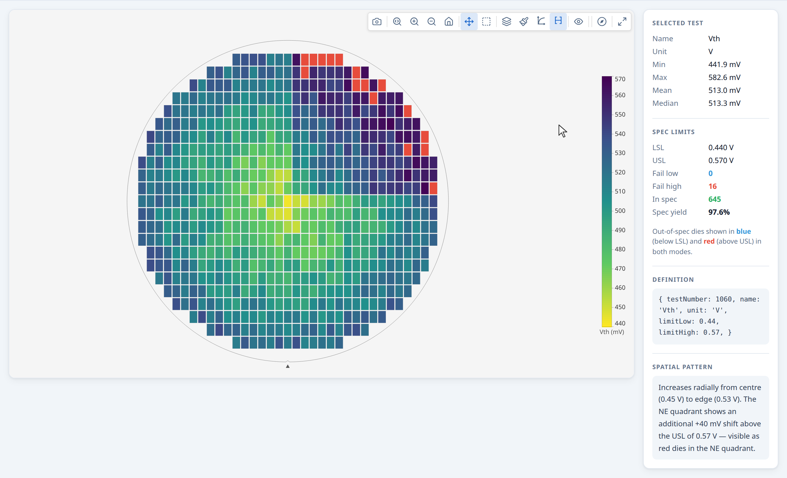

## 8. Controlling the display

### Initial display options

Pass `sceneOptions` to `renderWaferMap` to set the initial state:

```ts
renderWaferMap(canvas, wafer, dies, {
  sceneOptions: {
    plotMode:                'hardBin',
    colorScheme:             'color',       // 'color', 'greyscale', 'accessible', 'plasma', 'inferno'
    showRingBoundaries:      true,
    showQuadrantBoundaries:  false,
    showText:                false,         // die index labels
    showXYIndicator:         true,
    ringCount:               4,
    rotation:                0,             // 0, 90, 180, 270
    flipX:                   false,
    flipY:                   false,
    legendPosition:             'default',     // 'default'|'compact'|'left'|'top'|'bottom'|'floating'
  },
});
```

All of these can also be changed by the user via the toolbar at any time.

### Programmatic control

`renderWaferMap` returns a controller you can call from application code:

```ts
const ctrl = renderWaferMap(canvas, wafer, dies, { sceneOptions: { plotMode: 'hardBin' } });

// Switch display mode:
ctrl.setOptions({ plotMode: 'value', activeTest: 1 });

// Replace die data (e.g. after a data reload) — preserves zoom/pan:
ctrl.setDies(newDies);

// Read current state:
const opts = ctrl.getOptions();
console.log(opts.plotMode, opts.colorScheme);

// Return to default zoom:
ctrl.resetZoom();

// Clean up when the component unmounts:
ctrl.destroy();
```

### Syncing with external UI controls

Use `onSceneOptionsChange` to keep your own UI elements in sync with the toolbar:

```ts
const ctrl = renderWaferMap(canvas, wafer, dies, {
  sceneOptions: { plotMode: 'hardBin' },
  onSceneOptionsChange: (opts) => {
    modeDropdown.value     = opts.plotMode;
    schemeDropdown.value   = opts.colorScheme;
    ringsCheckbox.checked  = opts.showRingBoundaries ?? false;
  },
});

// When your own control changes, push it back:
modeDropdown.addEventListener('change', () => {
  ctrl.setOptions({ plotMode: modeDropdown.value });
});
```

> `onSceneOptionsChange` fires only when the toolbar changes options.  Calling
> `ctrl.setOptions()` programmatically does NOT re-fire it, so there is no
> feedback loop.

### Hiding the toolbar

If you want a static display with no toolbar:

```ts
renderWaferMap(canvas, wafer, dies, {
  showToolbar: false,
  sceneOptions: { plotMode: 'hardBin' },
});
```

Or keep the toolbar but remove the mode selector (useful when your app manages the
mode externally):

```ts
renderWaferMap(canvas, wafer, dies, {
  showPlotModeSelector: false,
  sceneOptions: { plotMode: 'value' },
  onSceneOptionsChange: (opts) => syncMyModeUI(opts),
});
```
**→ [Demo: Controlling the display](examples/08-display-control.html)**


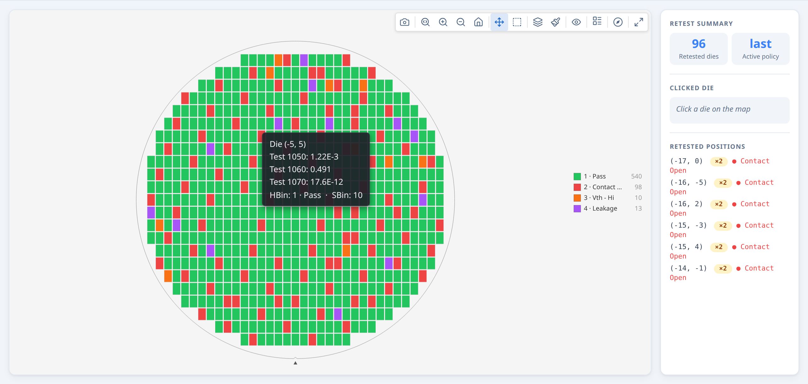

### Bin legend position

In `hardBin` and `softBin` modes, the bin legend can be placed in six positions via the **Legend style** toolbar button or the `legendPosition` option:

| Value | Behaviour |
| --- | --- |
| `'default'` | Vertical list on the right (full labels + counts). Auto-adapts: switches to `compact` below 280 px canvas width, `floating` below 180 px. |
| `'compact'` | Vertical list on the right (bin numbers only) |
| `'left'` | Vertical list on the left (full labels + counts) |
| `'top'` | Horizontal strip above the wafer (multi-column, auto-fitted) |
| `'bottom'` | Horizontal strip below the wafer (multi-column, auto-fitted) |
| `'floating'` | Draggable overlay, initially bottom-right (full labels + counts) |

Set the initial position via `sceneOptions` — the user can change it at any time via the toolbar:

```ts
renderWaferMap(canvas, wafer, dies, {
  sceneOptions: { plotMode: 'hardBin', legendPosition: 'bottom' },
});
```

The Legend style button is automatically disabled when the map is in `value` or stacked mode, since those modes use a continuous colorbar instead of a bin legend.

For galleries, `legendPosition` is a top-level `GalleryOptions` field and applies to all cards:

```ts
renderWaferGallery(container, items, {
  legendPosition: 'compact',
});
```

### Toolbar reference

The toolbar appears on hover over a single map, or as a persistent bar above the
gallery grid.  Which buttons appear depends on the context and the current data.

#### Single map toolbar


| | Button | Condition | What it does |
| --- | --- | --- | --- |
|  | Download PNG | Always | Saves the current canvas at current zoom/rotation |
|  | Zoom mode | Always | Drag to zoom into a region |
|  | Pan mode | Always | Drag to pan |
|  | Box select | Only when `onSelect` is provided | Drag to select a group of dies |
|    | Zoom in / Zoom out / Reset | Always | Step zoom; Reset returns to fitted view |
|  | Plot mode | Unless `showPlotModeSelector: false` | Opens mode menu: Test Value, Hard Bin, Soft Bin, Spec Limit, and Stacked modes (only when map was built with `lotStack`) |
|  | Colour palette | Always | Cycles through registered colour schemes |
|  | Log scale | Value / stacked-values mode only | Toggles log₁₀ colour normalisation; disabled when min ≤ 0 |
|  | Colorbar range | Value mode, test has `limitLow` or `limitHigh` | Toggles between spec-limit range (blue/red out-of-spec) and data range |
|  | Ring boundaries | Always | Overlays concentric ring zones |
|  | Quadrant boundaries | Always | Overlays NE/NW/SW/SE quadrant lines |
|  | Die labels | Always | Shows die index labels on each die |
|  | Reticle overlay | Only when `sceneOptions.reticles` is present | Toggles stepper field grid |
|  | XY indicator | Always | Toggles the axis arrow overlay |
|  | Legend style | Hard bin or soft bin mode only | Cycles legend position: default, compact, left, top, bottom, floating |
|  | Rotate 90° CW | Always | Rotates the wafer display 90° clockwise |
|  | Flip horizontal | Always | Mirrors the map left-right |
|  | Flip vertical | Always | Mirrors the map top-bottom |
|  | Summary panel | Only when `statsSummary` is provided | Toggles the findings and stats panel |

The full toolbar is shown when `toolbarControls` is `'full'` (default for `renderWaferMap`).
Gallery card modals also use `'full'`.  Gallery cards themselves use `'view-only'`:
only download, zoom/pan/select, and zoom in/out/reset are shown — mode and overlay
controls are in the shared gallery bar instead.

#### Gallery control bar


The gallery control bar is always visible above the card grid.

| | Button | Condition | What it does |
| --- | --- | --- | --- |
|  | Plot mode | Unless `showPlotModeSelector: false` | Same mode menu as single map; stacked modes always available in the gallery |
|  | Colour palette | Always | Applies to all cards |
|  | Aggregation method (Σ) | Stacked Test Values mode only | Selects mean, median, std dev, min, max, or count; re-aggregates all cards immediately |
|  | Log scale | Value / stacked-values mode only | Applies to all cards |
|  | Ring boundaries | Always | Applies to all cards |
|  | Quadrant boundaries | Always | Applies to all cards |
|  | Die labels | Always | Applies to all cards |
|  | Reticle overlay | Only when any item has `hasReticle: true` | Applies to all cards |
|  | XY indicator | Always | Applies to all cards |
|  | Legend style | Hard bin or soft bin mode only | Applies to all cards |
|  | Rotate 90° CW | Always | Applies to all cards |
|  | Flip horizontal | Always | Applies to all cards |
|  | Flip vertical | Always | Applies to all cards |
|  | Download all | Always | Exports all cards as a single tiled PNG |
|  | Lot findings | Only when `lotStatsSummary` is provided | Toggles the lot-level summary and findings panel |


## 9. Responding to user interaction

### Click and hover callbacks

```ts
renderWaferMap(canvas, wafer, dies, {
  onClick: (die, event) => {
    console.log(`Clicked die (${die.x}, ${die.y})`);
    console.log('Hard bin:', die.hbin);
    console.log('Test values:', die.testValues);
    showDetailPanel(die);
  },
  onHover: (die, event) => {
    if (die) updateStatusBar(`(${die.x}, ${die.y})`);
    else     clearStatusBar();
  },
});
```

`onClick` and `onHover` receive the full `Die` object — `die.x`, `die.y`, `die.testValues`,
`die.hbin`, `die.sbin`, and any metadata you attached.  `onHover` receives `null` when the cursor
leaves a die.

### Box selection

Provide `onSelect` to enable box-select mode.  A selection button appears in the
toolbar automatically:

```ts
renderWaferMap(canvas, wafer, dies, {
  onSelect: (selectedDies) => {
    console.log(`${selectedDies.length} dies selected`);
    const passing = selectedDies.filter(d => d.hbin === 1).length;
    showSelectionStats({ count: selectedDies.length, passing });
  },
});
```

Users can also click individual dies, Ctrl/Cmd+click to add to the selection, and
press Esc to clear.

### Programmatic selection

```ts
// Highlight a specific set of dies (e.g. from a table click):
const failingDies = result.dies.filter(d => d.hbin === 2);
ctrl.setSelection(failingDies);

// Clear:
ctrl.clearSelection();
```
**→ [Demo: Responding to user interaction](examples/09-interaction.html)**


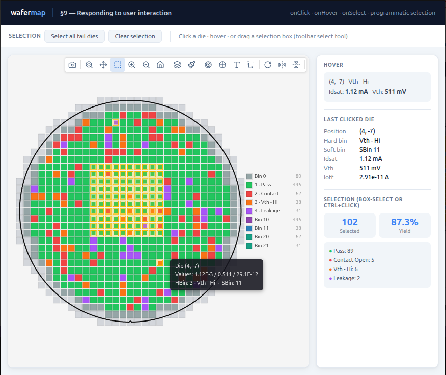

## 10. Adding statistical findings

The statistics engine (`analyzeWaferMap`) scans for spatial patterns across five families: rings, quadrants, angular sectors, contiguous failure clusters, and edge arcs. For each family it compares the local zone to the rest of the wafer using a statistical test appropriate to the variable type.

### Five-minute walkthrough

This is a complete, runnable Node.js script — no browser or DOM needed. It covers
the full path from raw CSV rows to printed findings. Copy, adjust the field names
to match your data, and run with `node analyse.mjs`.

```js
// analyse.mjs
import { readFileSync } from 'node:fs';
import { buildWaferMap }   from '@paulrobins/wafermap';
import { analyzeWaferMap } from '@paulrobins/wafermap/stats';  // /stats subpath — not root

// ── 1. Parse CSV ────────────────────────────────────────────────────────────
const lines  = readFileSync('data/wafers.csv', 'utf8').trim().split('\n');
const header = lines[0].split(',');
const col    = (row, name) => row[header.indexOf(name)];

const rows = lines.slice(1).map(line => {
  const r = line.split(',');
  return {
    wafer:  col(r, 'wafer'),           // e.g. "W01"
    x:      Number(col(r, 'x')),       // die grid position — integer, not mm
    y:      Number(col(r, 'y')),
    hbin:   Number(col(r, 'hbin')),    // hard bin number
    // testValues keys are integer test numbers, not column names:
    testValues: { 1010: Number(col(r, 'testA')) },
  };
});

// ── 2. Group rows by wafer ID ───────────────────────────────────────────────
const byWafer = new Map();
for (const row of rows) {
  if (!byWafer.has(row.wafer)) byWafer.set(row.wafer, []);
  byWafer.get(row.wafer).push(row);
}

// ── 3. Build + analyse each wafer ──────────────────────────────────────────
for (const [waferId, waferRows] of byWafer) {
  const result = buildWaferMap({
    results:  waferRows,
    passBins: [1],   // hbin=1 is pass
    testDefs: [{ testNumber: 1010, name: 'TestA', unit: 'V' }],
    // waferConfig and dieConfig are optional — the library infers geometry from the grid
  });

  // analyzeWaferMap accepts the full WaferMapResult; passBins is inferred automatically.
  const summary = analyzeWaferMap(result);

  // findings is pre-sorted: 'unusual' first, then 'notable', then 'info'.
  const top = summary.findings[0];
  const yld = summary.stats.yieldPercent;

  console.log(
    `${waferId}  yield=${yld !== null ? (yld * 100).toFixed(1) + '%' : 'n/a'}` +
    `  findings=${summary.findings.length}` +
    (top ? `  [${top.severity}] ${top.summary}` : ''),
  );
}

// Example output:
//   W01  yield=87.3%  findings=3  [unusual] Ring 4 (edge) yield is lower than the rest of the wafer
//   W02  yield=84.1%  findings=2  [notable] The NE quadrant shows reduced yield.
//   W03  yield=91.0%  findings=1  [info] Mean TestA in Ring 3 (edge) is lower than the rest of the wafer.
```

**What each finding object looks like** — `summary.findings[0]` for reference:

```js
{
  id:       'ring:Ring 4 (edge)',
  level:    'wafer',
  severity: 'unusual',            // 'unusual' > 'notable' > 'info'
  variable: { kind: 'yield', label: 'Yield' },
  comparison: { family: 'ring', left: 'Ring 4 (edge)', right: 'Rest of wafer' },
  effect:   { direction: 'lower', absoluteDelta: -0.18, relativeDelta: -0.62 },
  stats:    { method: 'z', pValue: 0.003, adjustedPValue: 0.009,
              sampleSizeLeft: 48, sampleSizeRight: 412 },
  summary:  'Ring 4 (edge) yield is lower than the rest of the wafer',
  highlight: { kind: 'region', regionFamily: 'ring', keys: ['Ring 4 (edge)'] },
}
```

Use `finding.summary` for display text. Use `finding.highlight` to programmatically
select or colour dies associated with the finding.

### Basic usage

```ts
import { buildWaferMap } from '@paulrobins/wafermap';
import { renderWaferMap } from '@paulrobins/wafermap/canvas-adapter';
import { analyzeWaferMap } from '@paulrobins/wafermap/stats';  // note: /stats subpath, not root

const result  = buildWaferMap({ results, waferConfig, dieConfig, passBins: [1] });
const summary = analyzeWaferMap(result);   // passBins inferred from result — no need to repeat it

renderWaferMap(canvas, result.wafer, result.dies, {
  statsSummary: summary,
});
```

When you pass a `WaferMapResult` to `analyzeWaferMap`, the `passBins` you gave to
`buildWaferMap` are carried through automatically — you only need to set `passBins`
explicitly in `analyzeWaferMap` options if you want to override them.

The `summary.findings` array is sorted by severity — `'unusual'` first, `'notable'`
next, `'info'` last. To get the single highest-severity finding:

```ts
const top = summary.findings[0];  // highest severity; undefined when no findings
if (top) {
  console.log(`[${top.severity}] ${top.summary}`);
  // e.g. "[unusual] Ring 4 (edge) yield is lower than the rest of the wafer"
}
```

A "Findings" button (notebook icon) appears in the toolbar when `statsSummary` is
provided.  Clicking it opens the summary panel, which lists all detected findings
grouped by severity alongside yield, bin, and test statistics.


### What gets analysed

By default the engine checks every combination of:

- **Ring zones** — each concentric ring vs. the rest of the wafer
- **Quadrant zones** — each of NE/NW/SE/SW vs. the rest of the wafer
- **Angular sectors** — 16 compass-direction sectors (N, NNE, NE, …) vs. the rest of the wafer; finer directional resolution than quadrants, catching drift patterns a single quadrant would dilute
- **Reticle-field positions** — each reticle cell vs. other cells (only when a `reticleConfig` was used)
- **Failure clusters** — contiguous groups of failing dies that are denser than the wafer-wide background failure rate; each cluster highlighted as a specific set of dies
- **Edge arcs** — failure clusters whose centroid is near the wafer perimeter and whose angular span is narrow; distinguished from full-ring edge effects (which ring analysis catches separately)

For each spatial family the engine tests: yield, hard bin rate per bin, soft bin rate per bin, and mean test value per test.

**Angular sectors in detail.** Sector analysis divides the wafer into compass-named angular slices — N, NNE, NE, ENE, E, … (16 sectors by default).  Each sector is compared to the rest of the wafer independently, giving finer directional resolution than quadrants: a drift pattern concentrated in the NE corner shows up as a sector finding even if the wider NE quadrant is diluted by clean dies elsewhere in that quarter.  Dies within 0.2 normalised radius of the wafer centre are excluded from sector analysis (they are too close to the centre to be meaningfully attributed to a direction).  The number of sectors is controlled by `sectorCount` (4, 8, 16, or 32); the feature can be disabled entirely with `enableAngularAnalysis: false`.

Findings are suppressed unless they pass both an adjusted p-value threshold and an effect size gate. The effect size gate uses two complementary criteria — absolute and relative — so that meaningful patterns are not missed on wafers with either high or low background failure rates.

### Interpreting findings and severity

The findings list is ranked and filtered by statistical strength and effect size:

- **p-value correction:** adjusted p-values are used (default `significanceLevel` = 0.05), corrected per-family using a Benjamini–Hochberg FDR procedure.
- **Effect size gate for yield/bin/cluster findings:** a finding passes if it satisfies at least one of:
  - absolute `|delta| ≥ minimumEffectSize` (default 0.15, i.e. a 15 percentage-point difference), **or**
  - relative `|delta / background| ≥ minimumRelativeEffect` (default 0.5, i.e. 50% above or below the wafer-wide background rate)

  The relative criterion matters on low-failure-rate wafers. With a 2% background rate, a 2 percentage-point elevation is only 0.02 in absolute terms (below the 0.15 threshold) but represents a 100% relative deviation — clearly significant. Without the relative criterion that finding would be silently dropped.

- **Effect size for test-value findings:** Cohen's d (pooled SD). Only `minimumEffectSize` applies; relative effect is not used for continuous measurements.
- **Minimum sample size** per region defaults to 5 (`minimumSampleSize`). Regions smaller than this are not tested.

**Severity** is derived from the adjusted p-value and the strongest satisfied effect criterion:

| Severity | p-value | Absolute delta | or Relative delta |
|----------|---------|----------------|-------------------|
| `unusual` | ≤ 0.01 | ≥ 0.25 | ≥ 2.0× background |
| `notable` | ≤ 0.05 | ≥ 0.15 | ≥ 1.0× background |
| `info` | any other passing finding | | |

**Cluster and edge-arc findings** have an additional size criterion applied after the rate-based gate above.  A large contiguous cluster is intrinsically striking even when the background failure rate is elevated (e.g. a 500-die donut ring that forms its own high background).  The size thresholds are:

| Severity | Cluster size (% of eligible wafer dies) |
|----------|-----------------------------------------|
| `unusual` | ≥ 10% |
| `notable` | ≥ 3% |

A cluster qualifies for a severity level if it satisfies **either** the rate criterion **or** the size criterion (both require the p-value gate).

Use the `summary`, `effect`, and `stats` fields on each `StatsFinding` to display numerical details to users.

### Clicking a finding highlights the map

When the user clicks a finding row in the panel, the map automatically:
1. Switches to the most relevant display mode (value mode for test findings, bin
   mode for bin findings)
2. Highlights the affected die zone with an amber overlay

Clicking the finding again clears the highlight.

### Controlling what is analysed

```ts
const summary = analyzeWaferMap(result, {
  ringCount:                 4,      // must match the renderer's ringCount
  passBins:                  [1],
  significanceLevel:         0.05,   // adjusted p-value threshold
  minimumEffectSize:         0.15,   // min absolute |delta| for proportion findings
  minimumRelativeEffect:     0.5,    // min relative |delta / background| for proportion findings
                                     // a finding passes if it satisfies either this OR minimumEffectSize
  minimumSampleSize:         5,      // min dies per region to test
  enableYieldAnalysis:       true,
  enableHardBinAnalysis:     true,
  enableSoftBinAnalysis:     true,
  enableTestValueAnalysis:   true,
  enableReticlePositionAnalysis: true,  // auto-disabled when no reticle config
  enableAngularAnalysis:     true,   // 16-sector directional analysis
  enableClusterAnalysis:     true,   // contiguous failure cluster + edge arc detection
  sectorCount:               16,     // 4 | 8 | 16 | 32
  minimumClusterSize:        3,      // min contiguous failing dies for a cluster finding
});
```

#### Cluster and edge-arc highlights

Cluster and edge-arc findings use `{ kind: 'dies' }` highlights — they identify the exact set of failing dies, not a region. Clicking one in the summary panel highlights those specific dies on the map:

```ts
const clusters = filterFindings(summary, { family: 'cluster' });
const arcs     = filterFindings(summary, { family: 'edge-arc' });
const sectors  = filterFindings(summary, { family: 'sector' });

// Each cluster finding's highlight carries the exact die keys:
for (const f of clusters) {
  console.log(f.comparison.left);    // e.g. "Cluster at (3, 2)"
  console.log(f.highlight.dieKeys);  // ['3,2', '4,2', '3,3', ...]
}
```

### Reading findings in code

Each finding is a `StatsFinding` with a human-readable `summary` and structured
data you can use in your own UI:

```ts
for (const finding of summary.findings) {
  console.log(finding.severity);          // 'unusual' | 'notable' | 'info'
  console.log(finding.summary);           // "Ring 3 (edge) yield is lower than the rest of the wafer"
  console.log(finding.variable.kind);     // 'yield' | 'hardBin' | 'softBin' | 'test'
  console.log(finding.effect.absoluteDelta);  // signed magnitude of the effect
  console.log(finding.stats.adjustedPValue);  // BH-adjusted p-value
}
```

`summary.findings` is sorted by severity — `'unusual'` first, then `'notable'`, then `'info'`.
`findings[0]` is always the highest-severity finding; no manual sort needed.

### Updating findings after a data change

```ts
// After replacing die data:
ctrl.setDies(newDies);
const newSummary = analyzeWaferMap({ ...result, dies: newDies });
ctrl.setStatsSummary(newSummary);
```

**→ [Demo: Statistical findings](examples/10-findings.html)**


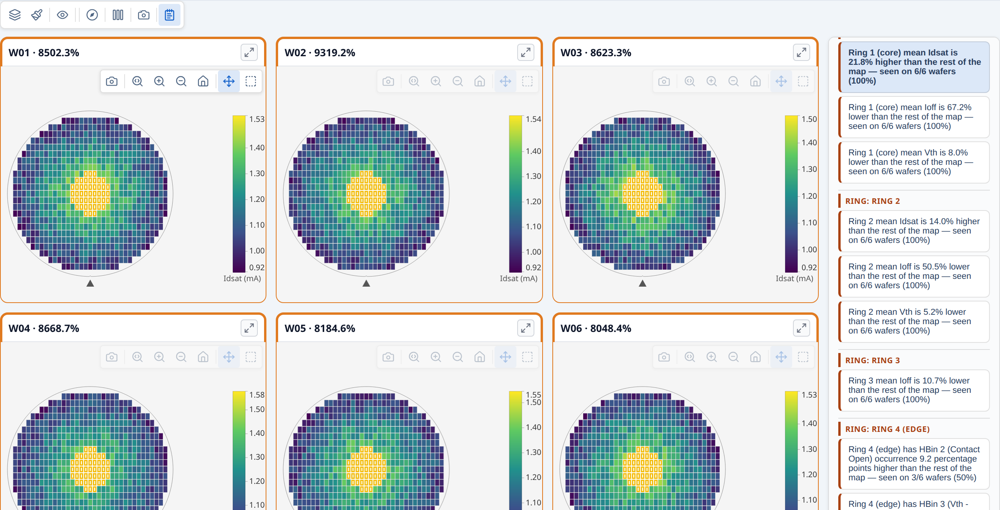

## 11. Summary panel

The summary panel is a persistent results panel that sits alongside the wafer map.
It shows yield, bin distribution, ring and quadrant statistics, test value summaries,
and the full findings list — all in one place without requiring the user to open the
toolbar findings button.

### Adding a summary panel to a single map

Pass `statsSummary` to `renderWaferMap` and the findings button appears in the toolbar
automatically.  The panel is hidden by default; clicking the button toggles it open:

```ts
import { buildWaferMap } from '@paulrobins/wafermap';
import { renderWaferMap } from '@paulrobins/wafermap/canvas-adapter';
import { analyzeWaferMap } from '@paulrobins/wafermap/stats';

const result  = buildWaferMap({ results, waferConfig, dieConfig, passBins: [1] });
const summary = analyzeWaferMap(result);

renderWaferMap(canvas, result.wafer, result.dies, {
  statsSummary: summary,
});
```

To start with the panel already open (no toolbar click required), add
`summaryPanel: { defaultOpen: true }`:

```ts
renderWaferMap(canvas, result.wafer, result.dies, {
  statsSummary: summary,
  summaryPanel: { defaultOpen: true },
});
```

The toolbar findings button reflects the current open/closed state, and the user can
still toggle the panel closed via that button.  Combine with a `placement` to pin the
panel to a specific side of the canvas without the toggle behaviour:

```ts
renderWaferMap(canvas, result.wafer, result.dies, {
  statsSummary: summary,
  summaryPanel: { placement: 'right' },   // always visible; no toggle
});
```

### What the panel shows

The panel is divided into sections:

| Section | Content |
| --- | --- |
| **Yield** | Pass count, fail count, yield %, edge-excluded count |
| **Hard Bins** | Count and percentage per bin; colour-coded |
| **Soft Bins** | Count and percentage per soft bin (when sbin data is present) |
| **Ring analysis** | Per-ring yield breakdown (Ring 1 = centre, Ring N = edge) |
| **Quadrant analysis** | Per-quadrant yield and die count |
| **Test values** | Min, mean, max per test parameter — labelled by `TestDef.name` when provided, otherwise `Test {N}` using the testNumber |
| **Findings** | All `StatsFinding` entries grouped by severity — clicking a finding highlights the affected die zone on the map |

### Updating the panel after data changes

```ts
const ctrl = renderWaferMap(canvas, result.wafer, result.dies, { statsSummary: summary });

// After a data reload:
ctrl.setDies(newDies);
const newSummary = analyzeWaferMap({ ...result, dies: newDies });
ctrl.setStatsSummary(newSummary);
```

### Summary panel in a gallery

Each gallery card carries its own `statsSummary`.  When the user opens a card modal
(expand ↗), the modal's summary panel shows that card's per-wafer summary:

```ts
const items = waferResults.map((r, i) => ({
  wafer:        r.wafer,
  dies:         r.dies,
  label:        `Wafer ${i + 1}`,
  statsSummary: analyzeWaferMap(r),
}));

renderWaferGallery(container, items, {
  sceneOptions: { plotMode: 'hardBin', hbinDefs, sbinDefs, testDefs },
});
```

**→ [Demo: Summary panel](examples/11-summary-panel.html)**


## 12. Building a lot gallery

`renderWaferGallery` renders multiple wafer maps in a responsive card grid.  All
cards share a single control bar — changing mode, colour, rotate, or flip applies
to every card at once.

### Basic gallery

```ts
import { buildWaferMap } from '@paulrobins/wafermap';
import { renderWaferGallery } from '@paulrobins/wafermap/canvas-adapter';

// Build a result per wafer
const waferResults = waferDatasets.map(data =>
  buildWaferMap({
    results:     data.map(r => ({ x: +r.x, y: +r.y, hbin: +r.hbin, sbin: +r.sbin })),
    waferConfig: { diameter: 300, notch: { type: 'bottom' } },
    dieConfig:   { width: 10, height: 10 },
    hbinDefs,
    sbinDefs,
  })
);

// Build gallery items
const items = waferResults.map((r, i) => ({
  wafer: r.wafer,
  dies:  r.dies,
  label: `Wafer ${i + 1}`,
}));

const ctrl = renderWaferGallery(
  document.getElementById('gallery'),
  items,
  { sceneOptions: { plotMode: 'hardBin' } },
);
```

Cards reflow responsively as the container resizes.  Each card has an expand
button (↗) in its header — clicking it opens a full-screen modal with the
complete toolbar.


### Sharing bin and test definitions across cards

Pass `hbinDefs`, `sbinDefs`, and `testDefs` through `sceneOptions` so the shared
bin legend and tooltips use the correct names on every card:

```ts
const sharedSceneOptions = {
  plotMode:  'hardBin',
  hbinDefs: [
    { bin: 1, name: 'Pass',  color: '#2ecc71' },
    { bin: 2, name: 'Fail',  color: '#e74c3c' },
  ],
  sbinDefs: [
    { bin: 10, name: 'Vth - Lo' },
    { bin: 11, name: 'Vth - Hi' },
  ],
  testDefs: [
    { testNumber: 1050, name: 'Idsat', unit: 'A' },
    { testNumber: 1060, name: 'Vth',   unit: 'V' },
  ],
};

renderWaferGallery(container, items, { sceneOptions: sharedSceneOptions });
```

### Per-card overrides

Each `GalleryItem` can override any `sceneOptions` field.  The per-card value is
merged on top of the shared options.  Use this sparingly — the main purpose is
providing per-card reticle geometry:

```ts
const items = waferResults.map((r, i) => ({
  wafer:        r.wafer,
  dies:         r.dies,
  label:        `Wafer ${i + 1}`,
  hasReticle:   r.reticles.length > 0,
  sceneOptions: { reticles: r.reticles },   // per-card reticle geometry
}));
```

### Click and select callbacks

```ts
const items = waferResults.map((r, i) => ({
  wafer: r.wafer,
  dies:  r.dies,
  label: `W${i + 1}`,
  onClick:  (die) => showDieDetail(die, i),
  onSelect: (dies) => showSelectionPanel(i, dies),
}));
```

### Updating the gallery after data changes

```ts
// Rebuild after the user changes wafer selection:
ctrl.setItems(newItems);

// Sync display mode from an external control:
ctrl.setOptions({ plotMode: 'value', activeTest: 1 });

// Track state changes back to your UI:
renderWaferGallery(container, items, {
  onSceneOptionsChange: (opts) => {
    myModeDropdown.value = opts.plotMode;
  },
});
```

### Stacked lot maps

The gallery toolbar includes three stacked modes that aggregate the full lot into a
single view — one card per bin or per test parameter.  Switch mode via the **mode
picker** in the gallery control bar:

| Mode | What each card shows |
| --- | --- |
| **Stacked Test Values** | Per-die mean (or median, std dev, min, max) across all wafers |
| **Stacked Hard Bins** | Per-die count of wafers on which that hard bin appeared |
| **Stacked Soft Bins** | Per-die count of wafers on which that soft bin appeared |

Switching to a stacked mode rebuilds the card set automatically; switching back
restores the original per-wafer cards.

**Aggregation method.** For Stacked Test Values the default aggregation is `mean`.
Change it via the **Σ button** in the gallery control bar (visible only in this mode),
or programmatically:

```ts
ctrl.setOptions({ aggrMethod: 'median' });  // re-aggregates immediately
```

**Zero-config discovery.** Even without `testDefs` or `binDefs`, the gallery scans
the lot data to discover unique tests and bins when entering a stacked mode, and
generates default labels (e.g. "Test 1050", "Bin 2") automatically.

**Spatial findings.** Each stacked card automatically gets a spatial analysis
summary — open the card modal and click the findings button to see ring, quadrant,
sector, and cluster findings on the aggregated map.  No extra code is required.

**→ [Demo: Building a lot gallery](examples/12-gallery.html)**  
See also: [Demo: Lot-level findings with stacked modes](examples/13-lot-findings.html)


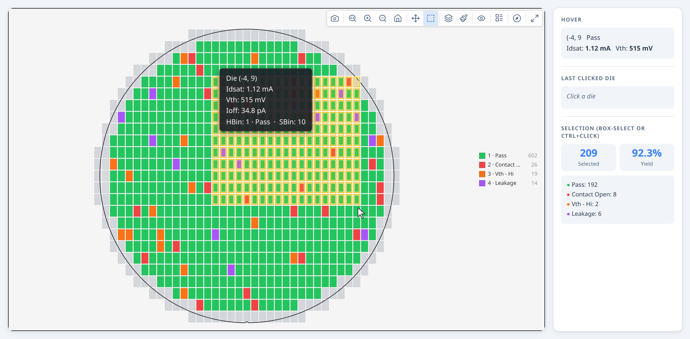


## 13. Lot-level statistical findings

`analyzeWaferLot` extends the per-wafer analysis to the full lot, detecting:

- **Repeated patterns** — ring, quadrant, or reticle findings that appear on ≥ 2 wafers
- **Inter-wafer yield outliers** — individual wafers whose yield deviates from the lot median

```ts
import { analyzeWaferMap, analyzeWaferLot } from '@paulrobins/wafermap/stats';

// Per-wafer summaries (attach to each gallery item)
const waferSummaries = waferResults.map(r => analyzeWaferMap(r, { ringCount: 4 }));

// Lot-level summary
const lotSummary = analyzeWaferLot(waferResults, { ringCount: 4 });

// Gallery items carry their own per-wafer summary
const items = waferResults.map((r, i) => ({
  wafer:        r.wafer,
  dies:         r.dies,
  label:        `Wafer ${i + 1}`,
  statsSummary: waferSummaries[i],   // shown when modal opens
}));

renderWaferGallery(container, items, {
  sceneOptions:    { plotMode: 'hardBin', hbinDefs, sbinDefs, testDefs },
  lotStatsSummary: lotSummary,
});
```

A "Findings" button appears in the gallery control bar.  Clicking it toggles the
lot summary panel alongside the card grid, showing lot-level yield, bin breakdown,
ring and quadrant statistics, test value summaries, and findings.


### What highlighting looks like

- **Repeated pattern finding** (ring/quadrant seen across N wafers): the affected
  wafer cards are outlined; the matching die zone is highlighted on each card using
  that wafer's own per-wafer finding data
- **Yield outlier** (single wafer): the outlier card is outlined
- Clicking the active finding again clears all highlights

### Updating the lot summary at runtime

```ts
const ctrl = renderWaferGallery(container, items, { lotStatsSummary });

// After data changes:
const newLotSummary = analyzeWaferLot(newResults);
ctrl.setLotStatsSummary(newLotSummary);
```

**→ [Demo: Lot-level statistical findings](examples/13-lot-findings.html)**


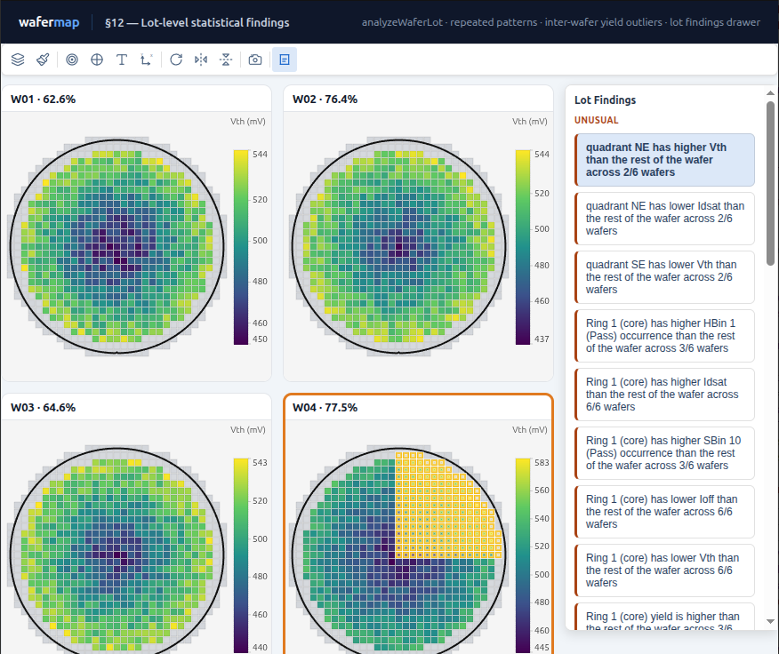

### Advanced: standalone stacked map with programmatic findings access

The gallery's stacked modes cover most use cases.  Use `buildWaferMap({ lotStack })`
directly when you need one or more of:

- A **standalone stacked map** (not inside a gallery — e.g. a dedicated lot-average view)
- **Programmatic access to the findings** before rendering (to filter, store, or feed your own UI)
- A **fixed aggregation method** set at build time rather than chosen interactively

```ts
import { buildWaferMap } from '@paulrobins/wafermap';
import { renderWaferMap } from '@paulrobins/wafermap/canvas-adapter';
import { analyzeWaferMap } from '@paulrobins/wafermap/stats';

// Aggregate six wafers into a single mean map
const result = buildWaferMap({
  lotStack:    { results: waferResults, method: 'mean' },
  waferConfig, dieConfig,
  testDefs,    // include limitLow/limitHigh to enable cluster detection
});

// Run spatial analysis on the aggregated result
const summary = analyzeWaferMap(result, {
  ringCount:   4,
  testNumbers: [1060],   // optional: restrict to a specific test
});

// summary.stats.isLotStack        === true
// summary.stats.aggregationMethod === 'mean'
// summary.stats.lotSize           === 6

renderWaferMap(canvas, result.wafer, result.dies, {
  sceneOptions: { plotMode: 'value', testDefs, activeTest: 0 },
  statsSummary: summary,
  waferResult:  result,
  summaryPanel: { defaultOpen: true },
});
```

Systematic lot patterns (e.g. an NE-quadrant drift present on every wafer) survive
averaging and emerge as clear findings on the lot-average map.  The summary panel
labels the view as "N wafers · mean" so it is unambiguous to the reader.

For cluster and edge-arc detection, dies that exceed a test's spec limits
(`limitLow` / `limitHigh` in `testDefs`) are used as the failure proxy.  If no spec
limits are defined, cluster detection is skipped automatically.

**→ [Demo: Standalone stacked map with spatial analysis](examples/20-lot-stack-analysis.html)**


## 14. Reticle overlays

A reticle (stepper field) is a rectangular group of dies that the lithography
tool exposes in a single step.  The reticle overlay draws the field boundaries on
top of the wafer map and enables reticle-position analysis in the stats engine.

### Adding a reticle overlay

```ts
const { wafer, dies, reticles, reticleConfig } = buildWaferMap({
  results,
  dieConfig:     { width: 10, height: 10 },
  reticleConfig: {
    width:  4,    // 4 dies wide per stepper field
    height: 2,    // 2 dies tall per stepper field
    // anchorDie: { x: 1, y: 0 }  // optional: pin a specific die to a field corner
  },
});

renderWaferMap(canvas, wafer, dies, {
  sceneOptions: { reticles },   // pass the generated reticle geometry
});
// showReticle defaults to true when reticles are provided
```

The toolbar shows a Reticle toggle button whenever `reticles` is non-empty.

### Reticle analysis in the stats engine

When a `reticleConfig` was used, `analyzeWaferMap` automatically includes
reticle-position comparisons (die's position within its stepper field vs. rest of reticle).
This surfaces systematic problems from mask defects, focus variation, or lens
aberrations:

```ts
const result  = buildWaferMap({ results, dieConfig, reticleConfig });
const summary = analyzeWaferMap(result, { enableReticlePositionAnalysis: true });
// result.reticleConfig is passed through automatically
```

### Reticle overlay in a gallery

Pass `reticles` as a per-card `sceneOptions` override and set `hasReticle: true` to
show the Reticle toggle in the gallery bar:

```ts
const items = waferResults.map(r => ({
  wafer:        r.wafer,
  dies:         r.dies,
  hasReticle:   r.reticles.length > 0,
  sceneOptions: { reticles: r.reticles },
}));
```
**→ [Demo: Reticle overlays](examples/14-reticle.html)**


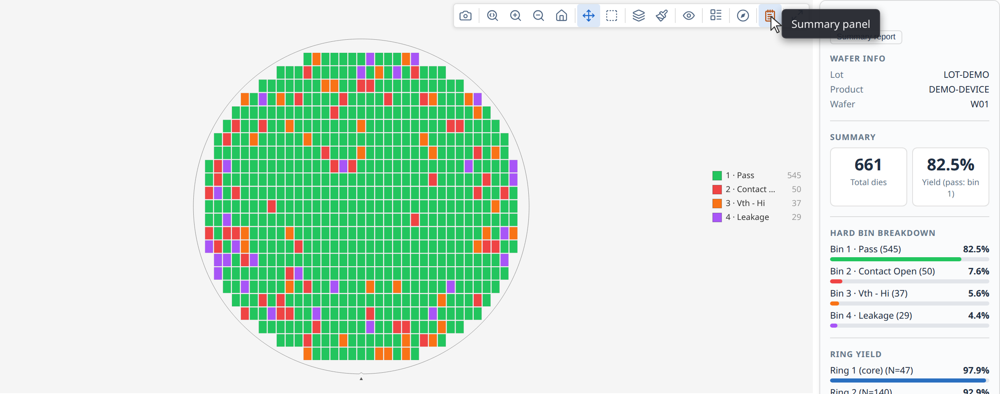

## 15. Processing large datasets with a Web Worker

For lots with many wafers or high die counts, `buildWaferMap` can be moved off the
main thread to avoid blocking the UI.

### Setup

```ts
import { createWafermapWorker } from '@paulrobins/wafermap/worker';

// Vite / webpack — import the pre-built worker script
import workerUrl from '@paulrobins/wafermap/worker-script?url';
const wmWorker = createWafermapWorker(new Worker(workerUrl, { type: 'module' }));

// Plain HTML / CDN
const wmWorker = createWafermapWorker(
  new Worker('https://cdn.jsdelivr.net/npm/@paulrobins/wafermap/dist/packages/worker/wafermap.worker.js', { type: 'module' })
);
```

Create the worker once at app startup and reuse it for all calls.

### Replacing `buildWaferMap` with `worker.run`

```ts
// Before:
const result = buildWaferMap({ results, waferConfig, dieConfig });

// After (same input/output, just async):
const result = await wmWorker.run({ results, waferConfig, dieConfig });

// Everything after is unchanged:
renderWaferMap(canvas, result.wafer, result.dies);
```

### Processing a lot in parallel

```ts
const waferResults = await Promise.all(
  waferIds.map(id => wmWorker.run({
    results:     dataByWafer[id],
    waferConfig: { diameter: 300 },
    dieConfig:   { width: 10, height: 10 },
  }))
);
```

### Cleanup

```ts
// When the app or page unmounts:
wmWorker.terminate();
```

> **Note:** `renderWaferMap` and `renderWaferGallery` require the DOM and must run on
> the main thread. `analyzeWaferMap`/`analyzeWaferLot` and `buildWaferMap` are pure
> functions with no DOM access — they can run in a Web Worker, Node.js, or any
> server-side environment.

**→ [Demo: Processing large datasets with a Web Worker](examples/15-worker.html)**

### Tip: keeping galleries responsive when building many maps

`buildWaferMap` and `analyzeWaferMap` are synchronous. Building a large gallery in
a single `.map()` loop blocks the main thread until all items are ready, leaving
the page blank for several seconds.

Pass factory functions instead of pre-built items and the gallery handles the rest
— the control bar and placeholder cards appear immediately, and each card is built
and inserted one per browser task as the factories run:

```ts
const items = fixtures.map(sample => () => {
  const result  = buildWaferMap({ results: sample.results, passBins: [1] });
  const summary = analyzeWaferMap(result,  { passBins: [1] });
  return { label: sample.label, wafer: result.wafer, dies: result.dies, statsSummary: summary };
});

renderWaferGallery(container, items);
```

The only visible difference is that each card's label is blank until its factory
runs — if the label depends on computed data (e.g. a findings count), it appears
when the card does rather than upfront. If the label is known in advance and you
want it visible immediately, pre-build items as usual for those cards.


## 16. Custom colour schemes

The built-in colour schemes are `'color'` (default), `'greyscale'`, `'accessible'`,
`'plasma'`, and `'inferno'`.  You can register additional schemes for brand colours,
thematic colouring, or specialised analysis:

```ts
import { registerColorScheme, listColorSchemes } from '@paulrobins/wafermap';

registerColorScheme('my-brand', {
  label: 'My Brand',

  // Colour for a specific bin number (hardBin / softBin modes)
  forBin: (bin: number) => {
    const palette = ['#003f88', '#e63946', '#2a9d8f', '#e9c46a', '#f4a261'];
    return palette[(bin - 1) % palette.length];
  },

  // Colour for a normalised value t ∈ [0, 1] (value / stackedValues modes)
  forValue: (t: number) => {
    const r = Math.round(t * 0);
    const g = Math.round(t * 100);
    const b = Math.round(80 + t * 175);
    return `rgb(${r},${g},${b})`;
  },

  // Plotly colorscale (only needed if you also use the toPlotly() path)
  plotlyColorscale: [
    [0,   '#000050'],
    [0.5, '#0064c8'],
    [1,   '#b4ffff'],
  ],
});

// The scheme now appears in every toolbar colour picker automatically:
listColorSchemes();  // [..., { name: 'my-brand', label: 'My Brand' }]

// Apply programmatically:
ctrl.setOptions({ colorScheme: 'my-brand' });
```

Register your schemes once, before any `renderWaferMap` or `renderWaferGallery`
call.  They are global and persist for the lifetime of the page.

**→ [Demo: Custom colour schemes](examples/16-color-schemes.html)**


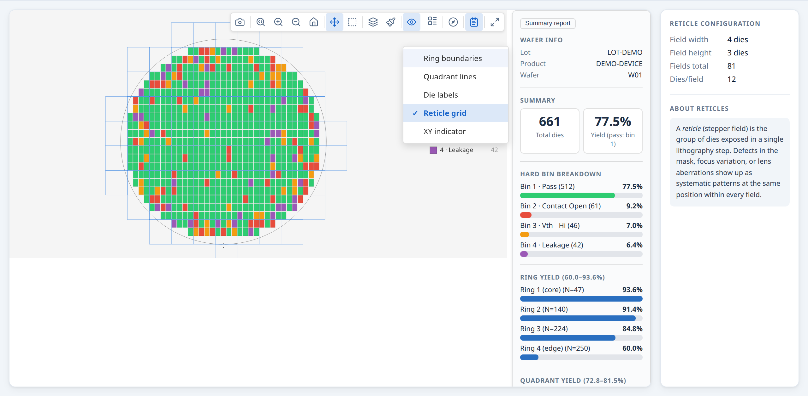

## 17. Common patterns and tips

### Show wafer metadata in the card header

Pass `metadata` via `waferConfig` so values appear in hover tooltips and can be
used for card labels:

```ts
const result = buildWaferMap({
  results,
  waferConfig: {
    diameter: 300,
    metadata: { lot: 'LOT123', waferNumber: 3, testDate: '2026-05-01' },
  },
});

// Use in gallery label:
items.push({ wafer: result.wafer, dies: result.dies, label: `W${result.wafer.metadata.waferNumber}` });
```

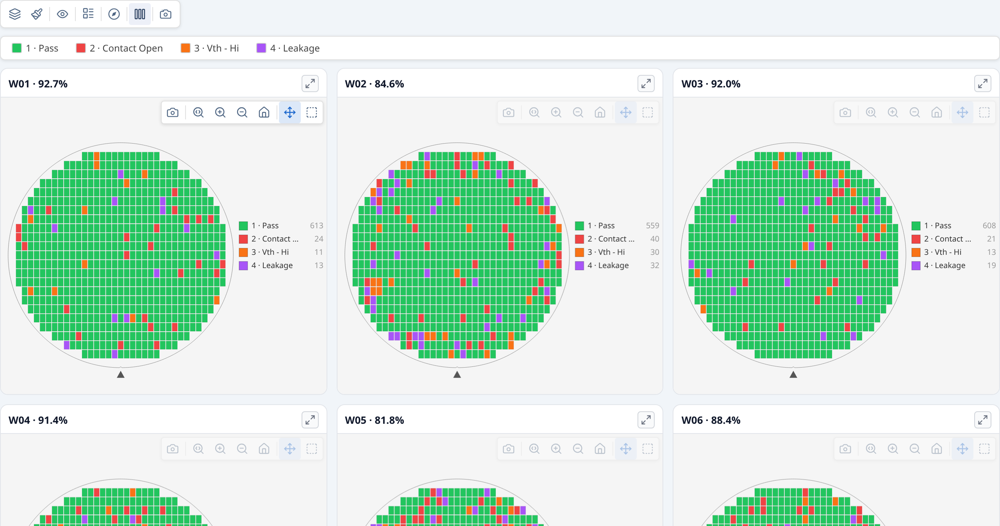

### Keep `ringCount` consistent between renderer and stats engine

The stats engine partitions dies into rings using the same count as the renderer.
If you change `ringCount` in one place, change it in the other:

```ts
const RING_COUNT = 4;

renderWaferMap(canvas, wafer, dies, {
  sceneOptions: { ringCount: RING_COUNT },
});

const summary = analyzeWaferMap(result, { ringCount: RING_COUNT });
```

### Re-use a single `buildWaferMap` result for both rendering and analysis

`analyzeWaferMap` accepts a `WaferMapResult` directly — no need to rebuild:

```ts
const result  = buildWaferMap({ results, waferConfig, dieConfig });
const summary = analyzeWaferMap(result);     // reuses the already-built dies and scene

renderWaferMap(canvas, result.wafer, result.dies, { statsSummary: summary });
```

### Check yield programmatically before rendering

```ts
const result = buildWaferMap({ results, waferConfig, dieConfig, passBins: [1] });
const { passDies, totalDies, yieldPercent } = result.yield;

if (yieldPercent !== null && yieldPercent < 0.5) {
  banner.textContent = `⚠ Low yield: ${(yieldPercent * 100).toFixed(1)}%`;
}
renderWaferMap(canvas, result.wafer, result.dies);
```

### Fit multiple maps to the same value range

When showing several wafers side-by-side in value mode, lock them all to the same
colour scale so the maps are visually comparable:

```ts
// Compute the range across all wafers first
let min = Infinity, max = -Infinity;
for (const r of waferResults) {
  for (const die of r.dies) {
    const v = die.testValues?.[1050];  // test number 1050 = Idsat
    if (v !== undefined) { min = Math.min(min, v); max = Math.max(max, v); }
  }
}

const items = waferResults.map(r => ({
  wafer:        r.wafer,
  dies:         r.dies,
  sceneOptions: { valueRange: [min, max] },
}));

renderWaferGallery(container, items, { sceneOptions: { plotMode: 'value' } });
```

### Engineering vs SI format for unitless values

Values without a unit (no `TestDef.unit` supplied) are formatted using
`fallbackFormat`.  The default is `'engineering'` (e.g. `1.00E-3`).  Switch to
`'si'` for µ/n/p prefixes (e.g. `1.00 m`):

```ts
renderWaferMap(canvas, wafer, dies, { fallbackFormat: 'si' });
renderWaferGallery(container, items, { fallbackFormat: 'si' });
```

### `buildWaferMap` is pure — safe to call on a server

`buildWaferMap` and `analyzeWaferMap`/`analyzeWaferLot` have no DOM access and no
side effects.  You can run them in Node.js, Deno, or any server-side environment to
pre-compute results and stream them to the browser:

```ts
// server.ts (Node.js)
import { buildWaferMap } from '@paulrobins/wafermap';
import { analyzeWaferLot } from '@paulrobins/wafermap/stats';

const results  = waferResults.map(r => buildWaferMap(r));
const lotStats = analyzeWaferLot(results);
// Serialise and send to the client...
```

Only `renderWaferMap`, `renderWaferGallery`, and `toCanvas` require a browser
environment.

### Analyse wafers in Node.js without a browser (console / CI script)

Because `buildWaferMap` and `analyzeWaferMap` have no DOM dependency you can run
the full analysis pipeline in a plain Node.js script — useful for CI checks,
batch processing, or quick exploration of a new dataset:

```js
// analyse-wafers.mjs — run with: node analyse-wafers.mjs
import { readFileSync } from 'node:fs';
import { buildWaferMap }    from '@paulrobins/wafermap';
import { analyzeWaferMap }  from '@paulrobins/wafermap/stats';

// --- 1. Parse CSV ---------------------------------------------------------
const csv   = readFileSync('data/wafers.csv', 'utf8');
const lines = csv.trim().split('\n');
const header = lines[0].split(',');
const col  = (row, name) => row[header.indexOf(name)];

const rows = lines.slice(1).map(line => {
  const r = line.split(',');
  return { x: +col(r,'x'), y: +col(r,'y'), hbin: +col(r,'hbin'),
           testValues: { 1010: +col(r,'testA') } };
});

// --- 2. Group by wafer ----------------------------------------------------
const byWafer = Map.groupBy(rows, r => r.waferId);   // Node 21+
// or: rows.reduce((m,r) => (m.set(r.waferId, [...(m.get(r.waferId) ?? []), r]), m), new Map())

// --- 3. Build + analyse each wafer ----------------------------------------
for (const [waferId, waferRows] of byWafer) {
  const result  = buildWaferMap({ results: waferRows, passBins: [1] });
  const summary = analyzeWaferMap(result);

  const yld     = summary.stats.yieldPercent;
  const top     = summary.findings[0];   // highest-severity finding (findings is pre-sorted)

  console.log(
    `${waferId}  yield=${yld !== null ? (yld * 100).toFixed(1) + '%' : 'n/a'}` +
    `  findings=${summary.findings.length}` +
    (top ? `  top=[${top.severity}] ${top.summary}` : ''),
  );
}
```

The `testValues` keys are **test numbers** (integers), not column names.  If you
want human-readable names in the findings output, pass `testDefs`:

```js
const result = buildWaferMap({
  results,
  passBins: [1],
  testDefs: [{ testNumber: 1010, name: 'TestA', unit: 'V' }],
});
```

### Filter findings by severity, kind, or spatial family

`filterFindings` is a pure utility that slices the `findings` array from any `StatsSummary` or `LotStatsSummary`. All criteria are ANDed; each accepts a single value or an array:

```ts
import { filterFindings } from '@paulrobins/wafermap/stats';

// Only ring or quadrant findings with unusual severity:
const critical = filterFindings(summary, {
  severity: 'unusual',
  family:   ['ring', 'quadrant'],
});

// All yield findings regardless of severity:
const yieldFindings = filterFindings(summary, { kind: 'yield' });
```

### Plot per-wafer yield as a trend chart using `lotYieldSeries`

`LotStatsSummary.lotYieldSeries` gives you one `{ waferIndex, yieldPercent }` entry per wafer — ready to feed a line chart without extra data wrangling:

```ts
const lotSummary = analyzeWaferLot(waferResults);

// lotYieldSeries is sorted by waferIndex
const labels = lotSummary.lotYieldSeries.map(e => `W${e.waferIndex + 1}`);
const values = lotSummary.lotYieldSeries.map(e =>
  e.yieldPercent !== null ? (e.yieldPercent * 100).toFixed(1) : null
);
// Feed labels/values into any charting library
```

`yieldPercent` is `null` for a wafer that had no bin data at all.

### Use gross die yield (edge dies in denominator)

By default, edge-excluded dies are removed from both the numerator and denominator. Set `edgeDieYieldMode: 'denominator-only'` to compute gross die yield — edge dies count in the denominator but never as pass:

```ts
const result = buildWaferMap({
  results,
  waferConfig: { diameter: 300, edgeExclusion: 3 },
  dieConfig:   { width: 8, height: 12 },
  passBins:    [1],
  edgeDieYieldMode: 'denominator-only',
});

const { yieldPercent, yieldPercentGross } = result.yield;
// yieldPercent      — standard yield, edge dies excluded entirely
// yieldPercentGross — gross die yield, edge dies in denominator
```

### Check for structured warnings from the stats engine

When `analyzeWaferMap` encounters an unusual condition (e.g. more than 100 distinct tests in the data without a `testNumbers` filter), it records a structured warning in `summary.stats.warnings[]` in addition to logging to the console:

```ts
const summary = analyzeWaferMap(result);

if (summary.stats.warnings?.length) {
  console.warn('Stats warnings:', summary.stats.warnings);
  // e.g. "101 tests found — test-value analysis skipped. Pass testNumbers to override."
}
```

To suppress the warning and run analysis on a specific subset, pass `testNumbers`:

```ts
const summary = analyzeWaferMap(result, { testNumbers: [1050, 1060, 1070] });
// No warning — analysis runs on exactly these three tests
```


## 18. Plotly/SVG compatibility

`toPlotly` converts a `Scene` into Plotly `{ data, layout }` for use with
`Plotly.react`. Use this when you specifically need SVG export, server-side
rendering, or want to embed the wafer map inside an existing Plotly dashboard.

```ts
import { buildWaferMap, buildScene, toPlotly, getDieAtPoint } from '@paulrobins/wafermap';
import { renderWaferMap } from '@paulrobins/wafermap/canvas-adapter';

const { wafer, dies } = buildWaferMap({ results, waferConfig, dieConfig, hbinDefs });

// Mirror the canvas toolbar state into Plotly via onSceneOptionsChange.
let sharedOpts = { plotMode: 'hardBin' };

function renderPlotly() {
  const scene = buildScene(wafer, dies, {
    ...sharedOpts,
    interactiveTransform: {
      rotation: sharedOpts.rotation ?? 0,
      flipX:    sharedOpts.flipX    ?? false,
      flipY:    sharedOpts.flipY    ?? false,
    },
  });
  const { data, layout } = toPlotly(scene, {
    diePitchMm: { x: dieWidth, y: dieHeight },
  });
  Plotly.react('plotly-chart', data, layout, { responsive: true });
}

// Canvas toolbar drives both renderers.
renderWaferMap(canvas, wafer, dies, {
  sceneOptions: sharedOpts,
  onSceneOptionsChange(opts) {
    Object.assign(sharedOpts, opts);
    renderPlotly();
  },
});

renderPlotly();  // initial render

// getDieAtPoint converts a Plotly click event to the matching Die object.
document.getElementById('plotly-chart').on('plotly_click', ev => {
  const scene = buildScene(wafer, dies, { ...sharedOpts });
  const die   = getDieAtPoint(scene, ev);
  if (die) console.log(die.x, die.y, die.hbin);
});
```

> **Note:** `buildScene` and `toPlotly` are lightweight and fast enough to call on
> every toolbar change. `buildWaferMap` is the expensive step, so call it once.

**→ [Demo: Plotly compatibility](examples/17-plotly.html)**


## 19. Advanced: the rendering pipeline

`renderWaferMap` and `renderWaferGallery` handle the full pipeline for you.  Use
the manual pipeline only when you need control they cannot provide — for example,
to drive a custom canvas renderer, integrate with a non-DOM environment, or step
through the geometry for debugging.

```ts
import {
  createWafer,
  generateDies,
  clipDiesToWafer,
  applyOrientation,
  applyProbeSequence,
  transformDies,
  generateReticleGrid,
  buildScene,
} from '@paulrobins/wafermap';
import { toCanvas } from '@paulrobins/wafermap/canvas-adapter';

// 1. Create the wafer geometry
const wafer = createWafer({ diameter: 300, notch: { type: 'bottom' } });

// 2. Generate and clip the die grid
const clipped = clipDiesToWafer(generateDies(wafer, dieSpec), wafer, dieSpec);

// 3. Apply wafer orientation (rotates the data grid to match orientation field)
const oriented = applyOrientation(clipped, wafer);

// 4. Assign probe sequence (sets die.probeIndex in snake order)
const sequenced = applyProbeSequence(oriented, { type: 'snake' });

// 5. Merge DieResult[] onto the die grid by (x, y) position
const resultMap = new Map(results.map(r => [`${r.x},${r.y}`, r]));
const enriched  = sequenced.map(die => {
  const r = resultMap.get(`${die.x},${die.y}`);
  return r ? { ...die, hbin: r.hbin, sbin: r.sbin, testValues: r.testValues } : die;
});

// 6. Build the reticle grid (optional)
const reticles = generateReticleGrid(wafer, { width: 4, height: 3, diePitchX: 8, diePitchY: 12 });

// 7. Apply interactive transforms (rotation, flip) on top of the base orientation
const currentDies = transformDies(enriched, { rotation: 90, flipX: false, flipY: false }, wafer.center);

// 8. Build a renderer-agnostic Scene
const scene = buildScene(wafer, currentDies, {
  plotMode: 'hardBin',
  reticles,
  showProbePath: true,
  interactiveTransform: { rotation: 90, flipX: false, flipY: false },
});

// 9. Draw to a canvas element (no toolbar, no DOM scaffolding)
toCanvas(document.getElementById('map'), scene);
```

**→ [Demo: Advanced — the rendering pipeline](examples/18-pipeline.html)**
