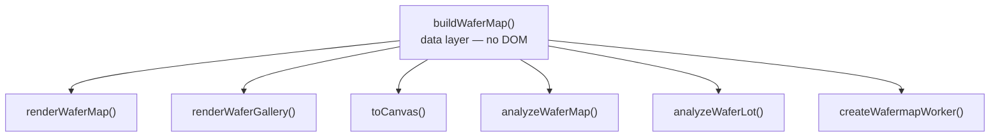
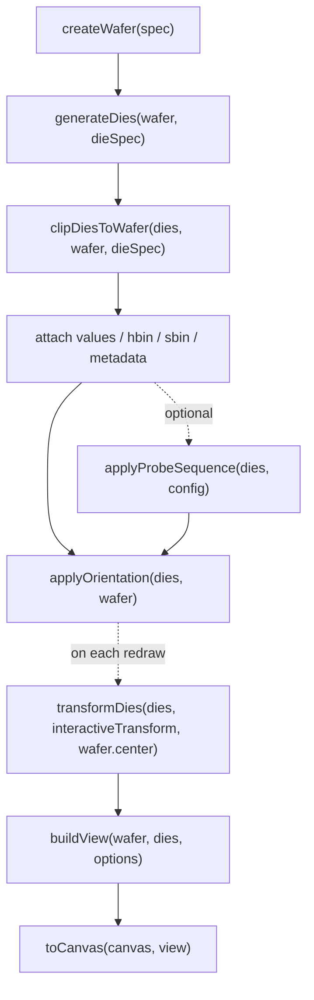

# API Reference

This document describes the public API exposed by `wafermap`.
For the system-level overview and recommended entry points, see [Architecture](architecture.md).

---

## 1 Coordinate system

**`x` and `y` throughout this API are die grid positions (prober step coordinates) — integers such as −7, 0, 5.  They are NOT millimetre values.  They must be JavaScript `number` type — CSV parsers return strings; always cast with `Number()` or `+` before passing to `buildWaferMap`.**

This matches what wafer test equipment outputs.  The library converts grid positions to physical mm internally using the die size you provide.

```text
prober outputs:  x=-5, y=3   (die grid position)
library computes: x_mm = -5 × 10 = -50 mm   (given die width = 10 mm)
```

Physical mm positions appear only on the `Die` output objects (`die.physX`, `die.physY`) and in the wafer model.  You never need to compute or supply mm values.

---

## 2 Quick Start

```ts
import { buildWaferMap } from '@paulrobins/wafermap';
import { renderWaferMap } from '@paulrobins/wafermap/render';

// x,y are prober step positions (die grid indices), not mm.
const result = buildWaferMap({
  results:   rows.map(r => ({ x: +r.x, y: +r.y, hbin: +r.hbin, testValues: { 1010: +r.testA } })),
  waferConfig: { diameter: 300, notch: { type: 'bottom' } },
  dieConfig:   { width: 10, height: 10 },
  testDefs: [{ testNumber: 1010, name: 'TestA', unit: 'V' }],
});

renderWaferMap(document.getElementById('map'), result);
```

The map renders with a full built-in toolbar — no extra HTML or JavaScript needed.

**Adding statistical findings** — the stats engine is pure (no DOM) and lives in the `/stats` subpath:

```ts
import { analyzeWaferMap } from '@paulrobins/wafermap/stats';

// Pass the full WaferMapResult — passBins and testDefs are inferred automatically.
const result  = buildWaferMap({ results, waferConfig, dieConfig, passBins: [1] });
const summary = analyzeWaferMap(result);

renderWaferMap(container, result, { statsSummary: summary });
// A "Findings" button now appears in the toolbar automatically.

// Access findings directly — array is pre-sorted: 'unusual' first, then 'notable', then 'info'.
const top = summary.findings[0];
if (top) console.log(`[${top.severity}] ${top.summary}`);
// e.g. "[unusual] Ring 4 (edge) yield is lower than the rest of the wafer"
```

---

## 3 API overview

If you want the shortest path to the right entry point before diving into the
type details, see [Architecture](architecture.md). It explains which layer to
use for data construction, rendering, analysis, and worker offloading.



| Section | Description |
|---|---|
| [4 `buildWaferMap`](#4-buildwafermapinput) | Data layer — primary entry point |
| [5 `renderWaferMap`](#5-renderwafermapcontainer-result-options) | Interactive canvas map with toolbar |
| [6 `renderWaferGallery`](#6-renderwafergallerycontainer-items-options-gallery) | Multi-map card grid |
| [7 Statistics / Findings](#7-statistics-findings-engine) | `analyzeWaferMap`, `analyzeWaferLot` |
| [8 Web Worker](#8-web-worker) | Off-main-thread rendering |
| [9 Low-level canvas API](#9-low-level-canvas-api) | `toCanvas` |
| [10 Package surface](#10-package-surface) | Subpath exports |
| [11 Advanced Pipeline](#11-advanced-manual-pipeline) | `buildView`, low-level API |
| [12 Important types](#12-important-types) | Key interfaces |
| [13 Limitations](#13-current-limitations) | Known constraints |

---

## 4 `buildWaferMap(input)`

The primary entry point.  Pass whatever data you have — prober step positions,
optional geometry hints, or a pre-built die array.  The function infers whatever
is missing and returns a fully constructed wafer model.

> **Inference reads geometry from the extent of the data.** When you supply only
> die positions, the wafer diameter and centre are derived from how far the data
> reaches.  This is correct whenever the data reaches the true wafer edge — a
> fully-populated wafer, or a **sparse** one (skip-sampled or randomly sampled
> positions missing across the whole face).  It is **wrong for *partial* data** —
> a contiguous region such as a half wafer, a single quadrant, or an off-centre
> cluster — because the extent stops short of the true edge, so the region is
> mistaken for a smaller full wafer and mis-centred.  For partial data supply
> `waferConfig.diameter` **and** `waferConfig.center` — see
> [§4.3 Inference levels](#43-inference-levels).  When the library detects
> likely-partial coverage with no anchor, it adds a structured warning to
> `result.warnings` (code `'partial-coverage'`).

**Server-safe:** `buildWaferMap` is a pure function with no DOM access or side
effects.  It can run in Node.js, Deno, a Web Worker, or any server-side environment.

```ts
import { buildWaferMap } from '@paulrobins/wafermap';
```

### 4.1 Input

`buildWaferMap` accepts either an array of data points or an object. They are equivalent when no extra options are needed — the array form is just shorthand for `{ results: [...] }`:

```ts
// Array form — shorthand, equivalent to passing { results }
buildWaferMap(results: DieResult[])

// Object form — use when you need geometry hints or other options.
// WaferMapInput is a union: pass either results OR lotStack, never both.
buildWaferMap(input: WaferMapInput)
```

`WaferMapInput` is a discriminated union:

```ts
// Shared base (WaferMapInputBase) — all fields are optional:
type WaferMapInputBase = {
  waferConfig?:      WaferConfig,      // physical wafer geometry (diameter, notch, orientation…)
  dieConfig?:        DieConfig,        // die size and coordinate conventions
  dies?:             Die[],            // pre-built die array; skips geometry generation
  reticleConfig?:    ReticleConfig,    // stepper field grid overlay
  passBins?:         number[],         // bins counted as pass for yield (default [1])
  retestPolicy?:     'last' | 'first' | 'best' | 'worst', // how to handle multiple results at the same (x,y); default 'last'
  edgeDieYieldMode?: 'exclude' | 'denominator-only', // default 'exclude'
  testDefs?:         TestDef[],        // named test definitions — one per testValues entry
  hbinDefs?:         BinDef[],         // named hard bin definitions — one per distinct hbin value
  sbinDefs?:         BinDef[],         // named soft bin definitions — one per distinct sbin value
}

// Single-wafer variant (WaferMapInputSingle):
type WaferMapInputSingle = WaferMapInputBase & {
  results?:  DieResult[]   // per-die measurements from the prober
  lotStack?: never          // passing both results and lotStack is a type error
}

// Lot-stack variant (WaferMapInputLotStack):
type WaferMapInputLotStack = WaferMapInputBase & {
  lotStack:  LotStackConfig  // collapse multiple wafers into one aggregated map
  results?:  never            // passing both results and lotStack is a type error and runtime error
}

type WaferMapInput = WaferMapInputSingle | WaferMapInputLotStack
```

All fields are optional.  Supply what you know; the library handles the rest. Passing both `results` and `lotStack` on the same object is a type error and is rejected at runtime.

#### 4.1.1 `DieResult`

A single die record from wafer test equipment.

```ts
{
  x:           number                      // die grid X position (prober step coordinate)
  y:           number                      // die grid Y position (prober step coordinate)
  testValues?: Record<number, number>      // preferred: test measurements keyed by stable test identity
                                           // e.g. { 1050: 1.42e-3, 1060: 0.487, 1070: 8.3e-12 }
                                           // the key is any stable integer per test — for example an STDF TEST_NUM,
                                           // a database test ID, or an application-defined constant
  values?:     number[]                    // @deprecated: use testValues. Positional array — fragile when tests are added or removed
  hbin?:       number                      // hard bin assignment (physical sort result; STDF V4 range 0–32767)
  sbin?:       number                      // soft bin assignment (test-program failure category; independent 0–32767 space)
  siteNum?:    number                      // STDF site_num — which parallel test site tested this die
                                           // enables test-site analysis in analyzeWaferMap when ��2 distinct
                                           // values each appear on ≥3 dies (indicating a multi-site probe card)
  partId?:     number                      // STDF pir.part_id — tester-assigned identifier for this unit
                                           // at most fabs this encodes probe sequence (the step order across the wafer)
                                           // but the field is semantically neutral — its meaning is fab-specific
                                           // note: STDF part_id is 1-based; camelCase follows the library convention
}
```

Use `testValues` (keyed map) rather than `values` (positional array). A keyed map is stable when tests are added, removed, or reordered between test program revisions; a positional array is not.

A single test result: `testValues: { 1050: 0.95 }`

When a die position appears more than once in the `results` array (a retest), the
`retestPolicy` field on `WaferMapInput` controls which result is kept.  The
`die.retestCount` field always records how many times that position appeared.

#### 4.1.2 `WaferConfig`

```ts
{
  diameter?:      number         // wafer diameter in mm; inferred from grid extent × pitch if omitted
  center?:        { x: number, y: number }
                  // prober coordinate that lies at the physical wafer centre.
                  // Supply for partial data (a contiguous half/quadrant/slice that
                  // stops short of the wafer edge); anchors placement to the true
                  // centre. Not needed for sparse full-extent data. Does NOT change
                  // die.x/die.y labels.
                  // When omitted, the centre is inferred as the data midpoint (full-wafer assumption).
  notch?:         { type: 'top' | 'bottom' | 'left' | 'right' }
                  // physical orientation mark direction; standard dimensions derived from diameter:
                  //   ≤ 100 mm → 32.5 mm orientation flat  (SEMI M1)
                  //   ≤ 150 mm → 57.5 mm orientation flat  (SEMI M1)
                  //   > 150 mm → V-notch ~3.5 mm wide, 1.25 mm deep  (SEMI M1)
  orientation?:   number         // degrees CCW to rotate the die grid on screen; default 0 (see note below)
  edgeExclusion?: number         // exclusion band width in mm measured inward from the wafer edge; dies in this band are dimmed
                                 // how these dies affect yield is controlled by the top-level edgeDieYieldMode option (§4.1.10)
  metadata?:      WaferMetadata  // arbitrary lot/wafer-level data attached to the view (lot ID, date, etc.)
}
```

**`orientation` note:** positive values rotate the die grid counter-clockwise (standard mathematical convention).  The notch/flat position is controlled by `notch.type` and is **not** affected by `orientation` — it stays fixed as the physical alignment mark.


#### 4.1.3 `DieConfig`

```ts
{
  width?:              number   // die width in mm (= X step pitch); enables physical mm coordinates
  height?:             number   // die height in mm (= Y step pitch); enables physical mm coordinates
  coordinateOrigin?:   {
    // where the prober places coordinate (0,0) on the wafer grid
    type: 'center'           // default — grid already centred; centroid offset applied automatically
        | 'LL'               // (0,0) at lower-left corner (standard STDF/KLA output)
        | 'UL'               // (0,0) at upper-left corner — positive Y runs downward (flips display Y)
        | 'LR'               // (0,0) at lower-right corner — positive X runs leftward (flips display X)
        | 'UR'               // (0,0) at upper-right corner — both axes flipped
        | 'custom'           // manual offset: centre = (0,0) + offset in grid steps
    offset?: { x: number; y: number }   // grid-step offset to the true centre; only used when type is 'custom'
  }
  yAxisDirection?: 'up' | 'down'     // which direction Y increases on the prober; 'down' for row/matrix probers (default 'up')
  xAxisDirection?: 'right' | 'left'  // which direction X increases; 'left' for backside or mirrored probing (default 'right')
}
```

When `width` and `height` are omitted, the library estimates die dimensions from
the grid layout using nearest-neighbour step analysis first, falling back to the
circular-wafer aspect-ratio constraint.


#### 4.1.4 `ReticleConfig`

```ts
{
  width:      number               // stepper field width in number of dies (e.g. 4 means 4 dies wide)
  height:     number               // stepper field height in number of dies
  anchorDie?: { x: number; y: number }
               // die grid index (x, y) that sits at the reticle field's internal (0,0) corner.
               // Shifts the entire reticle grid so this die aligns to a field boundary.
               // Default {0,0} — die (0,0) is at a corner.
}
```

When provided, reticle overlays are shown by default (`showReticle` defaults to `true`).

#### 4.1.5 `LotStackConfig`

Collapse data from multiple wafers into a single map before rendering.  When `lotStack`
is present the top-level `results` field is ignored.

```ts
{
  results:    DieResult[][]  // input data — one DieResult[] per wafer in the lot
  method:     // aggregation applied per die position across all wafers:
    | 'mean'       // arithmetic mean of values → testValues[0]
    | 'median'     // median of values → testValues[0]
    | 'stddev'     // sample standard deviation of values → testValues[0]
    | 'min'        // minimum value across lot → testValues[0]
    | 'max'        // maximum value across lot → testValues[0]
    | 'count'      // number of wafers that provided a value at this position → testValues[0]
    | 'countBin'   // how many wafers had targetBin at this position → testValues[0]
    | 'mode'       // most frequent bin across wafers → hbin
    | 'percent'    // percentage of wafers that had targetBin → testValues[0] in [0,100]
  targetBin?: number   // bin value to count or measure; required for 'countBin' and 'percent'
}
```

#### 4.1.6 `passBins`

```ts
passBins?: number[]   // default [1]  (industry convention: bin 1 = pass)
```

Bin values that count as pass for yield calculation.  Set to `[]` to suppress yield.

#### 4.1.7 `retestPolicy`

```ts
retestPolicy?: 'last' | 'first' | 'best' | 'worst'   // default 'last'
```

Controls how the library handles multiple results for the same die position (retests).
In wafer test it is common for a die to be tested more than once — for example after
a recontact, a temperature retest, or a continuity retest.

| Policy | Behaviour |
| ------ | --------- |
| `'last'` (default) | Keep the most recent result — the last entry in `results` for that position |
| `'first'` | Keep the earliest result — the first entry in `results` for that position |
| `'best'` | Keep the best result using `passBins` as the primary criterion: a pass result always beats a fail result. When both candidates are in the same pass/fail category, the lower `hbin` number is the tiebreaker. Falls back to `'last'` when any candidate has no `hbin`. |
| `'worst'` | Keep the worst result: a fail result always beats a pass result. When both are in the same category, the higher `hbin` number wins. Falls back to `'last'` when any candidate has no `hbin`. |

Regardless of which policy is active, `die.retestCount` is always set on any die that
appeared more than once in the input.  Use it to identify retested dies in your own
analysis without needing to re-scan the raw results.

```ts
// Last result wins (default — no field needed):
buildWaferMap({ results })

// Explicitly keep first result:
buildWaferMap({ results, retestPolicy: 'first' })

// Check how many retests occurred after the map is built:
result.dies.filter(d => d.retestCount !== undefined)
  .forEach(d => console.log(`Die (${d.x},${d.y}) tested ${d.retestCount} times`));
```

#### 4.1.8 `TestDef`

Named definition for one test parameter. The toolbar mode dropdown always offers one entry per test — using `testNumber` as the label when `testDefs` is absent. When `testDefs` is provided, tooltips show `"Idsat: 1.23 mA"` with the test name and SI-scaled unit; without it they fall back to `"Test 1050: 1.23 mA"`.

```ts
{
  testNumber?: number  // preferred: stable test identity matching the key used in DieResult.testValues
                       // e.g. an STDF TEST_NUM, a database test ID, or an application-defined constant
  index?:      number  // @deprecated: use testNumber. Positional index into the deprecated values[] array.
                       // At least one of testNumber or index must be provided.
  name:        string  // e.g. "Idsat", "Vth", "Continuity"
  unit?:       string  // SI base unit, e.g. "A", "V", "Ω", "F" — the formatter applies SI prefixes
                       // automatically (0.03 Ω → "30 mΩ"), so always pass the base unit, never a
                       // pre-scaled unit like "mA" or "µV"
  logScale?:   boolean // when true, value normalization and the colorbar use log₁₀ scale for this test
                       // silently falls back to linear when any die value is ≤ 0; default false
  limitLow?:   number  // lower specification limit in the same units as the test value
                       // values below this are out-of-spec; drives out-of-spec coloring and spec yield stats
  limitHigh?:  number  // upper specification limit in the same units as the test value
                       // values above this are out-of-spec
                       // both limits are optional independently — one-sided limits are valid
}
```

`testNumber` is preferred. When `testNumber` is set it must match the key used in `DieResult.testValues`. Use `index` only when working with the deprecated `values[]` array.

#### 4.1.9 `BinDef`

Named definition for one bin number.  Used for both hard bin (`hbinDefs`) and soft bin (`sbinDefs`) — the shape is identical but the number spaces are independent.

Per STDF V4, hard bins and soft bins each range 0–32767.  Bin 1 in hard bin space and bin 1 in soft bin space are different things and may have different names — always pass them as separate arrays.

```ts
{
  bin:    number   // the numeric bin value this defines
  name:   string   // e.g. "Pass", "Contact Open", "Vth - Hi NMOS"
  color?: string   // optional CSS color override, e.g. "#2ecc71" — overrides the active colour scheme
}
```

**Hard bins** (`hbinDefs`) are the physical sort result — where the part goes on the handler.  **Soft bins** (`sbinDefs`) are the logical test-program classification — the failure category as determined by the test algorithm, used for debug and yield analysis.  Many soft bins typically map to one hard bin.

#### 4.1.10 `edgeDieYieldMode`

```ts
edgeDieYieldMode?: 'exclude' | 'denominator-only'   // default 'exclude'
```

Controls how dies within the edge exclusion zone (`waferConfig.edgeExclusion`) are treated in yield calculation.

| Value | Behaviour |
| ----- | --------- |
| `'exclude'` (default) | Edge dies are excluded from both numerator and denominator. `YieldSummary.yieldPercent` reflects only the interior dies. |
| `'denominator-only'` | Edge dies are counted in the denominator but never in the pass numerator. Produces **gross die yield** — the industry metric for quantifying yield loss due to edge effects. `YieldSummary.yieldPercentGross` is populated with this value; `yieldPercent` is also populated for comparison. |

```ts
const result = buildWaferMap({
  results,
  waferConfig:      { diameter: 300, edgeExclusion: 3 },
  dieConfig:        { width: 8, height: 12 },
  edgeDieYieldMode: 'denominator-only',
});

const { yieldPercent, yieldPercentGross } = result.yield;
// yieldPercent      — interior-only yield (edge dies excluded entirely)
// yieldPercentGross — gross die yield (edge dies counted against you)
```

### 4.2 Return value

```ts
{
  wafer:         Wafer          // resolved wafer model (diameter, radius, center, notch, orientation)
  dies:          Die[]          // all dies inside the wafer boundary, with testValues/hbin/sbin attached
  plotMode:      PlotMode       // the plot mode chosen by buildWaferMap ('hardBin', 'value', etc.)
  metadata:      WaferMetadata | null  // wafer metadata from waferConfig.metadata
  isLotStack:    boolean        // true when built from lotStack input
  hbinDefs?:     BinDef[]       // named hard bin definitions passed to buildWaferMap
  sbinDefs?:     BinDef[]       // named soft bin definitions passed to buildWaferMap
  testDefs?:     TestDef[]      // named test definitions passed to buildWaferMap
  reticles:      Reticle[]      // generated reticle geometry — wired automatically when passed as a WaferMapDisplayItem
  reticleConfig: ReticleConfig | undefined  // the reticle config that was used; passed through to analyzeWaferMap automatically
  units:   'mm' | 'normalized'   // coordinate space of die.physX/die.physY and wafer dimensions
  warnings: WaferWarning[]       // structured geometry-inference advisories — always present (may be empty).
                                  // Read this instead of relying on console.warn.
                                  // { code: string; message: string; confidence?: number }
                                  // Current code: 'partial-coverage' — data does not span a full wafer;
                                  //   inferred diameter/centre may be wrong. Supply waferConfig.center + .diameter.
  inference: {
    wafer:    { confidence: number; method: string }   // how diameter was resolved; confidence 0–1.
                                                        // method is 'inferred-partial' when partial data was detected
    diePitch: { confidence: number; units: 'mm' | 'normalized' }  // how die size was resolved
    grid:     { confidence: number }                   // quality of the grid index assignment
    warnings?: string[]                                // @deprecated: mirrors result.warnings[].message; use result.warnings instead
  }
  dataCoverage: {
    filledDies:       number   // dies with at least one value or bin attached
    totalDies:        number   // all dies inside the wafer boundary (including partial)
    edgeExcludedDies: number   // dies whose centres fall within the edge exclusion band
    ratio:            number   // filledDies / totalDies ∈ [0, 1]
  }
  yield: YieldSummary   // pass/fail statistics computed against passBins
}
```

#### 4.2.1 `YieldSummary`

```ts
{
  passDies:          number          // dies with a bin in passBins
  failDies:          number          // full dies inside wafer with a bin not in passBins
  edgeExcludedDies:  number          // dies within the edge exclusion zone
  partialDies:       number          // dies straddling the wafer boundary
  totalDies:         number          // passDies + failDies (edge-excluded not included)
  yieldPercent:      number | null   // (passDies / totalDies) × 100 ∈ [0, 100]; null when no bin data
  yieldPercentGross: number | null   // (passDies / (passDies + failDies + edgeExcludedDies)) × 100 ∈ [0, 100];
                                     // only set when edgeDieYieldMode: 'denominator-only'; otherwise null
}
```

Partial dies are excluded from both numerator and denominator. Edge-excluded dies are excluded by default (`edgeDieYieldMode: 'exclude'`); set `edgeDieYieldMode: 'denominator-only'` to include them in the denominator for gross die yield.

**`result.yield.yieldPercent` vs `summary.stats.yieldPercent`** — both are in \[0, 100\] and can differ when you pass custom options to `analyzeWaferMap` (e.g. a different `edgeDieYieldMode` or `passBins`). Use `result.yield` for rendering and quick checks; use `summary.stats.yieldPercent` when you need the yield that is consistent with the findings analysis.

**`units`** tells you the coordinate space of the physical coordinates (`die.physX`, `die.physY`) and wafer dimensions; `die.x`/`die.y` remain die grid positions (prober step coordinates):

- `'mm'` — at least one physical dimension was known (die size or wafer diameter); physical coordinates (die.physX/die.physY and wafer dimensions) are expressed in millimetres.
- `'normalized'` — only grid positions were supplied; physical coordinates are in normalized units (aspect ratio preserved) with `pitchX = 1` normalized unit by convention.

### 4.3 Inference levels

The library adapts to whatever geometry context you provide.  Four distinct levels:

| Provided | Inferred | `units` |
| -------- | -------- | ------- |
| grid positions only | Pitch from nearest-neighbour step analysis; diameter from grid extent | `'normalized'` |
| grid positions + die size | Diameter from grid extent × pitch | `'mm'` |
| grid positions + wafer diameter | Die size from `diameter / grid_extent` | `'mm'` |
| grid positions + die size + diameter | Nothing — fully specified | `'mm'` |

> **All four levels assume the data spans a full, roughly symmetric wafer
> centred near the prober origin.** The diameter and centre are derived from the
> *extent of the data you pass*. See "Minimum geometry for partial data" below
> before relying on inference for anything less than a full wafer.

**Diameter snapping:** inferred diameters snap to industry-standard sizes.
100 mm, 150 mm, 200 mm, and 300 mm are preferred (±10% tolerance); other SEMI
standard sizes (25 / 50 / 75 / 450 mm) are tried next (±20%); remaining values
are rounded to the nearest 10 mm.

**Origin:** defaults to `'center'` (centroid offset applied automatically). Set `coordinateOrigin: { type: 'LL' }` explicitly for standard STDF/KLA output where (0,0) is at the lower-left corner.

#### Minimum geometry for partial data

Inference works backwards from the data's bounding extent. What matters is
whether the data **reaches the true wafer edge**:

- **Sparse data** — positions missing across the whole wafer (systematic
  skip-sampling, e.g. 1-in-4, or random sampling). The extent still reaches the
  edge, so diameter and centre infer correctly. **No geometry hints required.**
- **Partial data** — a contiguous region that stops short of the edge: a half
  wafer, a single quadrant, a slice, or an off-centre cluster. The extent
  understates the wafer, so the region is mistaken for a smaller full wafer and
  re-centred on its own midpoint. Inference is **wrong** here.

An **edge ring / annulus** is a middle case: only outer dies are present, but
they reach the true edge, so the diameter is right — only the empty interior is
"missing", which is harmless.

For partial data, supply both:

| Field | Meaning |
| ----- | ------- |
| `waferConfig.diameter` | the true wafer diameter in mm |
| `waferConfig.center` | the prober coordinate `(x, y)` that lies at the physical wafer centre |

`waferConfig.center` anchors placement to the real centre. It does **not** change
the public `die.x` / `die.y` labels — those remain the original prober
coordinates. (Supplying `dieConfig.width`/`height` for the pitch is recommended
too, so coordinates are in real mm.)

Detection is heuristic: the library flags likely-partial coverage by how far the
data centroid sits from its bounding-box centre. Contiguous partial regions are
caught; an off-centre cluster small enough to look like a tiny full wafer, and an
edge ring (centroid-symmetric), are not flagged — when in doubt, set
`waferConfig.center` explicitly rather than relying on the warning.

```ts
// Right half of a 300 mm wafer; prober (0,0) is the wafer centre.
const result = buildWaferMap({
  results,                                   // prober x ∈ [0..15], y ∈ [-15..15]
  waferConfig: { diameter: 300, center: { x: 0, y: 0 } },
  dieConfig:   { width: 10, height: 10 },
});
```

When the library detects likely-partial data and no `center` was supplied, it
adds a structured warning to `result.warnings` (code `'partial-coverage'`) and sets
`result.inference.wafer.method` to `'inferred-partial'` — check these
programmatically rather than relying on console output.

### 4.4 Examples

**Minimal — grid positions only (normalized units):**

```ts
const result = buildWaferMap([
  { x: 0, y:  0, testValues: { 1050: 0.95 } },
  { x: 1, y:  0, testValues: { 1050: 0.87 } },
  { x: 0, y: -1, testValues: { 1050: 0.91 } },
]);
// result.units === 'normalized'
```

**With die size — physical mm coordinates:**

```ts
const result = buildWaferMap({
  results:   data,
  dieConfig: { width: 10, height: 10 },
});
// result.units === 'mm'
```

**Fully specified with notch:**

```ts
const result = buildWaferMap({
  results:     data,
  waferConfig: { diameter: 300, notch: { type: 'bottom' }, orientation: 90 },
  dieConfig:   { width: 10, height: 10 },
});
```

**With bin data and edge exclusion:**

```ts
const result = buildWaferMap({
  results:     csvRows.map(r => ({ x: Number(r.x), y: Number(r.y), hbin: Number(r.hbin) })),
  waferConfig: { diameter: 200, edgeExclusion: 3 },
  dieConfig:   { width: 8, height: 8 },
});
console.log(result.yield.yieldPercent);
```

**Multiple tests and bins in a single pass:**

```ts
const result = buildWaferMap({
  results: rows.map(r => ({
    x: +r.x, y: +r.y,
    testValues: { 1010: +r.testA, 1020: +r.testB, 1030: +r.testC },
    hbin: +r.hbin,
    sbin: +r.sbin,
  })),
  testDefs: [
    { testNumber: 1010, name: 'Idsat', unit: 'A' },
    { testNumber: 1020, name: 'Vth',   unit: 'V' },
    { testNumber: 1030, name: 'Ioff',  unit: 'A' },
  ],
  dieConfig: { width: 10, height: 10 },
});
```

**Reticle overlay phased to die (2, 1):**

```ts
const result = buildWaferMap({
  results:   data,
  dieConfig: { width: 10, height: 10 },
  reticleConfig: { width: 4, height: 2, anchorDie: { x: 2, y: 1 } },
});
```

**Multi-wafer lot stack — count bin 2 failures across six wafers:**

```ts
const result = buildWaferMap({
  waferConfig: { diameter: 300 },
  dieConfig:   { width: 10, height: 10 },
  lotStack: {
    results:   [wafer1, wafer2, wafer3, wafer4, wafer5, wafer6],
    method:    'countBin',
    targetBin: 2,
  },
});
```

**Row-based prober (y increases downward, origin at upper-left):**

```ts
const result = buildWaferMap({
  results:   data,
  dieConfig: { width: 10, height: 10, coordinateOrigin: { type: 'UL' } },
});
```

**Retests — keep first result, surface retest count in tooltip:**

```ts
// Raw results may include the same (x, y) more than once.
// 'first' keeps the initial test; 'last' (default) keeps the most recent.
const result = buildWaferMap({
  results:      rawResults,
  retestPolicy: 'first',
  waferConfig:  { diameter: 300, notch: { type: 'bottom' } },
  dieConfig:    { width: 10, height: 10 },
});

// die.retestCount is set (to the total count) whenever a position was retested.
const retested = result.dies.filter(d => d.retestCount !== undefined);
console.log(`${retested.length} die positions were retested`);
// e.g. → "47 die positions were retested"
// The built-in tooltip automatically shows "Retests: N" for retested dies.
```

### 4.5 Post-enrichment

When you need to attach additional values after the map is built, use `getDieKey`
for stable lookups:

```ts
import { buildWaferMap, getDieKey } from '@paulrobins/wafermap';

const result = buildWaferMap({ results: primaryData, waferConfig, dieConfig });

const rowMap = new Map(rows.map(r => [getDieKey({ x: +r.x, y: +r.y }), r]));
const enrichedDies = result.dies.map(d => {
  const row = rowMap.get(getDieKey(d));
  if (!row) return d;
  return {
    ...d,
    testValues: { 1010: +row.testA, 1020: +row.testB, 1030: +row.testC },
    hbin:       +row.hbin,
    sbin:       +row.sbin,
  };
});
```

> **`getDieKey`** always use this for stable die lookups rather than ad-hoc template
> literals — it guarantees a consistent `"x,y"` format across grid offset corrections.

---

## 5 `renderWaferMap(container, result, options?)`

A fully self-contained interactive wafermap. Accepts a `WaferMapResult` directly,
owns view building internally, and provides a **built-in toolbar** that appears on
hover — wafermap-specific controls always in the same place.

```ts
renderWaferMap(container: HTMLElement, result: WaferMapResult, options?: RenderOptions): WaferMapController
```

`renderWaferMap` accepts any block `HTMLElement` as `container` — the function
creates and manages its own `<canvas>` inside it. Passing an `HTMLCanvasElement`
directly is deprecated but still works for one release.

The toolbar gives users direct access to every display option without any app-level
chrome: plot mode, colour scheme, ring and quadrant overlays, die labels, rotate,
flip, zoom, box-select, and PNG download. An **expand** button (⛶) in the toolbar
opens the map in a full-screen modal using canvas reparenting — no second controller
is created.

```ts
import { buildWaferMap } from '@paulrobins/wafermap';
import { renderWaferMap } from '@paulrobins/wafermap/render';

const result = buildWaferMap({ results, passBins });
const ctrl = renderWaferMap(document.getElementById('map'), result, { showToolbar: true });
```

### 5.1 `WaferViewOptions`

`viewOptions` controls the initial display state of the map — which plot mode to show, the
colour scheme, overlays, orientation, and so on. Every field is optional; the toolbar lets
users change all of them at runtime. Pass `viewOptions` inside `RenderOptions`:

```ts
renderWaferMap(container, result, {
  viewOptions: {
    plotMode:      'value',
    activeTest:    1060,       // testNumber to show (must match a testDef.testNumber)
    colorScheme:   'viridis',
    showDieLabels: true,
  },
});
```

To read or update options programmatically after mount, use the controller:

```ts
const ctrl = renderWaferMap(container, result, options);

ctrl.getOptions();                         // → current WaferViewOptions snapshot
ctrl.setOptions({ plotMode: 'softBin' });  // merge — only listed keys change
```

#### Field reference

| Field | Type | Default | Notes |
|---|---|---|---|
| `plotMode` | `PlotMode` | `'hardBin'` | `'hardBin'` \| `'softBin'` \| `'value'` \| `'stackedValues'` \| `'stackedBins'` \| `'stackedSoftBins'` |
| `colorScheme` | `string` | `'default'` | Built-in: `'default'` `'viridis'` `'greyscale'` `'accessible'` `'plasma'` `'inferno'` `'traffic'` `'thermal'`. Custom schemes via `registerColorScheme()`. |
| `activeTest` | `number` | `0` | testNumber to display in `value` mode — must match a `testDef.testNumber`, not a positional index |
| `colorBySpec` | `boolean` | `false` | In `value` mode: replace the gradient with categorical pass/fail colours when the active test has spec limits. Toggled via the Overlays toolbar menu. |
| `highlightBin` | `number` | — | Dim all bins except this one |
| `valueRange` | `[number, number] \| { test, range }` | auto | Explicit range for value colour normalization; overrides `colorbarRangeMode`. Tuple applies to the active test (caller owns the coupling). Object `{ test, range }` applies only when `test` matches the active test, else it is ignored and the scene auto-scales — use this to safely fix a range computed for a specific test. |
| `colorbarRangeMode` | `'spec' \| 'data'` | `'spec'` | When the active test has spec limits: `'spec'` spans `[limitLow, limitHigh]`; `'data'` spans actual data min/max. Out-of-spec die coloring (blue/red) applies in both modes. |
| `logScale` | `boolean` | from `TestDef` | Override log₁₀ scale for the active test; falls back to linear when vMin ≤ 0 |
| `aggregationMethod` | `string` | `'mean'` | Aggregation method in `stackedValues` mode: `'mean'` \| `'median'` \| `'stddev'` \| `'min'` \| `'max'` \| `'count'` |
| `lotSize` | `number` | — | Total wafers in lot — percentage denominator in `stackedBins`/`stackedSoftBins` tooltips |
| `rotation` | `0 \| 90 \| 180 \| 270` | `0` | Clockwise rotation in degrees |
| `flipX` | `boolean` | `false` | |
| `flipY` | `boolean` | `false` | |
| `showDieLabels` | `boolean` | `false` | Die index labels |
| `showPartialDies` | `boolean` | `true` | Render partial (edge) dies in muted grey. Set to `false` to hide them, matching real prober behaviour where edge positions outside the wafer circle are never tested. |
| `showRingBoundaries` | `boolean` | `false` | |
| `showQuadrantBoundaries` | `boolean` | `false` | |
| `showReticle` | `boolean` | `false` | Reticle field boundary overlay (requires `reticles` on the result) |
| `showXYIndicator` | `boolean` | `false` | Axis-orientation arrows showing +X/+Y directions |
| `ringCount` | `number` | `4` | |
| `legendPosition` | `'default' \| 'compact' \| 'left' \| 'top' \| 'bottom' \| 'floating'` | `'default'` | Bin legend position. `'default'` auto-adapts: compact below 280 px, floating below 180 px |

#### Persisting user preferences

`WaferViewOptions` is the intersection of two named sub-types:
- **`WaferPreferences`** — stable settings worth saving (colour scheme, rotation, overlays, legend position, log scale, colorbar range mode)
- **`WaferDisplayState`** — transient session state (plot mode, active test, value range, highlight bin)

The `onViewOptionsChange` callback receives a `category` hint (`'preference' | 'state' | 'mixed'`) so you can decide what to persist without filtering keys manually:

```ts
renderWaferMap(container, result, {
  onViewOptionsChange: (opts, changed, category) => {
    if (category === 'preference') saveToLocalStorage(opts);
  },
});
```

Use `=== 'preference'` (not `!== 'state'`) so that `'mixed'` events — which may include transient fields like `plotMode` or `activeTest` — do not get written to storage.

> **`colorScheme` note:** `'color'` is a deprecated alias for `'default'` — it works but does not appear in `listColorSchemes()` output. Use `'default'` in new code.

### 5.2 Hover tooltip content by mode

| Mode | Tooltip content |
| --- | --- |
| `value`, `hardBin`, `softBin` | Die (x, y) · one line per test value (`"Idsat: 1.23 mA"` with testDefs, `"Test 1050: 1.23 mA"` without) · bins with hard/soft labels |
| `stackedValues` | Die (x, y) · test label + method + aggregated value (e.g. `"Idsat (mean): 1.23 mA"` with testDefs, `"Test 1050 (mean): 1.23 mA"` without) |
| `stackedBins` | Die (x, y) · bin number · bin name · count · percentage (e.g. "1 · Pass: 3 (75%)") |
| `stackedSoftBins` | Same as `stackedBins` but uses `sbinDefs` for name lookup |

The `aggregationMethod` and `lotSize` fields on `WaferViewOptions` populate the method label and percentage denominator respectively.

### 5.3 Axis labels

When `showAxes: true`, tick labels show die grid indices (integer i/j values). `renderWaferMap` derives `diePitchMm` automatically from the view geometry, so axes always show grid indices. Only when calling `toCanvas` directly without supplying `diePitchMm` do axes fall back to mm values.

### 5.4 `RenderOptions`

All `ToCanvasOptions` fields are accepted (`padding`, `background`, `showAxes`, etc. — see `toCanvas` options below), plus:

```ts
{
  showAxes?:               boolean            // draw axis tick marks and die grid index labels (default false)
  viewOptions?:           WaferViewOptions  // initial display state; plotMode, testDefs, and reticles are pre-seeded from the result automatically
  onHover?:                (die: Die | null, event: MouseEvent) => void
  onClick?:                (die: Die, event: MouseEvent) => void
  onSelect?:               (dies: Die[]) => void     // fires after box-select drag or click-select
  onViewOptionsChange?:   (opts: WaferViewOptions, changed: (keyof WaferViewOptions)[], category: 'preference' | 'state' | 'mixed') => void
                          // mirrors toolbar changes; changed lists the keys that were modified;
                          // category is 'preference' when all changed keys are WaferPreferences,
                          // 'state' when all are WaferDisplayState, 'mixed' when both
  showTooltip?:            boolean   // default true
  showToolbar?:            boolean   // default true
  toolbarControls?:        'full' | 'view-only'   // 'view-only' shows only zoom/reset/select/download
  showPlotModeSelector?:   boolean   // show the mode button in the toolbar (default true); set false when the host app manages mode switching
  legendPosition?:         'default' | 'compact' | 'left' | 'top' | 'bottom' | 'floating'
                                            // initial bin legend position (default 'default'); user can change via toolbar
                                            // 'default' auto-adapts: compact below 280 px canvas width, floating below 180 px
  statsSummary?:           StatsSummary  // precomputed wafer-level stats — adds a summary panel toggle button to the toolbar
  summaryPanel?:           SummaryPanelOptions  // summary panel placement and open/closed initial state
  renderTooltip?:          (die: Die) => string | HTMLElement | null
                                            // custom tooltip renderer — replaces built-in tooltip content
                                            // string → innerHTML; HTMLElement → appended; null → suppress tooltip
  tooltipTestLimit?:       number    // max test value rows in the die hover tooltip (default 12);
                                            // excess rows are replaced with "…and N more"
  minZoom?:                number    // default 0.5
  maxZoom?:                number    // default 20
  downloadFilename?:       string    // stem for the PNG download filename (default 'wafermap') — '.png' is appended automatically
  onSaveImage?:            (blob: Blob, suggestedName: string) => void | Promise<void>
                                            // host hook for persisting the rendered PNG. When provided, the toolbar's save
                                            // button calls it instead of triggering a browser <a download>, letting
                                            // embedded hosts (Tauri, Electron, WebView2) route the image through a native
                                            // dialog. When omitted, the default download behaviour is unchanged.
  fallbackFormat?:         'si' | 'engineering'  // format for unitless values outside [0.1, 9999] (default 'engineering')
}
```

> **`MountOptions`** is a deprecated alias for `RenderOptions` — it still works but will be removed in a future release. Use `RenderOptions` in new code.

The box-select toolbar button is always shown. Providing `onSelect` lets your app react to selection changes; without it the selection is purely visual.

When `statsSummary` is provided, a summary panel toggle button (notebook icon) appears in the toolbar. The panel opens hidden by default; clicking the button shows or hides it. Clicking a finding in the panel highlights the affected die zone on the map.

**Toolbar z-index (`--wmap-z`).** The toolbar menus, dropdowns, and hover tooltip use `position: fixed` and are stacked relative to a CSS custom property:

```css
/* default — sufficient for most in-page embeds */
:root { --wmap-z: 100; }

/* raise it if a host modal sits above the toolbar menus */
:root { --wmap-z: 1200; }
```

The variable defaults to `100`. Menus and dropdowns use `--wmap-z`; the tooltip and submenus use `--wmap-z + 1`; the modal backdrop uses `--wmap-z + 1` and the modal box uses `--wmap-z + 2`. Menus opened from inside a modal are appended to the modal box rather than `document.body`, so they always appear above the modal content regardless of the host page's stacking context.

#### 5.4.1 `SummaryPanelOptions`

```ts
{
  placement?:   'right' | 'left' | 'top' | 'bottom'  // panel side; default 'right'
  defaultOpen?: boolean                               // open on mount; default false
}
```

The panel's **Test Values** section shows Min/Mean/Max for each test. Test names come from `testDefs` when provided; without `testDefs` each test is labelled `Test {N}` using its testNumber. The section appears whenever dies have `testValues`, regardless of whether `testDefs` is supplied.

### 5.5 `WaferMapController`

Choose the right update method:
- `setResult` — new wafer loaded (different geometry, dies, and/or test data). Re-seeds bin defs, testDefs, and reticles from the new result automatically.
- `setDies` — same wafer geometry, die values updated (faster than `setResult` — skips geometry rebuild).
- `setOptions` — display-only change: plot mode, colour scheme, zoom, etc. No data reload.

```ts
{
  setResult(result: WaferMapResult): void            // replace wafer geometry and die data
  setDies(dies: Die[]): void                        // replace die data only, rebuild view
  setOptions(opts: Partial<WaferViewOptions>): void // merge options, rebuild view
  getOptions(): WaferViewOptions                    // current options snapshot
  setSelection(dies: Die[]): void                    // programmatically highlight dies
  clearSelection(): void
  resetZoom(): void                                  // return to fitted view
  setFallbackFormat(format: 'si' | 'engineering'): void
  setStatsSummary(summary: StatsSummary | undefined): void  // update the summary panel at runtime
  getActiveLegend(): Array<{ bin: number; name: string; color: string }> | null
    // returns bin legend entries in hardBin/softBin modes; null in all other modes

  // Toolbar visibility — for host containers that manage layout context (e.g. gallery cards).
  // Not needed in typical standalone use.
  setFindingsVisible(visible: boolean): void        // show/hide the findings toolbar button
  setViewControlsVisible(visible: boolean): void   // show/hide mode, orientation, findings, and expand buttons as a group
  setExpandVisible(visible: boolean): void          // show/hide the expand toolbar button independently

  destroy(): void                                    // remove all listeners and DOM elements
}
```

> **`WaferCanvasController`** is a deprecated alias for `WaferMapController` — it still works but will be removed in a future release. Use `WaferMapController` in new code.

### 5.6 Toolbar buttons (full mode)

| Button | Action |
| --- | --- |
| Camera | Export current view as PNG |
| Zoom region | Drag to draw a zoom rectangle |
| Pan | Drag to pan the map (default mode) |
| Box select | Draw selection rectangle — fires `onSelect` callback if provided |
| Zoom + | Zoom in centred on canvas |
| Zoom − | Zoom out centred on canvas |
| Reset | Return to fitted view (also: double-click canvas) |
| Mode | Grouped dropdown: **Test Value** section (one entry per test — labelled by `testDef.name` when provided, otherwise `Test {N}` using the testNumber; cascade submenu when > 6 tests) · **Bins** section (Hard Bin, Soft Bin) · **Lot Aggregation** section (Stacked Test Values, Stacked Hard Bins, Stacked Soft Bins). Only modes for which data is actually present are shown. |
| Palette | Dropdown: all registered colour schemes |
| Log scale | Toggle log₁₀ scale for the colorbar and value normalization. Active only in `value` / `stackedValues` modes; dimmed otherwise. Overrides the per-test `TestDef.logScale` default. Silently falls back to linear when vMin ≤ 0. |
| Colorbar range | Toggle colorbar range between **spec** (`[limitLow, limitHigh]`) and **data** (actual min/max). Only shown in `value` mode when the active testDef has at least one limit defined. Active (highlighted) = spec range; inactive = data range. Out-of-spec die coloring (blue/red) applies in both states. |
| Rings | Toggle ring boundary overlay |
| Quadrants | Toggle quadrant boundary overlay |
| Labels | Toggle die index text labels |
| Reticle | Toggle reticle field overlay — only shown when `reticles` are present |
| XY indicator | Toggle axis-orientation arrows showing +X/+Y directions |
| Legend style | Dropdown: bin legend position — **Default (right)**, **Compact (right)**, **Left**, **Top**, **Bottom**, **Floating** (draggable). Disabled when not in a bin mode. |
| Rotate | Rotate 90° clockwise (cycles 0→90→180→270) |
| Flip H | Mirror horizontally |
| Flip V | Mirror vertically |
| Findings | Toggle summary panel — only shown when `statsSummary` is provided |
| Expand (⛶) | Open the map in a full-screen modal; canvas reparented — no view rebuild. Close with Esc, the × button, or the backdrop. Keyboard shortcut: `E`. Only shown in standalone use — hidden automatically inside gallery cards and modals. |

### 5.7 Interactions

| Gesture | Mode | Action |
| --- | --- | --- |
| Scroll wheel | Zoom mode | Zoom in/out centred on cursor |
| Drag | Pan mode (default) | Pan the map |
| Drag | Zoom mode | Draw zoom rectangle |
| Drag | Select mode | Box-select dies |
| Click on die | Any | `onClick` callback; selects die if `onSelect` provided |
| Ctrl/Cmd+click | Any | Toggle die in/out of selection |
| Ctrl/Cmd+drag | Select mode | Additive box-select |
| Hover over die | Any | Tooltip + `onHover` callback |
| Click bin legend entry | Any | Toggle `highlightBin` — dims all non-matching bins |
| Double-click | Any | Reset to fitted view |
| Esc | Any | Clear selection; also closes the expand modal |
| `E` key | Any (focus on canvas) | Open / close the expand modal |

> **Note:** zoom/rotate/flip are visual-only transforms — they never mutate the
> underlying `Die` data.  Selection stability is guaranteed: `die.x` and `die.y`
> remain unchanged regardless of display orientation.

### 5.8 Example usage

```ts
import { buildWaferMap } from '@paulrobins/wafermap';
import { renderWaferMap } from '@paulrobins/wafermap/render';

const result = buildWaferMap({ results, waferConfig, dieConfig });

const ctrl = renderWaferMap(document.getElementById('map'), result, {
  viewOptions: { plotMode: 'hardBin', colorScheme: 'default' },
  onClick:  (die)  => console.log(die.x, die.y, die.hbin, die.sbin),
  onSelect: (dies) => console.log(`Selected ${dies.length} dies`),
  onViewOptionsChange: (opts, changed, category) => {
    if (category === 'preference') savePreferences(opts);
    syncExternalUI(opts, changed);
  },
});

// Replace wafer geometry and die data after a full data reload:
ctrl.setResult(newResult);

// Update dies only — when geometry is unchanged:
ctrl.setDies(newDies);

// Programmatically change display mode:
ctrl.setOptions({ plotMode: 'value', colorScheme: 'plasma' });

// Clean up:
ctrl.destroy();
```

---

## 6 `renderWaferGallery(container, items, options?)` — gallery

A multi-map gallery with a shared control bar, per-card view-only toolbars, and
click-to-detail modal. All cards stay in sync — changing mode, colour, rotate, or
flip in the gallery bar applies to every card instantly.

```ts
renderWaferGallery(container: HTMLElement, items: Array<WaferMapDisplayItem | WaferMapDisplayItemFactory>, options?: GalleryOptions): GalleryController
```

```ts
import { renderWaferGallery } from '@paulrobins/wafermap/render';

renderWaferGallery(document.getElementById('gallery'), items, galleryOptions);
```

### 6.1 `WaferMapDisplayItem`

A gallery item. `WaferMapResult` satisfies this interface structurally, so `buildWaferMap` results can be passed directly with no conversion. Only `wafer` and `dies` are required — everything else is optional, which allows synthesized items (e.g. stacked-mode aggregates) to be constructed without the full result shape.

```ts
interface WaferMapDisplayItem {
  wafer:         Wafer                                // required — wafer geometry
  dies:          Die[]                                // required — die data

  hbinDefs?:     BinDef[]                             // hard bin names/colors
  sbinDefs?:     BinDef[]                             // soft bin names/colors
  testDefs?:     TestDef[]                            // named test definitions
  reticles?:     Reticle[]                            // reticle field geometry

  label?:        string                               // card header text
  viewOptions?:  Partial<WaferViewOptions>            // per-card overrides merged on top of shared options
  statsSummary?:  StatsSummary                        // shown in the modal's summary panel and the gallery Wafers panel; when lotStatsSummary is provided, per-wafer findings are available automatically — only set this explicitly when analysing without analyzeWaferLot
  onClick?:       (die: Die, event: MouseEvent) => void
  onSelect?:      (dies: Die[]) => void
}
```

Items are typically `buildWaferMap` results with display overrides spread in:

```ts
// Simplest form — result is a valid item as-is:
items = results.map(r => r);

// With display overrides:
items = results.map((r, i) => ({ ...r, label: ids[i] }));

// With per-card stats:
items = results.map((r, i) => ({ ...r, label: ids[i], statsSummary: summaries[i] }));
```

Reticle overlays are wired automatically from `result.reticles` — no extra configuration needed.

### 6.1.1 `WaferMapDisplayItemFactory`

```ts
type WaferMapDisplayItemFactory = () => WaferMapDisplayItem
```

A factory function accepted anywhere a `WaferMapDisplayItem` is expected (in the `items` array passed to
`renderWaferMap` or `setItems`). When the gallery encounters a factory it inserts a placeholder
card immediately and calls the factory in a deferred browser task (`setTimeout(0)`), swapping in
the real card when it returns.

Use factories instead of pre-built items when `buildWaferMap` / `analyzeWaferMap` is expensive —
the gallery shell and control bar appear instantly and cards fill in one by one rather than the
page being blank while all maps are built:

```ts
const items = fixtures.map(sample => () => {
  const result  = buildWaferMap({ results: sample.results, passBins: [1] });
  const summary = analyzeWaferMap(result, { passBins: [1] });
  return { ...result, label: sample.label, statsSummary: summary };
});

renderWaferGallery(container, items);
```

The placeholder card shows no label — if the label depends on computed data (e.g. a findings
count) it appears when the card does. Pre-built items and factories can be mixed freely in the
same array. Stacked modes (`stackedValues`, `stackedBins`, `stackedSoftBins`) require all items
to be pre-built.

### 6.2 `GalleryOptions`

```ts
{
  viewOptions?:           WaferViewOptions  // initial shared state
  onViewOptionsChange?:   (opts: WaferViewOptions, changed: (keyof WaferViewOptions)[], category: 'preference' | 'state' | 'mixed') => void
                          // mirrors control bar changes; same category semantics as renderWaferMap
  legendPosition?:         'default' | 'compact' | 'left' | 'top' | 'bottom' | 'floating'
                                            // initial bin legend position for all cards (default 'default'); user can change via gallery bar
                                            // 'default' auto-adapts: compact below 280 px card width, floating below 180 px
  cardPadding?:            number             // CSS-px padding inside each card canvas (default 6)
  downloadFilename?:       string             // stem for the composite PNG filename (default 'wafer-gallery')
  fallbackFormat?:         'si' | 'engineering'  // format for unitless values outside [0.1, 9999] (default 'engineering')
  showPlotModeSelector?:   boolean           // show the mode dropdown in the gallery bar (default true)
  lotStatsSummary?:        LotStatsSummary   // lot-level stats from analyzeWaferLot — adds a Findings button to the toolbar with Lot and Wafers tabs; per-wafer findings are drawn from the lot analysis automatically
  columns?:                number            // fix the number of grid columns; omit to let the gallery auto-size based on die pitch
}
```

### 6.3 `GalleryController`

```ts
{
  setItems(items: Array<WaferMapDisplayItem | WaferMapDisplayItemFactory>): void  // rebuild all cards; factories resolved progressively
  setOptions(opts: Partial<WaferViewOptions>): void // sync shared options to all cards
  getOptions(): WaferViewOptions
  setFallbackFormat(format: 'si' | 'engineering'): void
  setLotStatsSummary(summary: LotStatsSummary | undefined): void  // update the lot summary panel at runtime
  setColumns(columns: number | undefined): void  // override or restore auto column count at runtime
  destroy(): void
}
```

### 6.4 Gallery control bar

| Button | Action |
| --- | --- |
| Mode | Dropdown: plot mode for all cards |
| Palette | Dropdown: colour scheme for all cards |
| Log scale | Toggle log₁₀ scale for all cards. Active only in `value` / `stackedValues` modes; dimmed otherwise. |
| Rings | Toggle ring boundaries on all cards |
| Quadrants | Toggle quadrant boundaries on all cards |
| Labels | Toggle die labels on all cards |
| Reticle | Toggle reticle overlay on all cards — only shown when at least one item has reticle geometry |
| XY indicator | Toggle axis-orientation arrows on all cards |
| Legend style | Dropdown: bin legend position for all cards — **Default (right)**, **Compact (right)**, **Left**, **Top**, **Bottom**, **Floating**. Disabled when not in a bin mode. |
| Orientation | Dropdown: Rotate 90° CW, Flip horizontal, Flip vertical — applies to all cards |
| Columns | Dropdown: fix the column count to 1–5, or restore **Auto** (default). Auto sizes columns so dies are at least 4 px wide and all available width is used. |
| Download gallery | Composite PNG of all cards at full HiDPI resolution |
| Findings | Toggle summary panel — shown when `lotStatsSummary` is provided or any item carries `statsSummary` |

Per-card toolbars show only: box-select (when `onSelect` provided), zoom +/−, reset, download.

### 6.5 Findings panel

When `lotStatsSummary` is provided or any item carries `statsSummary`, a Findings toggle button appears in the control bar. Clicking it opens a panel alongside the grid. The panel has two tabs when both sources are present:

- **Lot** — lot-level yield, bin breakdown, ring/quadrant yield aggregated across all wafers, test value statistics, and cross-wafer findings (repeated patterns, yield outliers). Only present when `lotStatsSummary` is provided.
- **Wafers** — a findings index listing every wafer that has notable findings (from `item.statsSummary` or from `lotStatsSummary.perWafer`). Clicking a row opens the card modal with its summary panel. Only present when per-wafer findings exist.

`analyzeWaferLot` runs per-wafer analysis internally, so passing `lotStatsSummary` alone populates both tabs automatically — no separate `analyzeWaferMap` per item is needed.

Clicking a finding highlights the affected area:

- **Repeated-pattern findings** (e.g. ring or quadrant patterns seen across multiple wafers) — outlines the affected cards and highlights the matching die zone on each
- **Inter-wafer yield outliers** — outlines the outlier card(s)

Clicking the active finding again clears the highlight. Opening a card modal while a finding is active passes through the card's `statsSummary` so the modal's own per-wafer summary panel is also available.

### 6.6 Click-to-detail modal

Each card header contains an expand button (↗).  Clicking it opens a full-screen
modal with `renderWaferMap` mounted at full resolution and with the complete
toolbar.  Shared view options are passed through so the modal opens in the same
display state as the gallery.  Close with Esc, the × button, or clicking the
backdrop.

### 6.7 Shared bin legend

For `hardBin` and `softBin` modes a shared legend strip is rendered between the
control bar and the card grid — one coloured swatch + label per unique bin across
all items. The legend is hidden for `value`, `stackedValues`, `stackedBins`, and `stackedSoftBins`
(those modes use a per-card colorbar instead).

The legend uses bin definitions from the gallery items — `hbinDefs` for hardBin
mode, `sbinDefs` for softBin mode. Because hard and soft bin number spaces are
independent (STDF V4: both 0–32767), the two arrays are kept separate and never
merged.

Clicking a bin entry calls `setOptions({ highlightBin: bin })`, which dims all
non-matching bins on every card simultaneously. Clicking the active entry clears
the highlight. The active entry is indicated with a bold label and a blue swatch
border. The legend rebuilds automatically whenever the mode, colour scheme, or
highlight changes.

### 6.8 Stacked modes

The toolbar includes three lot-aggregation modes: **Stacked Hard Bins**,
**Stacked Soft Bins**, and **Stacked Test Values**.  The gallery handles
aggregation internally. 

Bin and test definitions are read from the gallery items automatically — no need to pass them in `viewOptions`. The gallery discovers unique values from the input dies to generate the cards and legend.

- **`stackedBins` / `stackedSoftBins`** — one card per bin; each die shows the
  count of wafers on which that bin appeared at that position.
- **`stackedValues`** — one card per test parameter; each die shows the lot
  aggregate (mean by default) of that parameter.  The aggregation method is
  `sharedOpts.aggregationMethod` (default `'mean'`); change it with
  `ctrl.setOptions({ aggregationMethod: 'median' })`.

Switching to a stacked mode rebuilds the cards; switching back restores the
original per-wafer cards.  `ctrl.setItems(newItems)` always accepts per-wafer
items — the gallery re-aggregates automatically if a stacked mode is active.

### 6.9 Gallery example

```ts
import { buildWaferMap } from '@paulrobins/wafermap';
import { renderWaferMap } from '@paulrobins/wafermap/render';

const results = waferIds.map(id => buildWaferMap({ results: dataByWafer[id], dieConfig }));
const items = results.map((r, i) => ({
  ...r,
  label:    waferIds[i],
  onClick:  (die) => showDieDetail(die, waferIds[i]),
  onSelect: (selected) => showSelectionPanel(waferIds[i], selected),
}));

const ctrl = renderWaferGallery(document.getElementById('gallery'), items, {
  viewOptions: { plotMode: 'hardBin' },
  onViewOptionsChange: (opts, changed, category) => syncSidebarControls(opts, changed, category),
  downloadFilename: 'lot-overview',
});

// Rebuild after wafer selection changes:
ctrl.setItems(newItems);

// Sync from external control:
ctrl.setOptions({ plotMode: 'value' });

// Clean up:
ctrl.destroy();
```

---

## 7 Statistics / Findings Engine

The stats engine detects statistically significant spatial patterns in wafer test data — yield loss, bin accumulation, or test value shifts concentrated in rings, quadrants, angular sectors, reticle positions, contiguous failure clusters, and edge arcs. It is pure (no DOM) and can run in Node.js.

Use `analyzeWaferMap` for a single wafer. Use `analyzeWaferLot` when you have a full lot and want cross-wafer patterns and outlier detection on top.

```ts
import { analyzeWaferMap, analyzeWaferLot } from '@paulrobins/wafermap/stats';
```

### 7.1 `analyzeWaferMap(input, options?)`

```ts
analyzeWaferMap(input: WaferMapResult | WaferMapInput, options?: AnalyzeWaferMapOptions): StatsSummary
```

`WaferMapResult` → §4.2 · `WaferMapInput` → §4.1 · `AnalyzeWaferMapOptions` → §7.3 · `StatsSummary` → §7.4

Analyses a single wafer and returns a `StatsSummary`. Accepts either a `WaferMapInput` object or the `WaferMapResult` returned by `buildWaferMap` — passing the result is preferred because `passBins` and `testDefs` are inferred automatically.

```ts
const result  = buildWaferMap({ results, waferConfig, dieConfig, passBins: [1] });
const summary = analyzeWaferMap(result);

// findings is pre-sorted: 'unusual' first, then 'notable', then 'info'
console.log(summary.findings[0]?.summary);
// e.g. "Ring 4 (edge) yield is 18.3 pp lower than the rest of the wafer"

// Pass to renderWaferMap to add a findings panel to the toolbar:
renderWaferMap(container, result, { statsSummary: summary });
```

**Analysing a lot-stack result** — pass a `WaferMapResult` built with `lotStack` directly. Ring, quadrant, sector, and reticle-position analysis run on the aggregated test values. When the active test has spec limits (`limitLow` / `limitHigh` in `testDefs`), out-of-spec dies are used as the failure proxy for cluster and edge-arc detection. If no spec limits are defined, cluster detection is skipped automatically.

```ts
const result = buildWaferMap({
  lotStack:    { results: waferResults, method: 'mean' },
  waferConfig, dieConfig, testDefs,
});
const summary = analyzeWaferMap(result);
renderWaferMap(container, result, { statsSummary: summary });
// summary.stats.isLotStack === true
// summary.stats.aggregationMethod === 'mean'
```

### 7.2 `analyzeWaferLot(items, options?)`

```ts
analyzeWaferLot(items: Array<WaferMapResult | WaferMapInput>, options?: AnalyzeWaferMapOptions): LotStatsSummary
```

`WaferMapResult` → §4.2 · `WaferMapInput` → §4.1 · `AnalyzeWaferMapOptions` → §7.3 · `LotStatsSummary` → §7.5

Analyses an array of wafers together and returns a `LotStatsSummary`. Use this when you have a full lot and want findings that span wafers — patterns on a single wafer are available in `perWafer[i].summary`, while lot-level findings cover the whole lot.

Each element is a `WaferMapInput` or `WaferMapResult`. In addition to per-wafer analysis, the lot summary adds:

- **Repeated-pattern findings** — ring, quadrant, or sector patterns present on ≥ 2 wafers
- **Inter-wafer yield outliers** — wafers whose yield is a statistical outlier within the lot

```ts
const waferResults = waferDataSets.map(d => buildWaferMap(d));
const lotSummary   = analyzeWaferLot(waferResults);

// Per-wafer findings:
console.log(lotSummary.perWafer[0].summary.findings);

// Lot-level findings (repeated patterns + outliers):
console.log(lotSummary.findings);

// Pass to renderWaferGallery to add a lot summary panel to the gallery bar:
renderWaferGallery(container, items, { lotStatsSummary: lotSummary });
```

### 7.3 `AnalyzeWaferMapOptions`

Both `analyzeWaferMap` and `analyzeWaferLot` accept these options. Most analyses work well with defaults — `ringCount` is the one option most users adjust (it should match the `ringCount` used in the renderer so ring labels are consistent).

```ts
{
  // ── Common ────────────────────────────────────────────────────────────────
  ringCount?:   number    // rings for spatial analysis; match the renderer (default 4)
  passBins?:    number[]  // pass bins; inferred automatically when a WaferMapResult is passed;
                          // only set explicitly when passing a raw WaferMapInput or overriding

  // ── Detection toggles ─────────────────────────────────────────────────────
  enableYieldAnalysis?:           boolean  // default true
  enableHardBinAnalysis?:         boolean  // default true
  enableSoftBinAnalysis?:         boolean  // default true
  enableTestValueAnalysis?:       boolean  // default true
  enableReticlePositionAnalysis?: boolean  // default true (only runs when reticleConfig is present)
  enableTestSiteAnalysis?:        boolean  // default undefined (auto) — enabled when the wafer has
                                           // meaningful site duplication (≥2 distinct siteNum values
                                           // each on ≥3 dies); set true to force-enable, false to suppress
  enableAngularAnalysis?:         boolean  // compass-sector directional analysis (default true)
  enableClusterAnalysis?:         boolean  // contiguous cluster + edge-arc detection (default true)
  enablePatternClassification?:   boolean  // spatial pattern labelling (center, edge-ring, etc.) (default true)

  // ── Test-value scope ──────────────────────────────────────────────────────
  testNumbers?:   number[]  // restrict test-value analysis to these test numbers;
                            // when omitted: all tests up to 100 — beyond that analysis is skipped
                            // and a warning appears in summary.stats.warnings[]

  // ── Statistical thresholds (rarely need changing) ─────────────────────────
  significanceLevel?:       number  // adjusted p-value threshold (default 0.05)
  minimumEffectSize?:       number  // minimum absolute |delta| for proportion findings (default 0.15)
  minimumRelativeEffect?:   number  // minimum relative |delta / background| (default 0.5);
                                    // catches signals on low-failure-rate wafers where absolute delta
                                    // is small but represents a large relative deviation
  sectorCount?:             number  // sectors for angular analysis: 4 | 8 | 16 | 32 (default 8)

  // ── Population ────────────────────────────────────────────────────────────
  includePartial?:      boolean  // include partial dies (default false)
  includeEdgeExcluded?: boolean  // include edge-excluded dies (default false)
}
```

### 7.3.1 Statistical rules & thresholds

A finding is emitted only when it clears two independent gates: it must be statistically significant (p-value ≤ 0.05 after multiple-comparison correction) **and** large enough to matter in practice (either an absolute 15 pp delta, or a 50% elevation above the background failure rate). Severity is then assigned based on how extreme the finding is. You can usually ignore this section — it explains why a particular pattern did or didn't produce a finding.

**Default thresholds:**

| Option | Default | Applies to |
|--------|---------|------------|
| `significanceLevel` | `0.05` | adjusted p-value threshold after per-family BH correction |
| `minimumEffectSize` | `0.15` | absolute proportion delta for yield/bin findings |
| `minimumRelativeEffect` | `0.5` | relative effect `\|delta / background\|` for yield/bin/cluster findings |
| minimum region size | auto | auto-scaled to ~1% of wafer die count (min 5); not user-configurable |

**Effect size gate for proportion findings (yield, hard bin, soft bin, cluster, edge-arc):**

A finding is kept when it passes the significance test AND satisfies at least one of:
- absolute `|delta| ≥ minimumEffectSize` (0.15 by default), **or**
- relative `|delta / background| ≥ minimumRelativeEffect` (0.5 by default)

The relative criterion catches meaningful signals on low-failure-rate wafers where the absolute delta is small but still represents a large deviation from background. For example, with a 3% background failure rate a 2 percentage-point increase is a 67% relative elevation — statistically and practically significant even though 0.02 < 0.15.

**Effect size gate for test-value findings:**

Test-value findings use Cohen's d (pooled standard deviation), not a proportion delta. Only `minimumEffectSize` applies (`|effectSize| ≥ 0.15`); `minimumRelativeEffect` is not used for these findings.

**Tests implemented:**

- Yield / bin proportions: two-proportion z-test (per-region vs. rest of wafer)
- Test-value comparisons: Welch-style t (z-approx) with pooled SD → Cohen's d effect size
- Contiguous cluster / edge-arc: one-sided binomial test (cluster failure rate vs. wafer-wide background)

**Multiple comparisons:** p-values are adjusted per variable-family using a Benjamini–Hochberg FDR procedure (grouping key: `variable.kind` + `comparison.family`). Only findings that pass both the adjusted p-value gate and the effect size gate are emitted.

**Severity mapping** (how the `severity` field is derived):

For proportion findings, severity uses whichever criterion — absolute or relative — is satisfied:

| Severity | p-value | Absolute delta | Relative delta |
|----------|---------|----------------|----------------|
| `unusual` | ≤ 0.01 | ≥ 0.25 | ≥ 2.0× background |
| `notable` | ≤ 0.05 | ≥ 0.15 | ≥ 1.0× background |
| `info` | any other passing finding | | |

For test-value findings (Cohen's d): `unusual` when d ≥ 0.5 at p ≤ 0.01; `notable` when d ≥ 0.15 at p ≤ 0.05.

**Cluster and edge-arc severity also considers cluster size** — a large contiguous cluster is visually dominant even when the rate contrast against an elevated background is modest. An additional size criterion applies on top of the rate/relative thresholds above:

| Severity | Cluster fraction of wafer |
|----------|--------------------------|
| `unusual` | ≥ 10 % of all eligible dies |
| `notable` | ≥ 3 % of all eligible dies |

Either the rate criterion or the size criterion can trigger the severity level; both require p ≤ 0.01 (`unusual`) or p ≤ 0.05 (`notable`).

**Behavioural notes:**

- Reticle-position analysis is enabled by default but only runs when a `reticleConfig` is present in the view.
- Test-value analysis is auto-skipped if the data contains more than 100 distinct tests unless `testNumbers` is provided. A warning is emitted via `console.warn` and also surfaced in `summary.stats.warnings[]` for programmatic inspection.

### 7.4 `StatsSummary`

```ts
{
  level: 'wafer'
  hasNotableFindings: boolean          // true when any finding is 'notable' or 'unusual'
  findings: StatsFinding[]             // sorted by severity: 'unusual' first, then 'notable', then 'info'
                                       // findings[0] is always the highest-severity finding; no manual sort needed
  wafer?: Record<string, unknown>      // identity fields from waferConfig.metadata (lot, wafer ID, test date, etc.)
  // Note: this `stats` block is analysis metadata; StatsFinding also has its own
  // nested `stats` object (pValue, sampleSizeLeft, etc.) — two distinct sub-objects.
  stats: {
    totalDies:            number        // all dies on the wafer including partial and edge-excluded
    analyzedDies:         number        // dies included in analysis (excludes partial and, by default, edge dies)
    excludedDies:         number        // edge-excluded dies (see edgeDieYieldMode)
    yieldPercent:         number | null // (passDies / analyzedDies) × 100 ∈ [0, 100]
                                        // null when no die in the wafer has an hbin value at all
    testsConsidered:      number[]     // test numbers (keys from testValues) that had enough data
    hardBinsConsidered:   number[]
    softBinsConsidered:   number[]
    warnings?:            string[]     // structured warnings, e.g. test-count cap exceeded
    isLotStack?:          boolean      // true when this summary was produced from lot-aggregated (lotStack) data
    aggregationMethod?:   string       // aggregation method used, e.g. 'mean', 'countBin' (present only when isLotStack is true)
    testSpecYield?: Array<{            // one entry per testDef that has at least one limit; absent when no testDefs with limits
      testNumber:   number
      label:        string            // testDef.name
      passDies:     number            // dies with value within [limitLow, limitHigh]
      failLowDies:  number            // dies with value < limitLow (0 when limitLow absent)
      failHighDies: number            // dies with value > limitHigh (0 when limitHigh absent)
      totalDies:    number            // dies that had a value for this test
      yieldPercent: number | null     // (passDies / totalDies) × 100 ∈ [0, 100]; null when totalDies = 0
    }>
    perTestStats?: Array<{            // one entry per active test with enough data; absent when no test values
      testNumber: number
      label:      string             // testDef.name, or "Test {N}" when no testDef
      count:      number             // number of dies with a value for this test
      min:        number
      max:        number
      mean:       number
      stddev:     number             // sample standard deviation
      median:     number             // 50th percentile (linear interpolation)
      q1:         number             // 25th percentile
      q3:         number             // 75th percentile
    }>
  }
}
```

### 7.5 `LotStatsSummary`

```ts
{
  level: 'lot'
  hasNotableFindings: boolean
  findings: StatsFinding[]             // lot-level findings (repeated patterns + inter-wafer outliers); sorted unusual → notable → info
  lot?: Record<string, unknown>        // shared identity fields from first wafer (lot ID, product, etc. — wafer-specific keys excluded)
  stats: {
    waferCount: number
  }
  lotYieldSeries: Array<{
    waferIndex:   number
    yieldPercent: number | null        // (passDies / totalDies) × 100 ∈ [0, 100]; null when a wafer had no bin data
  }>
  perWafer: Array<{
    waferIndex: number
    summary: StatsSummary              // per-wafer findings
  }>
  perWaferTestStats?: Array<{          // only present when enableTestValueAnalysis is true and at least one wafer has test data
    waferIndex: number
    tests: Array<{
      testNumber: number
      label:      string
      count:      number
      min:        number
      max:        number
      mean:       number
      stddev:     number
      median:     number
      q1:         number
      q3:         number
    }>
  }>
}
```

### 7.6 `renderFindingsReportHtml`

```ts
import { renderFindingsReportHtml } from '@paulrobins/wafermap/stats';

renderFindingsReportHtml(summary: StatsSummary | LotStatsSummary, options?: { title?: string }): string
```

Generates a standalone printable HTML **findings-only** report from a `StatsSummary` or `LotStatsSummary`. Includes wafer/lot identity fields, yield and die count stats, and a severity-coded findings table. Open the result in a new tab with `window.open('', '_blank')` for printing or saving as PDF.

`StatsSummary` → §7.4 · `LotStatsSummary` → §7.5

### 7.7 `renderSummaryReportHtml`

```ts
import { renderSummaryReportHtml } from '@paulrobins/wafermap/stats';

renderSummaryReportHtml(params: SummaryReportParams, options?: { title?: string }): string
```

Generates a standalone printable HTML **full summary report** — a snapshot of everything shown in the summary panel: metadata, yield, bin breakdown, ring yield, quadrant yield, test value statistics (min/mean/median/stddev/max per test, labelled by `testDef.name` or `Test {N}` when `testDefs` is absent), and findings. Open the result in a new tab with `window.open('', '_blank')` for printing or saving as PDF.

```ts
// SummaryReportParams
{
  wafer:         Wafer
  dies:          Die[]
  yieldSummary:  YieldSummary
  dataCoverage:  { filledDies: number; totalDies: number; edgeExcludedDies: number; ratio: number }
  hbinDefs?:     BinDef[]
  sbinDefs?:     BinDef[]
  testDefs?:     TestDef[]
  statsSummary?: StatsSummary
  passBins?:     number[]   // default [1]
  ringCount?:    number     // default 4
}
```

`Wafer` → §12.2 · `Die` → §12.1 · `YieldSummary` → §4.2.1 · `BinDef` → §4.1.9 · `TestDef` → §4.1.8 · `StatsSummary` → §7.4

The summary panel's "Summary report" button calls this automatically when `statsSummary` is provided.

### 7.8 `renderLotSummaryReportHtml`

```ts
import { renderLotSummaryReportHtml } from '@paulrobins/wafermap/stats';

renderLotSummaryReportHtml(params: LotSummaryReportParams, options?: { title?: string }): string
```

Generates a standalone printable HTML **full lot summary report** — the lot-level equivalent of `renderSummaryReportHtml`. Covers lot overview stats, per-wafer yield table, bin breakdown, ring and quadrant yield, test value statistics across the lot, and findings. Open the result in a new tab with `window.open('', '_blank')` for printing or saving as PDF.

```ts
// LotSummaryReportParams
{
  lotSummary: LotStatsSummary
  items:      Array<{
    label?:  string
    wafer?:  Wafer
    dies?:   Die[]
  }>
  hbinDefs?:  BinDef[]
  sbinDefs?:  BinDef[]
  testDefs?:  TestDef[]
  passBins?:  number[]   // default [1]
  ringCount?: number     // default 4
}
```

`LotStatsSummary` → §7.5 · `Wafer` → §12.2 · `Die` → §12.1 · `BinDef` → §4.1.9 · `TestDef` → §4.1.8

The lot summary panel's "Summary report" button calls this automatically when `lotStatsSummary` is provided to `renderWaferGallery`.

### 7.9 `openHtmlReport` / `setReportOpener`

```ts
import { openHtmlReport, setReportOpener } from '@paulrobins/wafermap/stats';

openHtmlReport(html: string): void
setReportOpener(opener: (html: string) => void): void
```

`openHtmlReport` opens a rendered HTML report string (from `renderFindingsReportHtml` or `renderSummaryReportHtml`) in a new browser tab. The summary panel's "Open Report" and "Summary report" buttons call it internally.

In embedded hosts where `window.open` is blocked (e.g. Tauri, Electron, WebView2), register a custom opener at startup:

```ts
setReportOpener(html => {
  // e.g. write to a host-managed window, invoke an IPC call, etc.
  myApp.showReport(html);
});
```

Once set, `openHtmlReport` routes through your opener instead of `window.open`. The summary panel buttons continue to work without any other changes.

### 7.10 `StatsFinding`

```ts
{
  id:       string          // stable identifier for this finding
  level:    'wafer' | 'lot' | 'inter-wafer'
  severity: 'unusual' | 'notable' | 'info'
            // ranking (highest → lowest): unusual > notable > info
  variable: {
    kind:   'yield' | 'hardBin' | 'softBin' | 'test'
    index?: number          // test number — the key from testValues (for 'test' kind)
    bin?:   number          // bin value (for 'hardBin'/'softBin' kind)
    label:  string          // human-readable name
    unit?:  string
  }
  comparison: {
    family: 'ring' | 'quadrant' | 'reticle-position' | 'wafer' | 'sector' | 'cluster' | 'edge-arc'
    left:   string          // e.g. "Ring 3 (edge)", "NE", "Reticle cell (1, 0)"
    right:  string          // typically "Rest of wafer" or "Lot median"
  }
  effect: {
    direction:      'higher' | 'lower' | 'different'
    absoluteDelta?: number
    relativeDelta?: number
    effectSize?:    number
  }
  stats: {                   // per-finding test statistics (distinct from StatsSummary.stats)
    method:            string
    pValue?:           number
    adjustedPValue?:   number
    sampleSizeLeft:    number   // dies in the region (left side of comparison)
    sampleSizeRight:   number   // dies in the rest of the wafer (right side)
  }
  summary:   string         // one-sentence human-readable description — a plain string, not an object
                            // e.g. "Ring 4 (edge) yield is 18.3 pp lower than the rest of the wafer"
  highlight: HighlightTarget
}
```

### 7.11 `HighlightTarget`

Describes what to visually emphasise when a finding is selected.

```ts
type HighlightTarget =
  | { kind: 'region';  regionFamily: 'ring' | 'quadrant' | 'reticle-position' | 'sector';
                        keys: string[]; dieKeys?: string[] }
  | { kind: 'bin';     bin: number; regionKeys?: string[]; dieKeys?: string[] }
  | { kind: 'wafer';   waferIndices: number[] }
  | { kind: 'dies';    dieKeys: string[] }
```

`dieKeys` entries use the `"x,y"` format returned by `getDieKey`.

**Highlight kind by finding family:**

| `comparison.family`  | `highlight.kind` | Notes |
|----------------------|------------------|-------|
| `ring`               | `region`         | `regionFamily: 'ring'` |
| `quadrant`           | `region`         | `regionFamily: 'quadrant'` |
| `reticle-position`   | `region`         | `regionFamily: 'reticle-position'` |
| `sector`             | `region`         | `regionFamily: 'sector'` |
| `cluster`            | `dies`           | exact failing die keys |
| `edge-arc`           | `dies`           | exact failing die keys |
| `wafer`              | `wafer`          | lot-level only |

### 7.12 Integrating with `renderWaferMap`

```ts
import { buildWaferMap } from '@paulrobins/wafermap';
import { renderWaferMap } from '@paulrobins/wafermap/render';
import { analyzeWaferMap, analyzeWaferLot } from '@paulrobins/wafermap/stats';

// Single wafer with summary panel toggle:
const result  = buildWaferMap({ results, waferConfig, dieConfig, passBins: [1] });
const summary = analyzeWaferMap(result, { ringCount: 4 });
renderWaferMap(container, result, { statsSummary: summary });

// Lot gallery with lot-level summary panel toggle:
const waferResults = waferDataSets.map(d => buildWaferMap(d));
const items = waferResults.map((r, i) => ({
  ...r,
  label:        `Wafer ${i + 1}`,
  statsSummary: analyzeWaferMap(r, { ringCount: 4 }),
}));
const lotSummary = analyzeWaferLot(waferResults, { ringCount: 4 });
renderWaferGallery(container, items, { lotStatsSummary: lotSummary });
```

### 7.13 Region builder utilities

These are exported from `@paulrobins/wafermap/stats` for use in custom analysis pipelines. They are also called internally by `analyzeWaferMap`.

```ts
import {
  buildRingRegions,
  buildQuadrantRegions,
  buildReticlePositionRegions,
  buildSectorRegions,
  buildTestSiteRegions,
} from '@paulrobins/wafermap/stats';

buildRingRegions(dies: Die[], wafer: Wafer, ringCount: number): StatsRegion[]
// family: 'ring'; keys 'ring:1' ... 'ring:N'

buildQuadrantRegions(dies: Die[], wafer: Wafer, ringCount: number): StatsRegion[]
// family: 'quadrant'; keys 'quadrant:NE' etc.

buildReticlePositionRegions(dies: Die[], reticleConfig: ReticleConfig | undefined): StatsRegion[]
// family: 'reticle-position'; keys 'reticle-position:cell:C,R'
// returns [] when reticleConfig is undefined

buildSectorRegions(dies: Die[], wafer: Wafer, sectorCount: number): StatsRegion[]
// family: 'sector'; keys 'sector:N', 'sector:NNE', etc.
// sectorCount: 4 | 8 | 16 | 32 (default 16 if invalid value passed)
// dies with normalised radius < 0.2 are excluded (too close to centre)

buildTestSiteRegions(dies: Die[], forceEnable?: boolean): StatsRegion[]
// family: 'test-site'; keys 'test-site:N' (one per distinct siteNum value)
// groups dies by die.siteNum — no geometry required
// auto-enable guard: returns [] unless ≥2 distinct siteNum values each appear on ≥3 dies
//   (prevents spurious regions when siteNum is used as a monotonic counter rather
//    than a true parallel-site identifier)
// pass forceEnable=true to bypass the guard when you have already validated the data
```

`Die` → §12.1 · `Wafer` → §12.2 · `ReticleConfig` → §4.1.4

Each `StatsRegion` has:

```ts
{
  family:   'ring' | 'quadrant' | 'reticle-position' | 'test-site' | 'sector'
  key:      string   // unique region identifier
  label:    string   // human-readable (e.g. "Ring 4 (edge)", "Sector NNW", "Site 2")
  dieKeys:  string[] // "x,y" keys of dies in this region
}
```

### 7.14 `filterFindings(source, filter)`

```ts
filterFindings(source: StatsSummary | LotStatsSummary, filter: FindingsFilter): StatsFinding[]
```

Filters findings from a `StatsSummary` or `LotStatsSummary` by any combination of severity, kind, family, and level. All criteria are ANDed; each accepts a single value or an array.

`StatsSummary` → §7.4 · `LotStatsSummary` → §7.5 · `StatsFinding` → §7.10

```ts
import { filterFindings } from '@paulrobins/wafermap/stats';

// Unusual ring or quadrant findings only:
const critical = filterFindings(summary, {
  severity: 'unusual',
  family: ['ring', 'quadrant'],
});

// All yield findings across the lot:
const yieldFindings = filterFindings(lotSummary, { kind: 'yield' });
```

```ts
interface FindingsFilter {
  severity?: StatsSeverity | StatsSeverity[]
  kind?:     StatsVariableKind | StatsVariableKind[]
  family?:   StatsComparisonFamily | StatsComparisonFamily[]
  level?:    StatsLevel | StatsLevel[]
}
```

### 7.15 `classifyPattern(dies, wafer, options?)`

```ts
classifyPattern(
  dies:    Die[],
  wafer:   Wafer,
  options: {
    passBins:   number[],
    ringCount?: number,
  }
): PatternClassification | null
```

Classifies the spatial failure pattern of a wafer from its die data. Returns `null` when the number of failing dies is below the minimum threshold (auto-scaled, min 5).

`Die` → §2.3 · `Wafer` → §2.1 · `PatternClassification` → below

Called automatically by `analyzeWaferMap` when `enablePatternClassification` is `true` (the default). Call directly when you need the geometry features without the full analysis pipeline, or to use the raw `PatternFeatures` as input to your own classifier.

```ts
import { classifyPattern } from '@paulrobins/wafermap/stats';

const result = buildWaferMap({ results, waferConfig, dieConfig, passBins: [1] });
const c = classifyPattern(result.dies, result.wafer, { passBins: [1] });

if (c) {
  console.log(c.pattern);     // 'edge-ring' | 'center' | 'scratch' | ...
  console.log(c.confidence);  // 'high' | 'medium' | 'low'
  console.log(c.note);        // advisory string when classification may be imprecise
  console.log(c.features);    // raw geometry numbers — use as ML input if needed
}
```

**`PatternClassification`**

```ts
interface PatternClassification {
  pattern:    PatternLabel           // detected pattern
  confidence: 'high' | 'medium' | 'low'
  features:   PatternFeatures        // raw geometry numbers
  note?:      string                 // advisory when classification may be imprecise
}

type PatternLabel =
  | 'center' | 'donut' | 'edge-ring' | 'edge-local'
  | 'scratch' | 'near-full' | 'random' | 'none'
```

**`PatternFeatures`**

The geometry numbers computed for every wafer — usable as input to a custom classifier:

```ts
interface PatternFeatures {
  globalRdd:         number  // failing / total eligible dies
  edgeRdd:           number  // failing in outermost ring / total outermost-ring dies
  centroidDistNorm:  number  // distance from wafer centre to salient-region centroid, / radius
  minDistNorm:       number  // min radial distance of salient-region dies, / radius
  maxDistNorm:       number  // max radial distance of salient-region dies, / radius
  p25DistNorm:       number  // 25th-percentile radial distance of all failing dies, / radius
  eccentricity:      number  // 0 = circle, 1 = line (from covariance of top-5 components)
  linearScore:       number  // fraction of top-5 component dies on the best row/col/diagonal
  salienceSize:      number  // die count of the largest connected component
  salienceFraction:  number  // salienceSize / total failing dies
  edgeAngularSpread: number  // fraction of 16 circumference sectors covered by edge-zone fails
  innerOuterRatio:   number  // fail rate inner half / fail rate outer half
}
```

See [Pattern Detection](pattern-detection.md) for benchmark accuracy figures and known limitations.

---

## 8 Web Worker

`buildWaferMap` and the analysis functions can be moved off the main thread so a
large build does not freeze the UI.  The `@paulrobins/wafermap/worker` subpackage
provides a thin wrapper around a pre-built worker script.

**The worker is a responsiveness tool, not a speed tool.** The worker runs the
*same* code as the main thread, then pays an additional cost: every `WaferMapInput`
sent in and every `WaferMapResult` sent back is deep-copied by the structured-clone
algorithm behind `postMessage`. For a result this copy can cost **~2× the build
itself**, and the deserialize half of it lands back on the main thread. So in
total wall-clock time the worker is **always slower** than calling `buildWaferMap`
directly. What you buy is that most of the work happens off-thread, so the page
stays interactive instead of locking up.

**When to use it:** only when a *single synchronous build would block the UI long
enough to notice* — roughly tens of thousands of dies, or many wafers built in one
batch. Indicative figures (vary by machine and data):

| dies per wafer | main-thread build+analyze (blocks UI) | worker wall-clock | verdict |
|---|---|---|---|
| ~500 | ~7 ms | ~12 ms | **don't use the worker** — nothing to unblock |
| ~20,000 | ~275 ms | ~370 ms | use it if a ~¼s freeze matters |
| ~50,000 | ~810 ms | ~1130 ms | use it — a ~0.8s freeze is very visible |

Below a few thousand dies the build is fast enough that the worker only adds
latency. Don't reach for it by default. `renderWaferMap` always runs on the main
thread regardless.

**If you need both the result and its analysis, use `runWithAnalysis` (§8.5), not
`run` followed by `runAnalysis`.** The latter ships the large result out of the
worker and clones it straight back in for analysis — three crossings of the big
object instead of one.

### 8.1 Setup

```ts
import { createWafermapWorker } from '@paulrobins/wafermap/worker';

// Bundler (Vite, webpack…) — import the worker script URL
import workerUrl from '@paulrobins/wafermap/worker-script?url';
const worker = createWafermapWorker(new Worker(workerUrl, { type: 'module' }));

// Plain HTML / CDN
const worker = createWafermapWorker(
  new Worker('https://cdn.jsdelivr.net/npm/@paulrobins/wafermap/dist/packages/worker/wafermap.worker.js', { type: 'module' })
);
```

Create the worker once and reuse it for all calls.

### 8.2 `createWafermapWorker(worker)`

```ts
createWafermapWorker(worker: Worker): WafermapWorker
```

Returns a `WafermapWorker`:

```ts
// WafermapWorker
{
  run(input: WaferMapInput): Promise<WaferMapResult>
  runAnalysis(
    results: WaferMapResult[],
    options: AnalyzeWaferMapOptions,
    hasMultiWafer: boolean,
  ): Promise<{ waferSummaries: StatsSummary[]; lotSummary: LotStatsSummary | null }>
  runWithAnalysis(
    inputs: WaferMapInput[],
    options: AnalyzeWaferMapOptions,
    hasMultiWafer: boolean,
  ): Promise<{ results: WaferMapResult[]; waferSummaries: StatsSummary[]; lotSummary: LotStatsSummary | null }>
  terminate(): void
}
```

`WaferMapInput` → §4.1 · `WaferMapResult` → §4.2

### 8.3 `worker.run(input)`

```ts
worker.run(input: WaferMapInput): Promise<WaferMapResult>
```

`WaferMapInput` → §4.1 · `WaferMapResult` → §4.2

Identical input and output to `buildWaferMap` — just async.

```ts
// Replaces:
const result = buildWaferMap({ results, waferConfig, dieConfig });

// With:
const result = await worker.run({ results, waferConfig, dieConfig });

// Everything after is unchanged:
renderWaferMap(container, result);
```

Multiple concurrent calls are safe — each resolves independently.  Run wafers in parallel with `Promise.all`:

```ts
const waferResults = await Promise.all(
  waferIds.map(id => worker.run({ results: dataByWafer[id], dieConfig }))
);
```

### 8.4 `worker.runWithAnalysis(inputs, options, hasMultiWafer)`

```ts
worker.runWithAnalysis(
  inputs: WaferMapInput[],
  options: AnalyzeWaferMapOptions,
  hasMultiWafer: boolean,
): Promise<{ results: WaferMapResult[]; waferSummaries: StatsSummary[]; lotSummary: LotStatsSummary | null }>
```

Builds **and** analyses in a single round-trip. The built `WaferMapResult`s are
analysed inside the worker and never sent out just to be sent back, so the large
result objects cross the worker boundary only once. Prefer this whenever you need
both the maps and their statistics — it avoids two extra structured-clone copies
per wafer compared with `run` + `runAnalysis`.

```ts
const { results, waferSummaries, lotSummary } = await worker.runWithAnalysis(
  waferIds.map(id => ({ results: dataByWafer[id], dieConfig })),
  { passBins: [1] },
  waferIds.length > 1,
);
results.forEach((result, i) =>
  renderWaferMap(containers[i], result, { statsSummary: waferSummaries[i] }));
```

`AnalyzeWaferMapOptions` → §7.3 · `StatsSummary` → §7.4 · `LotStatsSummary` → §7.5

### 8.5 `worker.terminate()`

```ts
worker.terminate(): void
```

Shuts down the underlying worker.  Any in-flight calls reject immediately.

---

## 9 Low-level canvas API

`toCanvas` is the one-shot draw primitive that `renderWaferMap` is built on. You need it when:
- building a custom rendering loop (custom zoom/pan, animation, non-standard hit-testing)
- generating wafer map images server-side or in a headless environment

For all other use cases, `renderWaferMap` is simpler and handles DPI, resize, and interaction automatically.

### 9.1 `toCanvas(canvas, view, options?)`

```ts
toCanvas(canvas: HTMLCanvasElement, view: View, options?: ToCanvasOptions): { hitTarget: HitTarget; viewport: Viewport; binLegendRows: BinLegendRow[] }
```

`View` is returned by `buildView` (§11.15).

Renders a view directly onto an HTML `<canvas>` element using the 2D Canvas API.
No toolbar is provided — this is a one-shot draw call.

```ts
import { toCanvas } from '@paulrobins/wafermap/render';
```

```ts
interface ToCanvasOptions {
  padding?:         number    // CSS-px padding inside canvas edge (default 16)
  showColorbar?:    boolean   // draw colorbar / bin legend (default true)
  colorbarWidth?:   number    // CSS-px width of the colorbar strip (default 16)
  background?:      string    // canvas background colour (default '#f5f5f5')
  showAxes?:        boolean   // draw axis tick marks and labels (default false)
  diePitchMm?:      { x: number; y: number }  // when provided, axis labels show die grid indices; otherwise mm values
  fallbackFormat?:  'si' | 'engineering'  // format for unitless values outside [0.1, 9999] (default 'engineering')
}
```

**Legend behaviour by plot mode:**

| Mode | Right-side legend |
| --- | --- |
| `value`, `stackedValues` | Continuous colorbar (gradient strip with min/max ticks). Axis label is `testDef.name` (e.g. `"Idsat (mA)"`), or `Test {N}` when no `testDefs` are supplied. |
| `stackedBins`, `stackedSoftBins` | Continuous colorbar; axis labelled "Count". |
| `hardBin`, `softBin` | Bin legend: one swatch + label per unique bin; overflows show `"+ N more"` |

Returns `{ hitTarget, viewport, binLegendRows }`:

- `hitTarget.getDieAtPoint(x, y): Die | null` — hit-test a CSS-pixel position
- `viewport` — the auto-fitted viewport transform (useful as initial state for custom zoom/pan)
- `binLegendRows` — `{ bin, y, h }[]` for hit-testing legend row clicks (non-empty for hardBin/softBin)

```ts
import { buildView } from '@paulrobins/wafermap/renderer';

const result  = buildWaferMap({ results, waferConfig, dieConfig });
const view   = buildView(result.wafer, result.dies, { plotMode: 'hardBin' });
const { hitTarget } = toCanvas(canvas, view);

canvas.addEventListener('mousemove', e => {
  const r   = canvas.getBoundingClientRect();
  const die = hitTarget.getDieAtPoint(e.clientX - r.left, e.clientY - r.top);
  if (die) showTooltip(die);
});
```

> `hitTarget` is a `HitTarget` object. **`CanvasHitTarget`** is a deprecated alias — use `HitTarget` in new code.

`toCanvas` reads `window.devicePixelRatio` automatically and snaps canvas dimensions to integer CSS pixels to prevent sub-pixel interpolation blur.  Set canvas size in CSS only; do not set `canvas.width`/`canvas.height` directly.

`renderWaferMap` additionally watches for `devicePixelRatio` changes (browser zoom, moving between displays) via a `matchMedia` listener and re-renders automatically.

---

## 10 Package surface

```ts
import { buildWaferMap }                       from '@paulrobins/wafermap';
import { renderWaferMap }                      from '@paulrobins/wafermap/render';
import { analyzeWaferMap, analyzeWaferLot }    from '@paulrobins/wafermap/stats';
import { createWafermapWorker }                from '@paulrobins/wafermap/worker';
```

The statistics engine (`analyzeWaferMap`, `analyzeWaferLot`, `filterFindings`) is also available from the **`/stats` subpath** and is re-exported from the root package. It has no DOM dependency, so you can run a complete build-and-analyse pipeline in Node.js:

```ts
// Node.js — no DOM required
import { buildWaferMap }   from '@paulrobins/wafermap';
import { analyzeWaferMap } from '@paulrobins/wafermap/stats';
```

Only `renderWaferMap` and `toCanvas` (both from `/render`) require a browser environment.

> **`buildView` and `View`** are no longer exported from the root `@paulrobins/wafermap` package. They are available from `@paulrobins/wafermap/renderer` for advanced use (see §11 Manual Pipeline). If you were importing them from the root, update your import path.

### 10.1 Helper exports

```ts
import { getDieKey, getDieTestValue } from '@paulrobins/wafermap';
```

```ts
getDieKey(die: { x: number; y: number }): string
getDieTestValue(die: Die, testNumber: number, fallbackIndex?: number): number | undefined
```

`getDieKey` returns a stable `"x,y"` string for map lookups (see §11.17 for details). `Die` → §12.1

`getDieTestValue` reads a test value from a die by test number:

```ts
// Preferred — reads from die.testValues
const idsat = getDieTestValue(die, 1050);

// Deprecated path — reads from die.values by position (fallback)
const v = getDieTestValue(die, 0, 0);
```

Returns `undefined` when no value is present.  Use this in post-build code that reads test values from dies.

Available subpath exports: `@paulrobins/wafermap`, `/core`, `/renderer`, `/render`, `/stats`, `/worker`, `/worker-script`

---

## 11 Advanced / Manual Pipeline

You only need this section if you are building a custom rendering pipeline — for example, rendering to SVG or WebGL, generating images server-side, or inserting custom geometry processing steps between wafer creation and rendering. For everything else, use `buildWaferMap` + `renderWaferMap`.

The [Advanced pipeline demo](examples/18-pipeline.html) is the reference for this path.

**Minimal working example:**

```ts
import { createWafer, generateDies, clipDiesToWafer } from '@paulrobins/wafermap/core';
import { buildView } from '@paulrobins/wafermap/renderer';
import { toCanvas } from '@paulrobins/wafermap/render';

const wafer = createWafer({ diameter: 300 });
const dies  = clipDiesToWafer(generateDies(wafer, { width: 10, height: 10 }), wafer);
// attach your data: dies.forEach(d => { d.hbin = ...; })
const view  = buildView(wafer, dies, { plotMode: 'hardBin' });
toCanvas(canvas, view);
```

**Full pipeline** (with orientation and interactive transforms):



In the manual pipeline, `die.x` and `die.y` are integer grid indices centred at the wafer origin, computed by `generateDies`.

### 11.1 `createWafer(spec)`

```ts
createWafer(spec: WaferSpec): Wafer
```

Creates a wafer model.  `diameter` is required.  Accepts a `WaferSpec`:

```ts
{
  diameter:     number                     // required
  center?:      { x: number; y: number }   // mm, default {0, 0}
  notch?:       { type: 'top' | 'bottom' | 'left' | 'right' }
  orientation?: number                     // degrees CCW, default 0
  metadata?:    WaferMetadata
}
```

Returns `Wafer` with `diameter`, `radius`, `center`, `notch` (with computed `length`), `orientation`, `metadata`.

---

### 11.2 `generateDies(wafer, spec)`

```ts
generateDies(wafer: Wafer, spec: DieSpec): Die[]
```

`Wafer` → §12.2 · `Die` → §12.1

Creates a rectangular die grid centred on the wafer.  Accepts a `DieSpec`:

```ts
{
  width:     number   // required
  height:    number   // required
  gridSize?: number
  offset?:   { x: number; y: number }
}
```

Returns `Die[]` with `id`, `x` (grid), `y` (grid), `physX` (mm), `physY` (mm), `width`, `height`.

---

### 11.3 `clipDiesToWafer(dies, wafer, spec?)`

```ts
clipDiesToWafer(dies: Die[], wafer: Wafer, dieConfig?: DieSpec): Die[]
```

Clips dies to the wafer boundary (circle + optional notch/flat exclusion zone).

- Removes dies entirely outside the wafer.
- Sets `insideWafer: true` on included dies.
- Sets `partial: true` on dies that straddle the boundary (requires `dieConfig` for 4-corner test).

`Die` → §12.1 · `Wafer` → §12.2 · `DieSpec` → §11.2

---

### 11.4 `isInsideWafer(x, y, wafer)`

```ts
isInsideWafer(x: number, y: number, wafer: Wafer): boolean
```

Returns `true` when the point (x, y) in physical mm falls inside the wafer boundary.

`Wafer` → §12.2

---

### 11.5 `mapDataToDies(dies, data, options)`

```ts
mapDataToDies(dies: Die[], data: DataRow[], options: MapOptions): Die[]
```

Maps row data onto dies by matching grid coordinates. `DataRow` is `Record<string, string | number>`.

```ts
// MapOptions
{
  matchBy?:    'xy' | 'ij'   // field pair to match on: x/y or i/j (default 'xy')
  xField?:     string        // field name for x coordinate (default 'x')
  yField?:     string        // field name for y coordinate (default 'y')
  iField?:     string        // field name for i coordinate (used when matchBy = 'ij')
  jField?:     string        // field name for j coordinate
  valueField:  string        // field name for the value to attach
}
```

`Die` → §12.1

---

### 11.6 `applyOrientation(dies, wafer)`

```ts
applyOrientation(dies: Die[], wafer: Wafer): Die[]
```

Rotates die physical coordinates (`physX`, `physY`) by `wafer.orientation` (degrees CCW) around `wafer.center`. Call once after `clipDiesToWafer` and before `transformDies`.

`Die` → §12.1 · `Wafer` → §12.2

---

### 11.7 `transformDies(dies, options, center?)`

```ts
transformDies(dies: Die[], options: TransformOptions, center?: { x: number; y: number }): Die[]
```

Applies interactive display transforms (rotation + flip) around `center` (defaults to `wafer.center`). Call on each redraw when the user rotates or flips.

```ts
// TransformOptions
{
  rotation?: number   // clockwise degrees: 0 | 90 | 180 | 270
  flipX?:    boolean
  flipY?:    boolean
}
```

`Die` → §12.1

---

### 11.8 `applyProbeSequence(dies, config)`

```ts
applyProbeSequence(dies: Die[], config: ProbeSequenceConfig): Die[]
```

Assigns `probeIndex` to each die according to the chosen scan strategy. Returns a new `Die[]` with `probeIndex` populated. Set `showProbePath: true` in `buildView` options to draw the path as an overlay.

```ts
// ProbeSequenceConfig
{
  type:          'row' | 'column' | 'snake' | 'custom'
  //   row    — left→right, top→bottom
  //   snake  — alternating direction per row (boustrophedon)
  //   column — top→bottom, left→right
  //   custom — explicit die ID ordering via customOrder
  customOrder?:  string[]   // ordered die IDs — required when type = 'custom'
}
```

`Die` → §12.1

---

### 11.9 `generateReticleGrid(wafer, spec)`

```ts
generateReticleGrid(wafer: Wafer, spec: ReticleSpec): Reticle[]
```

`Wafer` → §12.2

Generates reticle rectangles covering the wafer area.  Accepts a `ReticleSpec`:

```ts
{
  width:       number
  height:      number
  diePitchX:   number
  diePitchY:   number
  anchorDie?:  { x: number; y: number }
}
```

> Via `buildWaferMap`, pass `reticleConfig: ReticleConfig` instead — pitch is wired through automatically.

---

### 11.10 `classifyDie(die, wafer, options?)`

```ts
classifyDie(die: Die, wafer: Wafer, options?: { ringCount?: number }): { ring: number; quadrant: 'NE' | 'NW' | 'SW' | 'SE' }
```

`ring` runs 1 (innermost) to `ringCount` (outermost/edge). Default `ringCount` is 4.

`Die` → §12.1 · `Wafer` → §12.2

---

### 11.11 `getRingLabel(ring, ringCount)`

```ts
getRingLabel(ring: number, ringCount: number): string
```

Returns a human-readable label for a ring index, e.g. `"Ring 1 (centre)"`, `"Ring 4 (edge)"`.

---

### 11.12 `getUniqueBins(dies, binSpace?)`

```ts
getUniqueBins(dies: Die[], binSpace?: 'hard' | 'soft'): number[]
```

Returns all distinct bin values present in `dies`, sorted ascending. `binSpace` selects which field to read: `'hard'` reads `die.hbin` (default), `'soft'` reads `die.sbin`.

`Die` → §12.1

---

### 11.13 `aggregateBinCounts(diesByWafer, targetBin, binSpace?)`

```ts
aggregateBinCounts(diesByWafer: Die[][], targetBin: number, binSpace?: 'hard' | 'soft'): Die[]
```

Stacks multiple wafers and counts, per die position, how many wafers had a specific bin value.

Returns one `Die` per unique `(x, y)` with `testValues[0]` = count, and `hbin: targetBin` (for `'hard'`) or `sbin: targetBin` (for `'soft'`).

- Pass `binSpace: 'hard'` (default) for hard bins → use with `plotMode: 'stackedBins'`
- Pass `binSpace: 'soft'` for soft bins → use with `plotMode: 'stackedSoftBins'`

Set `valueRange: [0, diesByWafer.length]` and `lotSize: diesByWafer.length` for correct colorbar and percentage tooltips.

`Die` → §12.1

---

### 11.14 `aggregateValues(diesByWafer, method, paramIndex?)`

```ts
aggregateValues(diesByWafer: Die[][], method: 'mean' | 'median' | 'stddev' | 'min' | 'max' | 'count', paramIndex?: number): Die[]
```

`paramIndex` — the `testValues` key to read from each source die (e.g. a `testNumber` like `1050`). Defaults to `0`.

Returns one `Die` per unique `(x, y)` with the aggregated scalar stored at `testValues[0]`, ready for `buildView` in `stackedValues` mode.

`Die` → §12.1

---

### 11.15 `buildView(wafer, dies, options?)`

```ts
buildView(wafer: Wafer, dies: Die[], options?: ViewOptions): View
```

Builds the renderer-agnostic view. `Wafer` → §12.2 · `Die` → §12.1

```ts
interface ViewOptions {
  plotMode?:               'value' | 'hardBin' | 'softBin' | 'stackedValues' | 'stackedBins' | 'stackedSoftBins'
  colorBySpec?:            boolean           // colours in-spec dies with fixed pass colour instead of gradient; only in 'value' mode with limits
  showDieLabels?:          boolean
  showPartialDies?:        boolean   // default true; set false to hide edge dies outside the wafer circle
  showReticle?:            boolean
  showProbePath?:          boolean
  showRingBoundaries?:     boolean
  showQuadrantBoundaries?: boolean
  showXYIndicator?:        boolean
  ringCount?:              number    // default 4
  dieGap?:                 number    // visual kerf gap in mm, default 1
  colorScheme?:            string    // default 'default'
  highlightBin?:           number
  valueRange?:             [number, number] | { test: number; range: [number, number] }
  interactiveTransform?:   { rotation?: number; flipX?: boolean; flipY?: boolean }
  reticles?:               Reticle[]
  testDefs?:               TestDef[]   // named test definitions — drives mode dropdown and tooltip labels
  hbinDefs?:               BinDef[]    // named hard bin definitions (hbin, 0–32767 space)
  sbinDefs?:               BinDef[]    // named soft bin definitions (sbin, 0–32767 space — independent)
  activeTest?:              number      // testNumber to display in 'value' mode (matches testDef.testNumber, NOT a positional index); defaults to first available test
  logScale?:               boolean     // override log₁₀ scale for the active test; takes precedence over TestDef.logScale
  colorbarRangeMode?:      'spec' | 'data'  // default 'spec' when active testDef has limits: colorbar spans [limitLow, limitHigh]
                                            // 'data' spans actual data min/max; out-of-spec coloring applies in both modes
  aggregationMethod?:      string      // aggregation method label for 'stackedValues' hover tooltips (e.g. 'mean', 'median')
  lotSize?:                number      // total wafers in lot — for 'stackedBins'/'stackedSoftBins' hover percentage computation
}
```

Returns `View` with `rectangles`, `texts`, `overlays`, `hoverPoints`, `plotMode`, `colorScheme`, `metadata`, `dies`, `valueRange`, `testDefs`, `hbinDefs`, `sbinDefs`, `activeTest`, `logScale`, `aggregationMethod`, `lotSize`.

`hoverPoints` is `{ x, y }[]` — one entry per die, in physical mm coordinates. Used internally by `renderWaferMap` for hit-testing; you rarely need it directly when using `toCanvas` (use `hitTarget.getDieAtPoint` instead).

---

### 11.16 `buildHoverText(die, plotMode, ...)`

```ts
buildHoverText(
  die:               Die,
  plotMode:          PlotMode,
  testDefs?:         TestDef[],
  hbinDefs?:         BinDef[],
  sbinDefs?:         BinDef[],
  fallbackFormat?:   'si' | 'engineering',
  aggregationMethod?: string,
  lotSize?:          number,
  testLimit?:        number,   // max test rows shown; excess replaced with "…and N more" (default 12)
): string
```

Builds the HTML tooltip string for a single die. Exported so custom `toCanvas` pipelines can generate the same tooltip content as `renderWaferMap` without re-implementing the formatting logic.

`Die` → §12.1 · `TestDef` → §4.1.8 · `BinDef` → §4.1.9

```ts
import { buildHoverText } from '@paulrobins/wafermap/renderer';

const html = buildHoverText(die, 'hardBin', testDefs, hbinDefs, sbinDefs);
tooltipEl.innerHTML = html;
```

Called automatically by `renderWaferMap` on hover. Only needed when building a custom rendering pipeline with `toCanvas`.

---

### 11.17 `getDieKey(die)`

```ts
getDieKey(die: { x: number; y: number }): string
```

Returns a stable `"x,y"` string key for a die. Always prefer this over ad-hoc template literals — it guarantees a consistent format across grid offset corrections.

```ts
const map = new Map(result.dies.map(d => [getDieKey(d), d]));
const die = map.get(getDieKey({ x: 3, y: -2 }));
```

---

### 11.18 Color helpers

| Signature | Returns | Description |
| --------- | ------- | ----------- |
| `hardBinColor(bin: number)` | `string` | Categorical colour for a hard bin. Bins 1–14 use hand-picked colours (bin 1 = green/pass); bin 15+ uses a Wang hash into a 63-entry palette — any bin number range is supported |
| `hardBinGreyscale(bin: number)` | `string` | Greyscale variant of `hardBinColor` |
| `softBinColor(bin: number)` | `string` | Categorical colour for a soft bin. Uses the same 63-entry palette as `hardBinColor` but a different hash salt, so the same bin number maps to a different colour in each scheme |
| `valueToViridis(t: number)` | `string` | Maps `t ∈ [0,1]` to a Viridis RGB CSS string |
| `valueToGreyscale(t: number)` | `string` | Maps `t ∈ [0,1]` to a grey RGB CSS string |
| `contrastTextColor(cssColor: string)` | `'#000000' \| '#ffffff'` | Returns the WCAG-contrast text colour for a given background |

#### Color scheme registry

```ts
registerColorScheme(name: string, scheme: ColorScheme): void
getColorScheme(name?: string): ColorScheme
listColorSchemes(): Array<{ name: string; label: string }>
```

```ts
// ColorScheme
{
  label:    string                      // display name shown in the toolbar palette dropdown
  forBin:   (bin: number) => string     // CSS colour for a bin value
  forValue: (t: number) => string       // CSS colour for a normalised value t ∈ [0,1]
}
```

`registerColorScheme` registers a custom palette under `name`; it is then selectable via `colorScheme: name` in view options and appears in the toolbar. `getColorScheme` returns the scheme for `name` (defaults to `'default'`). `listColorSchemes` returns all registered schemes in registration order.

---

## 12 Important types

### 12.1 `Die`

```ts
{
  id:            string
  x:             number    // die grid X position — prober step coordinate (equals input x for centred grids)
  y:             number    // die grid Y position — prober step coordinate (equals input y for centred grids)
  physX:         number    // physical X in mm (or normalized units)
  physY:         number    // physical Y in mm (or normalized units)
  width:         number    // die width in mm (or normalized units)
  height:        number    // die height in mm (or normalized units)
  testValues?:   Record<number, number>  // test measurements keyed by test number
  values?:       number[]  // @deprecated: use testValues
  hbin?:         number    // hard bin (physical sort result; STDF V4 range 0–32767)
  sbin?:         number    // soft bin (test-program failure category; independent 0–32767 space)
  metadata?:     DieMetadata
  insideWafer?:  boolean
  partial?:      boolean   // straddles the wafer boundary
  edgeExcluded?: boolean   // centre falls within the edge exclusion zone
  probeIndex?:   number
  retestCount?:  number    // set when this position appeared more than once in input results
}
```

### 12.2 `Wafer`

```ts
{
  diameter:    number
  radius:      number
  center:      { x: number; y: number }
  notch?:      { type: 'top' | 'bottom' | 'left' | 'right'; length: number }
               // length = standard chord/half-width in mm, derived from diameter
  orientation: number
  metadata?:   WaferMetadata
}
```

### 12.3 `WaferMetadata`

Named fields with an open index signature — any extra key is accepted and displayed alongside the named fields in the summary panel header.

```ts
{
  lot?:         string
  waferId?:     string | number
  product?:     string
  testDate?:    string          // ISO 8601 recommended, e.g. "2026-04-23T08:30:00Z"
  operator?:    string
  testProgram?: string
  temperature?: number          // chuck temperature in °C
  [key: string]: unknown        // custom fields — shown in summary panel header
}
```

Custom fields are added at the top level, exactly like the named fields:

```ts
waferConfig: {
  metadata: {
    lot: 'LOT123', waferId: 1, testDate: '2026-04-23',
    equipmentId: 'P-01',  // custom — displayed in summary panel header
    recipe: 'NMOS-R2',    // custom
  }
}
```

### 12.4 `DieMetadata`

Named fields with an open index signature — any extra key is accepted and rendered automatically in die hover tooltips.

```ts
{
  lotId?:        string
  waferId?:      string
  deviceType?:   string
  testProgram?:  string
  temperature?:  number
  [key: string]: unknown   // custom fields — shown in hover tooltip automatically
}
```

All metadata fields — named and custom — appear in the hover tooltip with no extra configuration. The tooltip renders them as `key: value` lines, skipping `null` and `undefined` values. Named fields appear first in the order they are declared; custom fields follow in the order they appear on the object.

```ts
// In DieResult input:
{
  x: Number(r.x), y: Number(r.y), hbin: Number(r.hbin),
  metadata: {
    lotId:       r.lot,
    waferId:     r.wafer,
    deviceType:  'NMOS-A',
    testProgram: 'NM_v3.2',
    probeCard:   'PC-42',    // custom — shown in tooltip automatically
    inkDate:     r.inkDate,  // custom
  },
}

// In onClick or onHover callback:
onClick: (die) => {
  const lotId     = die.metadata?.lotId;
  const probeCard = die.metadata?.probeCard;
}
```

---

## 13 Current limitations

- Ring segmentation uses equal-width radial bands.  Configurable breakpoints are planned.
