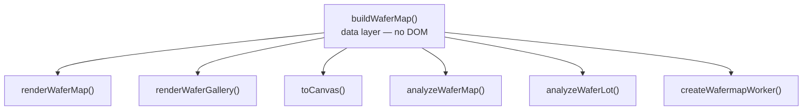
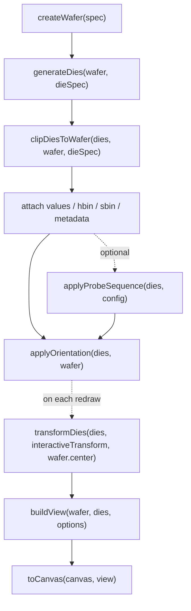

# API Reference

**For:** developers integrating the library. This is a reference, not a tutorial — if you're new, start with the [Quick Start](quickstart.md) and [Developer Guide](guide.md).

This document describes the public API exposed by `wafermap`.
For the system-level overview and recommended entry points, see [Architecture](architecture.md).

**How to read this document.** §3 is the section map — find your entry point there.
§4 (`buildWaferMap`, the data layer) plus §5 or §6 (the renderers) cover most
applications; §7 adds the findings engine. Cross-references use §N.N notation
throughout; shared types live in §12.

---

## 1 Coordinate system

**`x` and `y` throughout this API are die grid positions (prober step coordinates) — integers such as −7, 0, 5.  They are NOT millimetre values.  They must be JavaScript `number` type — CSV parsers return strings; always cast with `Number()` or `+` before passing to `buildWaferMap`.**

This matches what wafer test equipment outputs.  The library converts grid positions to physical mm internally using the die size you provide.

```text
prober outputs:  x=-5, y=3   (die grid position)
library computes: x_mm = -5 × 10 = -50 mm   (given die width = 10 mm)
```

Physical mm positions appear only on the `Die` output objects (`die.physX`, `die.physY`) and in the wafer model.  You never need to compute or supply mm values.

---

## 2 Quick Start

The step-by-step tutorial is [Quick Start](quickstart.md); this is the condensed call shape as a memory jogger:

```ts
import { buildWaferMap } from '@wafertools/wafermap';
import { renderWaferMap } from '@wafertools/wafermap/render';

// x,y are prober step positions (die grid indices), not mm.
const result = buildWaferMap({
  results:   rows.map(r => ({ x: +r.x, y: +r.y, hbin: +r.hbin, testValues: { 1010: +r.testA } })),
  waferConfig: { diameter: 300, notch: { type: 'bottom' } },
  dieConfig:   { width: 10, height: 10 },
  testDefs: [{ testNumber: 1010, name: 'TestA', unit: 'V' }],
});

renderWaferMap(document.getElementById('map'), result);
```

The map renders with a full built-in toolbar — no extra HTML or JavaScript needed. To add a statistical findings panel, pass the result through `analyzeWaferMap` — see §7.1.

---

## 3 API overview

If you want the shortest path to the right entry point before diving into the
type details, see [Architecture](architecture.md). It explains which layer to
use for data construction, rendering, analysis, and worker offloading.



| Section | Description |
|---|---|
| [4 `buildWaferMap`](#4-buildwafermapinput) | Data layer — primary entry point |
| [5 `renderWaferMap`](#5-renderwafermapcontainer-result-options) | Interactive canvas map with toolbar |
| [6 `renderWaferGallery`](#6-renderwafergallerycontainer-items-options-gallery) | Multi-map card grid |
| [7 Statistics / Findings](#7-statistics-findings-engine) | `analyzeWaferMap`, `analyzeWaferLot` |
| [8 Web Worker](#8-web-worker) | Off-main-thread rendering |
| [9 Low-level canvas API](#9-low-level-canvas-api) | `toCanvas` |
| [10 Package surface](#10-package-surface) | Subpath exports |
| [11 Advanced Pipeline](#11-advanced-manual-pipeline) | `buildView`, low-level API |
| [12 Important types](#12-important-types) | Key interfaces |
| [13 Limitations](#13-current-limitations) | Known constraints |

---

## 4 `buildWaferMap(input)`

The primary entry point.  Pass whatever data you have — prober step positions,
optional geometry hints, or a pre-built die array.  The function infers whatever
is missing and returns a fully constructed wafer model.

> **Inference reads geometry from the extent of the data.** When you supply only
> die positions, the wafer diameter and centre are derived from how far the data
> reaches.  This is correct whenever the data reaches the true wafer edge — a
> fully-populated wafer, or a **sparse** one (skip-sampled or randomly sampled
> positions missing across the whole face).  It is **wrong for *partial* data** —
> a contiguous region such as a half wafer, a single quadrant, or an off-centre
> cluster — because the extent stops short of the true edge, so the region is
> mistaken for a smaller full wafer and mis-centred.  For partial data supply
> `waferConfig.diameter` **and** `waferConfig.center` — see
> [§4.3 Inference levels](#43-inference-levels).  When the library detects
> likely-partial coverage with no anchor, it adds a structured warning to
> `result.warnings` (code `'partial-coverage'`).

**Server-safe:** `buildWaferMap` is a pure function with no DOM access or side
effects.  It can run in Node.js, Deno, a Web Worker, or any server-side environment.

```ts
import { buildWaferMap } from '@wafertools/wafermap';
```

### 4.1 Input

`buildWaferMap` accepts either an array of data points or an object. They are equivalent when no extra options are needed — the array form is just shorthand for `{ results: [...] }`:

```ts
// Array form — shorthand, equivalent to passing { results }
buildWaferMap(results: DieResult[])

// Object form — use when you need geometry hints or other options.
// WaferMapInput is a union: pass either results OR lotStack, never both.
buildWaferMap(input: WaferMapInput)
```

`WaferMapInput` is a discriminated union:

```ts
// Shared base (WaferMapInputBase) — all fields are optional:
type WaferMapInputBase = {
  waferConfig?:      WaferConfig,      // physical wafer geometry (diameter, notch, orientation…)
  dieConfig?:        DieConfig,        // die size and coordinate conventions
  dies?:             Die[],            // pre-built die array; skips geometry generation
  reticleConfig?:    ReticleConfig,    // stepper field grid overlay
  passBins?:         number[],         // bins counted as pass for yield (default [1])
  retestPolicy?:     'last' | 'first' | 'best' | 'worst', // how to handle multiple results at the same (x,y); default 'last'
  edgeDieYieldMode?: 'exclude' | 'denominator-only', // default 'exclude'
  testDefs?:         TestDef[],        // named test definitions — one per testValues entry
  hbinDefs?:         BinDef[],         // named hard bin definitions — one per distinct hbin value
  sbinDefs?:         BinDef[],         // named soft bin definitions — one per distinct sbin value
  metadataFields?:   MetadataFieldDef[], // opts a die.metadata key into the 'metadata' plot mode — §4.1.10
}

// Single-wafer variant (WaferMapInputSingle):
type WaferMapInputSingle = WaferMapInputBase & {
  results?:  DieResult[]   // per-die measurements from the prober
  lotStack?: never          // passing both results and lotStack is a type error
}

// Lot-stack variant (WaferMapInputLotStack):
type WaferMapInputLotStack = WaferMapInputBase & {
  lotStack:  LotStackConfig  // collapse multiple wafers into one aggregated map
  results?:  never            // passing both results and lotStack is a type error and runtime error
}

type WaferMapInput = WaferMapInputSingle | WaferMapInputLotStack
```

All fields are optional.  Supply what you know; the library handles the rest. Passing both `results` and `lotStack` on the same object is a type error and is rejected at runtime.

#### 4.1.1 `DieResult`

A single die record from wafer test equipment.

```ts
{
  x:           number                      // die grid X position (prober step coordinate)
  y:           number                      // die grid Y position (prober step coordinate)
  testValues?: Record<number, number>      // preferred: test measurements keyed by stable test identity
                                           // e.g. { 1050: 1.42e-3, 1060: 0.487, 1070: 8.3e-12 }
                                           // the key is any stable integer per test — for example an STDF TEST_NUM,
                                           // a database test ID, or an application-defined constant
  testPass?:   Record<number, boolean>     // recorded per-test pass/fail verdicts keyed the same way (true = pass)
                                           // parametric tests: value in testValues, optionally the tester's verdict here
                                           // (e.g. STDF PTR TEST_FLG); functional tests (testType 'F'): verdict here ONLY —
                                           // they have no measured value. e.g. { 2001: true, 2002: false }
  values?:     number[]                    // @deprecated: use testValues. Positional array — fragile when tests are added or removed
  hbin?:       number                      // hard bin assignment (physical sort result; STDF V4 range 0–32767)
  sbin?:       number                      // soft bin assignment (test-program failure category; independent 0–32767 space)
  siteNum?:    number                      // STDF site_num — which parallel test site tested this die
                                           // enables test-site analysis in analyzeWaferMap when ��2 distinct
                                           // values each appear on ≥3 dies (indicating a multi-site probe card)
  partId?:     number                      // STDF pir.part_id — tester-assigned identifier for this unit
                                           // at most fabs this encodes probe sequence (the step order across the wafer)
                                           // but the field is semantically neutral — its meaning is fab-specific
                                           // note: STDF part_id is 1-based; camelCase follows the library convention
}
```

A single test result: `testValues: { 1050: 0.95 }`

When a die position appears more than once in the `results` array (a retest), the
`retestPolicy` field on `WaferMapInput` controls which result is kept.  The
`die.retestCount` field always records how many times that position appeared.

#### 4.1.2 `WaferConfig`

```ts
{
  diameter?:      number         // wafer diameter in mm; inferred from grid extent × pitch if omitted
  center?:        { x: number, y: number }
                  // prober coordinate that lies at the physical wafer centre.
                  // Supply for partial data (a contiguous half/quadrant/slice that
                  // stops short of the wafer edge); anchors placement to the true
                  // centre. Not needed for sparse full-extent data. Does NOT change
                  // die.x/die.y labels.
                  // When omitted, the centre is inferred as the data midpoint (full-wafer assumption).
  notch?:         { type: 'top' | 'bottom' | 'left' | 'right' }
                  // physical orientation mark direction; standard dimensions derived from diameter:
                  //   ≤ 100 mm → 32.5 mm orientation flat  (SEMI M1)
                  //   ≤ 150 mm → 57.5 mm orientation flat  (SEMI M1)
                  //   > 150 mm → V-notch ~3.5 mm wide, 1.25 mm deep  (SEMI M1)
  orientation?:   number         // degrees CW to rotate the die grid on screen; default 0 (see note below)
  edgeExclusion?: number         // exclusion band width in mm measured inward from the wafer edge; dies in this band are dimmed
                                 // how these dies affect yield is controlled by the top-level edgeDieYieldMode option (§4.1.10)
  metadata?:      WaferMetadata  // arbitrary lot/wafer-level data attached to the view (lot ID, date, etc.)
}
```

**`orientation` note:** positive values rotate the die grid clockwise.  The notch/flat position is controlled by `notch.type` and is **not** affected by `orientation` — it stays fixed as the physical alignment mark.


#### 4.1.3 `DieConfig`

```ts
{
  width?:              number   // die width in mm (= X step pitch); enables physical mm coordinates
  height?:             number   // die height in mm (= Y step pitch); enables physical mm coordinates
  coordinateOrigin?:   {
    // where the prober places coordinate (0,0) on the wafer grid
    type: 'center'           // default — grid already centred; centroid offset applied automatically
        | 'LL'               // (0,0) at lower-left corner (standard STDF/KLA output)
        | 'UL'               // (0,0) at upper-left corner — positive Y runs downward (flips display Y)
        | 'LR'               // (0,0) at lower-right corner — positive X runs leftward (flips display X)
        | 'UR'               // (0,0) at upper-right corner — both axes flipped
        | 'custom'           // manual offset: centre = (0,0) + offset in grid steps
    offset?: { x: number; y: number }   // grid-step offset to the true centre; only used when type is 'custom'
  }
  yAxisDirection?: 'up' | 'down'     // which direction Y increases on the prober; 'down' for row/matrix probers (default 'up')
  xAxisDirection?: 'right' | 'left'  // which direction X increases; 'left' for backside or mirrored probing (default 'right')
}
```

When `width` and `height` are omitted, the library estimates die dimensions from
the grid layout using nearest-neighbour step analysis first, falling back to the
circular-wafer aspect-ratio constraint.


#### 4.1.4 `ReticleConfig`

```ts
{
  width:      number               // stepper field width in number of dies (e.g. 4 means 4 dies wide)
  height:     number               // stepper field height in number of dies
  anchorDie?: { x: number; y: number }
               // die grid index (x, y), in original die coordinates (die.x/die.y),
               // that sits at the reticle field's min-x/min-y corner (bottom-left,
               // since +Y is up) — i.e. it becomes the leftmost, bottom-most die
               // of the field it belongs to. Shifts the entire reticle grid so
               // this die aligns to a field boundary.
               // Default {0,0} — die (0,0) is at a corner.
}
```

When provided, reticle overlays are shown by default (`showReticle` defaults to `true`).

#### 4.1.5 `LotStackConfig`

Collapse data from multiple wafers into a single map before rendering.  When `lotStack`
is present the top-level `results` field is ignored.

```ts
{
  results:    DieResult[][]  // input data — one DieResult[] per wafer in the lot
  method:     // aggregation applied per die position across all wafers:
    | 'mean'       // arithmetic mean of values → testValues[0]
    | 'median'     // median of values → testValues[0]
    | 'stddev'     // sample standard deviation of values → testValues[0]
    | 'min'        // minimum value across lot → testValues[0]
    | 'max'        // maximum value across lot → testValues[0]
    | 'count'      // number of wafers that provided a value at this position → testValues[0]
    | 'countBin'   // how many wafers had targetBin at this position → testValues[0]
    | 'mode'       // most frequent bin across wafers → hbin
    | 'percent'    // percentage of wafers that had targetBin → testValues[0] in [0,100]
  targetBin?: number   // bin value to count or measure; required for 'countBin' and 'percent'
}
```

#### 4.1.6 `passBins`

```ts
passBins?: number[]   // default [1]  (industry convention: bin 1 = pass)
```

Bin values that count as pass for yield calculation.  Set to `[]` to suppress yield.

#### 4.1.7 `retestPolicy`

```ts
retestPolicy?: 'last' | 'first' | 'best' | 'worst'   // default 'last'
```

Controls how the library handles multiple results for the same die position (retests).
In wafer test it is common for a die to be tested more than once — for example after
a recontact, a temperature retest, or a continuity retest.

| Policy | Behaviour |
| ------ | --------- |
| `'last'` (default) | Keep the most recent result — the last entry in `results` for that position |
| `'first'` | Keep the earliest result — the first entry in `results` for that position |
| `'best'` | Keep the best result using `passBins` as the primary criterion: a pass result always beats a fail result. When both candidates are in the same pass/fail category, the lower `hbin` number is the tiebreaker. Falls back to `'last'` when any candidate has no `hbin`. |
| `'worst'` | Keep the worst result: a fail result always beats a pass result. When both are in the same category, the higher `hbin` number wins. Falls back to `'last'` when any candidate has no `hbin`. |

Regardless of which policy is active, `die.retestCount` is always set on any die that
appeared more than once in the input.  Use it to identify retested dies in your own
analysis without needing to re-scan the raw results.

```ts
// Last result wins (default — no field needed):
buildWaferMap({ results })

// Explicitly keep first result:
buildWaferMap({ results, retestPolicy: 'first' })

// Check how many retests occurred after the map is built:
result.dies.filter(d => d.retestCount !== undefined)
  .forEach(d => console.log(`Die (${d.x},${d.y}) tested ${d.retestCount} times`));
```

#### 4.1.8 `TestDef`

Named definition for one test parameter. The toolbar mode dropdown always offers one entry per test — using `testNumber` as the label when `testDefs` is absent. When `testDefs` is provided, tooltips show `"Idsat: 1.23 mA"` with the test name and SI-scaled unit; without it they fall back to `"Test 1050: 1.23 mA"`.

```ts
{
  testNumber:  number  // required: stable test identity matching the key used in DieResult.testValues
                       // e.g. an STDF TEST_NUM, a database test ID, or an application-defined constant
  name:        string  // e.g. "Idsat", "Vth", "Continuity"
  unit?:       string  // SI base unit, e.g. "A", "V", "Ω", "F" — the formatter applies SI prefixes
                       // automatically (0.03 Ω → "30 mΩ"), so always pass the base unit, never a
                       // pre-scaled unit like "mA" or "µV"
  logScale?:   boolean // when true, value normalization and the colorbar use log₁₀ scale for this test
                       // silently falls back to linear when any die value is ≤ 0; default false
  limitLow?:   number  // lower specification limit in the same units as the test value
                       // values below this are out-of-spec; drives out-of-spec coloring and spec yield stats
  limitHigh?:  number  // upper specification limit in the same units as the test value
                       // values above this are out-of-spec
                       // both limits are optional independently — one-sided limits are valid
  testType?:   'P' | 'F'  // 'P' = parametric (continuous measured value, the default),
                       // 'F' = functional (pass/fail outcome ONLY, no measured value —
                       // e.g. an STDF FTR; the verdict lives in DieResult.testPass).
                       // Functional tests stay selectable in value mode but always render
                       // as test pass/fail (solid green/red with a Pass/Fail legend), and
                       // are excluded from all parametric statistics — per-test stats
                       // tables, capability, correlation, distribution charts, value
                       // stacks, and regional value findings (a mean or Cpk of a binary
                       // outcome would be meaningless). They get pass-rate analysis
                       // instead: stats.functionalYield, "Functional Tests" tables, and
                       // regional pass-rate findings (kind 'functionalTest')
}
```

`testNumber` must match the key used in `DieResult.testValues` / `DieResult.testPass`.

`isParametricTest(def)` (exported) returns `false` only for `testType: 'F'` — an undefined def or undefined `testType` counts as parametric, so untyped callers are unaffected.

**Legacy functional encoding:** callers that predate `DieResult.testPass` encoded a functional outcome as a `testValues` entry of `1` (pass) / `0` (fail). That data keeps working everywhere — rendering, stats, and findings all read verdicts through `getTestPassStatus` (§10.1), which documents the fallback. New code should write `testPass` and leave functional tests out of `testValues` entirely.

#### 4.1.9 `BinDef`

Named definition for one bin number.  Used for both hard bin (`hbinDefs`) and soft bin (`sbinDefs`) — the shape is identical but the number spaces are independent.

Per STDF V4, hard bins and soft bins each range 0–32767.  Bin 1 in hard bin space and bin 1 in soft bin space are different things and may have different names — always pass them as separate arrays.

```ts
{
  bin:    number   // the numeric bin value this defines
  name:   string   // e.g. "Pass", "Contact Open", "Vth - Hi NMOS"
  color?: string   // optional CSS color override, e.g. "#2ecc71" — overrides the active colour scheme
}
```

**Hard bins** (`hbinDefs`) are the physical sort result — where the part goes on the handler.  **Soft bins** (`sbinDefs`) are the logical test-program classification — the failure category as determined by the test algorithm, used for debug and yield analysis.  Many soft bins typically map to one hard bin.

#### 4.1.10 `edgeDieYieldMode`

```ts
edgeDieYieldMode?: 'exclude' | 'denominator-only'   // default 'exclude'
```

Controls how dies within the edge exclusion zone (`waferConfig.edgeExclusion`) are treated in yield calculation.

| Value | Behaviour |
| ----- | --------- |
| `'exclude'` (default) | Edge dies are excluded from both numerator and denominator. `YieldSummary.yieldPercent` reflects only the interior dies. |
| `'denominator-only'` | Edge dies are counted in the denominator but never in the pass numerator. Produces **gross die yield** — the industry metric for quantifying yield loss due to edge effects. `YieldSummary.yieldPercentGross` is populated with this value; `yieldPercent` is also populated for comparison. |

```ts
const result = buildWaferMap({
  results,
  waferConfig:      { diameter: 300, edgeExclusion: 3 },
  dieConfig:        { width: 8, height: 12 },
  edgeDieYieldMode: 'denominator-only',
});

const { yieldPercent, yieldPercentGross } = result.yield;
// yieldPercent      — interior-only yield (edge dies excluded entirely)
// yieldPercentGross — gross die yield (edge dies counted against you)
```

#### 4.1.11 `MetadataFieldDef`

Named definition for one `die.metadata` key, opting it into the **`'metadata'` plot mode** — a generic categorical/layout view, distinct from test results and bins. Use this for any per-die classification that isn't a test outcome: which project a die belongs to on a multiproject wafer, vendor/third-party ownership, reserved/shared/unassigned areas, or any other host-defined grouping already carried in `die.metadata`.

```ts
{
  key:     string    // the die.metadata key this definition applies to
  label?:  string     // display name for the toolbar entry and map title — default: Title Case of key
  values?: Array<{ value: string; label?: string; color?: string }>  // optional per-value overrides
}
```

A key is only offered in the toolbar's "Metadata" mode-menu section when it appears in `metadataFields` **and** at least one die actually has that key set — presence in `metadataFields` is an explicit opt-in, never auto-detected. `values` is optional per field: distinct values with no override are still shown, auto-labeled with the raw (stringified) value and auto-colored from an ordered qualitative palette (assigned in natural alphanumeric order by value — so `D2` precedes `D10` rather than following it — making colors stable across reloads and the legend order predictable — not the pass/fail-flavored palette `hardBinColor` uses, since an arbitrary metadata field has no universal "good/bad" meaning).

```ts
const result = buildWaferMap({
  results: [
    { x: 4, y: -2, hbin: 1, metadata: { project: 'Project A', device: 'Device 12' } },
    { x: 5, y: -2, metadata: { project: 'vendor' } }, // vendor die — no test/bin data at all
  ],
  waferConfig: { diameter: 300 },
  dieConfig:   { width: 10, height: 10 },
  metadataFields: [
    { key: 'project', label: 'Project', values: [
      { value: 'Project A', color: '#4e79a7' },
      { value: 'vendor',    label: 'Third-party vendor', color: '#bab0ac' },
    ] },
  ],
});

renderWaferMap(container, result, { viewOptions: { plotMode: 'metadata', activeMetadataKey: 'project' } });
```

**Key properties of this mode:**

- **Coexists with test/bin data** — a die can carry `hbin`/`testValues` *and* a metadata classification at the same time; `'metadata'` is just another selectable toolbar view of the same underlying die, the same way `hardBin`/`softBin`/`value` already are. `die.metadata` already renders in every tooltip regardless of plot mode, so switching into `'metadata'` mode changes the map's colour/legend without changing what the tooltip shows.
- **No lot-stacking.** `'metadata'` is deliberately excluded from the stacked/lot-aggregation modes (`stackedValues`/`stackedBins`/`stackedSoftBins`) — a die's layout classification is a constant of the design, not a per-wafer measurement, so there is nothing meaningful to aggregate across a lot.
- **Never affects yield.** `die.metadata` was never part of the yield-eligibility pipeline, so a `'metadata'`-classified die's yield/pass-fail status (if it has one) is entirely unaffected by this mode.
- **Click-to-highlight in the legend**, exactly like `hardBin`/`softBin`: clicking a legend swatch dims every die except that value (`highlightMetadataValue`, the string-keyed analogue of `highlightBin`); clicking the same swatch again clears it.
- Reuses wafer geometry, tooltip, selection, zoom, and PNG export unchanged — none of those are plot-mode-aware. The one thing genuinely new is the colour fill, the legend, and the toolbar entry.

### 4.2 Return value

```ts
{
  wafer:         Wafer          // resolved wafer model (diameter, radius, center, notch, orientation)
  dies:          Die[]          // all dies inside the wafer boundary, with testValues/hbin/sbin attached
  plotMode:      PlotMode       // the plot mode chosen by buildWaferMap ('hardBin', 'value', etc.)
  metadata:      WaferMetadata | null  // wafer metadata from waferConfig.metadata
  isLotStack:    boolean        // true when built from lotStack input
  aggrMethod?:   string         // lot-stack aggregation method ('mean', 'median', 'countBin', …); undefined for single wafers
  lotSize?:      number         // number of wafers aggregated when built from lotStack; undefined for single wafers
  hbinDefs?:     BinDef[]       // named hard bin definitions passed to buildWaferMap
  sbinDefs?:     BinDef[]       // named soft bin definitions passed to buildWaferMap
  testDefs?:     TestDef[]      // named test definitions passed to buildWaferMap
  metadataFields?: MetadataFieldDef[]  // named metadata-field definitions passed to buildWaferMap — §4.1.11
  reticles:      Reticle[]      // generated reticle geometry — wired automatically when passed as a WaferMapDisplayItem
  reticleConfig: ReticleConfig | undefined  // the reticle config that was used; passed through to analyzeWaferMap automatically
  units:   'mm' | 'normalized'   // coordinate space of die.physX/die.physY and wafer dimensions
  warnings: WaferWarning[]       // structured geometry-inference advisories — always present (may be empty).
                                  // Surfaced automatically by renderWaferMap/renderWaferGallery in the
                                  // toolbar's warning indicator; read here for programmatic use. §4.2.2
                                  // { code: string; message: string;
                                  //   severity?: 'error' | 'warning' | 'info'; confidence?: number }
                                  // All three geometry codes below are severity 'error': they mean die
                                  // positions may be wrong, not that a feature is missing.
                                  // Codes:
                                  //   'partial-coverage'  — data does not span a full wafer; inferred
                                  //     diameter/centre may be wrong. Supply waferConfig.center + .diameter.
                                  //   'geometry-conflict' — waferConfig.diameter AND dieConfig.width/
                                  //     height were BOTH supplied, and are too small to contain the
                                  //     probed dies. A die with results is a real prober position and is
                                  //     always fully on the wafer, so the two supplied values contradict
                                  //     each other; check them against the real device.
                                  //   'inferred-pitch' — waferConfig.diameter was supplied without a die
                                  //     pitch, so pitch was derived as diameter ÷ grid span (assumes the
                                  //     data spans the full wafer — wrong whenever edge dies are absent).
                                  //     Supply dieConfig.width/height. NOTE: 'geometry-conflict' is never
                                  //     raised in this case — pitch is a free scaling parameter, so with
                                  //     no supplied pitch there is always one that "fits", and a fit
                                  //     check would otherwise fire on perfectly good full-wafer data.
  inference: {
    wafer:    { confidence: number; method: string }   // how diameter was resolved; confidence 0–1.
                                                        // method is 'inferred-partial' when partial data was detected
    diePitch: { confidence: number; units: 'mm' | 'normalized' }  // how die size was resolved
    grid:     { confidence: number }                   // quality of the grid index assignment
    warnings?: string[]                                // @deprecated: mirrors result.warnings[].message; use result.warnings instead
  }
  dataCoverage: {
    filledDies:       number   // dies with at least one value or bin attached
    totalDies:        number   // POSITIONED dies inside the wafer boundary (including partial) — 0 for a
                                // fully coordinate-less wafer; see unpositionedDies below, not this, for
                                // "how many dies does this wafer actually have"
    edgeExcludedDies: number   // dies whose centres fall within the edge exclusion band
    ratio:            number   // filledDies / totalDies ∈ [0, 1] — undefined/misleading when totalDies is 0
    unpositionedDies: number   // dies with no reported x/y at all (see §12.1's coordinate-less note) —
                                // always present, 0 when every die has a position
  }
  yield: YieldSummary   // pass/fail statistics computed against passBins — NOT scoped to positioned dies,
                         // unlike dataCoverage above; a coordinate-less die with bin data still counts
}
```

#### 4.2.1 `YieldSummary`

```ts
{
  passDies:          number          // dies with a bin in passBins
  failDies:          number          // full dies inside wafer with a bin not in passBins
  edgeExcludedDies:  number          // dies within the edge exclusion zone
  partialDies:       number          // dies straddling the wafer boundary
  totalDies:         number          // passDies + failDies (edge-excluded not included)
  yieldPercent:      number | null   // (passDies / totalDies) × 100 ∈ [0, 100]; null when no bin data
  yieldPercentGross: number | null   // (passDies / (passDies + failDies + edgeExcludedDies)) × 100 ∈ [0, 100];
                                     // only set when edgeDieYieldMode: 'denominator-only'; otherwise null
}
```

Partial dies are excluded from both numerator and denominator. Edge-excluded dies are excluded by default (`edgeDieYieldMode: 'exclude'`); set `edgeDieYieldMode: 'denominator-only'` to include them in the denominator for gross die yield.

**`result.yield.yieldPercent` vs `summary.stats.yieldPercent`** — both are in \[0, 100\] and can differ when you pass custom options to `analyzeWaferMap` (e.g. a different `edgeDieYieldMode` or `passBins`). Use `result.yield` for rendering and quick checks; use `summary.stats.yieldPercent` when you need the yield that is consistent with the findings analysis.

**`units`** tells you the coordinate space of the physical coordinates (`die.physX`, `die.physY`) and wafer dimensions; `die.x`/`die.y` remain die grid positions (prober step coordinates):

- `'mm'` — at least one physical dimension was known (die size or wafer diameter); physical coordinates (die.physX/die.physY and wafer dimensions) are expressed in millimetres.
- `'normalized'` — only grid positions were supplied; physical coordinates are in normalized units (aspect ratio preserved) with `pitchX = 1` normalized unit by convention.

### 4.3 Inference levels

The library adapts to whatever geometry context you provide.  Four distinct levels:

| Provided | Inferred | `units` |
| -------- | -------- | ------- |
| grid positions only | Pitch from nearest-neighbour step analysis; diameter from grid extent | `'normalized'` |
| grid positions + die size | Diameter from grid extent × pitch | `'mm'` |
| grid positions + wafer diameter | Die size from `diameter / grid_extent` | `'mm'` |
| grid positions + die size + diameter | Nothing — fully specified | `'mm'` |

> **All four levels assume the data spans a full, roughly symmetric wafer
> centred near the prober origin.** The diameter and centre are derived from the
> *extent of the data you pass*. See "Minimum geometry for partial data" below
> before relying on inference for anything less than a full wafer.

**Diameter snapping:** inferred diameters snap to industry-standard sizes.
100 mm, 150 mm, 200 mm, and 300 mm are preferred (±10% tolerance); other SEMI
standard sizes (25 / 50 / 75 / 450 mm) are tried next (±20%); remaining values
are rounded to the nearest 10 mm.

**Origin:** defaults to `'center'` (centroid offset applied automatically). Set `coordinateOrigin: { type: 'LL' }` explicitly for standard STDF/KLA output where (0,0) is at the lower-left corner.

#### 4.2.2 `WaferWarning`

The library's one warning vocabulary. Raised by geometry inference on
`WaferMapResult.warnings`, and by analysis on `StatsSummary.stats.warnings`.

```ts
{
  code:      string   // stable machine-readable key — BRANCH ON THIS, not on message
  message:   string   // human-readable, suitable for direct display
  severity?: 'error' | 'warning' | 'info'   // default 'warning' when absent
  confidence?: number // inference confidence 0–1, when one applies
}
```

**Codes**

| Code | Severity | Meaning |
| --- | --- | --- |
| `partial-coverage` | `error` | Data does not span a full wafer; inferred diameter/centre may be wrong and dies may be mis-positioned. Supply `waferConfig.center` + `.diameter`. |
| `geometry-conflict` | `error` | `waferConfig.diameter` and `dieConfig.width`/`height` were both supplied and cannot contain the probed dies. |
| `inferred-pitch` | `error` | `diameter` supplied without a die pitch, so pitch was derived as `diameter ÷ grid span` — wrong whenever edge dies are absent. |
| `test-count-capped` | `warning` | More tests found than `analyzeWaferMap` will analyse, so **no test findings were computed at all**. Pass `testNumbers` to scope it. |

`severity` is about trust in what is on screen, not about how loud the message is:
`'error'` means the map may be **positionally wrong**; `'warning'` means something
expected is missing or degraded but what is drawn is correct. The union of `code`
is deliberately open to `string` so new advisories are not a breaking change —
switch with a `default` branch.

These are surfaced automatically — see [`WarningsOptions`](#510-warnings).

#### Minimum geometry for partial data

Inference works backwards from the data's bounding extent. What matters is
whether the data **reaches the true wafer edge**:

- **Sparse data** — positions missing across the whole wafer (systematic
  skip-sampling, e.g. 1-in-4, or random sampling). The extent still reaches the
  edge, so diameter and centre infer correctly. **No geometry hints required.**
- **Partial data** — a contiguous region that stops short of the edge: a half
  wafer, a single quadrant, a slice, or an off-centre cluster. The extent
  understates the wafer, so the region is mistaken for a smaller full wafer and
  re-centred on its own midpoint. Inference is **wrong** here.

An **edge ring / annulus** is a middle case: only outer dies are present, but
they reach the true edge, so the diameter is right — only the empty interior is
"missing", which is harmless.

For partial data, supply both:

| Field | Meaning |
| ----- | ------- |
| `waferConfig.diameter` | the true wafer diameter in mm |
| `waferConfig.center` | the prober coordinate `(x, y)` that lies at the physical wafer centre |

`waferConfig.center` anchors placement to the real centre. It does **not** change
the public `die.x` / `die.y` labels — those remain the original prober
coordinates. (Supplying `dieConfig.width`/`height` for the pitch is recommended
too, so coordinates are in real mm.)

Detection is heuristic: the library flags likely-partial coverage by how far the
data centroid sits from its bounding-box centre. Contiguous partial regions are
caught; an off-centre cluster small enough to look like a tiny full wafer, and an
edge ring (centroid-symmetric), are not flagged — when in doubt, set
`waferConfig.center` explicitly rather than relying on the warning.

```ts
// Right half of a 300 mm wafer; prober (0,0) is the wafer centre.
const result = buildWaferMap({
  results,                                   // prober x ∈ [0..15], y ∈ [-15..15]
  waferConfig: { diameter: 300, center: { x: 0, y: 0 } },
  dieConfig:   { width: 10, height: 10 },
});
```

When the library detects likely-partial data and no `center` was supplied, it
adds a structured warning to `result.warnings` (code `'partial-coverage'`) and sets
`result.inference.wafer.method` to `'inferred-partial'` — check these
programmatically rather than relying on console output.

### 4.4 Examples

**Minimal — grid positions only (normalized units):**

```ts
const result = buildWaferMap([
  { x: 0, y:  0, testValues: { 1050: 0.95 } },
  { x: 1, y:  0, testValues: { 1050: 0.87 } },
  { x: 0, y: -1, testValues: { 1050: 0.91 } },
]);
// result.units === 'normalized'
```

**With die size — physical mm coordinates:**

```ts
const result = buildWaferMap({
  results:   data,
  dieConfig: { width: 10, height: 10 },
});
// result.units === 'mm'
```

**Fully specified with notch:**

```ts
const result = buildWaferMap({
  results:     data,
  waferConfig: { diameter: 300, notch: { type: 'bottom' }, orientation: 90 },
  dieConfig:   { width: 10, height: 10 },
});
```

**With bin data and edge exclusion:**

```ts
const result = buildWaferMap({
  results:     csvRows.map(r => ({ x: Number(r.x), y: Number(r.y), hbin: Number(r.hbin) })),
  waferConfig: { diameter: 200, edgeExclusion: 3 },
  dieConfig:   { width: 8, height: 8 },
});
console.log(result.yield.yieldPercent);
```

**Multiple tests and bins in a single pass:**

```ts
const result = buildWaferMap({
  results: rows.map(r => ({
    x: +r.x, y: +r.y,
    testValues: { 1010: +r.testA, 1020: +r.testB, 1030: +r.testC },
    hbin: +r.hbin,
    sbin: +r.sbin,
  })),
  testDefs: [
    { testNumber: 1010, name: 'Idsat', unit: 'A' },
    { testNumber: 1020, name: 'Vth',   unit: 'V' },
    { testNumber: 1030, name: 'Ioff',  unit: 'A' },
  ],
  dieConfig: { width: 10, height: 10 },
});
```

**Reticle overlay phased to die (2, 1):**

```ts
const result = buildWaferMap({
  results:   data,
  dieConfig: { width: 10, height: 10 },
  reticleConfig: { width: 4, height: 2, anchorDie: { x: 2, y: 1 } },
});
```

**Multi-wafer lot stack — count bin 2 failures across six wafers:**

```ts
const result = buildWaferMap({
  waferConfig: { diameter: 300 },
  dieConfig:   { width: 10, height: 10 },
  lotStack: {
    results:   [wafer1, wafer2, wafer3, wafer4, wafer5, wafer6],
    method:    'countBin',
    targetBin: 2,
  },
});
```

**Row-based prober (y increases downward, origin at upper-left):**

```ts
const result = buildWaferMap({
  results:   data,
  dieConfig: { width: 10, height: 10, coordinateOrigin: { type: 'UL' } },
});
```

**Retests — keep first result, surface retest count in tooltip:**

```ts
// Raw results may include the same (x, y) more than once.
// 'first' keeps the initial test; 'last' (default) keeps the most recent.
const result = buildWaferMap({
  results:      rawResults,
  retestPolicy: 'first',
  waferConfig:  { diameter: 300, notch: { type: 'bottom' } },
  dieConfig:    { width: 10, height: 10 },
});

// die.retestCount is set (to the total count) whenever a position was retested.
const retested = result.dies.filter(d => d.retestCount !== undefined);
console.log(`${retested.length} die positions were retested`);
// e.g. → "47 die positions were retested"
// The built-in tooltip automatically shows "Retests: N" for retested dies.
```

### 4.5 Post-enrichment

When you need to attach additional values after the map is built, use `getDieKey`
for stable lookups:

```ts
import { buildWaferMap, getDieKey } from '@wafertools/wafermap';

const result = buildWaferMap({ results: primaryData, waferConfig, dieConfig });

const rowMap = new Map(rows.map(r => [getDieKey({ x: +r.x, y: +r.y }), r]));
const enrichedDies = result.dies.map(d => {
  const row = rowMap.get(getDieKey(d));
  if (!row) return d;
  return {
    ...d,
    testValues: { 1010: +row.testA, 1020: +row.testB, 1030: +row.testC },
    hbin:       +row.hbin,
    sbin:       +row.sbin,
  };
});
```

> **`getDieKey`** always use this for stable die lookups rather than ad-hoc template
> literals — it guarantees a consistent `"x,y"` format across grid offset corrections.

---

## 5 `renderWaferMap(container, result, options?)`

A fully self-contained interactive wafermap. Accepts a `WaferMapResult` directly,
owns view building internally, and provides a **built-in toolbar** that appears on
hover — wafermap-specific controls always in the same place.

```ts
renderWaferMap(container: HTMLElement, result: WaferMapResult, options?: RenderOptions): WaferMapController
```

`renderWaferMap` accepts any block `HTMLElement` as `container` — the function
creates and manages its own `<canvas>` inside it, sized to fill the container
(`width: 100%; height: 100%`). Width comes from document flow, but the canvas can
only fill a **resolved height**. A plain block `<div>` in normal flow works (it
grows to the map), but a flex or grid child whose ancestors never resolve a height
collapses to zero — the map is then invisible and the library logs a warning. Give
the container a height with any of:

```html
<!-- Fixed size: -->
<div id="map" style="width: 600px; height: 600px;"></div>

<!-- Responsive square (height follows width): -->
<div id="map" style="width: 100%; aspect-ratio: 1;"></div>
```

```ts
// Or let the library size it — no container CSS needed:
renderWaferMap(container, result, { height: 600 }); // px, or '70vh', etc.
```

See [Troubleshooting → Map is blank, invisible, or the wrong height](troubleshooting.md)
for all four valid sizing patterns.

`maxSize` is an independent cap, not a substitute for giving the container a
resolved height: it stops the map from growing past a fixed pixel ceiling once
the container (or `height`) is large, top-left aligning the map within any
leftover space rather than stretching to fill it.

```ts
// Container/viewport may be huge; the map itself never exceeds 400×400px:
renderWaferMap(container, result, { height: 600, maxSize: 400 });
```

Passing an `HTMLCanvasElement` directly is deprecated but still works for one release.

The toolbar gives users direct access to every display option without any app-level
chrome: plot mode, colour scheme, ring and quadrant overlays, die labels, rotate,
flip, zoom, box-select, and PNG download. An **expand** button (⛶) in the toolbar
opens the map in an enlarged modal overlay using canvas reparenting — no second
controller is created. A maximise button inside the modal grows it to fill the window.

```ts
import { buildWaferMap } from '@wafertools/wafermap';
import { renderWaferMap } from '@wafertools/wafermap/render';

const result = buildWaferMap({ results, passBins });
const ctrl = renderWaferMap(document.getElementById('map'), result, { showToolbar: true });
```

### 5.1 `WaferViewOptions`

`viewOptions` controls the initial display state of the map — which plot mode to show, the
colour scheme, overlays, orientation, and so on. Every field is optional; the toolbar lets
users change all of them at runtime. Pass `viewOptions` inside `RenderOptions`:

```ts
renderWaferMap(container, result, {
  viewOptions: {
    plotMode:      'value',
    activeTest:    1060,       // testNumber to show (must match a testDef.testNumber)
    colorScheme:   'viridis',
    showDieLabels: true,
  },
});
```

To read or update options programmatically after mount, use the controller:

```ts
const ctrl = renderWaferMap(container, result, options);

ctrl.getOptions();                         // → current WaferViewOptions snapshot
ctrl.setOptions({ plotMode: 'softBin' });  // merge — only listed keys change
```

#### Field reference

| Field | Type | Default | Notes |
|---|---|---|---|
| `plotMode` | `PlotMode` | `'hardBin'` | `'hardBin'` \| `'softBin'` \| `'value'` \| `'stackedValues'` \| `'stackedBins'` \| `'stackedSoftBins'` \| `'metadata'` |
| `colorScheme` | `string` | `'default'` | Built-in: `'default'` `'viridis'` `'greyscale'` `'accessible'` `'plasma'` `'inferno'` `'traffic'` `'thermal'`. Custom schemes via `registerColorScheme()`. Not used in `'metadata'` mode (always the dedicated ordered palette + `MetadataFieldDef.values[].color` overrides — §4.1.11). |
| `activeTest` | `number` | `0` | testNumber to display in `value` mode — must match a `testDef.testNumber`, not a positional index |
| `activeMetadataKey` | `string` | — | `die.metadata` key to display in `'metadata'` mode — must match a `metadataFields[].key` (§4.1.11) |
| `passFailDisplay` | `'off' \| 'spec' \| 'test'` | `'off'` | Requested pass/fail display for `value` mode. `'spec'` colours dies by spec-limit judgement (green / blue fail-low / red fail-high; degrades to `'off'` when the active test has no limits). `'test'` colours dies by the tester's own verdict from `die.testPass` (green pass / red fail, undirected; degrades to `'off'` when no die has a verdict for the active test). The library resolves the effective display — a functional active test (`testType: 'F'`) always renders as `'test'` regardless of this option. Both solid displays replace the colorbar with a Pass/Fail legend carrying per-category die counts, and the map title's secondary line names which is shown (`Spec pass/fail` vs `Tester pass/fail` vs `Functional pass/fail`). Toggled via the Overlays toolbar menu, whose two entries appear only when valid for the active test. |
| `highlightBin` | `number` | — | Dim all bins except this one. Clicking a bin/soft-bin legend swatch toggles it. |
| `highlightMetadataValue` | `string` | — | `'metadata'` mode's analogue of `highlightBin` — dim every die except this metadata value. Clicking a metadata legend swatch toggles it. |
| `valueRange` | `[number, number] \| { test, range }` | auto | Explicit range for value colour normalization; overrides `colorbarRangeMode`. Tuple applies to the active test (caller owns the coupling). Object `{ test, range }` applies only when `test` matches the active test, else it is ignored and the view auto-scales — use this to safely fix a range computed for a specific test. |
| `colorbarRangeMode` | `'spec' \| 'data'` | `'spec'` | Controls **only** the colorbar's numeric range when the active test has spec limits: `'spec'` spans `[limitLow, limitHigh]`; `'data'` spans the actual data min/max. In both ranges all dies are coloured by the gradient and out-of-spec dies are flagged with a triangle marker (▽ below `limitLow`, △ above `limitHigh`) over their gradient fill — so the distribution stays readable while out-of-spec dies remain visibly flagged. The marker is drawn black or white per die for contrast against its own gradient fill, so it stays visible under any colour scheme. Ignored under `passFailDisplay: 'spec'` (pass/fail mode always uses spec limits and fills dies solid green/blue/red). |
| `logScale` | `boolean` | from `TestDef` | Override log₁₀ scale for the active test; falls back to linear when vMin ≤ 0 |
| `aggregationMethod` | `string` | `'mean'` | Aggregation method in `stackedValues` mode: `'mean'` \| `'median'` \| `'stddev'` \| `'min'` \| `'max'` \| `'count'` |
| `lotSize` | `number` | — | Total wafers in lot — percentage denominator in `stackedBins`/`stackedSoftBins` tooltips |
| `rotation` | `0 \| 90 \| 180 \| 270` | `0` | Clockwise rotation in degrees |
| `flipX` | `boolean` | `false` | |
| `flipY` | `boolean` | `false` | |
| `showDieLabels` | `boolean` | `false` | Die index labels |
| `showPartialDies` | `boolean` | `true` | Render partial (edge) dies in muted grey. Set to `false` to hide them, matching real prober behaviour where edge positions outside the wafer circle are never tested. |
| `showRingBoundaries` | `boolean` | `false` | |
| `showQuadrantBoundaries` | `boolean` | `false` | |
| `showReticle` | `boolean` | `false` | Reticle field boundary overlay (requires `reticles` on the result) |
| `showXYIndicator` | `boolean` | `false` | Axis-orientation arrows showing +X/+Y directions |
| `ringCount` | `number` | `4` | |
| `legendPosition` | `'default' \| 'compact' \| 'left' \| 'top' \| 'bottom' \| 'floating'` | `'default'` | Bin legend position. `'default'` auto-adapts: compact below 280 px, floating below 180 px |

#### Persisting user preferences

`WaferViewOptions` is the intersection of two named sub-types:
- **`WaferPreferences`** — stable settings worth saving (colour scheme, rotation, overlays, legend position, log scale, colorbar range mode)
- **`WaferDisplayState`** — transient session state (plot mode, active test, active metadata key, value range, highlight bin)

The `onViewOptionsChange` callback receives a `category` hint (`'preference' | 'state' | 'mixed'`) so you can decide what to persist without filtering keys manually:

```ts
renderWaferMap(container, result, {
  onViewOptionsChange: (opts, changed, category) => {
    if (category === 'preference') saveToLocalStorage(opts);
  },
});
```

Use `=== 'preference'` (not `!== 'state'`) so that `'mixed'` events — which may include transient fields like `plotMode` or `activeTest` — do not get written to storage.


### 5.2 Hover tooltip content by mode

| Mode | Tooltip content |
| --- | --- |
| `value`, `hardBin`, `softBin` | Die (x, y) · one line per test value (`"Idsat: 1.23 mA"` with testDefs, `"Test 1050: 1.23 mA"` without) · bins with hard/soft labels |
| `stackedValues` | Die (x, y) · test label + method + aggregated value (e.g. `"Idsat (mean): 1.23 mA"` with testDefs, `"Test 1050 (mean): 1.23 mA"` without) |
| `stackedBins` | Die (x, y) · bin number · bin name · count · percentage (e.g. "1 · Pass: 3 (75%)") |
| `stackedSoftBins` | Same as `stackedBins` but uses `sbinDefs` for name lookup |

The `aggregationMethod` and `lotSize` fields on `WaferViewOptions` populate the method label and percentage denominator respectively.

### 5.3 Axis labels

When `showAxes: true`, tick labels show die grid indices (integer i/j values). `renderWaferMap` derives `diePitchMm` automatically from the view geometry, so axes always show grid indices. Only when calling `toCanvas` directly without supplying `diePitchMm` do axes fall back to mm values.

### 5.4 `RenderOptions`

All `ToCanvasOptions` fields are accepted (`padding`, `background`, `showAxes`, etc. — see `toCanvas` options below), plus:

```ts
{
  height?:                 number | string    // intrinsic map height. renderWaferMap fills its container, which must
                                            // therefore have a resolved height; set this and the library sizes its own
                                            // wrapper, so the map renders with no container CSS. Number = px, or any CSS
                                            // length ('600px', '70vh'). Omit when the container already has a height.
  maxSize?:                number            // cap the map's rendered width/height in px; top-left aligns within the
                                            // container when smaller than it. Independent of `height` — see above.
                                            // The expand button/E-key still opens at full size, unaffected by this cap.
  showAxes?:               boolean            // draw axis tick marks and die grid index labels (default false)
  viewOptions?:           WaferViewOptions  // initial display state; plotMode, testDefs, and reticles are pre-seeded from the result automatically
  onHover?:                (die: Die | null, event: MouseEvent) => void
  onClick?:                (die: Die, event: MouseEvent) => void
  onSelect?:               (dies: Die[]) => void     // fires after box-select drag or click-select
  onViewOptionsChange?:   (opts: WaferViewOptions, changed: (keyof WaferViewOptions)[], category: 'preference' | 'state' | 'mixed') => void
                          // mirrors toolbar changes; changed lists the keys that were modified;
                          // category is 'preference' when all changed keys are WaferPreferences,
                          // 'state' when all are WaferDisplayState, 'mixed' when both
  showTooltip?:            boolean   // default true
  showToolbar?:            boolean   // default true
  showMetadataBadge?:      boolean   // default true — small always-visible metadata overlay (lot, wafer ID, product,
                                            // test program, temperature, etc.) bottom-left on the canvas, independent of
                                            // showToolbar/Insights. Zero layout cost (a canvas overlay, not a layout
                                            // element); collapsed to one identifying line, expands in place on click/
                                            // Enter/Space. Renders nothing when the result has no metadata at all.
  toolbarControls?:        'full' | 'view-only'   // 'view-only' shows only zoom/reset/select/download
  showPlotModeSelector?:   boolean   // show the mode button in the toolbar (default true); set false when the host app manages mode switching
  showExpandButton?:       boolean   // show the toolbar expand button and enable the E-key shortcut (default true);
                                            // set false when the host already renders the map inside its own expanded/modal
                                            // context, where wmap's built-in expand modal would be redundant
  legendPosition?:         'default' | 'compact' | 'left' | 'top' | 'bottom' | 'floating'
                                            // initial bin legend position (default 'default'); user can change via toolbar
                                            // 'default' auto-adapts: compact below 280 px canvas width, floating below 180 px
  statsSummary?:           StatsSummary  // precomputed wafer-level stats — adds a Summary toggle button to the toolbar
  summaryPanel?:           SummaryPanelOptions  // Summary panel placement and open/closed initial state
  insights?:               InsightsOptions  // adds an Insights toolbar button that swaps the map for this wafer's own
                                            // chart suite (Overview, Distributions, Correlation) — default disabled. See §5.9.
  warnings?:               WarningsOptions  // built-in surfacing of the library's own advisories — ON by default.
                                            // { display?: boolean; onWarning?: (w: WaferWarning[]) => void }
                                            // See §4.2.2 and the note below.
  renderTooltip?:          (die: Die) => string | HTMLElement | null
                                            // custom tooltip renderer — replaces built-in tooltip content
                                            // string → innerHTML; HTMLElement → appended; null → suppress tooltip
  showHelpButton?:         boolean   // show a help button in the toolbar that opens the built-in end-user guide
                                            // (default false); enable in applications that want to surface the guide
                                            // without linking externally. Opens as a real, separate window when
                                            // `window.open` is available, falling back to an in-page non-modal
                                            // floating window when it's blocked (some embedded WebViews — Tauri,
                                            // Electron, WebView2 — silently return null)
  userGuideExtension?:     UserGuideExtension  // insert a host app's own documentation into the guide window
                                            // (see "User guide extension" below) — only relevant when showHelpButton is true
  minZoom?:                number    // default 0.5
  maxZoom?:                number    // default 20
  downloadFilename?:       string    // stem for the PNG download filename (default 'wafermap') — '.png' is appended automatically
  onSaveImage?:            (blob: Blob, suggestedName: string) => void | Promise<void>
                                            // host hook for persisting the rendered PNG. When provided, the toolbar's save
                                            // button calls it instead of triggering a browser <a download>, letting
                                            // embedded hosts (Tauri, Electron, WebView2) route the image through a native
                                            // dialog. When omitted, the default download behaviour is unchanged.
  onSaveText?:             (text: string, suggestedName: string, mimeType: string) => void | Promise<void>
                                            // host hook for the Summary/Insights test-values table's "Export CSV" button.
                                            // Mirrors onSaveImage — when provided, called instead of a browser <a download>
                                            // (a silent no-op in Tauri/Electron/WebView2). When omitted, the default
                                            // download behaviour is unchanged.
  fallbackFormat?:         'si' | 'engineering'  // format for unitless values outside [0.1, 9999] (default 'engineering')
  zIndex?:                 number    // base z-index for wmap's transient overlays (menus, tooltip, expand/help modals).
                                            // Omit for a safe high default (above typical app modal layers); set it to
                                            // embed the map inside your own modal/overlay. See "Overlay z-index" below.
}
```


> **Sizing.** `renderWaferMap` fills its container, so the container must have a resolved height (width comes from document flow). A plain block `<div>` grows to fit the map; a flex/grid child needs a height-resolved parent or it collapses to zero — the library logs a warning when it detects this. Pass `height` to have the library size the container for you. See [Troubleshooting → Map is blank, invisible, or the wrong height](troubleshooting.md).

The box-select toolbar button is always shown. Providing `onSelect` lets your app react to selection changes; without it the selection is purely visual.

When `statsSummary` is provided, a summary panel toggle button (notebook icon) appears in the toolbar. The panel opens hidden by default; clicking the button shows or hides it. Clicking a finding in the panel highlights the affected die zone on the map.

**Overlay z-index (`zIndex` / `--wmap-z`).** Every transient overlay wmap creates in the host page — toolbar menus and dropdowns, the die hover tooltip, the expand modal, and the (non-modal) user-guide window — uses `position: fixed`. By default they stack at a **high** base value (`6000`), so they appear above typical app modal layers with no configuration. wmap layers its own overlays from the base upward: menus and dropdowns at the base, the tooltip and submenus at base + 1, the modal backdrop at base + 1 and the modal box at base + 2. The user-guide window uses its own incrementing band above that, so it's never hidden behind a still-open modal. A gallery card detached into its own window (§6.6) is a separate OS window, not an in-page overlay, so none of this stacking applies to it — it's positioned and raised by the OS window manager instead.

To embed a wmap render **inside your own modal or overlay**, pass `zIndex` so wmap's menus and tooltips land above it:

```ts
// Host modal at z-index 5000; put wmap's overlays above it:
renderWaferMap(container, result, { zIndex: 5100 });
```

`zIndex` is applied for the lifetime of the render and restored on `controller.destroy()`. Internally it writes the `--wmap-z` CSS custom property on `document.documentElement` (overlays that append to `document.body` inherit it from there); you can set `--wmap-z` yourself instead of passing `zIndex` if you prefer to control stacking via CSS. Menus opened from inside the expand modal or the user-guide window are appended to that box rather than `document.body`, so they always appear above its content regardless of the host page's stacking context.

**Native `<dialog>` host modals need no configuration at all.** If your own modal is built on the native `<dialog>` element and shown via `.showModal()`, it's promoted into the browser's **top layer** — a rendering layer that sits above the entire normal stacking order unconditionally, regardless of any `z-index` (no `zIndex` value, however high, can make a `document.body`-level element paint above it). wmap detects this automatically: every overlay it creates (tooltip, menus, the expand modal, the user-guide window's in-page fallback) checks whether its trigger lives inside a `<dialog>` currently shown modally (`element.matches(':modal')`) and, if so, roots itself inside that dialog instead of `document.body` — so it lands correctly in the same top-layer subtree with no `zIndex` or other configuration needed. This is unrelated to the `zIndex` mechanism above, which only matters for ordinary (non-`<dialog>`) modal implementations — a plain `fixed`/`absolute` overlay div, whatever library built it.

#### 5.4.1 Theming (`--wmap-*` custom properties)

wmap's **chrome** — the toolbar, summary panel, menus, the die tooltip, and the wafer **canvas** itself (background, axis labels, grid) — is themed entirely through CSS custom properties. Set them on any ancestor of the render container and everything wmap draws follows. Every token has a **light default baked in**, so if you set nothing you get the default light appearance; override only what you want.

This is the same mechanism `--wmap-z` uses for stacking. It is theme-agnostic: wmap defines the tokens and their defaults, the host supplies the values. (The **data** palette — the bin/value colours of the dies — is separate and controlled by `colorScheme`, not these tokens; it does not follow the chrome accent.)

**Token reference** (default in parentheses):

| Token | Themes | Default |
| --- | --- | --- |
| `--wmap-canvas-bg` | Wafer canvas background | `#f5f5f5` (falls back to `--wmap-surface`) |
| `--wmap-surface` | Menus, panels, toolbar surfaces, gallery cards | `#fff` |
| `--wmap-panel-bg` | Summary-panel base | `#fafbfc` |
| `--wmap-border` | Borders, dividers, axis tick lines | `rgba(0,0,0,0.12)` |
| `--wmap-text` | Primary text (chrome + canvas axis/legend) | `#333` |
| `--wmap-text-muted` | Secondary/muted text | `#66788a` |
| `--wmap-text-strong` | Emphasis text — Summary-panel headings, big stat numbers, metadata badge values | `#1f2f43` |
| `--wmap-icon` | Toolbar icon default | `#506784` |
| `--wmap-icon-hover` | Toolbar icon hover | `#2a3f5f` |
| `--wmap-icon-active` | Active icon / on-canvas accent | `#1a66cc` |
| `--wmap-bg-hover` / `--wmap-bg-active` | Hover / active row backgrounds | `#edf0f8` / `#dce8f8` |
| `--wmap-menu-hover` / `--wmap-menu-active` | Menu-item hover / active | `#f0f4fc` / `#dce8f8` |
| `--wmap-separator` | Faint separators | `rgba(0,0,0,0.12)` |
| `--wmap-warn-bg` / `--wmap-warn-border` / `--wmap-warn-text` | Warning banner | `#fffbe6` / `#f0c040` / `#7a5800` |
| `--wmap-err-bg` / `--wmap-err-border` / `--wmap-err-text` | Error banner (geometry advisories — dies may be mis-positioned) | `#fef2f2` / `#dc8a8a` / `#7a1c1c` |
| `--wmap-info-bg` / `--wmap-info-text` | Info callout | `#dce8f8` / `#334155` |
| `--wmap-selected` | Finding-drilldown card outline (gallery) | `#e07a20` |
| `--wmap-finding-indicator` | Summary button text colour when the wafer/lot has notable findings | `#b7551a` |

`--wmap-err-*` and `--wmap-warn-*` are visually distinct on purpose — a warning says something is missing or degraded, an error says the map may be positionally **wrong** (geometry advisories), and flattening the two into one colour hides the difference that matters. **Every token that pairs a background with text on it — `warn-*`, `err-*`, `text-strong` against `panel-bg`/`surface` — needs its own AA-contrasting pair when you theme it.** Overriding only the surfaces and leaving these unset does not make them invisible; it makes them fall back to the *light-theme* defaults above, which is how a dark theme silently ends up with near-black text on a near-black panel. §5.4.1's dark/Nord examples below set all of them for exactly this reason.

Canvas colours are resolved from these variables at draw time and re-resolved on a theme change or OS light/dark flip, so the wafer repaints to match.

**Following the OS light/dark preference** — put the light values on `:root` and override in a media query:

```css
:root {
  --wmap-surface: #fff;
  --wmap-text: #333;
  /* …other light values… */
}
@media (prefers-color-scheme: dark) {
  :root {
    --wmap-canvas-bg: #242426;
    --wmap-surface:   #2a2a2d;
    --wmap-panel-bg:  #202022;
    --wmap-border:    #3a3a3a;
    --wmap-text:      #ccc;
    --wmap-text-muted:#888;
    --wmap-icon:      #aaa;
    --wmap-icon-hover:#6af;
    --wmap-icon-active:#6af;
    /* …etc… */
  }
}
```

**Example — a dark theme** (drop-in; overrides only what differs from the light defaults):

```css
.wmap-dark {
  --wmap-canvas-bg:   #242426;
  --wmap-surface:     #2a2a2d;
  --wmap-panel-bg:    #202022;
  --wmap-border:      #3a3a3a;
  --wmap-text:        #ccc;
  --wmap-text-muted:  #888;
  --wmap-text-strong: #f2f2f2;
  --wmap-icon:        #aaa;
  --wmap-icon-hover:  #6af;
  --wmap-icon-active: #6af;
  --wmap-bg-hover:    #343438;
  --wmap-bg-active:   #2b3a4f;
  --wmap-menu-hover:  #343438;
  --wmap-menu-active: #2b3a4f;
  --wmap-separator:   #2a2a2a;
  --wmap-warn-bg:     #3a2f0f;
  --wmap-warn-border: #7a6222;
  --wmap-warn-text:   #f0c04d;
  --wmap-err-bg:      #3a1414;
  --wmap-err-border:  #7a3030;
  --wmap-err-text:    #ff8a8a;
  --wmap-info-bg:     #1a2b3d;
  --wmap-info-text:   #8ecbff;
  --wmap-selected:    #6af;
  --wmap-finding-indicator: #ffa057;
}
```

Every one of these matters: the six tokens that used to be left unset here — `--wmap-text-strong` plus the `warn-*`/`err-*`/`info-*`/`finding-indicator` group — do not go unstyled when omitted. They fall back to wmap's *light*-theme defaults, and `--wmap-text-strong` (the Summary panel's heading/big-number colour) defaults to `#1f2f43`, near-black. Near-black text on the `#202022` panel above is under 1.1:1 contrast — invisible, not merely dim. Omitting any of this block's tokens reproduces that bug for whichever surface reads the one you left out.

**Example — Nord** (a branded palette; shows the same structure with a different accent):

```css
.wmap-nord {
  --wmap-canvas-bg:   #2e3440;
  --wmap-surface:     #323846;
  --wmap-panel-bg:    #2b303b;
  --wmap-border:      #434c5e;
  --wmap-text:        #e5e9f0;
  --wmap-text-muted:  #a6adbb;
  --wmap-text-strong: #eceff4;
  --wmap-icon:        #d8dee9;
  --wmap-icon-hover:  #88c0d0;
  --wmap-icon-active: #88c0d0;
  --wmap-bg-hover:    #3b4252;
  --wmap-bg-active:   #3b4a58;
  --wmap-menu-hover:  #3b4252;
  --wmap-menu-active: #3b4a58;
  --wmap-separator:   #3b4252;
  --wmap-warn-bg:     #3b3220;
  --wmap-warn-border: #7a6a3a;
  --wmap-warn-text:   #ebcb8b;
  --wmap-err-bg:      #3b2020;
  --wmap-err-border:  #7a4040;
  --wmap-err-text:    #f39a9a;
  --wmap-info-bg:     #20303a;
  --wmap-info-text:   #88c0d0;
  --wmap-selected:    #88c0d0;
  --wmap-finding-indicator: #dc9a80;
}
```

> The reference host [tsmap](https://github.com/wafertools/tsmap) implements a full theme picker (light, dark, Nord, Solarized, a brand green, high-contrast) this way — its `index.html` `:root` blocks are a worked example of the complete token set across multiple themes.

#### 5.4.2 `SummaryPanelOptions`

```ts
{
  placement?:   'right' | 'left' | 'top' | 'bottom'  // panel side; default 'right'
  defaultOpen?: boolean                               // open on mount; default false
}
```

The Summary panel is a docked panel — metadata, yield, bin breakdown, ring/quadrant yield, test values, and detected anomalies (`StatsSummary.findings`, with severity/kind/region filter controls wired to `filterFindings`, §7.x) — plus one combined "Summary report" button that opens the full HTML report (`renderSummaryReportHtml`/`renderLotSummaryReportHtml`, which already includes findings). Always co-visible with the map so a clicked finding can highlight the affected dies right there — see §5.9 for why this is a separate surface from Insights. Its bin/ring/quadrant/test-value numbers and Insights' Overview sub-tab read the same underlying computation (`StatsSummary.stats.*`, `buildRegionYieldData`), so the two surfaces can show overlapping numbers without ever disagreeing.

#### 5.4.3 `InsightsOptions`

```ts
{
  enabled?:     boolean                                          // show the Insights toolbar button; default false
  defaultView?: 'overview' | 'distributions' | 'correlation'      // sub-tab shown first; default 'overview'
}
```

### 5.5 `WaferMapController`

Choose the right update method:
- `setResult` — new wafer loaded (different geometry, dies, and/or test data). Re-seeds bin defs, testDefs, and reticles from the new result automatically.
- `setDies` — same wafer geometry, die values updated (faster than `setResult` — skips geometry rebuild).
- `setOptions` — display-only change: plot mode, colour scheme, zoom, etc. No data reload.

```ts
{
  setResult(result: WaferMapResult): void            // replace wafer geometry and die data
  setDies(dies: Die[]): void                        // replace die data only, rebuild view
  setOptions(opts: Partial<WaferViewOptions>): void // merge options, rebuild view
  getOptions(): WaferViewOptions                    // current options snapshot
  setSelection(dies: Die[]): void                    // programmatically highlight dies
  clearSelection(): void
  resetZoom(): void                                  // return to fitted view
  setFallbackFormat(format: 'si' | 'engineering'): void
  setStatsSummary(summary: StatsSummary | undefined): void  // update the Summary panel at runtime
  getActiveLegend(): Array<{ bin: number | string; name: string; color: string }> | null
    // returns legend entries in hardBin/softBin/metadata modes (bin is a metadata value string
    // in 'metadata' mode); null in all other modes, or when 'metadata' has no activeMetadataKey set

  closeSummaryPanel(): void              // close the auto-mounted Summary panel if open; no-op if none exists
  setInsightsOpen(open: boolean): void  // programmatically open/close the Insights tab; no-op if `insights.enabled` was not set

  // Toolbar visibility — for host containers that manage layout context (e.g. gallery cards).
  // Not needed in typical standalone use.
  setSummaryVisible(visible: boolean): void        // show/hide the Summary toolbar button
  setViewControlsVisible(visible: boolean): void   // show/hide mode, orientation, summary, and expand buttons as a group
  setExpandVisible(visible: boolean): void          // show/hide the expand toolbar button independently
  setHelpButtonVisible(visible: boolean): void      // show/hide the help toolbar button independently
  setMetadataBadgeVisible(visible: boolean): void   // show/hide the metadata badge without affecting its content
  openUserGuide(): void   // opens the end-user guide window directly — the same action the help toolbar button
                                  // performs, but callable regardless of showHelpButton/setHelpButtonVisible, so a host
                                  // that hides wmap's own help button (e.g. folding it into its own combined help menu)
                                  // can still trigger the guide without a DOM query

  destroy(): void                                    // remove all listeners and DOM elements
}
```


### 5.6 Toolbar buttons (full mode)

| Button | Action |
| --- | --- |
| Camera | Export current view as PNG |
| Zoom region | Drag to draw a zoom rectangle |
| Pan | Drag to pan the map (default mode) |
| Box select | Draw selection rectangle — fires `onSelect` callback if provided |
| Zoom + | Zoom in centred on canvas |
| Zoom − | Zoom out centred on canvas |
| Reset | Return to fitted view (also: double-click canvas) |
| Mode | Grouped dropdown: **Test Value** section (one entry per test — labelled by `testDef.name` when provided, otherwise `Test {N}` using the testNumber; cascade submenu when > 6 tests) · **Bins** section (Hard Bin, Soft Bin) · **Lot Aggregation** section (Stacked Test Values, Stacked Hard Bins, Stacked Soft Bins). Only modes for which data is actually present are shown. |
| Palette | Dropdown: all registered colour schemes |
| Log scale | Toggle log₁₀ scale for the colorbar and value normalization. Shown only in `value` / `stackedValues` modes, and hidden (not just dimmed) whenever a solid pass/fail display is active or the active test is functional, since log scale has no effect on pass/fail colouring. Overrides the per-test `TestDef.logScale` default. Silently falls back to linear when vMin ≤ 0. |
| Colorbar range | Toggle colorbar range between **spec** (`[limitLow, limitHigh]`) and **data** (actual min/max). Only shown in `value` mode when the active testDef has at least one limit defined. Active (highlighted) = spec range; inactive = data range. In both states all dies keep the gradient fill and out-of-spec dies are flagged with a triangle marker (▽ below `limitLow`, △ above `limitHigh`) over that fill. |
| Rings | Toggle ring boundary overlay |
| Quadrants | Toggle quadrant boundary overlay |
| Labels | Toggle die index text labels |
| Reticle | Toggle reticle field overlay — only shown when `reticles` are present |
| XY indicator | Toggle axis-orientation arrows showing +X/+Y directions |
| Legend style | Dropdown: bin legend position — **Default (right)**, **Compact (right)**, **Left**, **Top**, **Bottom**, **Floating** (draggable). Disabled outside hardBin/softBin/metadata modes. |
| Rotate | Rotate 90° clockwise (cycles 0→90→180→270) |
| Flip H | Mirror horizontally |
| Flip V | Mirror vertically |
| Summary | Toggle the Summary panel — only shown when `statsSummary` is provided |
| Insights | Toggle the Insights tab — swaps the map for this wafer's chart suite. Only shown when `insights.enabled: true`. See §5.9. |
| Expand (⛶) | Open the map in an enlarged modal overlay; canvas reparented — no view rebuild. A maximise button in the modal grows it to fill the window (`F`). Close with Esc, the × button, or the backdrop. Keyboard shortcut: `E`. Only shown in standalone use — hidden automatically inside gallery cards (which have their own non-modal expand, see §6), inside an already-open modal or window, and **while the Insights tab is open** (there is no single map view left to enlarge once Insights owns the screen — each chart panel inside Insights has its own expand button for enlarging just that chart). |
| User guide | Open the built-in end-user guide — a real, separate window when available, falling back to an in-page non-modal floating window when `window.open` is blocked (some embedded WebViews). Only shown when `showHelpButton: true`; callable directly via `openUserGuide()` regardless. |

**While the Insights tab is open**, every control above except Insights and User guide is hidden — Camera/Zoom/Pan/Box select, Mode/Palette/Log scale/Colorbar range/Rings/Quadrants/Labels/Reticle/XY indicator/Legend style/Rotate/Flip, Summary, and Expand all apply only to the map view, which the chart suite has replaced; Summary's panel specifically would have nothing to highlight against with the map hidden behind Insights. They reappear as soon as Insights is closed.

### 5.7 Interactions

| Gesture | Mode | Action |
| --- | --- | --- |
| Scroll wheel | Zoom mode | Zoom in/out centred on cursor |
| Drag | Pan mode (default) | Pan the map |
| Drag | Zoom mode | Draw zoom rectangle |
| Drag | Select mode | Box-select dies |
| Click on die | Any | `onClick` callback; selects die if `onSelect` provided |
| Ctrl/Cmd+click | Any | Toggle die in/out of selection |
| Ctrl/Cmd+drag | Select mode | Additive box-select |
| Hover over die | Any | Tooltip + `onHover` callback |
| Click bin legend entry | Any | Toggle `highlightBin` — dims all non-matching bins |
| Double-click | Any | Reset to fitted view |
| Esc | Any | Clear selection; also closes the expand modal |
| `E` key | Any (focus on canvas) | Open / close the expand modal |

> **Note:** zoom/rotate/flip are visual-only transforms — they never mutate the
> underlying `Die` data.  Selection stability is guaranteed: `die.x` and `die.y`
> remain unchanged regardless of display orientation.

### 5.8 Example usage

```ts
import { buildWaferMap } from '@wafertools/wafermap';
import { renderWaferMap } from '@wafertools/wafermap/render';

const result = buildWaferMap({ results, waferConfig, dieConfig });

const ctrl = renderWaferMap(document.getElementById('map'), result, {
  viewOptions: { plotMode: 'hardBin', colorScheme: 'default' },
  onClick:  (die)  => console.log(die.x, die.y, die.hbin, die.sbin),
  onSelect: (dies) => console.log(`Selected ${dies.length} dies`),
  onViewOptionsChange: (opts, changed, category) => {
    if (category === 'preference') savePreferences(opts);
    syncExternalUI(opts, changed);
  },
});

// Replace wafer geometry and die data after a full data reload:
ctrl.setResult(newResult);

// Update dies only — when geometry is unchanged:
ctrl.setDies(newDies);

// Programmatically change display mode:
ctrl.setOptions({ plotMode: 'value', colorScheme: 'plasma' });

// Clean up:
ctrl.destroy();
```

### 5.9 Insights tab

Passing `insights: { enabled: true }` adds an **Insights** toolbar button. Clicking it swaps the map for a chart suite computed from this wafer's own dies — the same panels a gallery's Insights tab shows (§6.10), scoped to one wafer. Clicking the button again (or the toolbar's Insights button) returns to the map view; the toolbar itself stays visible and usable the whole time so the Insights button is always reachable to close the tab.

**Separate from the Summary panel (§5.4.2) on purpose.** A finding's entire value is click-to-highlight-on-map, which can't work inside a full takeover of the map — so the Summary panel (which includes findings) stays docked, always co-visible with the map, while Insights takes over the full view for chart-heavy content that doesn't reference specific dies. The two toggle independently; opening one never hides the other's toolbar button. Insights' Overview numbers and the Summary panel's compact bin/ring/quadrant/test-value rows read the same underlying computation, so they never disagree even though both can be on screen in principle.

Insights has three sub-tabs:

- **Overview** — a yield bar (labelled with the actual `passBins` in use, e.g. "Yield by wafer (pass: bin 1)"), a hard/soft bin pareto, and a details card with ring/quadrant regional yield and per-test min/mean/max/spec-yield.
- **Distributions** — process capability (Cp/Cpk/Pp/Ppk, normalized per test — see §7.16's `buildCapabilityData` for how tests without full spec limits are handled), a test-value boxplot, and a value histogram.
- **Correlation** — a Pearson-r correlation matrix and a die-level X/Y scatter. Clicking a capability box drives the boxplot/histogram's selected test in place; clicking a correlation matrix cell drives the scatter panel's X/Y in place.

For a single wafer there is no "Group by" control (grouping needs more than one wafer to be meaningful — see §6.10) and no click-to-open-wafer action (the map you're looking at already *is* the only wafer there is to open). Everything else — the wafer picker on histogram/correlation/scatter, the capability↔boxplot/histogram cross-link, the correlation↔scatter cross-link — behaves the same as the gallery version.

`insights.enabled` only changes what the toolbar exposes; it needs no other options. `insights.defaultView` picks which sub-tab shows first (default `'overview'`). Panels that read parametric test data (capability, boxplot, histogram, correlation, scatter) need `testDefs` passed to `buildWaferMap` to have anything to plot — yield and bin pareto only need `die.hbin`/`die.sbin`.

```ts
const result = buildWaferMap({ results, waferConfig, dieConfig, testDefs, passBins: [1] });
renderWaferMap(document.getElementById('map'), result, { insights: { enabled: true } });
```

### 5.10 Warnings

`renderWaferMap` and `renderWaferGallery` surface the library's own advisories
themselves. A ⚠ indicator appears in the toolbar **only when there is something to
say**; clicking it lists each advisory with its code and explanation. The same set
feeds the Summary panel's banner.

This is on by default and needs no wiring. The reasoning: the library raises
advisories that mean the map may be *positionally wrong* (`partial-coverage` and
friends — §4.2.2), and it is the only party that knows. Leaving it to the caller to
notice and display them means, in practice, that nobody is told.

It is deliberately **not** a toast. These are persistent conditions about whether the
map can be trusted, and a message that dismisses itself leaves the map still wrong
with no way back to the explanation.

```ts
interface WarningsOptions {
  display?:   boolean                              // default true
  onWarning?: (warnings: WaferWarning[]) => void   // collected, de-duplicated, severity-ordered
}
```

**Hosts with their own notification system** should pass both:

```ts
renderWaferMap(el, result, {
  warnings: {
    display: false,                    // suppress the built-in indicator
    onWarning: (warnings) => myToastSystem.show(warnings),
  },
});
```

The library still does the collecting, de-duplicating and severity ordering; the host
owns only presentation. `onWarning` fires once on mount — with an empty array when
there is nothing to report, so you can clear your own display — and again whenever the
set changes (for example when a `statsSummary` arrives later and raises the
test-count cap).

Turning `display` off *without* wiring `onWarning` means nobody is told, which is the
situation this feature exists to end.

**Collecting without a map.** `collectWarnings` and `severityOf` are exported from
`@wafertools/wafermap/render`, so a host can reproduce exactly the set the built-in UI
would show rather than re-deriving it from two separate sources:

```ts
import { collectWarnings } from '@wafertools/wafermap/render';

const warnings = collectWarnings({ result, statsSummary });   // most severe first
```

Warnings are de-duplicated on `code` + `message`. A lot legitimately raises the same
geometry advisory on every wafer; repeating it twenty times would bury the one that
differs.

### 5.11 User guide extension

`showHelpButton: true` (§5.4, §6.2) opens wmap's own built-in end-user guide — but a host application often has its own documentation too, and forcing the user to find two separate help buttons/documents is poor UX. `userGuideExtension` inserts the host's own content **before** wmap's guide content in the same window, so there's one help button and one combined document instead of two:

```ts
import type { UserGuideExtension } from '@wafertools/wafermap/render';

interface UserGuideExtension {
  html:   string   // host-provided HTML, inserted before wmap's own guide content.
                    // Static content only — must not contain <script> tags (see below).
  title?: string    // overrides the floating window's title bar text
                    // (default 'Wafer Map — User Guide')
}
```

```ts
renderWaferMap(container, result, {
  showHelpButton: true,
  userGuideExtension: {
    title: 'My App — Help',
    html: '<h1>My App</h1><p>App-specific documentation goes here…</p>',
  },
});
```

wmap's own guide content keeps its own `<h1>Wafer Map — User Guide</h1>` further down the page — the result reads as one combined document with the host's section first, not a title rewrite of wmap's own content. `title`, when given, only affects the window chrome (title bar), matching the same convention `renderWaferGallery`'s window uses.

**No `<script>` tags in `html`.** wmap re-executes exactly one inline script after inserting the combined content — its own live-demo bootstrap, always the last element in wmap's guide HTML — by finding the content container's *first* `<script>` in document order. A `<script>` tag in the host's own HTML would be found first instead, silently breaking wmap's live demos. Keep `html` to static markup (headings, prose, images, links).

---

## 6 `renderWaferGallery(container, items, options?)` — gallery

A multi-map gallery with a shared control bar, per-card view-only toolbars, and
click-to-detach into separate windows. All cards stay in sync — changing mode,
colour, rotate, or flip in the gallery bar applies to every card instantly.

```ts
renderWaferGallery(container: HTMLElement, items: Array<WaferMapDisplayItem | WaferMapDisplayItemFactory>, options?: GalleryOptions): GalleryController
```

The container needs a **width** but not a fixed height — the grid grows to fit its
cards. `width: 100%` is the typical choice; do not set `overflow: hidden` on it or
card content will be clipped.

```html
<div id="gallery" style="width: 100%;"></div>
```

```ts
import { renderWaferGallery } from '@wafertools/wafermap/render';

renderWaferGallery(document.getElementById('gallery'), items, galleryOptions);
```

### 6.1 `WaferMapDisplayItem`

A gallery item. `WaferMapResult` satisfies this interface structurally, so `buildWaferMap` results can be passed directly with no conversion. Only `wafer` and `dies` are required — everything else is optional, which allows synthesized items (e.g. stacked-mode aggregates) to be constructed without the full result shape.

```ts
interface WaferMapDisplayItem {
  wafer:         Wafer                                // required — wafer geometry
  dies:          Die[]                                // required — die data

  hbinDefs?:     BinDef[]                             // hard bin names/colors
  sbinDefs?:     BinDef[]                             // soft bin names/colors
  testDefs?:     TestDef[]                            // named test definitions
  metadataFields?: MetadataFieldDef[]                 // opts die.metadata keys into 'metadata' plot mode — §4.1.11
  reticles?:     Reticle[]                            // reticle field geometry

  label?:        string                               // card header text
  viewOptions?:  Partial<WaferViewOptions>            // per-card overrides merged on top of shared options
  statsSummary?:  StatsSummary                        // shown in the card's own summary panel when detached into its own window, and in the gallery Wafers panel; when lotStatsSummary is provided, per-wafer findings are available automatically — only set this explicitly when analysing without analyzeWaferLot
  onClick?:       (die: Die, event: MouseEvent) => void
  onSelect?:      (dies: Die[]) => void
}
```

Items are typically `buildWaferMap` results with display overrides spread in:

```ts
// Simplest form — result is a valid item as-is:
items = results.map(r => r);

// With display overrides:
items = results.map((r, i) => ({ ...r, label: ids[i] }));

// With per-card stats:
items = results.map((r, i) => ({ ...r, label: ids[i], statsSummary: summaries[i] }));
```

Reticle overlays are wired automatically from `result.reticles` — no extra configuration needed.

### 6.1.1 `WaferMapDisplayItemFactory`

```ts
type WaferMapDisplayItemFactory = () => WaferMapDisplayItem
```

A factory function accepted anywhere a `WaferMapDisplayItem` is expected (in the `items` array passed to
`renderWaferMap` or `setItems`). When the gallery encounters a factory it inserts a placeholder
card immediately and calls the factory in a deferred browser task (`setTimeout(0)`), swapping in
the real card when it returns.

Use factories instead of pre-built items when `buildWaferMap` / `analyzeWaferMap` is expensive —
the gallery shell and control bar appear instantly and cards fill in one by one rather than the
page being blank while all maps are built:

```ts
const items = fixtures.map(sample => () => {
  const result  = buildWaferMap({ results: sample.results, passBins: [1] });
  const summary = analyzeWaferMap(result, { passBins: [1] });
  return { ...result, label: sample.label, statsSummary: summary };
});

renderWaferGallery(container, items);
```

The placeholder card shows no label — if the label depends on computed data (e.g. a findings
count) it appears when the card does. Pre-built items and factories can be mixed freely in the
same array. Stacked modes (`stackedValues`, `stackedBins`, `stackedSoftBins`) require all items
to be pre-built.

### 6.2 `GalleryOptions`

```ts
{
  viewOptions?:           WaferViewOptions  // initial shared state
  onViewOptionsChange?:   (opts: WaferViewOptions, changed: (keyof WaferViewOptions)[], category: 'preference' | 'state' | 'mixed') => void
                          // mirrors control bar changes; same category semantics as renderWaferMap
  legendPosition?:         'default' | 'compact' | 'left' | 'top' | 'bottom' | 'floating'
                                            // initial bin legend position for all cards (default 'default'); user can change via gallery bar
                                            // 'default' auto-adapts: compact below 280 px card width, floating below 180 px
  cardPadding?:            number             // CSS-px padding inside each card canvas (default 6)
  downloadFilename?:       string             // stem for the composite PNG filename (default 'wafer-gallery')
  onSaveImage?:            (blob: Blob, suggestedName: string) => void | Promise<void>
                                            // host hook for persisting the composite gallery PNG (and each card's own
                                            // save). Mirrors renderWaferMap's onSaveImage — see §5.4 for full semantics.
  onSaveText?:             (text: string, suggestedName: string, mimeType: string) => void | Promise<void>
                                            // host hook for the Summary/Insights test-values table's "Export CSV" button.
                                            // Mirrors onSaveImage — see §5.4 for full semantics.
  fallbackFormat?:         'si' | 'engineering'  // format for unitless values outside [0.1, 9999] (default 'engineering')
  showPlotModeSelector?:   boolean           // show the mode dropdown in the gallery bar (default true)
  showHelpButton?:         boolean           // show a help button in the gallery bar that opens the built-in end-user
                                            // guide (default false). Opens as a real, separate window when `window.open`
                                            // is available, falling back to an in-page non-modal floating window when
                                            // it's blocked (some embedded WebViews)
  userGuideExtension?:     UserGuideExtension  // insert a host app's own documentation into the guide window
                                            // (see "User guide extension" below) — only relevant when showHelpButton is true
  lotStatsSummary?:        LotStatsSummary   // lot-level stats from analyzeWaferLot — adds a Summary button to the toolbar with Lot and Wafers tabs; per-wafer findings are drawn from the lot analysis automatically
  summaryPanel?:           SummaryPanelOptions  // Summary panel placement and open/closed initial state (§5.4.2)
  insights?:               InsightsOptions   // adds an Insights toolbar button that swaps the grid for a lot-wide chart
                                            // suite (Overview, Distributions, Correlation, with a "Group by" control)
                                            // — default disabled. See §6.10.
  warnings?:               WarningsOptions   // built-in surfacing of the library's own advisories — ON by default.
                                            // Collected across every card and de-duplicated, so a problem affecting
                                            // the whole lot is stated once, not per wafer.
  columns?:                number            // fix the number of grid columns; omit to let the gallery auto-size based on die pitch
  maxSize?:                number            // cap each card's rendered width/height in px; cards pack from the left rather
                                            // than stretching. Omit and the cap is derived from die density — 480px for an
                                            // ordinary wafer, widening to at most 720px for high-DPW wafers so dies stay
                                            // readable. An explicit value is a hard cap and is never widened.
  zIndex?:                 number            // base z-index for wmap's transient overlays (menus, tooltip, modals); omit for a
                                            // safe high default, or set it to embed the gallery inside your own modal/overlay
                                            // (same semantics as renderWaferMap — see "Overlay z-index" in §5.4)
}
```

### 6.3 `GalleryController`

```ts
{
  setItems(items: Array<WaferMapDisplayItem | WaferMapDisplayItemFactory>): void  // rebuild all cards; factories resolved progressively
  setOptions(opts: Partial<WaferViewOptions>): void // sync shared options to all cards
  getOptions(): WaferViewOptions
  setFallbackFormat(format: 'si' | 'engineering'): void
  setLotStatsSummary(summary: LotStatsSummary | undefined): void  // update the lot summary panel at runtime
  setColumns(columns: number | undefined): void  // override or restore auto column count at runtime
  openUserGuide(): void   // opens the end-user guide window directly — the same action the help toolbar button
                                  // performs, but callable regardless of showHelpButton, so a host that hides
                                  // wmap's own help button (e.g. folding it into its own combined help menu) can
                                  // still trigger the guide without a DOM query
  destroy(): void
}
```

### 6.4 Gallery control bar

| Button | Action |
| --- | --- |
| Mode | Dropdown: plot mode for all cards |
| Palette | Dropdown: colour scheme for all cards. Hidden in `'metadata'` mode — that mode always uses its own dedicated ordered palette (§4.1.11), never the colour scheme picker, so the control would have no visible effect. |
| Log scale | Toggle log₁₀ scale for all cards. Shown only in `value` / `stackedValues` modes, and hidden whenever a solid pass/fail display is active or the active test is functional, since log scale has no effect on pass/fail colouring. |
| Rings | Toggle ring boundaries on all cards |
| Quadrants | Toggle quadrant boundaries on all cards |
| Labels | Toggle die labels on all cards |
| Reticle | Toggle reticle overlay on all cards — only shown when at least one item has reticle geometry |
| XY indicator | Toggle axis-orientation arrows on all cards |
| Legend style | Dropdown: bin legend position for all cards — **Default (right)**, **Compact (right)**, **Left**, **Top**, **Bottom**, **Floating**. Disabled outside hardBin/softBin/metadata modes. |
| Orientation | Dropdown: Rotate 90° CW, Flip horizontal, Flip vertical — applies to all cards |
| Columns | Dropdown: fix the column count to 1–5, or restore **Auto** (default). Auto sizes columns so dies are at least 4 px wide. Cards are capped (see `maxSize`) and pack from the left rather than stretching to fill the width. |
| Download gallery | Composite PNG of all cards at full HiDPI resolution |
| Summary | Toggle the Summary panel — shown when `lotStatsSummary` is provided or any item carries `statsSummary` |
| Insights | Toggle the Insights tab — swaps the grid for a lot-wide chart suite. Only shown when `insights.enabled: true`. See §6.10. |
| User guide | Open the built-in end-user guide — a real, separate window when available, falling back to an in-page non-modal floating window when `window.open` is blocked (some embedded WebViews). Only shown when `showHelpButton: true`; callable directly via `openUserGuide()` regardless. |

Per-card toolbars show only: box-select (when `onSelect` provided), zoom +/−, reset, download.

**While the Insights tab is open**, the grid/mode/palette/overlay/orientation/columns/download controls above, and Summary, are all hidden as a group — none of them apply to the chart suite, and Summary specifically toggles the gallery's Summary panel, which lives inside the grid body already hidden underneath. Summary, Insights, and User guide stay visible.

### 6.5 Summary panel

When `lotStatsSummary` is provided or any item carries `statsSummary`, a Summary toggle button appears in the control bar. Clicking it opens a panel alongside the grid. The panel has two tabs when both sources are present:

- **Lot** — lot-level yield, bin breakdown, ring/quadrant yield aggregated across all wafers, test value statistics, cross-wafer findings (repeated patterns, yield outliers), and a combined "Summary report" button that opens the full `renderLotSummaryReportHtml` document (stats + findings in one). Only present when `lotStatsSummary` is provided.
- **Wafers** — a findings index listing every wafer that has notable findings (from `item.statsSummary` or from `lotStatsSummary.perWafer`), plus its own "Findings report" button covering just those wafers' findings. Clicking a row detaches that card into its own window with its summary panel. Only present when per-wafer findings exist.

`analyzeWaferLot` runs per-wafer analysis internally, so passing `lotStatsSummary` alone populates both tabs automatically — no separate `analyzeWaferMap` per item is needed.

Clicking a finding highlights the affected area:

- **Repeated-pattern findings** (e.g. ring or quadrant patterns seen across multiple wafers) — outlines the affected cards and highlights the matching die zone on each
- **Inter-wafer yield outliers** — outlines the outlier card(s)

Clicking the active finding again clears the highlight. Detaching a card while a finding is active passes through the card's `statsSummary` so the window's own per-wafer summary panel is also available.

### 6.6 Detaching a card into its own window

Each card header contains an expand button (↗). Clicking it detaches that card
into its own **real, separate window** (`window.open`) — not an in-page overlay —
so it can be moved anywhere on screen, including outside the bounds of the host
browser/app window, same as any other OS-managed window. The gallery grid stays
fully interactive the whole time (there was never a backdrop or overlay to block
it), and any number of cards may be detached at once, so several wafers can be
inspected side by side. The detached window mounts a fresh `renderWaferMap` at
full resolution with the complete toolbar; shared view options are passed
through so it opens in the same display state as the gallery.

The card left behind in the grid becomes a small placeholder — its own
controller is torn down while detached (the popup is the only live view of that
wafer) — and its header button toggles to a "reattach" affordance (same button,
no new UI). Clicking it, or closing the popup window itself, tears the popup
down and rebuilds a fresh card in the grid slot with the gallery's current
shared view options.

If the gallery's card set changes shape while a card is detached — most notably
a stacked-mode switch, which can collapse many per-wafer cards into fewer
aggregate ones — the popup has no equivalent grid slot to return to. Rather than
closing or breaking, it becomes **unlinked**: its window title and an in-content
banner both switch to an "— unlinked from gallery" notice, its own canvas/toolbar
keep working exactly as before, and it can only be closed manually from then on
(there is no longer a slot to reattach to).

**Embedded hosts where `window.open` is blocked (e.g. Tauri, Electron, WebView2).**
Just like `openHtmlReport` (§7.9), a plain `window.open` call is blocked/returns
`null` silently in these environments. Rather than leaving the detach button
inert there, wmap automatically **falls back to the same in-page non-modal
floating window the user guide uses** whenever `window.open` is unavailable and
no custom opener is registered — detach keeps working everywhere, it just can't
be dragged outside the host window's own bounds in that fallback case.

**Non-modal floating windows can be minimized.** Both the detach fallback
window above and the user guide's own window (§6.5) show a minimize button in
their header, alongside maximize/close. Minimizing collapses the window to a
220px-wide title strip — the map/content is hidden, not destroyed, and
clicking again restores it to its previous size (including any size the user
resized it to). The title truncates with an ellipsis and a native hover
tooltip while minimized. Modal overlays (the single-map expand modal opened
via the toolbar's expand button or `E`) do not get this button, since a
modal's backdrop already blocks the rest of the page — minimizing one would
achieve nothing.

If your host has its own multi-window API and you want a real separate OS
window instead of the in-page fallback, register a custom opener at startup:

```ts
import { setDetachWindowOpener } from '@wafertools/wafermap/render';

setDetachWindowOpener((label) => {
  // Return a Window-like handle (must expose a usable `.document`, `.closed`,
  // and `.close()`) backed by your host's own window API. Return null to
  // decline — falls back to the in-page floating window, same as if no
  // opener were registered at all.
  return myApp.openDetachWindow(label);
});
```

**Not usable for Tauri as designed.** A Tauri `WebviewWindow` is fully
isolated — a separate script context with its own `window`/`document` and no
shared JS state with the window that created it — so it cannot produce the
synchronous `Window`-with-live-`.document` handle this contract expects. Tauri
hosts get the in-page fallback automatically with no configuration; a real
Tauri-backed detach window would need a different mechanism entirely (a
dedicated bootstrap page + IPC to pass the wafer data across, since there's no
way to share a DOM reference between Tauri windows) — tracked as an open,
unscoped item in tsmap's own issue log if you're building a Tauri host and want
to pick this up.

### 6.7 Shared bin legend & lot metadata strip

A shared strip is rendered between the control bar and the card grid, combining
two independent pieces of content:

- **Bin swatches** — for `hardBin` and `softBin` modes only, one coloured
  swatch and label per unique bin across all items. Hidden for `value`,
  `stackedValues`, `stackedBins`, and `stackedSoftBins` (those modes use a
  per-card colorbar instead), unchanged from before.
- **Lot-level metadata** (lot, product, test program, temperature, etc.) — shown
  in **every** mode, not just bin modes, so basic wafer/lot identity is never
  hidden behind a mode switch. Built on `buildFacetTable` (`@wafertools/wafermap/stats`):
  a field with a single value across every currently-shown item shows it
  plainly (`Lot: LOT123`); a field that varies shows every distinct value it
  takes (`Lot: LOT123, LOT456`) — never `analyzeWaferLot`'s first-wafer-wins
  `lotIdentity`, and never silently dropped just because a gallery spans
  multiple lots. A field with many distinct values truncates to the top few
  (by wafer coverage) plus a `+N more` suffix, matching the die-hover
  tooltip's own `+N more tests` convention, so it never grows unbounded.
  `waferId` stays excluded from this strip by default (unique per wafer,
  never a useful summary value — the same curation `buildFacetTable` already
  applies for the Insights "Group by" control). In a stacked mode, also leads
  with `"N wafers stacked · <method>"`.

The strip is hidden only when there is nothing to show at all — no metadata and
no bin swatches for the current mode.

The richer per-wafer fields this strip's distinct-value list doesn't fully spell
out are also available per card: each card's header is expandable — click it
(or the chevron next to the label) to reveal that wafer's own full metadata as
an overlay under the header, not a layout push, so it never resizes the card's
map. Only rendered when the wafer actually has metadata to show. A card
detached into its own window — a real popup, or the in-page floating-window
fallback used when `window.open` is unavailable — carries the exact same
expandable header, so identity and metadata read identically wherever a
wafer from this gallery is being viewed.

The bin swatches use bin definitions from the gallery items — `hbinDefs` for
hardBin mode, `sbinDefs` for softBin mode. Because hard and soft bin number
spaces are independent (STDF V4: both 0–32767), the two arrays are kept separate
and never merged.

Clicking a bin entry calls `setOptions({ highlightBin: bin })`, which dims all
non-matching bins on every card simultaneously. Clicking the active entry clears
the highlight. The active entry is indicated with a bold label and a blue swatch
border. The strip rebuilds automatically whenever the mode, colour scheme,
highlight, or item set changes.

### 6.8 Stacked modes

The toolbar includes three lot-aggregation modes: **Stacked Hard Bins**,
**Stacked Soft Bins**, and **Stacked Test Values**.  The gallery handles
aggregation internally. 

Bin and test definitions are read from the gallery items automatically — no need to pass them in `viewOptions`. The gallery discovers unique values from the input dies to generate the cards and legend.

- **`stackedBins` / `stackedSoftBins`** — one card per bin; each die shows the
  count of wafers on which that bin appeared at that position.
- **`stackedValues`** — one card per test parameter; each die shows the lot
  aggregate (mean by default) of that parameter.  The aggregation method is
  `sharedOpts.aggregationMethod` (default `'mean'`); change it with
  `ctrl.setOptions({ aggregationMethod: 'median' })`.

Switching to a stacked mode rebuilds the cards; switching back restores the
original per-wafer cards.  `ctrl.setItems(newItems)` always accepts per-wafer
items — the gallery re-aggregates automatically if a stacked mode is active.

### 6.9 Gallery example

```ts
import { buildWaferMap } from '@wafertools/wafermap';
import { renderWaferMap } from '@wafertools/wafermap/render';

const results = waferIds.map(id => buildWaferMap({ results: dataByWafer[id], dieConfig }));
const items = results.map((r, i) => ({
  ...r,
  label:    waferIds[i],
  onClick:  (die) => showDieDetail(die, waferIds[i]),
  onSelect: (selected) => showSelectionPanel(waferIds[i], selected),
}));

const ctrl = renderWaferGallery(document.getElementById('gallery'), items, {
  viewOptions: { plotMode: 'hardBin' },
  onViewOptionsChange: (opts, changed, category) => syncSidebarControls(opts, changed, category),
  downloadFilename: 'lot-overview',
});

// Rebuild after wafer selection changes:
ctrl.setItems(newItems);

// Sync from external control:
ctrl.setOptions({ plotMode: 'value' });

// Clean up:
ctrl.destroy();
```

### 6.10 Insights tab

Passing `insights: { enabled: true }` adds an **Insights** toolbar button. Clicking it swaps the grid for a lot-wide chart suite, computed from every gallery item's `dies` — mutually exclusive with the grid view, since the chart suite wants the full body's room, not a side panel. The gallery grid's own state (mode, columns, etc.) is preserved underneath and restored when you switch back. Independent of the Summary panel (§6.5, opened separately) — the two toggle independently and neither hides the other's toolbar button, since the Summary panel's click-to-highlight has nothing to act on while Insights has replaced the grid.

Insights has the same three sub-tabs as the single-wafer version (§5.9) — **Overview**, **Distributions**, **Correlation** — plus:

- **Group by.** When any gallery item's `wafer.metadata` has more than one distinct value for a groupable field (`lot`, `product`, `testProgram`, `temperature`, `split`, or any custom key), a "Group by" dropdown appears above the panels. `waferId` is deliberately never offered — every panel already shows one row/box per wafer when ungrouped, so "grouping" by wafer identity would just recreate that with an extra click. Each panel consumes the active grouping differently, matching what makes sense for that chart type:
  - **Yield / bin pareto** — one pooled bar per group, click-to-drill into that group's per-wafer bars with a Back button. Grouped bin pareto swaps to a clustered view (one bar per group, side by side, per bin) instead of drilling.
  - **Boxplot** — one pooled row per group by default, click-to-drill into that group's per-wafer rows with a Back button.
  - **Histogram** — an overlaid multi-series view, one coloured series per group, with a click-to-emphasize legend.
  - **Capability / correlation matrix** — a "Group: `<value>` ▾" dropdown that restricts to exactly one group's dies at a time (pooling across groups would be misleading for both — Simpson's paradox for correlation, mixed-population statistics for capability).
  - **Scatter** — never restricts; every group's points are always plotted together, coloured by group instead of hard bin, with a click-to-filter legend.
- **Wafer picker.** Histogram, correlation, and scatter each pool every wafer by default when ungrouped (they draw one shared canvas, not one per wafer) — a "Wafer: `All wafers ▾`" selector lets you narrow to a single wafer instead. Narrowing also clears the "Mixed `<fields>` — Simpson's paradox" warning that correlation/scatter show when the pooled wafers vary on a groupable field, since a single wafer can't be mixed with anything.
- **Click to open a wafer.** Leaf rows in the yield bar and the boxplot (a real per-wafer row — ungrouped, or drilled into a group) open that wafer in a modal, reusing the same detach-window rendering the gallery's card-expand feature uses. A boxplot leaf click opens the wafer already in **test-value mode on the boxplot's currently selected test**, not the default plot mode. Bin pareto/cluster bars and capability/correlation/scatter are not clickable-to-open.
- **Precomputed lot yield.** When `lotStatsSummary` is also provided, the yield panel reads each wafer's yield directly from `lotStatsSummary.lotYieldSeries` instead of recomputing it from dies — guaranteeing the Insights tab's yield numbers agree exactly with the gallery's own Summary panel (§6.5) and any report generated from the same `lotStatsSummary`. Falls back to computing from dies (same `passBins`/exclusion rule as `buildWaferMap`) when `lotStatsSummary` is absent.

```ts
const items = results.map((r, i) => ({ ...r, label: waferIds[i] }));
const lotSummary = analyzeWaferLot(items.map(it => ({ dies: it.dies, wafer: it.wafer })));

renderWaferGallery(document.getElementById('gallery'), items, {
  insights: { enabled: true },
  lotStatsSummary: lotSummary,
});
```

`analyzeWaferLot` → §7.2 · `LotStatsSummary` → §7.5

---

## 7 Statistics / Findings Engine

The stats engine detects statistically significant spatial patterns in wafer test data — yield loss, bin accumulation, or test value shifts concentrated in rings, quadrants, angular sectors, reticle positions, contiguous failure clusters, and edge arcs. It is pure (no DOM) and can run in Node.js.

Use `analyzeWaferMap` for a single wafer. Use `analyzeWaferLot` when you have a full lot and want cross-wafer patterns and outlier detection on top.

```ts
import { analyzeWaferMap, analyzeWaferLot } from '@wafertools/wafermap/stats';
```

### 7.1 `analyzeWaferMap(input, options?)`

```ts
analyzeWaferMap(input: WaferMapResult | WaferMapInput, options?: AnalyzeWaferMapOptions): StatsSummary
```

`WaferMapResult` → §4.2 · `WaferMapInput` → §4.1 · `AnalyzeWaferMapOptions` → §7.3 · `StatsSummary` → §7.4

Analyses a single wafer and returns a `StatsSummary`. Accepts either a `WaferMapInput` object or the `WaferMapResult` returned by `buildWaferMap` — passing the result is preferred because `passBins` and `testDefs` are inferred automatically.

```ts
const result  = buildWaferMap({ results, waferConfig, dieConfig, passBins: [1] });
const summary = analyzeWaferMap(result);

// findings is pre-sorted: 'unusual' first, then 'notable', then 'info'
console.log(summary.findings[0]?.summary);
// e.g. "Ring 4 (edge) yield is 18.3 pp lower than the rest of the wafer"

// Pass to renderWaferMap to add a findings panel to the toolbar:
renderWaferMap(container, result, { statsSummary: summary });
```

**Analysing a lot-stack result** — pass a `WaferMapResult` built with `lotStack` directly. Ring, quadrant, sector, and reticle-position analysis run on the aggregated test values. When the active test has spec limits (`limitLow` / `limitHigh` in `testDefs`), out-of-spec dies are used as the failure proxy for cluster and edge-arc detection. If no spec limits are defined, cluster detection is skipped automatically.

```ts
const result = buildWaferMap({
  lotStack:    { results: waferResults, method: 'mean' },
  waferConfig, dieConfig, testDefs,
});
const summary = analyzeWaferMap(result);
renderWaferMap(container, result, { statsSummary: summary });
// summary.stats.isLotStack === true
// summary.stats.aggregationMethod === 'mean'
```

### 7.2 `analyzeWaferLot(items, options?)`

```ts
analyzeWaferLot(items: Array<WaferMapResult | WaferMapInput>, options?: AnalyzeWaferMapOptions): LotStatsSummary
```

`WaferMapResult` → §4.2 · `WaferMapInput` → §4.1 · `AnalyzeWaferMapOptions` → §7.3 · `LotStatsSummary` → §7.5

Analyses an array of wafers together and returns a `LotStatsSummary`. Use this when you have a full lot and want findings that span wafers — patterns on a single wafer are available in `perWafer[i].summary`, while lot-level findings cover the whole lot.

Each element is a `WaferMapInput` or `WaferMapResult`. In addition to per-wafer analysis, the lot summary adds:

- **Repeated-pattern findings** — ring, quadrant, or sector patterns present on ≥ 2 wafers
- **Inter-wafer yield outliers** — wafers whose yield is a statistical outlier within the lot

```ts
const waferResults = waferDataSets.map(d => buildWaferMap(d));
const lotSummary   = analyzeWaferLot(waferResults);

// Per-wafer findings:
console.log(lotSummary.perWafer[0].summary.findings);

// Lot-level findings (repeated patterns + outliers):
console.log(lotSummary.findings);

// Pass to renderWaferGallery to add a lot summary panel to the gallery bar:
renderWaferGallery(container, items, { lotStatsSummary: lotSummary });
```

### 7.3 `AnalyzeWaferMapOptions`

Both `analyzeWaferMap` and `analyzeWaferLot` accept these options. Most analyses work well with defaults — `ringCount` is the one option most users adjust (it should match the `ringCount` used in the renderer so ring labels are consistent).

```ts
{
  // ── Common ────────────────────────────────────────────────────────────────
  ringCount?:   number    // rings for spatial analysis; match the renderer (default 4)
  passBins?:    number[]  // pass bins; inferred automatically when a WaferMapResult is passed;
                          // only set explicitly when passing a raw WaferMapInput or overriding

  // ── Detection toggles ─────────────────────────────────────────────────────
  enableYieldAnalysis?:           boolean  // default true
  enableHardBinAnalysis?:         boolean  // default true
  enableSoftBinAnalysis?:         boolean  // default true
  enableTestValueAnalysis?:       boolean  // default FALSE — expensive regional Welch pass on test values
                                           // (scales with regions × tests × dies). Opt in only when you
                                           // display the regional test-value findings. Implies perTestStats.
                                           // See the Performance guide for measured costs: performance.md
  computePerTestStats?:           boolean  // default false — cheap per-test quartile scan into perTestStats
                                           // (mean/stddev/median/q1/q3) WITHOUT the regional Welch pass.
                                           // Use this for box-plot / histogram panels. Implied by
                                           // enableTestValueAnalysis.
  enableReticlePositionAnalysis?: boolean  // default true (only runs when reticleConfig is present)
  enableTestSiteAnalysis?:        boolean  // default undefined (auto) — enabled when the wafer has
                                           // meaningful site duplication (≥2 distinct siteNum values
                                           // each on ≥3 dies); set true to force-enable, false to suppress
  enableAngularAnalysis?:         boolean  // compass-sector directional analysis (default true)
  enableClusterAnalysis?:         boolean  // contiguous cluster + edge-arc detection (default true)
  enablePatternClassification?:   boolean  // spatial pattern labelling (center, edge-ring, etc.) (default true)

  // ── Test-value scope ──────────────────────────────────────────────────────
  testNumbers?:   number[]  // restrict test-value analysis to these test numbers;
                            // when omitted: all tests up to 100 — beyond that analysis is skipped
                            // and a 'test-count-capped' WaferWarning appears in
                            // summary.stats.warnings[] (§4.2.2) and in the map's
                            // warning indicator

  // ── Statistical thresholds (rarely need changing) ─────────────────────────
  significanceLevel?:       number  // adjusted p-value threshold (default 0.05)
  minimumEffectSize?:       number  // minimum absolute |delta| for proportion findings (default 0.15)
  minimumRelativeEffect?:   number  // minimum relative |delta / background| (default 1.0);
                                    // catches signals on low-failure-rate wafers where absolute delta
                                    // is small but represents a large relative deviation
  sectorCount?:             number  // sectors for angular analysis: 4 | 8 | 16 | 32 (default 8)

  // ── Population ────────────────────────────────────────────────────────────
  includePartial?:      boolean  // include partial dies (default false)
  includeEdgeExcluded?: boolean  // include edge-excluded dies (default false)
}
```

### 7.3.1 Statistical rules & thresholds

A finding is emitted only when it clears two independent gates: it must be statistically significant (p-value ≤ 0.05 after multiple-comparison correction) **and** large enough to matter in practice (either an absolute 15 pp delta, or a 50% elevation above the background failure rate). Severity is then assigned based on how extreme the finding is. You can usually ignore this section — it explains why a particular pattern did or didn't produce a finding.

**Default thresholds:**

| Option | Default | Applies to |
|--------|---------|------------|
| `significanceLevel` | `0.05` | adjusted p-value threshold after per-family BH correction |
| `minimumEffectSize` | `0.15` | absolute proportion delta for yield/bin findings |
| `minimumRelativeEffect` | `1.0` | relative effect `\|delta / background\|` for yield/bin/cluster findings |
| minimum region size | auto | auto-scaled to ~1% of wafer die count (min 5); not user-configurable |

**Effect size gate for proportion findings (yield, hard bin, soft bin, cluster, edge-arc):**

A finding is kept when it passes the significance test AND satisfies at least one of:
- absolute `|delta| ≥ minimumEffectSize` (0.15 by default), **or**
- relative `|delta / background| ≥ minimumRelativeEffect` (1.0 by default)

The relative criterion catches meaningful signals on low-failure-rate wafers where the absolute delta is small but still represents a large deviation from background. For example, with a 3% background failure rate a 2 percentage-point increase is a 67% relative elevation — statistically and practically significant even though 0.02 < 0.15.

**Effect size gate for test-value findings:**

Test-value findings use Cohen's d (pooled standard deviation), not a proportion delta. Only `minimumEffectSize` applies (`|effectSize| ≥ 0.15`); `minimumRelativeEffect` is not used for these findings.

**Tests implemented:**

- Yield / bin proportions: two-proportion z-test (per-region vs. rest of wafer)
- Test-value comparisons: Welch-style t (z-approx) with pooled SD → Cohen's d effect size
- Contiguous cluster / edge-arc: one-sided binomial test (cluster failure rate vs. wafer-wide background)

**Multiple comparisons:** p-values are adjusted per variable-family using a Benjamini–Hochberg FDR procedure (grouping key: `variable.kind` + `comparison.family`). Only findings that pass both the adjusted p-value gate and the effect size gate are emitted.

**Severity mapping** (how the `severity` field is derived):

For proportion findings, severity uses whichever criterion — absolute or relative — is satisfied:

| Severity | p-value | Absolute delta | Relative delta |
|----------|---------|----------------|----------------|
| `unusual` | ≤ 0.01 | ≥ 0.25 | ≥ 2.0× background |
| `notable` | ≤ 0.05 | ≥ 0.15 | ≥ 1.0× background |
| `info` | any other passing finding | | |

For test-value findings (Cohen's d): `unusual` when d ≥ 0.5 at p ≤ 0.01; `notable` when d ≥ 0.15 at p ≤ 0.05.

**Cluster and edge-arc severity also considers cluster size** — a large contiguous cluster is visually dominant even when the rate contrast against an elevated background is modest. An additional size criterion applies on top of the rate/relative thresholds above:

| Severity | Cluster fraction of wafer |
|----------|--------------------------|
| `unusual` | ≥ 10 % of all eligible dies |
| `notable` | ≥ 3 % of all eligible dies |

Either the rate criterion or the size criterion can trigger the severity level; both require p ≤ 0.01 (`unusual`) or p ≤ 0.05 (`notable`).

**Behavioural notes:**

- Reticle-position analysis is enabled by default but only runs when a `reticleConfig` is present in the view.
- Test-value analysis is auto-skipped if the data contains more than 250 distinct tests unless `testNumbers` is provided. **The result is no test findings at all, not a trimmed set** — nothing throws, so an empty findings list is indistinguishable from "nothing to report" unless you check. A `WaferWarning` with code `'test-count-capped'` appears in `summary.stats.warnings[]` (§4.2.2), is shown by the renderers' warning indicator, and is also logged via `console.warn`.

### 7.4 `StatsSummary`

```ts
{
  level: 'wafer'
  hasNotableFindings: boolean          // true when any finding is 'notable' or 'unusual'
  findings: StatsFinding[]             // sorted by severity: 'unusual' first, then 'notable', then 'info'
                                       // findings[0] is always the highest-severity finding; no manual sort needed
  wafer?: Record<string, unknown>      // identity fields from waferConfig.metadata (lot, wafer ID, test date, etc.)
  // Note: this `stats` block is analysis metadata; StatsFinding also has its own
  // nested `stats` object (pValue, sampleSizeLeft, etc.) — two distinct sub-objects.
  stats: {
    totalDies:            number        // all dies on the wafer including partial and edge-excluded
    analyzedDies:         number        // dies included in analysis (excludes partial and, by default, edge dies)
    excludedDies:         number        // edge-excluded dies (see edgeDieYieldMode)
    yieldPercent:         number | null // (passDies / analyzedDies) × 100 ∈ [0, 100]
                                        // null when no die in the wafer has an hbin value at all
    testsConsidered:      number[]     // test numbers (keys from testValues) that had enough data
    hardBinsConsidered:   number[]
    softBinsConsidered:   number[]
    hardBinCounts?:  Record<number, number>  // die count per hard bin, over the yield-eligible population
                                              // (excludes partial/edge-excluded dies) — unlike hardBinsConsidered
                                              // above (which bin codes appear at all), these are the actual
                                              // counts a bin-breakdown display should show
    softBinCounts?:  Record<number, number>  // same, for soft bins
    warnings?:            WaferWarning[]  // structured advisories — §4.2.2. Same shape as
                                          // WaferMapResult.warnings, so a host has ONE warning
                                          // vocabulary. Branch on warning.code, e.g.
                                          // 'test-count-capped'. Was string[] before 0.22.0.
    isLotStack?:          boolean      // true when this summary was produced from lot-aggregated (lotStack) data
    aggregationMethod?:   string       // aggregation method used, e.g. 'mean', 'countBin' (present only when isLotStack is true)
    testSpecYield?: Array<{            // one entry per testDef that has at least one limit; absent when no testDefs with limits
      testNumber:   number
      label:        string            // testDef.name
      passDies:     number            // dies with value within [limitLow, limitHigh]
      failLowDies:  number            // dies with value < limitLow (0 when limitLow absent)
      failHighDies: number            // dies with value > limitHigh (0 when limitHigh absent)
      totalDies:    number            // dies that had a value for this test
      yieldPercent: number | null     // (passDies / totalDies) × 100 ∈ [0, 100]; null when totalDies = 0
    }>
    functionalYield?: Array<{         // one entry per functional (testType 'F') test — "functional yield" in fab terms;
                                      // verdicts read via getTestPassStatus (recorded testPass first, then the
                                      // legacy 0/1 testValues fallback); partial/edge-excluded dies excluded
      testNumber:      number
      label:           string         // testDef.name
      passDies:        number
      failDies:        number
      totalDies:       number         // dies with a recorded verdict — never counts untested dies as fails
      passRatePercent: number | null  // (passDies / totalDies) × 100 ∈ [0, 100]; null when totalDies = 0
    }>
    perTestStats?: Array<{            // present only when computePerTestStats or enableTestValueAnalysis is set;
                                      // one entry per active test with enough data
      testNumber: number
      label:      string             // testDef.name, or "Test {N}" when no testDef
      count:      number             // number of dies with a value for this test
      min:        number
      max:        number
      mean:       number
      stddev:     number             // sample standard deviation
      median:     number             // 50th percentile (linear interpolation)
      q1:         number             // 25th percentile
      q3:         number             // 75th percentile
    }>
  }
}
```

### 7.5 `LotStatsSummary`

```ts
{
  level: 'lot'
  hasNotableFindings: boolean
  findings: StatsFinding[]             // lot-level findings (repeated patterns + inter-wafer outliers); sorted unusual → notable → info
  lot?: Record<string, unknown>        // shared identity fields from first wafer (lot ID, product, etc. — wafer-specific keys excluded)
  stats: {
    waferCount: number
  }
  lotYieldSeries: Array<{
    waferIndex:   number
    yieldPercent: number | null        // (passDies / totalDies) × 100 ∈ [0, 100]; null when a wafer had no bin data
  }>
  perWafer: Array<{
    waferIndex: number
    summary: StatsSummary              // per-wafer findings
  }>
  perWaferTestStats?: Array<{          // present only when computePerTestStats or enableTestValueAnalysis is set
                                       // (prefer computePerTestStats — it skips the regional Welch pass)
    waferIndex: number
    tests: Array<{
      testNumber: number
      label:      string
      count:      number
      min:        number
      max:        number
      mean:       number
      stddev:     number
      median:     number
      q1:         number
      q3:         number
    }>
  }>
}
```

### 7.6 `renderFindingsReportHtml`

```ts
import { renderFindingsReportHtml } from '@wafertools/wafermap/stats';

renderFindingsReportHtml(summary: StatsSummary | LotStatsSummary, options?: { title?: string }): string
```

Generates a standalone printable HTML **findings-only** report from a `StatsSummary` or `LotStatsSummary`. Includes wafer/lot identity fields, yield and die count stats, and a severity-coded findings table. Open the result in a new tab with `window.open('', '_blank')` for printing or saving as PDF.

Findings that another finding absorbs as an exact restatement (§7.10, `absorbedIds`) are omitted, matching the Summary panel — the surviving row's text names what it absorbed, so printing both would state the same fact twice.

`StatsSummary` → §7.4 · `LotStatsSummary` → §7.5

### 7.7 `renderSummaryReportHtml`

```ts
import { renderSummaryReportHtml } from '@wafertools/wafermap/stats';

renderSummaryReportHtml(params: SummaryReportParams, options?: { title?: string }): string
```

Generates a standalone printable HTML **full summary report** — a snapshot of everything shown in the summary panel: metadata, yield, bin breakdown, ring yield, quadrant yield, test value statistics (min/mean/median/stddev/max per test, labelled by `testDef.name` or `Test {N}` when `testDefs` is absent), a **Process Capability** section (Cp/Cpk/Pp/Ppk for every test in `testDefs` with both a lower and upper spec limit — omitted entirely when none qualify, same "appears automatically" convention as every other section), and findings. Open the result in a new tab with `window.open('', '_blank')` for printing or saving as PDF.

```ts
// SummaryReportParams
{
  wafer:         Wafer
  dies:          Die[]
  yieldSummary:  YieldSummary
  dataCoverage:  { filledDies: number; totalDies: number; edgeExcludedDies: number; ratio: number }
  hbinDefs?:     BinDef[]
  sbinDefs?:     BinDef[]
  testDefs?:     TestDef[]
  statsSummary?: StatsSummary
  passBins?:     number[]   // default [1]
  ringCount?:    number     // default 4
}
```

`Wafer` → §12.2 · `Die` → §12.1 · `YieldSummary` → §4.2.1 · `BinDef` → §4.1.9 · `TestDef` → §4.1.8 · `StatsSummary` → §7.4

The summary panel's "Summary report" button calls this automatically when `statsSummary` is provided.

### 7.8 `renderLotSummaryReportHtml`

```ts
import { renderLotSummaryReportHtml } from '@wafertools/wafermap/stats';

renderLotSummaryReportHtml(params: LotSummaryReportParams, options?: { title?: string }): string
```

Generates a standalone printable HTML **full lot summary report** — the lot-level equivalent of `renderSummaryReportHtml`. Covers lot overview stats, per-wafer yield table, bin breakdown, ring and quadrant yield, test value statistics across the lot, a **Process Capability** section (same rule as §7.7), a **Splits** section (one row per item with a `wafer.metadata.split` assigned — omitted when none do), and findings. Open the result in a new tab with `window.open('', '_blank')` for printing or saving as PDF.

```ts
// LotSummaryReportParams
{
  items: Array<{
    label:          string
    wafer?:         Wafer
    dies?:          Die[]
    statsSummary?:  StatsSummary   // reused directly as analyzeWaferLot's perWaferSummaries — avoids re-running analyzeWaferMap
  }>
  hbinDefs?:       BinDef[]
  sbinDefs?:       BinDef[]
  testDefs?:       TestDef[]
  passBins?:       number[]   // default [1]
  ringCount?:      number     // default 4
  analyzeOptions?: AnalyzeWaferMapOptions  // passthrough to the internal per-group analyzeWaferLot call
}
```

`Wafer` → §12.2 · `Die` → §12.1 · `BinDef` → §4.1.9 · `TestDef` → §4.1.8 · `StatsSummary` → §7.4 · `AnalyzeWaferMapOptions` → §7.3

There is no `lotSummary` parameter — grouping, per-group analysis (`analyzeWaferLot`), and rendering all happen internally from the flat `items` list, so callers never pre-compute a lot summary or pre-partition by lot identity themselves. `items` is partitioned by whichever of `lot`/`product`/`testProgram`/`temperature` actually vary across the wafers' `wafer.metadata` (a `split` difference alone never triggers a split — comparing splits *within* one report is the point of that field, not a reason to separate them into different documents). The common single-lot case produces one report identical to a plain single-lot call; a load that spans more than one lot/product/program/temperature is split into multiple side-by-side sections instead of silently pooling stats across populations that shouldn't be averaged together, with a banner explaining the split.

The lot summary panel's "Summary report" button calls this automatically when `lotStatsSummary` is provided to `renderWaferGallery` (the on-screen panel and the generated report can legitimately show different numbers for a heterogeneous multi-lot load — the panel displays the host's own precomputed `lotStatsSummary` as a single pooled view, while the report always applies the identity-based split described above).

### 7.9 `openHtmlReport` / `setReportOpener`

```ts
import { openHtmlReport, setReportOpener } from '@wafertools/wafermap/stats';

openHtmlReport(html: string): void
setReportOpener(opener: (html: string) => void): void
```

`openHtmlReport` opens a rendered HTML report string (from `renderFindingsReportHtml` or `renderSummaryReportHtml`) in a new browser tab. The summary panel's single "Summary report" button calls it internally (with `renderSummaryReportHtml`, which already embeds a findings section); `renderFindingsReportHtml` remains available for a caller that wants a findings-only document of its own.

In embedded hosts where `window.open` is blocked (e.g. Tauri, Electron, WebView2), register a custom opener at startup:

```ts
setReportOpener(html => {
  // e.g. write to a host-managed window, invoke an IPC call, etc.
  myApp.showReport(html);
});
```

Once set, `openHtmlReport` routes through your opener instead of `window.open`. The summary panel buttons continue to work without any other changes.

### 7.10 `StatsFinding`

```ts
{
  id:       string          // stable identifier for this finding
  level:    'wafer' | 'lot' | 'inter-wafer'
  severity: 'unusual' | 'notable' | 'info'
            // ranking (highest → lowest): unusual > notable > info
  variable: {
    kind:   'yield' | 'hardBin' | 'softBin' | 'test' | 'functionalTest' | 'spatialPattern'
    index?: number          // test number — the key from testValues (for 'test' kind)
    bin?:   number          // bin value (for 'hardBin'/'softBin' kind)
    label:  string          // human-readable name
    unit?:  string
  }
  comparison: {
    family: 'ring' | 'quadrant' | 'reticle-position' | 'test-site' | 'wafer'
          | 'sector' | 'cluster' | 'edge-arc' | 'spatial-pattern'
    left:   string          // e.g. "Ring 3 (edge)", "NE", "Rings 1–3", "Reticle cell (1, 0)"
                            // adjacent same-signal regions are merged into one finding (e.g. "Rings 1–3")
    right:  string          // typically "Rest of wafer" or "Lot median"
  }
  effect: {
    direction:      'higher' | 'lower' | 'different'
    absoluteDelta?: number
    relativeDelta?: number
    effectSize?:    number
  }
  stats: {                   // per-finding test statistics (distinct from StatsSummary.stats)
    method:            string
    pValue?:           number
    adjustedPValue?:   number
    sampleSizeLeft:    number   // dies in the region (left side of comparison)
    sampleSizeRight:   number   // dies in the rest of the wafer (right side)
  }
  summary:   string         // one-sentence human-readable description — a plain string, not an object
                            // e.g. "Ring 4 (edge) yield is 18.3 pp lower than the rest of the wafer"
  highlight: HighlightTarget
  relatedIds?: string[]     // ids of findings this one summarises at a finer level:
                            // a spatial-pattern's supporting regional findings, or the per-region
                            // findings collapsed into a merged band ("Rings 1–3"). Audit/drill-down.
                            // NOTE: these do not all resolve to entries in `findings` — a merged
                            // band names the constituents it REPLACED, and those are gone.
  absorbedIds?: string[]    // ids of findings that state exactly the same fact as this one, hidden
                            // from the Summary panel and the findings report in favour of it.
                            // Unlike relatedIds, everything here IS still in `findings`.
                            // Two cases: a soft-bin finding whose hard-bin twin covers provably the
                            // same dies (merged label reads "Hard and soft bin 3 (same dies)"), and
                            // the single pass bin's row against the yield row restating it.
                            // Merging is on die-set identity, never bin number — hard and soft bins
                            // are independent number spaces.
}
```

### 7.11 `HighlightTarget`

Describes what to visually emphasise when a finding is selected.

```ts
type HighlightTarget =
  | { kind: 'region';  regionFamily: 'ring' | 'quadrant' | 'reticle-position' | 'test-site' | 'sector';
                        regionKeys: string[]; dieKeys?: string[] }
  | { kind: 'bin';     bin: number; regionKeys?: string[]; dieKeys?: string[] }
  | { kind: 'wafer';   waferIndices: number[] }
  | { kind: 'dies';    dieKeys: string[] }
```

`dieKeys` entries use the `"x,y"` format returned by `getDieKey`.

**Highlight kind by finding family:**

| `comparison.family`  | `highlight.kind` | Notes |
|----------------------|------------------|-------|
| `ring`               | `region`         | `regionFamily: 'ring'` |
| `quadrant`           | `region`         | `regionFamily: 'quadrant'` |
| `reticle-position`   | `region`         | `regionFamily: 'reticle-position'` |
| `sector`             | `region`         | `regionFamily: 'sector'` |
| `cluster`            | `dies`           | exact failing die keys |
| `edge-arc`           | `dies`           | exact failing die keys |
| `wafer`              | `wafer`          | lot-level only |

### 7.12 Integrating with `renderWaferMap`

```ts
import { buildWaferMap } from '@wafertools/wafermap';
import { renderWaferMap } from '@wafertools/wafermap/render';
import { analyzeWaferMap, analyzeWaferLot } from '@wafertools/wafermap/stats';

// Single wafer with summary panel toggle:
const result  = buildWaferMap({ results, waferConfig, dieConfig, passBins: [1] });
const summary = analyzeWaferMap(result, { ringCount: 4 });
renderWaferMap(container, result, { statsSummary: summary });

// Lot gallery with lot-level summary panel toggle:
const waferResults = waferDataSets.map(d => buildWaferMap(d));
const items = waferResults.map((r, i) => ({
  ...r,
  label:        `Wafer ${i + 1}`,
  statsSummary: analyzeWaferMap(r, { ringCount: 4 }),
}));
const lotSummary = analyzeWaferLot(waferResults, { ringCount: 4 });
renderWaferGallery(container, items, { lotStatsSummary: lotSummary });
```

### 7.13 Region builder utilities

These are exported from `@wafertools/wafermap/stats` for use in custom analysis pipelines. They are also called internally by `analyzeWaferMap`.

```ts
import {
  buildRingRegions,
  buildQuadrantRegions,
  buildReticlePositionRegions,
  buildSectorRegions,
  buildTestSiteRegions,
} from '@wafertools/wafermap/stats';

buildRingRegions(dies: Die[], wafer: Wafer, ringCount: number): StatsRegion[]
// family: 'ring'; keys 'ring:1' ... 'ring:N'

buildQuadrantRegions(dies: Die[], wafer: Wafer, ringCount: number): StatsRegion[]
// family: 'quadrant'; keys 'quadrant:NE' etc.

buildReticlePositionRegions(dies: Die[], reticleConfig: ReticleConfig | undefined): StatsRegion[]
// family: 'reticle-position'; keys 'reticle-position:cell:C,R'
// returns [] when reticleConfig is undefined

buildSectorRegions(dies: Die[], wafer: Wafer, sectorCount: number): StatsRegion[]
// family: 'sector'; keys 'sector:N', 'sector:NNE', etc.
// sectorCount: 4 | 8 | 16 | 32 (default 16 if invalid value passed)
// dies with normalised radius < 0.2 are excluded (too close to centre)

buildTestSiteRegions(dies: Die[], forceEnable?: boolean): StatsRegion[]
// family: 'test-site'; keys 'test-site:N' (one per distinct siteNum value)
// groups dies by die.siteNum — no geometry required
// auto-enable guard: returns [] unless ≥2 distinct siteNum values each appear on ≥3 dies
//   (prevents spurious regions when siteNum is used as a monotonic counter rather
//    than a true parallel-site identifier)
// pass forceEnable=true to bypass the guard when you have already validated the data
```

`Die` → §12.1 · `Wafer` → §12.2 · `ReticleConfig` → §4.1.4

Each `StatsRegion` has:

```ts
{
  family:   'ring' | 'quadrant' | 'reticle-position' | 'test-site' | 'sector'
  key:      string   // unique region identifier
  label:    string   // human-readable (e.g. "Ring 4 (edge)", "Sector NNW", "Site 2")
  dieKeys:  string[] // "x,y" keys of dies in this region
}
```

Three region-ordering helpers are also exported from `@wafertools/wafermap/stats`. They are the
single source of truth for sector and quadrant ordering, used by `buildSectorRegions` and by the
internal adjacent-finding merge:

```ts
sectorCompassNames(sectorCount: number): string[]
// CCW-from-East compass names for 4 | 8 | 16 | 32 (defaults to the 16-point set otherwise)

areQuadrantsAdjacent(a: string, b: string): boolean
// edge-sharing quadrants (NE–NW, NE–SE, NW–SW, SE–SW) are adjacent; diagonals are not

parseRegionKey(key: string): { family, ring?, quadrant?, sector? }
// parse a region key ('ring:2', 'quadrant:NE', 'sector:NNE') into its structured parts
```

### 7.14 `filterFindings(source, filter)`

```ts
filterFindings(source: StatsSummary | LotStatsSummary, filter: FindingsFilter): StatsFinding[]
```

Filters findings from a `StatsSummary` or `LotStatsSummary` by any combination of severity, kind, family, and level. All criteria are ANDed; each accepts a single value or an array.

Operates on the **complete** findings list and deliberately does not apply the display de-duplication: a filter on `kind: 'softBin'` returns every soft-bin finding, including ones a hard-bin twin absorbed for display. If you are building a list for a human to read rather than querying, exclude `absorbedIds` as well — see [§7.10](#710-statsfinding) and the [Developer Guide](guide.md#de-duplicating-for-display).

`StatsSummary` → §7.4 · `LotStatsSummary` → §7.5 · `StatsFinding` → §7.10

```ts
import { filterFindings } from '@wafertools/wafermap/stats';

// Unusual ring or quadrant findings only:
const critical = filterFindings(summary, {
  severity: 'unusual',
  family: ['ring', 'quadrant'],
});

// All yield findings across the lot:
const yieldFindings = filterFindings(lotSummary, { kind: 'yield' });
```

```ts
interface FindingsFilter {
  severity?: StatsSeverity | StatsSeverity[]
  kind?:     StatsVariableKind | StatsVariableKind[]
  family?:   StatsComparisonFamily | StatsComparisonFamily[]
  level?:    StatsLevel | StatsLevel[]
}
```

### 7.15 `classifyPattern(dies, wafer, options?)`

```ts
classifyPattern(
  dies:    Die[],
  wafer:   Wafer,
  options: {
    passBins:   number[],
    ringCount?: number,
  }
): PatternClassification | null
```

Classifies the spatial failure pattern of a wafer from its die data. Returns `null` when the number of failing dies is below the minimum threshold (auto-scaled, min 5).

`Die` → §2.3 · `Wafer` → §2.1 · `PatternClassification` → below

Called automatically by `analyzeWaferMap` when `enablePatternClassification` is `true` (the default). Call directly when you need the geometry features without the full analysis pipeline, or to use the raw `PatternFeatures` as input to your own classifier.

```ts
import { classifyPattern } from '@wafertools/wafermap/stats';

const result = buildWaferMap({ results, waferConfig, dieConfig, passBins: [1] });
const c = classifyPattern(result.dies, result.wafer, { passBins: [1] });

if (c) {
  console.log(c.pattern);     // 'edge-ring' | 'center' | 'scratch' | ...
  console.log(c.confidence);  // 'high' | 'medium' | 'low'
  console.log(c.note);        // advisory string when classification may be imprecise
  console.log(c.features);    // raw geometry numbers — use as ML input if needed
}
```

**`PatternClassification`**

```ts
interface PatternClassification {
  pattern:    PatternLabel           // detected pattern
  confidence: 'high' | 'medium' | 'low'
  features:   PatternFeatures        // raw geometry numbers
  note?:      string                 // advisory when classification may be imprecise
}

type PatternLabel =
  | 'center' | 'donut' | 'edge-ring' | 'edge-local'
  | 'scratch' | 'near-full' | 'random' | 'none'
```

**`PatternFeatures`**

The geometry numbers computed for every wafer — usable as input to a custom classifier:

```ts
interface PatternFeatures {
  globalRdd:         number  // failing / total eligible dies
  edgeRdd:           number  // failing in outermost ring / total outermost-ring dies
  centroidDistNorm:  number  // distance from wafer centre to salient-region centroid, / radius
  minDistNorm:       number  // min radial distance of salient-region dies, / radius
  maxDistNorm:       number  // max radial distance of salient-region dies, / radius
  p25DistNorm:       number  // 25th-percentile radial distance of all failing dies, / radius
  eccentricity:      number  // 0 = circle, 1 = line (from covariance of top-5 components)
  linearScore:       number  // fraction of top-5 component dies on the best row/col/diagonal
  salienceSize:      number  // die count of the largest connected component
  salienceFraction:  number  // salienceSize / total failing dies
  edgeAngularSpread: number  // fraction of 16 circumference sectors covered by edge-zone fails
  innerOuterRatio:   number  // fail rate inner half / fail rate outer half
}
```

See [Pattern Detection](pattern-detection.md) for benchmark accuracy figures and known limitations.

### 7.16 Chart-data builders

Pure, DOM-free data builders for the chart types the Insights tab (§5.9, §6.10) draws internally. Each takes plain `{ dies?: Die[] }`-shaped items (or a `wafer.metadata`-carrying superset for the faceting ones) and returns plain data — no canvas, no rendering. Public because the underlying math is independently useful (e.g. feeding your own chart library, or a non-DOM report), even though the canvas panels that consume them inside the Insights tab are not (see §10).

All die-population rules match wmap's own conventions elsewhere: yield/bin builders exclude `partial`/`edgeExcluded` dies via the same `isYieldEligibleDie` rule `buildWaferMap`/`analyzeWaferMap` use (§11.20); a die with no `hbin`/`sbin` is never coerced into a real bin (bin `0` is reserved as the "no data" category everywhere in wmap, matching every registered colour scheme's palette).

```ts
import {
  buildYieldData, buildYieldDataCombined,
  buildBinParetoData, buildBinClusterData,
  buildCapabilityData,
  buildTestBoxplotData,
  buildTestHistogramData, buildTestHistogramSeries,
  buildCorrelationMatrix, filterCorrelationMatrix,
  buildScatterData, buildScatterDataGrouped,
  buildFacetTable, facetValueOf, DEFAULT_FACET_CURATION, FACET_NONE_VALUE,
} from '@wafertools/wafermap/stats';
```

| Function | Returns | Notes |
| --- | --- | --- |
| `buildYieldData(items, passBins?, sortBy?)` | `ChartDatum[]` | One row per item. Prefers each item's precomputed `yieldPercent` (e.g. from `LotStatsSummary.lotYieldSeries`) over recomputing from `dies`, so it agrees byte-for-byte with whatever else already reports that wafer's yield. `sortBy`: `'yield' \| 'label'` (default `'label'`). `ChartDatum.key`, when the input item carried one (`YieldItem.key`), is carried through unchanged — resolve a clicked row back to your own item by `key`, not `label` (two items can share a label, e.g. if neither supplies one). |
| `buildYieldDataCombined(groups, passBins?, sortBy?)` | `ChartDatum[]` | One row per group — the mean of the group's per-item yields, weighted by each item's *yield-eligible* die count (excludes `partial`/`edgeExcluded` dies, matching what the yield rate itself was computed over) — not raw `dies.length`, which would let dies that never counted toward an item's own yield still skew the combined average. |
| `buildBinParetoData(items, binType)` | `ChartDatum[]` | One row per bin (`binType: 'hbin' \| 'sbin'`), sorted by count descending. An item carrying `hardBinCounts`/`softBinCounts` (e.g. `StatsSummary.stats.hardBinCounts`) contributes those directly instead of re-walking its `dies`. |
| `buildBinClusterData(groups, binType)` | `BinClusterData` | Every group's bin counts side by side — `{ groups: string[], bins: BinCluster[] }`, one `BinCluster` per bin with a `counts[]` aligned to `groups`. |
| `buildCapabilityData(items, testDefs)` | `CapabilityDatum[]` | Cp/Cpk (pooled within-item stddev — each item is treated as the short-term subgroup) and Pp/Ppk (overall stddev), for every parametric test with at least one recorded value. Tests with both `limitLow` and `limitHigh` get `hasSpec: true`, full capability indices, and `min`/`q1`/`median`/`q3`/`max` normalized `(v - lsl) / (usl - lsl)`. Tests missing one or both limits still appear (`hasSpec: false`, `lsl`/`usl`/`cp`/`cpk`/`pp`/`ppk` all absent/null) normalized onto their own observed `[min, max]` instead — a lot with sparse spec coverage no longer renders empty. Sorted spec'd-first (worst-Ppk-first within that tier), then unspec'd (most-variable-first). |
| `computeFunctionalYield(dies, testDefs)` | `StatsSummary['stats']['functionalYield']` | Per-test pass rate for every functional (`testType: 'F'`) test — pass/fail/verdict counts and `passRatePercent`. Verdicts read via `getTestPassStatus` (recorded `testPass` first, then the legacy 0/1 fallback); partial/edge-excluded dies excluded; dies with no verdict are never counted as fails. The same computation `analyzeWaferMap` uses for `stats.functionalYield` and the "Functional Tests" tables. |
| `buildTestBoxplotData(items, testNumber)` | `BoxplotDatum[]` | One five-number summary (`min`/`q1`/`median`/`q3`/`max`/`count`) per item, for one test. Excludes partial/edge-excluded dies. An item carrying `testStats` with an entry for the requested test (e.g. from `StatsSummary.stats.perTestStats`) uses it directly instead of re-scanning `dies`. |
| `buildTestHistogramData(items, testNumber, bucketCount?, limitLow?, limitHigh?)` | `HistogramBucket[]` | Bucketed value counts across `items`, pooled. |
| `buildTestHistogramSeries(groups, testNumber, bucketCount?, limitLow?, limitHigh?)` | `HistogramSeriesData` | Shared bucket ranges with one count series per group — `{ ranges, series: [{ groupKey, counts }] }`. |
| `buildCorrelationMatrix(dies, testDefs)` | `CorrelationMatrix` | Pearson r for every parametric test pair. |
| `filterCorrelationMatrix(matrix, options)` | `{ matrix, strongPairs, moderatePairs, hiddenWeakPairs, strongestPair }` | Caps matrix size (`options.maxTests`) and requires a minimum test count (`options.minTests`), keeping the pairs with the largest correlation magnitude. |
| `buildScatterData(items, xTest, yTest)` | `ScatterPoint[]` | One point per die with valid values for both tests. |
| `buildScatterDataGrouped(groups, xTest, yTest)` | `ScatterPoint[]` | Same, with each point tagged `group: string` — every group's points are returned together (this function never restricts to one group). |
| `buildFacetTable(items, options?)` | `FacetField[]` | The distinct-values table over `wafer.metadata` — "what can I group/compare/split by?" One entry per metadata key present on at least one item, curated via `DEFAULT_FACET_CURATION` (`lot`, `product`, `testProgram`, `temperature`, `split`, `operator`, `testDate`; `waferId` is curated `facet: false` — present but not offered, since it's unique per item by definition). `options.facetableOnly` (default `true`) restricts to curated-`facet:true`-or-uncurated keys; pass `false` to include `waferId` too. |
| `facetValueOf(metadata, key, curation?)` | `string \| undefined` | The faceting value of one metadata key for one item — date-curated fields (`testDate`) truncate to date-only. |

`FACET_NONE_VALUE` (`'(none)'`) is the residual bucket: `buildFacetTable` emits it as a
`FacetValue.value` for items whose metadata has no value for that field, so the counts
still add up to the full population instead of silently dropping the gap. It always
sorts last regardless of size. **Compare against the constant, not the literal string** —
and treat it as "field missing", not as a real metadata value, when labelling anything a
user reads. A wafer genuinely carrying the string `"(none)"` is indistinguishable from a
missing one, which is the one case where this bucket is ambiguous.

`WaferMetadata` → §12.3

### 7.17 `LotSummaryReportParams` grouping detail

See §7.8 for the full `renderLotSummaryReportHtml` grouping behavior — items are partitioned by whichever of `lot`/`product`/`testProgram`/`temperature` actually vary, never by `split` alone.

---

## 8 Web Worker

`buildWaferMap` and the analysis functions can be moved off the main thread so a
large build does not freeze the UI.  The `@wafertools/wafermap/worker` subpackage
provides a thin wrapper around a pre-built worker script.

**The worker is a responsiveness tool, not a speed tool.** The worker runs the
*same* code as the main thread, then pays an additional cost: every `WaferMapInput`
sent in and every `WaferMapResult` sent back is deep-copied by the structured-clone
algorithm behind `postMessage`. For a result this copy can cost **~2× the build
itself**, and the deserialize half of it lands back on the main thread. So in
total wall-clock time the worker is **always slower** than calling `buildWaferMap`
directly. What you buy is that most of the work happens off-thread, so the page
stays interactive instead of locking up.

**When to use it:** only when a *single synchronous build would block the UI long
enough to notice* — roughly tens of thousands of dies, or many wafers built in one
batch. Indicative figures (vary by machine and data):

| dies per wafer | main-thread build+analyze (blocks UI) | worker wall-clock | verdict |
|---|---|---|---|
| ~500 | ~7 ms | ~12 ms | **don't use the worker** — nothing to unblock |
| ~20,000 | ~275 ms | ~370 ms | use it if a ~¼s freeze matters |
| ~50,000 | ~810 ms | ~1130 ms | use it — a ~0.8s freeze is very visible |

Below a few thousand dies the build is fast enough that the worker only adds
latency. Don't reach for it by default. `renderWaferMap` always runs on the main
thread regardless.

**If you need both the result and its analysis, use `runWithAnalysis` (§8.5), not
`run` followed by `runAnalysis`.** The latter ships the large result out of the
worker and clones it straight back in for analysis — three crossings of the big
object instead of one.

### 8.1 Setup

```ts
import { createWafermapWorker } from '@wafertools/wafermap/worker';

// Bundler (Vite, webpack…) — import the worker script URL
import workerUrl from '@wafertools/wafermap/worker-script?url';
const worker = createWafermapWorker(new Worker(workerUrl, { type: 'module' }));

// Plain HTML / CDN
const worker = createWafermapWorker(
  new Worker('https://cdn.jsdelivr.net/npm/@wafertools/wafermap/dist/packages/worker/wafermap.worker.js', { type: 'module' })
);
```

Create the worker once and reuse it for all calls.

### 8.2 `createWafermapWorker(worker)`

```ts
createWafermapWorker(worker: Worker): WafermapWorker
```

Returns a `WafermapWorker`:

```ts
// WafermapWorker
{
  run(input: WaferMapInput): Promise<WaferMapResult>
  runAnalysis(
    results: WaferMapResult[],
    options: AnalyzeWaferMapOptions,
    hasMultiWafer: boolean,
  ): Promise<{ waferSummaries: StatsSummary[]; lotSummary: LotStatsSummary | null }>
  runWithAnalysis(
    inputs: WaferMapInput[],
    options: AnalyzeWaferMapOptions,
    hasMultiWafer: boolean,
  ): Promise<{ results: WaferMapResult[]; waferSummaries: StatsSummary[]; lotSummary: LotStatsSummary | null }>
  terminate(): void
}
```

`WaferMapInput` → §4.1 · `WaferMapResult` → §4.2

### 8.3 `worker.run(input)`

```ts
worker.run(input: WaferMapInput): Promise<WaferMapResult>
```

`WaferMapInput` → §4.1 · `WaferMapResult` → §4.2

Identical input and output to `buildWaferMap` — just async.

```ts
// Replaces:
const result = buildWaferMap({ results, waferConfig, dieConfig });

// With:
const result = await worker.run({ results, waferConfig, dieConfig });

// Everything after is unchanged:
renderWaferMap(container, result);
```

Multiple concurrent calls are safe — each resolves independently.  Run wafers in parallel with `Promise.all`:

```ts
const waferResults = await Promise.all(
  waferIds.map(id => worker.run({ results: dataByWafer[id], dieConfig }))
);
```

### 8.4 `worker.runWithAnalysis(inputs, options, hasMultiWafer)`

```ts
worker.runWithAnalysis(
  inputs: WaferMapInput[],
  options: AnalyzeWaferMapOptions,
  hasMultiWafer: boolean,
): Promise<{ results: WaferMapResult[]; waferSummaries: StatsSummary[]; lotSummary: LotStatsSummary | null }>
```

Builds **and** analyses in a single round-trip. The built `WaferMapResult`s are
analysed inside the worker and never sent out just to be sent back, so the large
result objects cross the worker boundary only once. Prefer this whenever you need
both the maps and their statistics — it avoids two extra structured-clone copies
per wafer compared with `run` + `runAnalysis`.

```ts
const { results, waferSummaries, lotSummary } = await worker.runWithAnalysis(
  waferIds.map(id => ({ results: dataByWafer[id], dieConfig })),
  { passBins: [1] },
  waferIds.length > 1,
);
results.forEach((result, i) =>
  renderWaferMap(containers[i], result, { statsSummary: waferSummaries[i] }));
```

`AnalyzeWaferMapOptions` → §7.3 · `StatsSummary` → §7.4 · `LotStatsSummary` → §7.5

### 8.5 `worker.terminate()`

```ts
worker.terminate(): void
```

Shuts down the underlying worker.  Any in-flight calls reject immediately.

---

## 9 Low-level canvas API

`toCanvas` is the one-shot draw primitive that `renderWaferMap` is built on. You need it when:
- building a custom rendering loop (custom zoom/pan, animation, non-standard hit-testing)
- generating wafer map images server-side or in a headless environment

For all other use cases, `renderWaferMap` is simpler and handles DPI, resize, and interaction automatically.

### 9.1 `toCanvas(canvas, view, options?)`

```ts
toCanvas(canvas: HTMLCanvasElement, view: View, options?: ToCanvasOptions): { hitTarget: HitTarget; viewport: Viewport; binLegendRows: BinLegendRow[] }
```

`View` is returned by `buildView` (§11.15).

Renders a view directly onto an HTML `<canvas>` element using the 2D Canvas API.
No toolbar is provided — this is a one-shot draw call.

```ts
import { toCanvas } from '@wafertools/wafermap/render';
```

```ts
interface ToCanvasOptions {
  padding?:         number    // CSS-px padding inside canvas edge (default 16)
  showColorbar?:    boolean   // draw colorbar / bin legend (default true)
  colorbarWidth?:   number    // CSS-px width of the colorbar strip (default 16)
  background?:      string    // canvas background colour (default '#f5f5f5')
  showAxes?:        boolean   // draw axis tick marks and labels (default false)
  showTitle?:       boolean   // draw the map title (test/mode name + stack context) by the colorbar/legend (default true)
  diePitchMm?:      { x: number; y: number }  // when provided, axis labels show die grid indices; otherwise mm values
  fallbackFormat?:  'si' | 'engineering'  // format for unitless values outside [0.1, 9999] (default 'engineering')
}
```

**Legend behaviour by plot mode:**

| Mode | Legend |
| --- | --- |
| `value` | Continuous colorbar (gradient with min/max ticks). Under `passFailDisplay: 'spec'` the colorbar is replaced by a **spec legend**: Pass / Fail high / Fail low swatches with per-category die counts, adaptive to the active test's limits (a one-sided spec omits the absent fail side). Under `passFailDisplay: 'test'` (always the case for a functional active test) it is replaced by a **Pass / Fail legend** with per-category die counts. |
| `stackedValues` | Continuous colorbar. |
| `stackedBins`, `stackedSoftBins` | Continuous colorbar (counts). |
| `hardBin`, `softBin` | Bin legend: one swatch + label per unique bin; overflows show `"+ N more"`. |

**Map title (`showTitle`, default true):** every mode draws a title naming what the map shows, placed by the colorbar/legend (never under the toolbar). The primary line sits above the scale, supporting context below it:

| Mode | Title (primary · secondary) |
| --- | --- |
| `value` | `Vth (mV)` |
| `value` + `passFailDisplay: 'spec'` | `Vth (mV) · #1050` · `Spec pass/fail` |
| `value` + `passFailDisplay: 'test'` | `Vth (mV) · #1050` · `Tester pass/fail` — or `Functional pass/fail` for a functional test |
| `stackedValues` | `Vth (mV) · mean` · `stacked (6 wafers)` |
| `hardBin` / `softBin` | `Hard Bin` / `Soft Bin` |
| `stackedBins` / `stackedSoftBins` | `Hard Bin 2 · Leakage` · `stacked (6 wafers)` |

The colorbar also shows a scale note (`log₁₀`, or `linear — log n/a` when log was requested but the data range includes ≤ 0).

Returns `{ hitTarget, viewport, binLegendRows }`:

- `hitTarget.getDieAtPoint(x, y): Die | null` — hit-test a CSS-pixel position
- `viewport` — the auto-fitted viewport transform (useful as initial state for custom zoom/pan)
- `binLegendRows` — `{ bin, y, h }[]` for hit-testing legend row clicks (non-empty for hardBin/softBin; the spec legend also populates this, using negative sentinel `bin` keys for its Pass/Fail rows)

```ts
import { buildView } from '@wafertools/wafermap/renderer';

const result  = buildWaferMap({ results, waferConfig, dieConfig });
const view   = buildView(result.wafer, result.dies, { plotMode: 'hardBin' });
const { hitTarget } = toCanvas(canvas, view);

canvas.addEventListener('mousemove', e => {
  const r   = canvas.getBoundingClientRect();
  const die = hitTarget.getDieAtPoint(e.clientX - r.left, e.clientY - r.top);
  if (die) showTooltip(die);
});
```

> `hitTarget` is a `HitTarget` object.

`toCanvas` reads `window.devicePixelRatio` automatically and snaps canvas dimensions to integer CSS pixels to prevent sub-pixel interpolation blur.  Set canvas size in CSS only; do not set `canvas.width`/`canvas.height` directly.

`renderWaferMap` additionally watches for `devicePixelRatio` changes (browser zoom, moving between displays) via a `matchMedia` listener and re-renders automatically.

---

## 10 Package surface

```ts
import { buildWaferMap }                       from '@wafertools/wafermap';
import { renderWaferMap }                      from '@wafertools/wafermap/render';
import { analyzeWaferMap, analyzeWaferLot }    from '@wafertools/wafermap/stats';
import { createWafermapWorker }                from '@wafertools/wafermap/worker';
```

The statistics engine (`analyzeWaferMap`, `analyzeWaferLot`, `filterFindings`) is also available from the **`/stats` subpath** and is re-exported from the root package. It has no DOM dependency, so you can run a complete build-and-analyse pipeline in Node.js:

```ts
// Node.js — no DOM required
import { buildWaferMap }   from '@wafertools/wafermap';
import { analyzeWaferMap } from '@wafertools/wafermap/stats';
```

Only `renderWaferMap` and `toCanvas` (both from `/render`) require a browser environment.

> **The renderers are not on the root entry point.** `renderWaferMap`, `renderWaferGallery`
> and `toCanvas` are exported **only** from `@wafertools/wafermap/render` — so
> `import { renderWaferMap } from '@wafertools/wafermap'` will fail. This is deliberate:
> the root entry stays DOM-free (and therefore usable in Node and tree-shakeable) by
> re-exporting only `core`, `renderer` and `stats`. Import the geometry/data layer from the
> root and the renderer from `/render`.

> **`buildView` and `View`** are no longer exported from the root `@wafertools/wafermap` package. They are available from `@wafertools/wafermap/renderer` for advanced use (see §11 Manual Pipeline). If you were importing them from the root, update your import path.

### 10.1 Helper exports

```ts
import { getDieKey, getDieTestValue, getTestPassStatus, dieHasTestData, isParametricTest } from '@wafertools/wafermap';
```

```ts
getDieKey(die: { x: number; y: number }): string
getDieTestValue(die: Die, testNumber: number): number | undefined
getTestPassStatus(die: Die, testNumber: number, testDef?: TestDef): boolean | undefined
dieHasTestData(die: Die): boolean
isParametricTest(def: TestDef | undefined): boolean
```

`getDieKey` returns a stable `"x,y"` string for map lookups (see §11.17 for details). `Die` → §12.1

`getDieTestValue` reads a test value from a die by test number:

```ts
const idsat = getDieTestValue(die, 1050);
```

Returns `undefined` when no value is present.  Use this in post-build code that reads test values from dies.

`getTestPassStatus` is the single read-path for "did this die pass test N" (true = pass). Primary source: `die.testPass[testNumber]`. **Migration fallback — this is the only place the rule exists:** for a functional test (`testType: 'F'`) with no `testPass` entry but a `testValues` entry of exactly `0` or `1`, the legacy encoding is interpreted as `1` = pass / `0` = fail. The fallback is never applied to parametric tests. Returns `undefined` when no verdict is recorded — treat that as no-data, never as a fail.

`dieHasTestData` is true when a die carries any per-test data — a test value or a recorded pass/fail verdict.

`isParametricTest` returns `false` only for `testType: 'F'` — an undefined def or undefined `testType` counts as parametric.

Available subpath exports: `@wafertools/wafermap`, `/core`, `/renderer`, `/render`, `/stats`, `/worker`, `/worker-script`

> **The Insights tab's canvas chart panels are not a public subpath.** `insights.enabled` (§5.9, §6.10) is the supported way to get charts — the DOM/canvas rendering code behind it is internal to `/render` and not independently importable, so you cannot assemble your own page from wmap's chart panels the way you can compose `/render`'s other pieces. The pure data layer those panels are built on (§7.16) *is* public from `/stats`, if you want to drive your own chart library from the same computations.

---

## 11 Advanced / Manual Pipeline

You only need this section if you are building a custom rendering pipeline — for example, rendering to SVG or WebGL, generating images server-side, or inserting custom geometry processing steps between wafer creation and rendering. For everything else, use `buildWaferMap` + `renderWaferMap`.

The [Advanced pipeline demo](examples/pipeline.html) is the reference for this path.

**Minimal working example:**

```ts
import { createWafer, generateDies, clipDiesToWafer } from '@wafertools/wafermap/core';
import { buildView } from '@wafertools/wafermap/renderer';
import { toCanvas } from '@wafertools/wafermap/render';

const wafer = createWafer({ diameter: 300 });
const dies  = clipDiesToWafer(generateDies(wafer, { width: 10, height: 10 }), wafer);
// attach your data: dies.forEach(d => { d.hbin = ...; })
const view  = buildView(wafer, dies, { plotMode: 'hardBin' });
toCanvas(canvas, view);
```

**Full pipeline** (with orientation and interactive transforms):



In the manual pipeline, `die.x` and `die.y` are integer grid indices centred at the wafer origin, computed by `generateDies`.

### 11.1 `createWafer(spec)`

```ts
createWafer(spec: WaferSpec): Wafer
```

Creates a wafer model.  `diameter` is required.  Accepts a `WaferSpec`:

```ts
{
  diameter:     number                     // required
  center?:      { x: number; y: number }   // mm, default {0, 0}
  notch?:       { type: 'top' | 'bottom' | 'left' | 'right' }
  orientation?: number                     // degrees CW, default 0
  metadata?:    WaferMetadata
}
```

Returns `Wafer` with `diameter`, `radius`, `center`, `notch` (with computed `length`), `orientation`, `metadata`.

---

### 11.2 `generateDies(wafer, spec)`

```ts
generateDies(wafer: Wafer, spec: DieSpec): Die[]
```

`Wafer` → §12.2 · `Die` → §12.1

Creates a rectangular die grid centred on the wafer.  Accepts a `DieSpec`:

```ts
{
  width:     number   // required
  height:    number   // required
  gridSize?: number
  offset?:   { x: number; y: number }
}
```

Returns `Die[]` with `id`, `x` (grid), `y` (grid), `physX` (mm), `physY` (mm), `width`, `height`.

---

### 11.3 `clipDiesToWafer(dies, wafer, spec?)`

```ts
clipDiesToWafer(dies: Die[], wafer: Wafer, dieConfig?: DieSpec): Die[]
```

Clips dies to the wafer boundary (circle + optional notch/flat exclusion zone).

- Removes dies entirely outside the wafer.
- Sets `insideWafer: true` on included dies.
- Sets `partial: true` on dies that straddle the boundary (requires `dieConfig` for 4-corner test).

`Die` → §12.1 · `Wafer` → §12.2 · `DieSpec` → §11.2

---

### 11.4 `isInsideWafer(x, y, wafer)`

```ts
isInsideWafer(x: number, y: number, wafer: Wafer): boolean
```

Returns `true` when the point (x, y) in physical mm falls inside the wafer boundary.

`Wafer` → §12.2

---

### 11.5 `mapDataToDies(dies, data, options)`

```ts
mapDataToDies(dies: Die[], data: DataRow[], options: MapOptions): Die[]
```

Maps row data onto dies by matching grid coordinates. `DataRow` is `Record<string, string | number>`.

```ts
// MapOptions
{
  matchBy?:    'xy' | 'ij'   // field pair to match on: x/y or i/j (default 'xy')
  xField?:     string        // field name for x coordinate (default 'x')
  yField?:     string        // field name for y coordinate (default 'y')
  iField?:     string        // field name for i coordinate (used when matchBy = 'ij')
  jField?:     string        // field name for j coordinate
  valueField:  string        // field name for the value to attach
}
```

`Die` → §12.1

---

### 11.6 `applyOrientation(dies, wafer)`

```ts
applyOrientation(dies: Die[], wafer: Wafer): Die[]
```

Rotates die physical coordinates (`physX`, `physY`) by `wafer.orientation` (degrees CW) around `wafer.center`. Call once after `clipDiesToWafer` and before `transformDies`.

`Die` → §12.1 · `Wafer` → §12.2

---

### 11.7 `transformDies(dies, options, center?)`

```ts
transformDies(dies: Die[], options: TransformOptions, center?: { x: number; y: number }): Die[]
```

Applies interactive display transforms (rotation + flip) around `center` (defaults to `wafer.center`). Call on each redraw when the user rotates or flips.

```ts
// TransformOptions
{
  rotation?: number   // clockwise degrees: 0 | 90 | 180 | 270
  flipX?:    boolean
  flipY?:    boolean
}
```

`Die` → §12.1

---

### 11.8 `applyProbeSequence(dies, config)`

```ts
applyProbeSequence(dies: Die[], config: ProbeSequenceConfig): Die[]
```

Assigns `probeIndex` to each die according to the chosen scan strategy. Returns a new `Die[]` with `probeIndex` populated. Set `showProbePath: true` in `buildView` options to draw the path as an overlay.

```ts
// ProbeSequenceConfig
{
  type:          'row' | 'column' | 'snake' | 'custom'
  //   row    — left→right, top→bottom
  //   snake  — alternating direction per row (boustrophedon)
  //   column — top→bottom, left→right
  //   custom — explicit die ID ordering via customOrder
  customOrder?:  string[]   // ordered die IDs — required when type = 'custom'
}
```

`Die` → §12.1

---

### 11.9 `generateReticleGrid(wafer, spec)`

```ts
generateReticleGrid(wafer: Wafer, spec: ReticleSpec): Reticle[]
```

`Wafer` → §12.2

Generates reticle rectangles covering the wafer area.  Accepts a `ReticleSpec`:

```ts
{
  width:       number
  height:      number
  diePitchX:   number
  diePitchY:   number
  anchorDie?:  { x: number; y: number }
               // die index at the field's min-x/min-y corner (bottom-left,
               // since +Y is up) — see §4.1.4
  gridOrigin?: { x: number; y: number }
               // physical position of die index (0,0). Default {0,0} (the
               // wafer centre) — correct only when the die grid is itself
               // centred on the wafer. `buildWaferMap` passes this
               // automatically; pass it yourself only when calling
               // generateReticleGrid directly against a die grid whose
               // physical placement is offset from the wafer centre by a
               // non-whole-die-pitch amount (e.g. partial/off-centre data),
               // otherwise field boundaries silently drift off die edges.
}
```

> Via `buildWaferMap`, pass `reticleConfig: ReticleConfig` instead — pitch is wired through automatically.

---

### 11.10 `classifyDie(die, wafer, options?)`

```ts
classifyDie(die: Die, wafer: Wafer, options?: { ringCount?: number }): { ring: number; quadrant: 'NE' | 'NW' | 'SW' | 'SE' }
```

`ring` runs 1 (innermost) to `ringCount` (outermost/edge). Default `ringCount` is 4.

`Die` → §12.1 · `Wafer` → §12.2

---

### 11.11 `getRingLabel(ring, ringCount)`

```ts
getRingLabel(ring: number, ringCount: number): string
```

Returns a human-readable label for a ring index, e.g. `"Ring 1 (centre)"`, `"Ring 4 (edge)"`.

---

### 11.12 `getUniqueBins(dies, binSpace?)`

```ts
getUniqueBins(dies: Die[], binSpace?: 'hard' | 'soft'): number[]
```

Returns all distinct bin values present in `dies`, sorted ascending. `binSpace` selects which field to read: `'hard'` reads `die.hbin` (default), `'soft'` reads `die.sbin`.

`Die` → §12.1

---

### 11.13 `aggregateBinCounts(diesByWafer, targetBin, binSpace?)`

```ts
aggregateBinCounts(diesByWafer: Die[][], targetBin: number, binSpace?: 'hard' | 'soft'): Die[]
```

Stacks multiple wafers and counts, per die position, how many wafers had a specific bin value.

Returns one `Die` per unique `(x, y)` with `testValues[0]` = count, and `hbin: targetBin` (for `'hard'`) or `sbin: targetBin` (for `'soft'`).

- Pass `binSpace: 'hard'` (default) for hard bins → use with `plotMode: 'stackedBins'`
- Pass `binSpace: 'soft'` for soft bins → use with `plotMode: 'stackedSoftBins'`

Set `valueRange: [0, diesByWafer.length]` and `lotSize: diesByWafer.length` for correct colorbar and percentage tooltips.

`Die` → §12.1

---

### 11.14 `aggregateValues(diesByWafer, method, paramIndex?)`

```ts
aggregateValues(diesByWafer: Die[][], method: 'mean' | 'median' | 'stddev' | 'min' | 'max' | 'count', paramIndex?: number): Die[]
```

`paramIndex` — the `testValues` key to read from each source die (e.g. a `testNumber` like `1050`). Defaults to `0`.

Returns one `Die` per unique `(x, y)` with the aggregated scalar stored at `testValues[0]`, ready for `buildView` in `stackedValues` mode.

`Die` → §12.1

---

### 11.15 `buildView(wafer, dies, options?)`

```ts
buildView(wafer: Wafer, dies: Die[], options?: ViewOptions): View
```

Builds the renderer-agnostic view. `Wafer` → §12.2 · `Die` → §12.1

```ts
interface ViewOptions {
  plotMode?:               'value' | 'hardBin' | 'softBin' | 'stackedValues' | 'stackedBins' | 'stackedSoftBins' | 'metadata'
  passFailDisplay?:        'off' | 'spec' | 'test'  // solid pass/fail display: 'spec' = limits judgement, 'test' = recorded verdict (die.testPass);
                                             // library-resolved — degrades to 'off' when invalid; functional tests always render as 'test'
  showDieLabels?:          boolean
  showPartialDies?:        boolean   // default true; set false to hide edge dies outside the wafer circle
  showReticle?:            boolean
  showProbePath?:          boolean
  showRingBoundaries?:     boolean
  showQuadrantBoundaries?: boolean
  showXYIndicator?:        boolean
  ringCount?:              number    // default 4
  dieGap?:                 number    // visual kerf gap in mm, default 1
  colorScheme?:            string    // default 'default'
  highlightBin?:           number
  highlightMetadataValue?: string    // 'metadata' mode's analogue of highlightBin
  valueRange?:             [number, number] | { test: number; range: [number, number] }
  interactiveTransform?:   { rotation?: number; flipX?: boolean; flipY?: boolean }
  reticles?:               Reticle[]
  testDefs?:               TestDef[]   // named test definitions — drives mode dropdown and tooltip labels
  hbinDefs?:               BinDef[]    // named hard bin definitions (hbin, 0–32767 space)
  sbinDefs?:               BinDef[]    // named soft bin definitions (sbin, 0–32767 space — independent)
  metadataFields?:         MetadataFieldDef[]  // opts die.metadata keys into 'metadata' plot mode — §4.1.11
  activeTest?:              number      // testNumber to display in 'value' mode (matches testDef.testNumber, NOT a positional index); defaults to first available test
  activeMetadataKey?:      string      // die.metadata key to display in 'metadata' mode (matches a metadataFields[].key)
  logScale?:               boolean     // override log₁₀ scale for the active test; takes precedence over TestDef.logScale
  colorbarRangeMode?:      'spec' | 'data'  // sets colorbar range only: 'spec' (default) spans [limitLow, limitHigh],
                                            // 'data' spans actual data min/max. In both, dies keep the gradient fill and
                                            // out-of-spec dies get a triangle marker (▽ below limit, △ above)
  aggregationMethod?:      string      // aggregation method label for 'stackedValues' hover tooltips (e.g. 'mean', 'median')
  lotSize?:                number      // total wafers in lot — for 'stackedBins'/'stackedSoftBins' hover percentage computation
}
```

Returns `View` with `rectangles`, `texts`, `overlays`, `hoverPoints`, `plotMode`, `colorScheme`, `metadata`, `dies`, `valueRange`, `testDefs`, `hbinDefs`, `sbinDefs`, `activeTest`, `logScale`, `aggregationMethod`, `lotSize`, and (for `'metadata'` mode) `metadataFields`, `activeMetadataKey`, `metadataCounts` (`Map<string, number>` — value → die count, mirroring `binCounts`).

Display-transform fields:

- **`gridToScreen`** (`Affine<'grid','screen'>`, §11.21) — the authoritative die-grid → screen transform. Use this (or `affineInvert` of it) for anything positional; it is composed from the real pipeline in order and stays correct for every combination of wafer orientation, data-axis flip and interactive rotate/flip.
- **`dataAxisFlip`** — the data-pipeline flip alone (from `xAxisDirection`/`yAxisDirection`/`coordinateOrigin`), with no interactive flip mixed in.
- **`axisFlip`** / **`rotation`** — a *lossy* summary (total flip as an XOR, total rotation as a sum). These cannot represent `rotate → mirror → rotate` and are only exact while `wafer.orientation` is `0`; they remain for coarse orientation hints. Prefer `gridToScreen` for coordinate maths.

`hoverPoints` is `{ x, y }[]` — one entry per die, in physical mm coordinates. Used internally by `renderWaferMap` for hit-testing; you rarely need it directly when using `toCanvas` (use `hitTarget.getDieAtPoint` instead).

---

### 11.16 `buildHoverText(die, plotMode, opts?)`

```ts
buildHoverText(
  die:      Die,
  plotMode: PlotMode,
  opts?: {
    testDefs?:       TestDef[]
    hbinDefs?:       BinDef[]
    sbinDefs?:       BinDef[]
    fallbackFormat?: 'si' | 'engineering'
    aggrMethod?:     string                 // lot-stack aggregation method name
    lotSize?:        number                 // wafers in the stack — annotates a count with its lot share
    waferMeta?:      WaferMetadata | null   // wafer-level metadata; per-die keys override
    activeTest?:     number                 // active test number (value mode) — leads the tooltip
    reticleConfig?:  ReticleConfig          // when set, adds "Reticle (column, row)" below "Die (x, y)"
  },
): string
```

Builds the HTML tooltip string for a single die. Exported so custom `toCanvas` pipelines can generate the same tooltip content as `renderWaferMap` without re-implementing the formatting logic.

The tooltip is **compact and mode-aware**, so it never becomes an unwieldy block on dies with many tests:

- **`value` mode** — leads with the **active test** (`activeTest`) value, in bold, with an `(out of spec)` note when it fails its limits; the remaining tests are summarised as `+N more tests`.
- **`hardBin` / `softBin` mode** — shows the bin verdict (`HBin` / `SBin`), then a `N test values recorded` count rather than listing individual tests (no single test is privileged in bin mode).
- **stacked modes** — show the single aggregated value.

When `reticleConfig` is passed, a `Reticle (column, row)` line is inserted immediately after `Die (x, y)`, computed via `getReticleCell` (§11.21) — the same function `buildReticlePositionRegions` (§7) uses for reticle-position findings, so the tooltip and findings labels always agree. Omitted entirely when `reticleConfig` is not passed. `renderWaferMap`/`renderWaferGallery` pass this automatically from `result.reticleConfig` whenever a reticle was configured on `buildWaferMap` — no action needed for the built-in tooltip.

`Die` → §12.1 · `TestDef` → §4.1.8 · `BinDef` → §4.1.9 · `ReticleConfig` → §4.1.4

```ts
import { buildHoverText } from '@wafertools/wafermap/renderer';

const html = buildHoverText(die, 'hardBin', { testDefs, hbinDefs, sbinDefs });
tooltipEl.innerHTML = html;
```

Called automatically by `renderWaferMap` on hover. Only needed when building a custom rendering pipeline with `toCanvas`.

---

### 11.17 `buildMapTitle(view, fallbackFormat?, binDefs?)`

```ts
buildMapTitle(
  view:            View,
  fallbackFormat?: 'si' | 'engineering',   // default 'engineering'
  binDefs?:        BinDef[],               // active bin defs — names a single-bin stacked card's bin
): MapTitleParts   // { primary: string; secondary: string }
```

Builds the on-canvas map title for any plot mode, derived from the `View`. Returns a primary/secondary split so the renderer can place the key identifier above the colorbar/legend and supporting context (stack/wafer-count, or `Spec pass/fail`) below it. `toCanvas` calls this automatically when `showTitle` is true; exported so custom pipelines can render the same title. See the title table under §9.1.

`View` → §11.15 · `BinDef` → §4.1.9

---

### 11.18 `getDieKey(die)`

```ts
getDieKey(die: { x: number; y: number }): string
```

Returns a stable `"x,y"` string key for a die. Always prefer this over ad-hoc template literals — it guarantees a consistent format across grid offset corrections.

```ts
const map = new Map(result.dies.map(d => [getDieKey(d), d]));
const die = map.get(getDieKey({ x: 3, y: -2 }));
```

---

### 11.19 Color helpers

| Signature | Returns | Description |
| --------- | ------- | ----------- |
| `hardBinColor(bin: number)` | `string` | Categorical colour for a hard bin. Bins 1–14 use hand-picked colours (bin 1 = green/pass); bin 15+ uses a Wang hash into a 63-entry palette — any bin number range is supported |
| `hardBinGreyscale(bin: number)` | `string` | Greyscale variant of `hardBinColor` |
| `softBinColor(bin: number)` | `string` | Categorical colour for a soft bin. Uses the same 63-entry palette as `hardBinColor` but a different hash salt, so the same bin number maps to a different colour in each scheme |
| `valueToViridis(t: number)` | `string` | Maps `t ∈ [0,1]` to a Viridis RGB CSS string |
| `valueToGreyscale(t: number)` | `string` | Maps `t ∈ [0,1]` to a grey RGB CSS string |
| `contrastTextColor(cssColor: string)` | `'#000000' \| '#ffffff'` | Returns the WCAG-contrast text colour for a given background |

#### Color scheme registry

```ts
registerColorScheme(name: string, scheme: ColorScheme): void
getColorScheme(name?: string): ColorScheme
listColorSchemes(): Array<{ name: string; label: string }>
```

```ts
// ColorScheme
{
  label:    string                      // display name shown in the toolbar palette dropdown
  forBin:   (bin: number) => string     // CSS colour for a bin value
  forValue: (t: number) => string       // CSS colour for a normalised value t ∈ [0,1]
}
```

`registerColorScheme` registers a custom palette under `name`; it is then selectable via `colorScheme: name` in view options and appears in the toolbar. `getColorScheme` returns the scheme for `name` (defaults to `'default'`). `listColorSchemes` returns all registered schemes in registration order.

### 11.20 `isYieldEligibleDie(die, options?)`

```ts
import { isYieldEligibleDie } from '@wafertools/wafermap';
// also available from '@wafertools/wafermap/core'

isYieldEligibleDie(die: Die, options?: { includePartial?: boolean; includeEdgeExcluded?: boolean }): boolean
```

Whether a die counts toward yield/rollup calculations, per wmap's standard fab-reporting convention: `partial` (boundary-straddling) and `edgeExcluded` dies are skipped by default, even though they may carry real measured values — many fabs exclude them from yield/bin reporting specifically, not from other per-die analysis (a partial/edge-excluded die's test values still belong in distributions, correlations, and scatter plots). Both options default to `false` (excluded).

This is the single source of truth for the rule — `buildWaferMap`'s yield calculation, `analyzeWaferMap`'s eligible-die filter, and the §7.16 chart-data builders' yield/bin-pareto functions all call it, so they never silently drift apart on which dies count.

`Die` → §12.1

---

### 11.21 Affine display transforms

```ts
import {
  affineIdentity, affineRotation, affineMirror, affineCompose,
  affineInvert, affinePoint, affineVector, affineSwapsAxes,
} from '@wafertools/wafermap';
// also available from '@wafertools/wafermap/core'

interface Affine<From extends CoordFrame, To extends CoordFrame> {
  a: number; b: number; c: number; d: number; e: number; f: number
}
// applied as:  x' = a·x + c·y + e     y' = b·x + d·y + f

type CoordFrame = 'physical' | 'grid' | 'baked' | 'screen'
```

Every rotation and mirror in the library is composed through this one type. It exists because **rotation and mirroring do not commute**: the real display pipeline is `rotate → mirror → rotate → mirror` (wafer orientation → data-axis flip → interactive rotation → interactive flip), and

```text
mirror ∘ rot(θ) = rot(−θ) ∘ mirror
```

so collapsing that sequence into a single summed angle plus XOR'd flip flags is valid **only** when the first rotation is zero. Matrices compose associatively and get it right by construction.

| function | purpose |
| --- | --- |
| `affineIdentity()` | the identity transform |
| `affineRotation(deg, cx?, cy?)` | clockwise rotation about a centre — matches `rotatePoint` |
| `affineMirror(flipX, flipY, cx?, cy?)` | mirror through a centre on each requested axis |
| `affineCompose(outer, inner)` | `inner` first, then `outer`; frame tags must meet |
| `affineInvert(m)` | inverse — e.g. screen → grid for axis labels |
| `affinePoint(m, x, y)` | transform a **position** (translation applies) |
| `affineVector(m, dx, dy)` | transform a **direction** (translation ignored) |
| `affineSwapsAxes(m)` | whether an axis-aligned rect must exchange width/height |

The `From`/`To` tags are **phantom** (type-level only; the runtime value is a plain 6-number object). They make composing in the wrong order, or applying a matrix to a point from the wrong frame, a compile error. The frames are:

- **`physical`** — wafer-local mm for a *physical wafer feature* (boundary outline, notch, ring/quadrant borders). Follows `wafer.orientation` but **not** the data-axis flip: that flip exists to make the render physically truthful for a prober convention (`yAxisDirection: 'down'` puts row 1 at the top), so the wafer holds still while the die grid moves relative to it.
- **`grid`** — wafer-local mm for geometry *aligned to the die grid* (reticle fields, the +X/+Y indicator). **Does** follow the data-axis flip, so it stays locked to the dies.
- **`baked`** — what `Die.physX`/`physY` holds after `buildWaferMap`.
- **`screen`** — final display mm after the interactive rotate/flip; what `View.hoverPoints` holds.

Use these when a custom `toCanvas` pipeline draws its own overlays: take `view.gridToScreen` (§11.15) and transform your geometry through it rather than re-deriving rotation and flip by hand.

```ts
import { affinePoint, affineInvert } from '@wafertools/wafermap';

// place a marker that must sit on a specific die-grid position
const p = affinePoint(view.gridToScreen, gridX, gridY);

// go the other way: screen mm → die-grid mm
const back = affinePoint(affineInvert(view.gridToScreen), p.x, p.y);
```

---

### 11.22 `getReticleCell(die, config)`

```ts
import { getReticleCell } from '@wafertools/wafermap';
// also available from '@wafertools/wafermap/core'

getReticleCell(
  die:    { x: number; y: number },
  config: { width: number; height: number; anchorDie?: { x: number; y: number } },
): { column: number; row: number }
```

The field-local `(column, row)` a die occupies within its reticle field, per the `anchorDie` convention documented on `generateReticleGrid` (§11.9): `anchorDie` is the field's min-x/min-y (bottom-left) corner, so a die's local position is `die − anchorDie`, wrapped to the field dimensions. Both `column` and `row` are `0`-indexed.

This is the single source of truth for "which reticle cell is this die in" — `buildReticlePositionRegions` (§7) and `buildHoverText`'s (§11.16) `Reticle (column, row)` tooltip line both call it, so field geometry, findings labels, and tooltip text can never drift apart.

Note this is purely index arithmetic on `die.x`/`die.y`, so it is unaffected by any display convention — `xAxisDirection`, `coordinateOrigin`, wafer orientation, and interactive rotate/flip change only where a die is *drawn* (see §11.21), never which reticle cell it belongs to.

`ReticleConfig` → §4.1.4

---

### 11.23 `resolveGridPitch(gridPoints, dieOpts?, waferDiameter?)`

```ts
import { resolveGridPitch } from '@wafertools/wafermap';
// also available from '@wafertools/wafermap/core'

resolveGridPitch(
  gridPoints:     Array<{ x: number; y: number }>,
  dieOpts?:       { width?: number; height?: number },
  waferDiameter?: number,
): {
  pitchX:     number
  pitchY:     number
  units:      'mm' | 'normalized'   // 'normalized' when no physical dimension was known
  confidence: number
}
```

The exact pitch derivation `buildWaferMap` uses internally, exposed so a host doing its
own pre-flight on prober coordinates gets the same answer rather than re-deriving it (a
host-side re-derivation is how grid geometry silently diverges from what the map renders).

`gridPoints` are integer prober step coordinates, not mm — physical position is
`grid_pos × pitch`. When both die dimensions are supplied the result is exact and in `mm`.
Otherwise nearest-neighbour step analysis is tried first (reliable for regular grids with
≥ 4 points), falling back to the circular-wafer aspect-ratio constraint; when no physical
dimension is known at all, `units` is `'normalized'` and `confidence` drops accordingly.

Check `confidence` before trusting the result, and prefer `result.warnings` (§4.2) for
judging whether the geometry wmap actually built is sound — this helper answers "what pitch
do these coordinates imply", not "is my configuration valid", which the library owns.

This is the one deliberate exception to `inference/` being internal; nothing else from that
directory is public.

---

## 12 Important types

### 12.1 `Die`

```ts
{
  id:            string
  x?:            number    // die grid X position — prober step coordinate (equals input x for centred grids)
  y?:            number    // die grid Y position — prober step coordinate (equals input y for centred grids)
  physX?:        number    // physical X in mm (or normalized units)
  physY?:        number    // physical Y in mm (or normalized units)
  width:         number    // die width in mm (or normalized units)
  height:        number    // die height in mm (or normalized units)
  testValues?:   Record<number, number>  // test measurements keyed by test number
  values?:       number[]  // @deprecated: use testValues
  hbin?:         number    // hard bin (physical sort result; STDF V4 range 0–32767)
  sbin?:         number    // soft bin (test-program failure category; independent 0–32767 space)
  metadata?:     DieMetadata
  insideWafer?:  boolean
  partial?:      boolean   // straddles the wafer boundary — always false for dies
                           // built from `results` (see note below)
  edgeExcluded?: boolean   // centre falls within the edge exclusion zone
  probeIndex?:   number
  retestCount?:  number    // set when this position appeared more than once in input results
}
```

> **A die with test results is always fully on the wafer.** A prober can only step to sites that lie entirely on the wafer, so a prober map never contains edge-straddling dies. `buildWaferMap` therefore never sets `partial` on a die built from `results`, and floors the *inferred* wafer diameter so it always contains every die.
>
> It follows that a die falling outside the wafer boundary is proof the **geometry** is wrong, not the die — the measured positions are ground truth and the inferred diameter/pitch is the guess. If you supply `waferConfig.diameter` and it cannot contain the probed dies, wmap does not silently resize it (you asserted it); it adds an entry to `result.inference.warnings` naming the shortfall and the likely cause. The most common cause is supplying `diameter` **without** `dieConfig.width`/`height`: the pitch is then derived as `diameter ÷ gridSpan`, which assumes your data spans the full wafer — wrong whenever edge dies are absent. Supply the die pitch, which is the value that actually matters.
>
> `partial` remains meaningful for a synthesized die grid clipped to a wafer — see `clipDiesToWafer` (§11.3), where straddling dies legitimately arise.

> **A die can have no reported position at all.** `x`/`y`/`physX`/`physY` are optional for exactly this case — real-world data sometimes has no spatial layout (wafer-number-only logs), or a lot where some wafers have positions and others don't, including a single wafer mixing both. A die is either fully positioned or fully unpositioned, never half (`buildWaferMap` throws if only one of `x`/`y` is supplied). Use the `hasPosition(die)` type guard (`@wafertools/wafermap/core`) to narrow to `PositionedDie` (the same shape, `x`/`y`/`physX`/`physY` required) before calling anything that assumes a position — every spatial function in this library (region builders, cluster/pattern detection, `buildView`) already takes `PositionedDie[]`, not `Die[]`, so the type system catches a missing filter at compile time. `getDieKey(die)` falls back to `` `id:${die.id}` `` for an unpositioned die, so two of them never collide on the same key. Non-spatial consumers (yield, bin counts, per-test stats) are unaffected — they never read position and see coordinate-less dies like any other.
>
> `renderWaferMap`/`renderWaferGallery` render a coordinate-less wafer as a die-list table or a compact bin/value summary **in place of the map**, never as a wafer-shaped mosaic with fabricated positions — see the end-user guide's "Dies with no reported position" section for what a host actually sees, and `dataCoverage.unpositionedDies` (§7) below for how a card's build result reports how many.

### 12.2 `Wafer`

```ts
{
  diameter:    number
  radius:      number
  center:      { x: number; y: number }
  notch?:      { type: 'top' | 'bottom' | 'left' | 'right'; length: number }
               // length = standard chord/half-width in mm, derived from diameter
  orientation: number
  metadata?:   WaferMetadata
}
```

### 12.3 `WaferMetadata`

Named fields with an open index signature — any extra key is accepted and displayed alongside the named fields in the summary panel header.

```ts
{
  lot?:         string
  waferId?:     string | number
  product?:     string
  testDate?:    string          // ISO 8601 recommended, e.g. "2026-04-23T08:30:00Z"
  operator?:    string
  testProgram?: string
  temperature?: number          // chuck temperature in °C
  split?:       string          // user-assigned experiment/process-corner tag (e.g. "TT", "FF"),
                                 // distinct from any parser-derived field — a first-class slot so hosts that
                                 // support wafer-split assignment get it picked up by the Insights tab's
                                 // "Group by" (§6.10) and lot summary reports' Splits section (§7.8) automatically
  [key: string]: unknown        // custom fields — shown in summary panel header
}
```

Custom fields are added at the top level, exactly like the named fields:

```ts
waferConfig: {
  metadata: {
    lot: 'LOT123', waferId: 1, testDate: '2026-04-23',
    equipmentId: 'P-01',  // custom — displayed in summary panel header
    recipe: 'NMOS-R2',    // custom
  }
}
```

Since 0.15.0, `WaferMetadata` is also the home for lot/wafer facts shown in **die hover tooltips** — they merge in as the tooltip base, with any per-die [`DieMetadata`](#124-diemetadata) key overriding the wafer value.

### 12.4 `DieMetadata`

An open index signature for annotations that **genuinely vary die-to-die**. Any key is accepted and rendered automatically in die hover tooltips.

```ts
{
  [key: string]: unknown   // per-die fields — shown in hover tooltip automatically
}
```

> **Changed in 0.15.0:** the named wafer-level fields (`lotId`, `waferId`, `deviceType`, `testProgram`, `temperature`) were **removed** from `DieMetadata`. They are properties of the wafer, not the die — set them once on [`WaferMetadata`](#123-wafermetadata) (`waferConfig.metadata`). Storing them per die replicated identical values across every die for no benefit.

The tooltip merges the wafer's `WaferMetadata` (base) with the die's `DieMetadata`; a per-die key overrides the wafer value of the same name. Both render as `key: value` lines, skipping `null`/`undefined`. wmap renders whatever keys the host supplies — it has no opinion on which fields belong in a tooltip, so control over tooltip content lives in the host-provided metadata.

```ts
// Wafer-level facts — set once:
buildWaferMap({
  results,
  waferConfig: { metadata: { lot: 'LOT-001', product: 'NMOS-A', testProgram: 'NM_v3.2' } },
});

// Per-die annotations — only what varies die-to-die:
{
  x: Number(r.x), y: Number(r.y), hbin: Number(r.hbin),
  metadata: { probeCard: 'PC-42', inkDate: r.inkDate },
}

// In onClick or onHover callback:
onClick: (die) => {
  const probeCard = die.metadata?.probeCard;
}
```

### 12.5 Other exported type names

Every type below is reachable from a function documented above — these are the names
to `import type` when you need to annotate a variable rather than let inference do it.
Their shapes are described at the function that produces or consumes them; this table
exists so the name is discoverable, not to restate the shape.

The `*Item` types are **input** shapes for the §7.16 chart builders (what you pass in);
the `*Datum` / `*Data` types they return are documented there. All accept `dies?: Die[]`
and, where noted, precomputed statistics that are used in preference to re-walking `dies`.

| Type | Subpath | Role |
| --- | --- | --- |
| `WaferNotch` | `/core` | `{ type: 'top' \| 'bottom' \| 'left' \| 'right' }` — `WaferConfig.notch`. |
| `Quadrant` | `/core` | `'NE' \| 'NW' \| 'SW' \| 'SE'`. |
| `DieClassification` | `/core` | `classifyDie` result — `{ ring, quadrant }`. |
| `ClassifyOptions` | `/core` | `classifyDie` options — `{ ringCount? }`. |
| `DieEligibilityOptions` | `/core` | `isYieldEligibleDie` options — `includePartial?` / `includeEdgeExcluded?`. |
| `DieLike` | `/core` | Minimal die shape the aggregation helpers accept — satisfied by both `Die` and `DieResult`. |
| `AggregationMethod` | `/core` | `'mean' \| 'median' \| 'stddev' \| 'min' \| 'max' \| 'count'`. |
| `PitchResult` | `/core` | `resolveGridPitch` return — §11.23. |
| `WaferMapOptions` | `/renderer` | `buildWaferMap`'s second argument — `ViewOptions` plus `debug?`. |
| `ViewRect` | `/renderer` | One drawn die rectangle on `View.rects`. |
| `ViewText` | `/renderer` | One positioned text run on the `View`. |
| `ViewOverlay` | `/renderer` | One overlay polyline set — wafer boundary, reticle, probe path, ring/quadrant boundary, XY indicator. |
| `ViewHoverPoint` | `/renderer` | `{ x, y }` hover probe point. |
| `ToCanvasResult` | `/render` | `toCanvas` return — `hitTarget`, fitted `viewport`, `binLegendRows`. |
| `ViewportTransform` | `/render` | Pan/zoom state — `{ originX, originY, ppm, snapDist }`. Usable as `renderWaferMap`'s initial viewport. |
| `InsightsView` | `/render` | `'overview' \| 'distributions' \| 'correlation'`. |
| `DetachWindowOpener` | `/render` | `(label) => Window \| null` — `setDetachWindowOpener`, for hosts where `window.open` is blocked. |
| `AnalyzeWaferMapInput` | `/stats` | `WaferMapInput \| WaferMapResult`. |
| `AnalyzeWaferLotInput` | `/stats` | `Array<WaferMapInput \| WaferMapResult>`. |
| `HighlightRegionTarget` | `/stats` | `StatsFinding.highlight` variant `kind: 'region'`. |
| `HighlightBinTarget` | `/stats` | Variant `kind: 'bin'`. |
| `HighlightWaferTarget` | `/stats` | Variant `kind: 'wafer'`. |
| `HighlightDieTarget` | `/stats` | Variant `kind: 'dies'`. |
| `ParsedRegionKey` | `/stats` | `parseRegionKey` return — `{ family, ring?, quadrant?, sector? }`. |
| `BinItem` | `/stats` | Input to `buildBinParetoData` / `buildBinClusterData`; may carry precomputed `hardBinCounts`/`softBinCounts`. |
| `BinType` | `/stats` | `'hbin' \| 'sbin'`. |
| `BoxplotItem` | `/stats` | Input to `buildTestBoxplotData`; may carry precomputed `testStats`. |
| `CapabilityItem` | `/stats` | Input to `buildCapabilityData` — one item is the short-term subgroup for Cp/Cpk. |
| `HistogramItem` | `/stats` | Input to `buildTestHistogramData`. |
| `HistogramSeries` | `/stats` | One group's counts in `HistogramSeriesData`, aligned to the shared `ranges`. |
| `ScatterItem` | `/stats` | Input to `buildScatterData` / `buildScatterDataGrouped`. |
| `RegionYieldDatum` | `/stats` | `buildRegionYieldData` row — `key` parses with `parseRegionKey`. |
| `YieldSortBy` | `/stats` | `'yield' \| 'label'`. |
| `CorrelationCell` | `/stats` | One matrix cell — `{ xIndex, yIndex, r }` (`r` is `null` when undefined). |
| `CorrelationTestInfo` | `/stats` | A matrix axis entry — `{ testNumber, label, unit? }`. |
| `CorrelationSummary` | `/stats` | `filterCorrelationMatrix` return. |
| `FacetItem` | `/stats` | Input to `buildFacetTable` — `{ metadata?, dieCount? }`. |
| `FacetValue` | `/stats` | One distinct value — `{ value, waferCount, dieCount }`. |
| `FacetCuration` | `/stats` | One curation entry — `label`, `facet?`, `date?`. |
| `BuildFacetTableOptions` | `/stats` | `buildFacetTable` options — `curation?`, `facetableOnly?`. |

---

## 13 Current limitations

- Ring segmentation uses equal-width radial bands.  Configurable breakpoints are planned.
