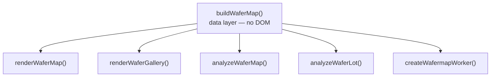

# API Reference

**For:** developers integrating the library. This is a reference, not a tutorial — if you're new, start with the [Quick Start](quickstart.md) and [Developer Guide](guide.md).

This document describes the public API exposed by `wafermap`.
For the system-level overview and recommended entry points, see [Architecture](architecture.md).

**How to read this document.** §3 is the section map — find your entry point there.
§4 (`buildWaferMap`, the data layer) plus §5 or §6 (the renderers) cover most
applications; §7 adds the findings engine. Cross-references use §N.N notation
throughout; shared types live in §11.

| Sections | Page |
|---|---|
| §1–3 Coordinate system, Quick Start, API overview | this page |
| §4 `buildWaferMap` | [The data layer](api/core.md) |
| §5 `renderWaferMap` | [Single map](api/render-map.md) |
| §6 `renderWaferGallery` | [Gallery](api/gallery.md) |
| §7 Statistics and findings engine | [Statistics](api/stats.md) |
| §8 Web Worker | [Web Worker](api/worker.md) |
| §9–12 Package surface, helpers, types, limitations | [Reference](api/reference.md) |

---

> ### How much of this do I need?
>
> **Almost none of it.** This is a reference, not a reading list — it documents
> every option so that the rare one you eventually need is written down, not so
> that you learn them.
>
> A working map is two calls:
>
> ```ts
> const result = buildWaferMap({ results, waferConfig, dieConfig });
> renderWaferMap(document.getElementById('map'), result);
> ```
>
> That renders with a full interactive toolbar — plot modes, colour schemes,
> zoom, export — with **no options passed at all**. Add `analyzeWaferMap` when
> you want the findings and summary panel, and `renderWaferGallery` in place of
> `renderWaferMap` for a lot. That is four functions, and it is the whole story
> for most integrations.
>
> For scale: **tsmap**, a complete cross-platform desktop application built on
> this library, imports **18** of its ~100 exports. `RenderOptions` has 23
> fields; a typical integration sets a handful. Everything else here is depth
> that stays out of your way until you go looking for it.
>
> New to the library? Start with the [Quick Start](quickstart.md) (a 5-minute
> tutorial), then the [Guide](guide.md) for a feature walkthrough. Come back
> here when you need a specific option.

## 1 Coordinate system

**`x` and `y` throughout this API are die grid positions (prober step coordinates) — integers such as −7, 0, 5.  They are NOT millimetre values.  They must be JavaScript `number` type — CSV parsers return strings; always cast with `Number()` or `+` before passing to `buildWaferMap`.**

This matches what wafer test equipment outputs.  The library converts grid positions to physical mm internally using the die size you provide.

```text
prober outputs:  x=-5, y=3   (die grid position)
library computes: x_mm = -5 × 10 = -50 mm   (given die width = 10 mm)
```

Physical mm positions appear only on the `Die` output objects (`die.physX`, `die.physY`) and in the wafer model.  You never need to compute or supply mm values.

---

## 2 Quick Start

The step-by-step tutorial is [Quick Start](quickstart.md); this is the condensed call shape as a memory jogger:

```ts
import { buildWaferMap } from '@wafertools/wafermap';
import { renderWaferMap } from '@wafertools/wafermap/render';

// x,y are prober step positions (die grid indices), not mm.
const result = buildWaferMap({
  results:   rows.map(r => ({ x: +r.x, y: +r.y, hbin: +r.hbin, testValues: { 1010: +r.testA } })),
  waferConfig: { diameter: 300, notch: { type: 'bottom' } },
  dieConfig:   { width: 10, height: 10 },
  testDefs: [{ testNumber: 1010, name: 'TestA', unit: 'V' }],
});

renderWaferMap(document.getElementById('map'), result);
```

The map renders with a full built-in toolbar — no extra HTML or JavaScript needed. To add a statistical findings panel, pass the result through `analyzeWaferMap` — see §7.1.

---

## 3 API overview

If you want the shortest path to the right entry point before diving into the
type details, see [Architecture](architecture.md). It explains which layer to
use for data construction, rendering, analysis, and worker offloading.


```mermaid
graph TD
    bwm["buildWaferMap()<br/>data layer — no DOM"]
    rwm["renderWaferMap()"]
    rg["renderWaferGallery()"]
    awm["analyzeWaferMap()"]
    awl["analyzeWaferLot()"]
    wk["createWafermapWorker()"]

    bwm --> rwm
    bwm --> rg
    bwm --> awm
    bwm --> awl
    bwm --> wk
```

**Everyday — the four functions almost every integration uses:**

| Section | Description |
|---|---|
| [4 `buildWaferMap`](api/core.md#4-buildwafermapinput) | Data layer — primary entry point. Turns rows into a wafer map |
| [5 `renderWaferMap`](api/render-map.md#5-renderwafermapcontainer-result-options) | Interactive canvas map with toolbar. Works with no options |
| [6 `renderWaferGallery`](api/gallery.md#6-renderwafergallerycontainer-items-options-gallery) | The same, for a whole lot: a grid of cards |
| [7 Statistics / Findings](api/stats.md#7-statistics-findings-engine) | `analyzeWaferMap`, `analyzeWaferLot` — findings and the summary panel |

**Occasional — reach for these when you hit the specific need:**

| Section | Description |
|---|---|
| [8 Web Worker](api/worker.md#8-web-worker) | Off-main-thread building, for very large lots |
| [9 Package surface](api/reference.md#9-package-surface) | Which subpath exports what, and why the renderers aren't on the root |
| [10 Helper functions](api/reference.md#10-helper-functions) | `getDieKey`, `getTestPassStatus`, bin colours for your own surfaces, colour-scheme registration |
| [11 Important types](api/reference.md#11-important-types) | `Die`, `Wafer`, `TestDef` and friends |
| [12 Limitations](api/reference.md#12-current-limitations) | Known constraints |

---
