# Developer Guide — wafermap

This guide walks through building wafer map visualisations in a real application,
from a single interactive map up to a multi-wafer gallery with statistical findings.
It focuses on practical patterns; for the full type reference see [API Reference](api.md).
For a visual overview of how the library fits together, see [Architecture](architecture.md).

## Architecture at a glance

If you are trying to understand the shape of the library before choosing an API,
start with [Architecture](architecture.md). It shows the top-level flow from raw
wafer data to built maps, rendered views, analysis summaries, and worker-based
execution.

## 1. Installation and setup

Install the package:

```bash
npm install @paulrobins/wafermap
```

The preferred canvas renderers have no external dependencies.

### With a bundler (Vite, webpack, etc.)

```ts
import { buildWaferMap } from '@paulrobins/wafermap';
import { renderWaferMap } from '@paulrobins/wafermap/render';
import { analyzeWaferMap } from '@paulrobins/wafermap/stats';
```

### Plain HTML (CDN / script tags)

```html
<script type="module">
  import { buildWaferMap } from 'https://esm.sh/@paulrobins/wafermap';
  import { renderWaferMap, renderWaferGallery } from 'https://esm.sh/@paulrobins/wafermap/render';
</script>
```


## 2. Your first wafer map

The minimal path is two function calls: `buildWaferMap` to process your data, then
`renderWaferMap` to draw it.

`renderWaferMap` creates and manages its own `<canvas>` — pass any block element
sized to the desired display area:

```html
<!-- Fixed size: -->
<div id="map" style="width:500px; height:500px;"></div>

<!-- Responsive square (fills its container, always square): -->
<div id="map" style="width:100%; aspect-ratio:1;"></div>
```

```ts
import { buildWaferMap } from '@paulrobins/wafermap';
import { renderWaferMap } from '@paulrobins/wafermap/render';

// Minimum input: x/y die grid positions. The library infers everything else.
const result = buildWaferMap([
  { x:  0, y:  0, hbin: 1 },
  { x:  1, y:  0, hbin: 2 },
  { x:  0, y: -1, hbin: 1 },
  { x:  1, y: -1, hbin: 1 },
  // ... more dies
]);

renderWaferMap(document.getElementById('map'), result);
```

To respond to die clicks, pass an `onClick` callback — the `Die` object has `x`, `y`, `hbin`, `sbin`, and `testValues`:

```ts
renderWaferMap(document.getElementById('map'), result, {
  onClick: (die) => console.log(die.x, die.y, die.hbin),
});
```

`renderWaferMap` returns immediately and mounts a self-contained interactive map.
A toolbar appears on hover, giving users access to all display controls — no extra
HTML or JavaScript required (`showToolbar` defaults to `true`). The toolbar includes an **expand** button (⛶) that
opens the map in a full-screen modal without rebuilding the view.

> **`x` and `y` are always die grid positions (prober step coordinates) — integers
> like −7, 0, 5.  They are NOT millimetre values.**  The library converts to physical
> mm internally when you supply a die size.

**→ [Demo: Your first wafer map](examples/first-map.html)**


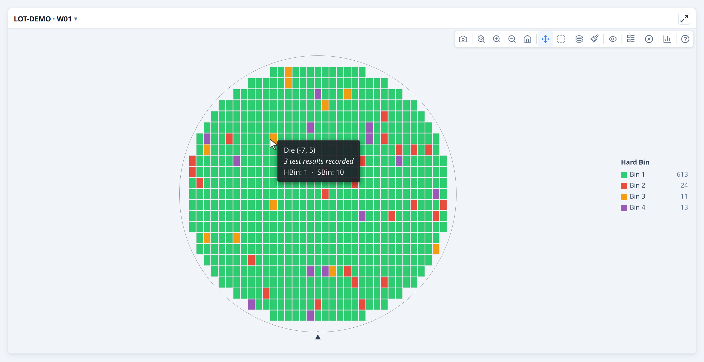

## 3. Loading real data from a CSV

In practice your data comes from a wafer prober log, STDF export, or a CSV pulled
from your database.  A typical row has a wafer ID, die grid position, and one or
more test results.

```
lot,wafer,x,y,hbin,sbin,testA,testB,testC
LOT123,W01,-7,-2,3,45,1.098,0.773,5.758
LOT123,W01,-7,-1,1,10,1.099,0.772,5.966
...
```

Parse the CSV and map each row to a `DieResult`. **All numeric fields must be cast to `number` — CSV parsers return strings.** `buildWaferMap` will throw a descriptive error if it detects string `x`/`y` coordinates, but other fields such as `hbin` and `testValues` values must also be cast to avoid silent NaN artefacts.

```ts
import { buildWaferMap } from '@paulrobins/wafermap';
import { renderWaferMap } from '@paulrobins/wafermap/render';

async function loadAndRender(csvText: string, container: HTMLElement) {
  const rows = parseCsv(csvText);  // your CSV parser of choice

  const results = rows.map(r => ({
    x:          Number(r.x),       // must be number — not string "3"
    y:          Number(r.y),
    hbin:       Number(r.hbin),
    sbin:       Number(r.sbin),
    testValues: { 1010: Number(r.testA), 1020: Number(r.testB), 1030: Number(r.testC) },
  }));

  const result = buildWaferMap({
    results,
    testDefs: [
      { testNumber: 1010, name: 'TestA' },
      { testNumber: 1020, name: 'TestB' },
      { testNumber: 1030, name: 'TestC' },
    ],
  });
  renderWaferMap(container, result);
}
```

`x` and `y` are the prober step positions from your equipment — pass them directly,
no unit conversion needed.

**→ [Demo: Loading real data from a CSV](examples/csv-data.html)**

Here we have toggled some toolbar options on: XY Axis indicator and Ring boundaries. 


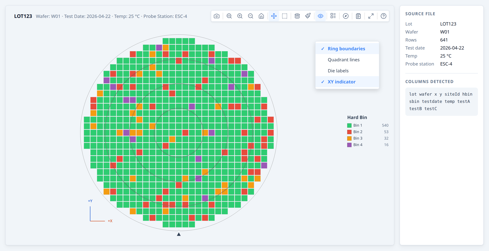

For a real-world dataset, see [Demo: Real wafer defect data (WM-811K)](examples/real-data.html), which loads a sample from the WM-811K public dataset and lets you explore the spatial findings engine across known defect pattern types (Center, Donut, Edge-Loc, Scratch, etc.).

## 4. Adding die size and wafer geometry

When you supply physical dimensions, `die.physX` and `die.physY` are in millimetres and the wafer boundary is drawn to scale; `die.x`/`die.y` remain die grid positions (prober step coordinates).

```ts
const result = buildWaferMap({
  results,
  waferConfig: {
    diameter:  300,                       // mm — 200 or 300 are most common
    notch:     { type: 'bottom' },        // physical alignment notch direction
  },
  dieConfig: {
    width:  10,                           // mm — die X pitch
    height: 10,                           // mm — die Y pitch
  },
});
```

The notch renders as a V-notch on 200 mm+ wafers and as a flat on smaller wafers —
you don't need to specify which.

### When you don't know the geometry

Omit any field you don't know — the library infers what it can:

```ts
// Die size known, diameter unknown → diameter inferred from grid extent
buildWaferMap({ results, dieConfig: { width: 10, height: 10 } });

// Diameter known, die size unknown → die size estimated from diameter ÷ grid extent
buildWaferMap({ results, waferConfig: { diameter: 300 } });

// Nothing known → proportionally correct layout in normalised units
buildWaferMap({ results });
```

Check `result.units` to know which case applied: `'mm'` means physical millimetres;
`'normalized'` means grid-relative units.

### Partial data — anchoring the wafer centre

Inference reads geometry from how far your data reaches. That works as long as the
data reaches the true wafer edge — including **sparse** data, where positions are
missing across the whole face (systematic skip-sampling such as 1-in-4, or random
sampling). Sparse data still resolves the diameter and centre correctly with no
hints.

It breaks for **partial** data — a contiguous region that stops short of the edge:
a half wafer, a single quadrant, a slice, or an off-centre cluster. The extent
understates the wafer, so the region is mistaken for a smaller full wafer and
re-centred on its own midpoint. For partial data, give the library the true
diameter and the prober coordinate of the wafer centre:

```ts
// Only the right half of a 300 mm wafer was tested; prober (0,0) is the centre.
const result = buildWaferMap({
  results,
  waferConfig: { diameter: 300, center: { x: 0, y: 0 } },
  dieConfig:   { width: 10, height: 10 },
});
```

`waferConfig.center` anchors placement to the real centre. It does not change the
public `die.x`/`die.y` labels — those stay the original prober coordinates.

When the library detects likely-partial coverage with no `center`, it adds a
structured `WaferWarning` to `result.warnings` (code `'partial-coverage'`) and sets
`result.inference.wafer.method` to `'inferred-partial'`. Detection is heuristic,
so for any partial dataset set `waferConfig.center` explicitly rather than relying
on the warning. (`result.inference.warnings` is a deprecated string-array mirror
of the same messages — use `result.warnings` in new code.)

### Edge exclusion

```ts
const result = buildWaferMap({
  results,
  waferConfig: { diameter: 300, edgeExclusion: 3 },  // 3 mm exclusion band
  dieConfig:   { width: 10, height: 10 },
});

console.log(result.yield.yieldPercent);  // excludes edge dies from numerator and denominator
```

Dies within the exclusion band have `die.edgeExcluded = true` and are shown dimmed
on the map.

### Coordinate origins

If your prober uses a non-centred origin, tell the library:

```ts
// All x,y ≥ 0 → auto-detected as lower-left origin (no explicit config needed)
buildWaferMap({ results, dieConfig: { width: 10, height: 10 } });

// Row-based prober: origin at upper-left, Y increases downward
buildWaferMap({
  results,
  dieConfig: { width: 10, height: 10, coordinateOrigin: { type: 'UL' } },
});
```

**→ [Demo: Die size and wafer geometry](examples/geometry.html)**


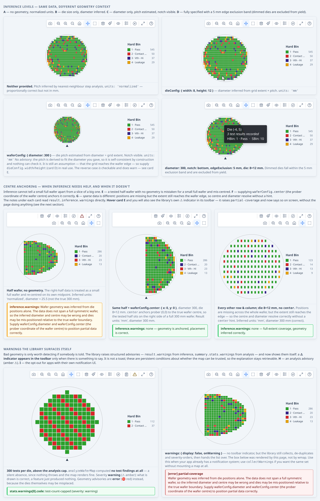

**→ [Demo: Partial data](examples/partial-data.html)**


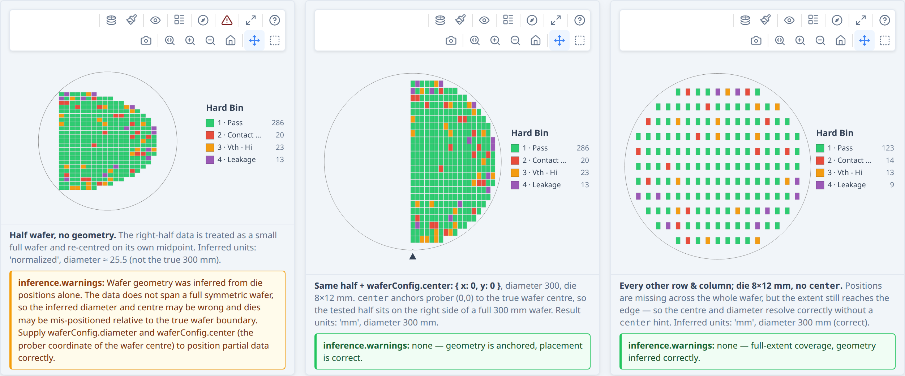


## 5. Working with bins

Bins are the primary pass/fail classification from wafer test equipment.  Hard bins
are the physical sort result; soft bins are the failure category assigned by the
test program.

### Basic bin map

```ts
const results = rows.map(r => ({
  x:    Number(r.x),
  y:    Number(r.y),
  hbin: Number(r.hbin),
}));

const result = buildWaferMap({ results });
renderWaferMap(container, result);
// Opens in 'hardBin' mode by default
```

### Named bins with custom colours

Without names, bins are labelled "HBin 1", "HBin 2", etc.  Supply `hbinDefs` for
readable labels and optional colour overrides:

```ts
const result = buildWaferMap({
  results,
  hbinDefs: [
    { bin: 1, name: 'Pass',          color: '#2ecc71' },
    { bin: 2, name: 'Contact Open',  color: '#e74c3c' },
    { bin: 3, name: 'Vth - Hi NMOS', color: '#e67e22' },
    { bin: 5, name: 'Continuity',    color: '#9b59b6' },
  ],
});

renderWaferMap(container, result, {
  viewOptions: { plotMode: 'hardBin' },
});
```

> **Tip:** Pass `hbinDefs` into `buildWaferMap`, not just `renderWaferMap`.  The
> stats engine and tooltips both read them from the built result.

### Hard bin and soft bin together

```ts
const results = rows.map(r => ({
  x:    Number(r.x),
  y:    Number(r.y),
  hbin: Number(r.hbin),
  sbin: Number(r.sbin),
}));

const result = buildWaferMap({
  results,
  hbinDefs: [ { bin: 1, name: 'Pass' }, /* ... */ ],
  sbinDefs: [ { bin: 10, name: 'Vth - Lo' }, { bin: 11, name: 'Vth - Hi' }, /* ... */ ],
});

renderWaferMap(container, result);
// hbinDefs and sbinDefs are inherited automatically from the result
// User can switch between Hard Bin and Soft Bin in the toolbar Mode menu
```

### Pass bins and yield

The library counts yield against `passBins` (default `[1]`).  Change this if your
pass bin isn't 1:

```ts
const result = buildWaferMap({
  results,
  passBins: [1, 100],   // bins 1 and 100 are both counted as pass
});

const yld = result.yield.yieldPercent;
console.log(yld !== null ? `${yld.toFixed(1)}%` : 'n/a');
```

**→ [Demo: Working with bins](examples/named-bins.html)**


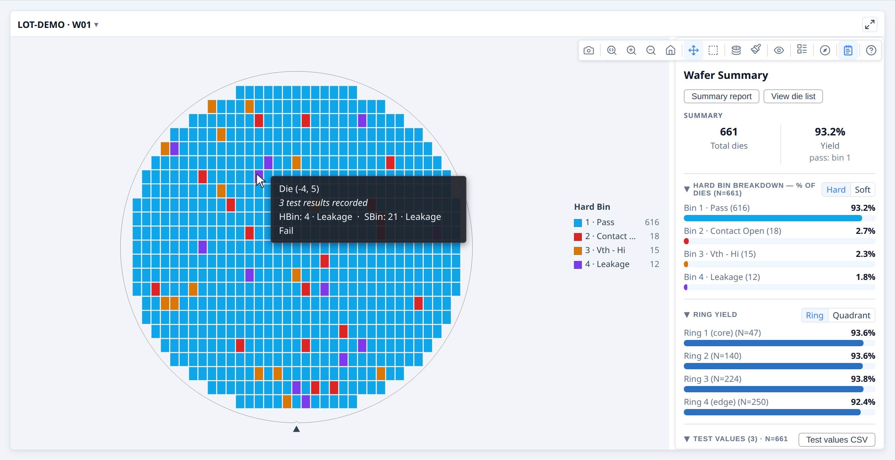

## 6. Working with test values

Three related terms appear together throughout the API — here is how they fit:

| Term | Where it appears | Purpose |
|------|-----------------|---------|
| `testValues: { 1010: 0.95 }` | `DieResult` (input to `buildWaferMap`) | Per-die measurement; key is the integer test number |
| `testDefs: [{ testNumber: 1010, name: 'Vth', unit: 'V' }]` | `buildWaferMap` options | Connects test numbers to human-readable names and units; optional but recommended |
| `testNumbers: [1010, 1020]` | `analyzeWaferMap` options | Filter — limits which tests the stats engine analyses; required only when the data has more tests than you want to analyse |

The integer key in `testValues` and `testDef.testNumber` must match exactly — the library uses these to link measurements to names and to drive the stats engine.

Continuous test measurements (leakage current, threshold voltage, etc.) go in
`testValues` — a map keyed by a stable integer test identity.  `TestDef` is
optional: without it the library uses `Test {N}` (the testNumber) everywhere a
name would appear — mode dropdown, tooltip, colorbar axis, summary panel.  Add
`TestDef` when you want human-readable names, units, and SI prefix formatting:

```ts
const results = rows.map(r => ({
  x:          Number(r.x),
  y:          Number(r.y),
  testValues: {
    1050: Number(r.idsat),
    1060: Number(r.vth),
    1070: Number(r.ioff),
  },
}));

const result = buildWaferMap({
  results,
  dieConfig: { width: 8, height: 12 },
  testDefs: [
    { testNumber: 1050, name: 'Idsat', unit: 'A' },
    { testNumber: 1060, name: 'Vth',   unit: 'V' },
    { testNumber: 1070, name: 'Ioff',  unit: 'A' },
  ],
});

renderWaferMap(container, result, {
  viewOptions: {
    plotMode:   'value',
    activeTest: 1050,   // testNumber for Idsat — NOT a positional index
    // testDefs inherited automatically from the result
  },
});
```

The `testValues` key is any stable integer that uniquely identifies the test — for
example an STDF TEST_NUM, a database test ID, or an application-defined constant.
The key must match the `testNumber` field in the corresponding `TestDef`.

Always pass the SI base unit in `TestDef.unit` (e.g. `'A'`, `'V'`, `'Ω'`, `'F'`).
The formatter applies SI prefixes automatically — `0.03` with unit `'Ω'` displays as
`30 mΩ`. Passing a pre-scaled unit like `'mA'` would produce incorrect labels
(e.g. `30 µmA` instead of `30 nA`).

With `testDefs` in place:
- The toolbar Mode dropdown shows one entry per test by name ("Idsat", "Vth", …) — without `testDefs` it shows "Test 1050", "Test 1060", etc.
- Hover tooltips show "Idsat: 1.23 mA" — without `testDefs` they show "Test 1050: 1.23 mA"
- The colorbar axis label includes the name and unit — without `testDefs` it shows "Test 1050"
- The summary panel Test Values section uses test names — without `testDefs` it uses "Test 1050", etc.

`TestDef.logScale: true` enables log₁₀ scale for that test by default (silently falls back to linear when any die value ≤ 0). The user can also toggle log scale at any time via the toolbar Log scale button, which overrides the per-test default.

### Spec limits on test parameters

Add `limitLow` and/or `limitHigh` to a `TestDef` to specify the engineering specification window. Both are optional independently — one-sided limits are valid. Once limits are defined, two things happen automatically across all plot modes:

**In `value` mode** — spec limits affect both the colorbar and the die colours:

The colorbar always shows LSL / USL labels at the limit positions. Exactly how depends on the colorbar range mode (toggled via the bracket toolbar button):

- **`colorbarRangeMode: 'spec'` (default when limits are present)** — the bar spans `[limitLow, limitHigh]`. The limit values appear as "LSL" / "USL" labels at the bar endpoints alongside the numeric values. Out-of-spec dies are highlighted: below `limitLow` renders in <span style="color:#3498db">**blue**</span>, above `limitHigh` in <span style="color:#e74c3c">**red**</span>.
- **`colorbarRangeMode: 'data'`** — the bar spans the actual data min/max. LSL / USL are shown as marker lines on the bar wherever the limits fall within the data range. All dies are coloured by the gradient regardless of spec status — the bar and die colours are always consistent with each other.

**With `colorBySpec: true`** — a categorical pass/fail view instead of the continuous gradient:
- Pass (in spec): green (`#2ecc71`)
- Fail low (below LSL): blue (`#3498db`)
- Fail high (above USL): red (`#e74c3c`)
- No data: grey

In this mode the colorbar is replaced by a **spec legend** showing the categories that apply (Pass always; Fail high / Fail low only when the test defines that limit) with per-category die counts. The title reads `{test} · #{number}` above the legend and `Spec pass/fail` below it.

```ts
const testDefs = [
  { testNumber: 1050, name: 'Idsat', unit: 'A' },
  {
    testNumber: 1060, name: 'Vth', unit: 'V',
    limitLow:  0.44,  // LSL — below this is a spec failure
    limitHigh: 0.57,  // USL — above this is a spec failure
  },
  { testNumber: 1070, name: 'Ioff', unit: 'A' },
];

const result = buildWaferMap({ results, waferConfig, dieConfig, testDefs });

// Enable pass/fail colouring for Vth to see spec status at a glance
renderWaferMap(container, result, {
  viewOptions: {
    plotMode:    'value',
    colorBySpec: true,
    activeTest:  1060,
    // testDefs inherited automatically from the result
  },
});
```

Spec limits also feed the stats engine: `analyzeWaferMap` populates `summary.stats.testSpecYield` with per-test spec yield, fail-low count, and fail-high count for every test that has at least one limit defined.

**→ [Demo: Working with test values](examples/test-values.html)**


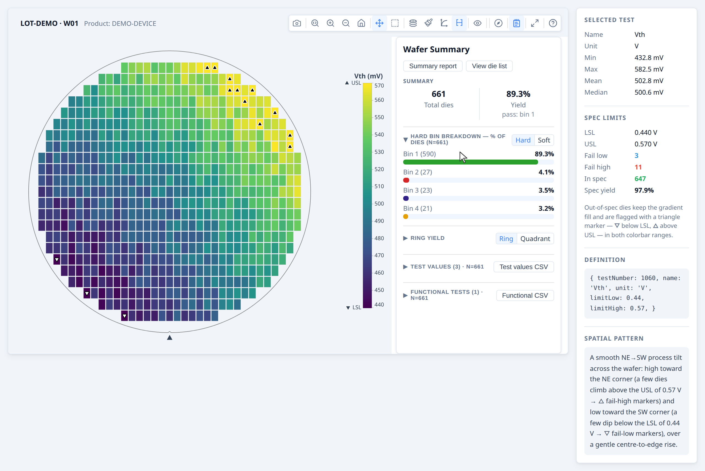

The same map with the view option 'Spec pass/fail' selected. Now the map shows the dies in spec limits in green and the dies out of limits in red, for the given test.

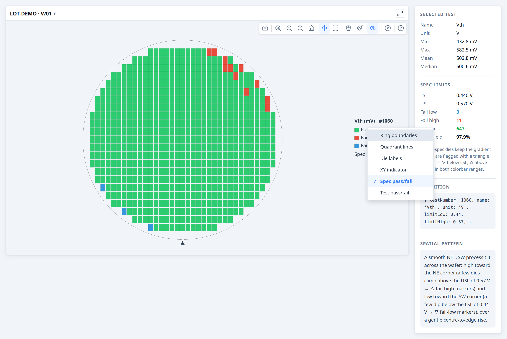


## 7. Retests and enriching dies after build

### Handling retests

If your data includes multiple probe results for the same die position (retests),
the library handles them automatically. Four policies are available:

| Policy | Behaviour |
| ------ | --------- |
| `'last'` (default) | Keep the most recent result per position |
| `'first'` | Keep the earliest result per position |
| `'best'` | Keep the best result using `passBins` as the primary criterion: a pass always beats a fail. Within the same pass/fail category, lower `hbin` number wins. Falls back to `'last'` when candidates have no `hbin`. |
| `'worst'` | Keep the worst result: a fail always beats a pass. Within the same category, higher `hbin` number wins. Falls back to `'last'` when candidates have no `hbin`. |

```ts
const result = buildWaferMap({
  results:      rawResults,  // may contain the same (x,y) more than once
  retestPolicy: 'best',      // keep the best bin result per position
});

// Check which dies were retested:
result.dies.filter(d => d.retestCount !== undefined)
           .forEach(d => console.log(`(${d.x},${d.y}) retested ${d.retestCount}×`));
```

Retested dies automatically show "Retests: N" in their hover tooltip. `retestCount` is only set on dies that appeared more than once in the input — non-retested dies have `retestCount === undefined`.

### Post-enrichment (attaching extra values after the map is built)

Sometimes you need to attach data that isn't in the same table as the grid
positions — for example, merging test values from a separate parametric table into
a map already built from a bin summary:

```ts
import { buildWaferMap, getDieKey } from '@paulrobins/wafermap';

// Step 1: build the map from the bin data
const result = buildWaferMap({ results: binRows.map(r => ({
  x: Number(r.x), y: Number(r.y), hbin: Number(r.hbin),
})), dieConfig: { width: 10, height: 10 } });

// Step 2: build a lookup from the parametric table
const paramMap = new Map(paramRows.map(r => [getDieKey({ x: Number(r.x), y: Number(r.y) }), r]));

// Step 3: enrich dies in place
const enrichedDies = result.dies.map(die => {
  const row = paramMap.get(getDieKey(die));
  if (!row) return die;
  return { ...die, testValues: { 1050: Number(row.idsat), 1060: Number(row.vth) } };
});

// testDefs must be on the result so the stats engine and tooltips can read them
const testDefs = [
  { testNumber: 1050, name: 'Idsat', unit: 'A' },
  { testNumber: 1060, name: 'Vth',   unit: 'V' },
];

renderWaferMap(container, { ...result, dies: enrichedDies, testDefs });
```

> Always use `getDieKey(die)` for lookups rather than manually formatting `"${die.x},${die.y}"` —
> it guarantees the correct format after any grid offset correction.

### Per-die metadata

Attach structured data to individual dies using the `metadata` field on each `DieResult`. The named fields (`lotId`, `waferId`, `deviceType`, `testProgram`, `temperature`) cover the most common identifiers; any additional key you add is accepted via the open index signature:

```ts
const result = buildWaferMap({
  results: rows.map(r => ({
    x:    Number(r.x),
    y:    Number(r.y),
    hbin: Number(r.hbin),
    metadata: {
      lotId:       r.lot,
      waferId:     r.wafer,
      deviceType:  'NMOS-A',
      testProgram: 'NM_v3.2',
      // custom fields — any key accepted, shown in tooltip automatically
      probeCard:   r.probe_card,
      inkDate:     r.ink_date,
    },
  })),
  dieConfig: { width: 10, height: 10 },
});
```

**All metadata fields appear automatically in hover tooltips** — no extra configuration needed. The tooltip renders each field as `key: value`, in the order: named fields first, then custom fields. `null` and `undefined` values are skipped.

Read metadata back from the die in any callback:

```ts
renderWaferMap(container, result, {
  onClick: (die) => {
    console.log(die.metadata?.lotId);      // named field
    console.log(die.metadata?.probeCard);  // custom field
  },
});
```

### Wafer-level metadata

Custom fields work the same way on `waferConfig.metadata` (`WaferMetadata → §12.3`). They appear in the summary panel header alongside the named fields:

```ts
const result = buildWaferMap({
  results: rows.map(r => ({ x: Number(r.x), y: Number(r.y), hbin: Number(r.hbin) })),
  dieConfig: { width: 10, height: 10 },
  waferConfig: {
    metadata: {
      lot:      'LOT123',
      waferId:  1,
      testDate: '2026-04-23',
      // custom fields — shown in summary panel header
      equipmentId: 'P-01',
      recipe:      'NMOS-R2',
    },
  },
});
```

**→ [Demo: Working with retested dies](examples/retests.html)**


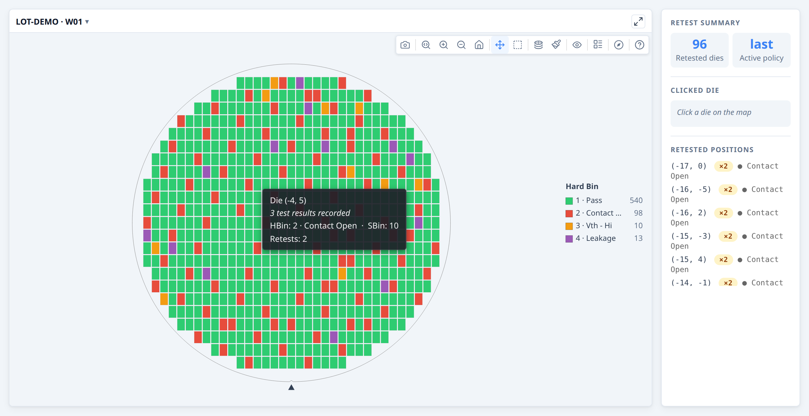

## 8. Controlling the display

### Initial display options

Pass `viewOptions` to `renderWaferMap` to set the initial state:

```ts
renderWaferMap(container, result, {
  viewOptions: {
    plotMode:                'hardBin',
    colorScheme:             'default',     // 'default', 'greyscale', 'accessible', 'plasma', 'inferno'
    showRingBoundaries:      true,
    showQuadrantBoundaries:  false,
    showDieLabels:           false,         // die index labels
    showXYIndicator:         true,
    ringCount:               4,
    rotation:                0,             // 0, 90, 180, 270
    flipX:                   false,
    flipY:                   false,
    legendPosition:             'default',     // 'default'|'compact'|'left'|'top'|'bottom'|'floating'
  },
});
```

All of these can also be changed by the user via the toolbar at any time.

### Programmatic control

`renderWaferMap` returns a controller you can call from application code:

```ts
const ctrl = renderWaferMap(container, result, { viewOptions: { plotMode: 'hardBin' } });

// Switch display mode (activeTest is a testNumber, e.g. from testDefs):
ctrl.setOptions({ plotMode: 'value', activeTest: 1050 });

// Replace die data (e.g. after a data reload) — preserves zoom/pan:
ctrl.setDies(newDies);

// Read current state:
const opts = ctrl.getOptions();
console.log(opts.plotMode, opts.colorScheme);

// Return to default zoom:
ctrl.resetZoom();

// Clean up when the component unmounts:
ctrl.destroy();
```

### Syncing with external UI controls

Use `onViewOptionsChange` to keep your own UI elements in sync with the toolbar:

```ts
const ctrl = renderWaferMap(container, result, {
  viewOptions: { plotMode: 'hardBin' },
  onViewOptionsChange: (opts) => {
    modeDropdown.value     = opts.plotMode;
    schemeDropdown.value   = opts.colorScheme;
    ringsCheckbox.checked  = opts.showRingBoundaries ?? false;
  },
});

// When your own control changes, push it back:
modeDropdown.addEventListener('change', () => {
  ctrl.setOptions({ plotMode: modeDropdown.value });
});
```

> `onViewOptionsChange` fires only when the toolbar changes options.  Calling
> `ctrl.setOptions()` programmatically does NOT re-fire it, so there is no
> feedback loop.

### Hiding the toolbar

If you want a static display with no toolbar:

```ts
renderWaferMap(container, result, {
  showToolbar: false,
  viewOptions: { plotMode: 'hardBin' },
});
```

Or keep the toolbar but remove the mode selector (useful when your app manages the
mode externally):

```ts
renderWaferMap(container, result, {
  showPlotModeSelector: false,
  viewOptions: { plotMode: 'value' },
  onViewOptionsChange: (opts) => syncMyModeUI(opts),
});
```
**→ [Demo: Controlling the display](examples/display-control.html)**


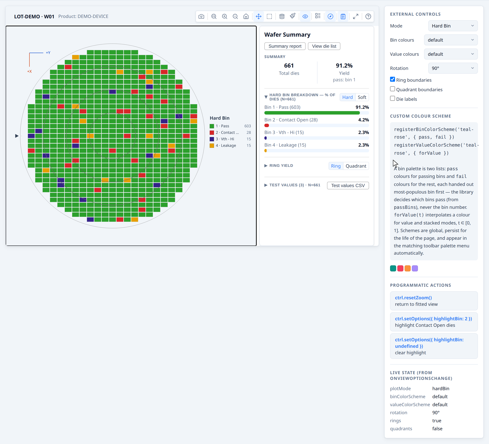

### Bin legend position

In `hardBin` and `softBin` modes, the bin legend can be placed in six positions via the **Legend style** toolbar button or the `legendPosition` option:

| Value | Behaviour |
| --- | --- |
| `'default'` | Vertical list on the right (full labels + counts). Auto-adapts: switches to `compact` below 280 px canvas width, `floating` below 180 px. |
| `'compact'` | Vertical list on the right (bin numbers only) |
| `'left'` | Vertical list on the left (full labels + counts) |
| `'top'` | Horizontal strip above the wafer (multi-column, auto-fitted) |
| `'bottom'` | Horizontal strip below the wafer (multi-column, auto-fitted) |
| `'floating'` | Draggable overlay, initially bottom-right (full labels + counts) |

Set the initial position via `viewOptions` — the user can change it at any time via the toolbar:

```ts
renderWaferMap(container, result, {
  viewOptions: { plotMode: 'hardBin', legendPosition: 'floating' },
});
```
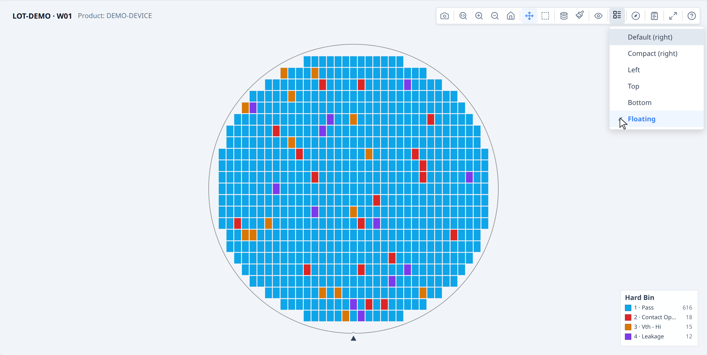


The Legend style button is automatically disabled when the map is in `value` or stacked mode, since those modes use a continuous colorbar instead of a bin legend.

For galleries, `legendPosition` is a top-level `GalleryOptions` field and applies to all cards:

```ts
renderWaferGallery(container, items, {
  legendPosition: 'floating',
});
```

### Toolbar reference

The toolbar appears on hover over a single map, or as a persistent bar above the
gallery grid.  Which buttons appear depends on the context and the current data.

#### Single map toolbar

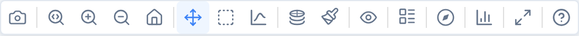

| | Button | Condition | What it does |
| --- | --- | --- | --- |
|  | Download PNG | Always | Saves the current canvas at current zoom/rotation |
|  | Zoom mode | Always | Drag to zoom into a region |
|    | Zoom in / Zoom out / Reset | Always | Step zoom; Reset returns to fitted view |
|  | Pan mode | Always | Drag to pan |
|  | Box select | Always | Drag to select a group of dies; fires `onSelect` when provided |
|  | Plot mode | Unless `showPlotModeSelector: false` | Opens mode menu: Test Value, Hard Bin, Soft Bin, and Stacked modes (only when map was built with `lotStack`) |
|  | Colour palette | Always | Opens colour scheme picker |
|  | Log scale | Value / stacked-values mode only | Toggles log₁₀ colour normalisation; disabled when min ≤ 0 |
|  | Colorbar range | Value mode, test has `limitLow` or `limitHigh`, Spec pass/fail off | Toggles between spec-limit range (blue/red out-of-spec) and data range |
|  | Overlays | Always | Dropdown: Ring boundaries, Quadrant lines, Die labels, Reticle grid (when reticles present), XY indicator, Spec pass/fail (value mode, test has limits) |
|  | Legend style | Hard bin or soft bin mode only | Dropdown: legend position (default, compact, left, top, bottom, floating) |
|  | Orientation | Always | Dropdown: Rotate 90° CW, Flip horizontal, Flip vertical |
|  | Summary panel | Only when `statsSummary` is provided | Toggles the findings and stats panel |
|  | Expand | Always | Opens the map in a full-screen modal; canvas reparented — no view rebuild. `E` key shortcut. |
|  | User guide | Only when `showHelpButton: true` | Opens the built-in end-user guide in a modal |

The full toolbar is shown when `toolbarControls` is `'full'` (default). Gallery card modals
also use `'full'`. In the gallery, cards show only the navigation controls (download, zoom,
pan, select) — the view controls (mode, overlays, orient, etc.) live in the shared gallery bar.

#### Gallery control bar

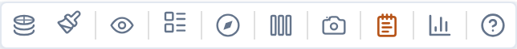

The gallery control bar is always visible above the card grid.

| | Button | Condition | What it does |
| --- | --- | --- | --- |
|  | Plot mode | Unless `showPlotModeSelector: false` | Same mode menu as single map; stacked modes always available in the gallery |
|  | Colour palette | Always | Colour scheme picker; applies to all cards |
|  | Aggregation method | Stacked Test Values mode only | Selects mean, median, std dev, min, max, or count; re-aggregates all cards immediately |
|  | Log scale | Value / stacked-values mode only | Applies to all cards |
|  | Colorbar range | Value mode, active test has `limitLow` or `limitHigh`, Spec pass/fail off | Toggles spec-limit range (blue/red out-of-spec) ↔ data range; applies to all cards |
|  | Overlays | Always | Dropdown: Ring boundaries, Quadrant lines, Die labels, Reticle grid (when any card has reticles), XY indicator, Spec pass/fail (value mode, active test has limits) — applies to all cards |
|  | Legend style | Hard bin or soft bin mode only | Dropdown: legend position; applies to all cards |
|  | Orientation | Always | Dropdown: Rotate 90° CW, Flip horizontal, Flip vertical — applies to all cards |
|  | Columns | Always | Dropdown: fix the column count to 1–5, or choose **Auto** to let the gallery size columns based on die pitch so all available width is used |
|  | Download all | Always | Exports all cards as a single tiled PNG |
|  | Lot findings | Only when `lotStatsSummary` is provided | Toggles the lot-level summary and findings panel |
|  | User guide | Only when `showHelpButton: true` | Opens the built-in end-user guide in a modal |


## 9. Responding to user interaction

### Click and hover callbacks

```ts
renderWaferMap(container, result, {
  onClick: (die, event) => {
    console.log(`Clicked die (${die.x}, ${die.y})`);
    console.log('Hard bin:', die.hbin);
    console.log('Test values:', die.testValues);
    showDetailPanel(die);
  },
  onHover: (die, event) => {
    if (die) updateStatusBar(`(${die.x}, ${die.y})`);
    else     clearStatusBar();
  },
});
```

`onClick` and `onHover` receive the full `Die` object — `die.x`, `die.y`, `die.testValues`,
`die.hbin`, `die.sbin`, and any metadata you attached.  `onHover` receives `null` when the cursor
leaves a die.

### Box selection

The box-select button is always in the toolbar.  Provide `onSelect` to receive the selected dies when the user finishes a drag selection:

```ts
renderWaferMap(container, result, {
  onSelect: (selectedDies) => {
    console.log(`${selectedDies.length} dies selected`);
    const passing = selectedDies.filter(d => d.hbin === 1).length;
    showSelectionStats({ count: selectedDies.length, passing });
  },
});
```

Users can also click individual dies, Ctrl/Cmd+click to add to the selection, and
press Esc to clear.

### Programmatic selection

```ts
// Highlight a specific set of dies (e.g. from a table click):
const failingDies = result.dies.filter(d => d.hbin === 2);
ctrl.setSelection(failingDies);

// Clear:
ctrl.clearSelection();
```
**→ [Demo: Responding to user interaction](examples/interaction.html)**


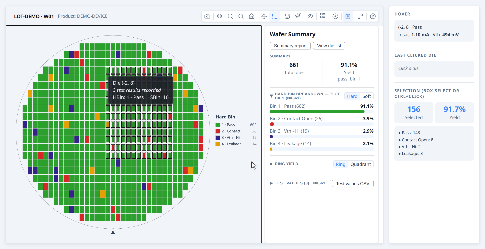

### Bin legend filter

In `hardBin` and `softBin` modes, clicking any row in the bin legend dims all dies that do not belong to that bin — making it easy to isolate a single failure category across the wafer. Click the same row again to clear the filter.

```ts
// Equivalent programmatic control:
ctrl.setOptions({ highlightBin: 2 });   // isolate bin 2
ctrl.setOptions({ highlightBin: undefined }); // clear
```

The filter also works in gallery view — clicking a legend row in the gallery toolbar highlights that bin across every card simultaneously.

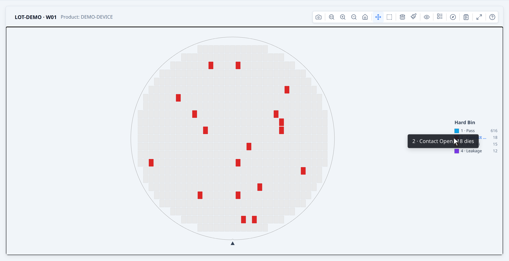

## 10. Adding statistical findings

The statistics engine (`analyzeWaferMap`) scans for spatial patterns across five families: rings, quadrants, angular sectors, contiguous failure clusters, and edge arcs. For each family it compares the local zone to the rest of the wafer using a statistical test appropriate to the variable type.

It also runs a **spatial pattern classifier** that labels the overall failure signature of the wafer — edge-ring, center cluster, scratch, and so on. This operates separately from the zone-by-zone statistical tests: the statistical findings are the evidence, the pattern label is the interpretation. See [Spatial Pattern Detection](pattern-detection.md) for how the classifier works, what it was tested on, and its known limitations.

### Basic usage

Pass the result of `analyzeWaferMap` to `renderWaferMap` as `statsSummary`.
That's all most users need — the library handles the rest.

```ts
import { buildWaferMap } from '@paulrobins/wafermap';
import { renderWaferMap } from '@paulrobins/wafermap/render';
import { analyzeWaferMap } from '@paulrobins/wafermap/stats';  // note: /stats subpath, not root

const result  = buildWaferMap({ results, waferConfig, dieConfig, passBins: [1] });
const summary = analyzeWaferMap(result);   // passBins inferred from result — no need to repeat it

renderWaferMap(container, result, {
  statsSummary: summary,
});
```

A "Findings" button (notebook icon) appears in the toolbar. Clicking it opens
the summary panel — a persistent results panel alongside the map showing yield,
bin distribution, ring and quadrant stats, test value summaries, and the full
findings list. Clicking any finding in the panel highlights the affected dies on
the map. See [§11 Summary panel](#11-summary-panel) for the full panel content
reference and configuration options (auto-open, pinned placement, gallery use).

When you pass a `WaferMapResult` to `analyzeWaferMap`, the `passBins` you gave to
`buildWaferMap` are carried through automatically — you only need to set `passBins`
explicitly in `analyzeWaferMap` options if you want to override them.

### What gets analysed

By default the engine checks every combination of:

- **Ring zones** — each concentric ring vs. the rest of the wafer
- **Quadrant zones** — each of NE/NW/SE/SW vs. the rest of the wafer
- **Angular sectors** — 16 compass-direction sectors (N, NNE, NE, …) vs. the rest of the wafer; finer directional resolution than quadrants, catching drift patterns a single quadrant would dilute
- **Reticle-field positions** — each reticle cell vs. other cells (only when a `reticleConfig` was used)
- **Failure clusters** — contiguous groups of failing dies that are denser than the wafer-wide background failure rate; each cluster highlighted as a specific set of dies
- **Edge arcs** — failure clusters whose centroid is near the wafer perimeter and whose angular span is narrow; distinguished from full-ring edge effects (which ring analysis catches separately)

For each spatial family the engine tests: yield, hard bin rate per bin, soft bin rate per bin, and mean test value per test.

**Angular sectors in detail.** Sector analysis divides the wafer into compass-named angular slices — N, NNE, NE, ENE, E, … (16 sectors by default).  Each sector is compared to the rest of the wafer independently, giving finer directional resolution than quadrants: a drift pattern concentrated in the NE corner shows up as a sector finding even if the wider NE quadrant is diluted by clean dies elsewhere in that quarter.  Dies within 0.2 normalised radius of the wafer centre are excluded from sector analysis (they are too close to the centre to be meaningfully attributed to a direction).  The number of sectors is controlled by `sectorCount` (4, 8, 16, or 32); the feature can be disabled entirely with `enableAngularAnalysis: false`.

Findings are suppressed unless they pass both an adjusted p-value threshold and an effect size gate. The effect size gate uses two complementary criteria — absolute and relative — so that meaningful patterns are not missed on wafers with either high or low background failure rates.

### Clicking a finding highlights the map

When the user clicks a finding row in the panel, the map automatically:
1. Switches to the most relevant display mode (value mode for test findings, bin
   mode for bin findings)
2. Highlights the affected die zone with an amber overlay

Clicking the finding again clears the highlight.

### Interpreting findings and severity

The findings list is ranked and filtered by statistical strength and effect size:

- **p-value correction:** adjusted p-values are used (default `significanceLevel` = 0.05), corrected per-family using a Benjamini–Hochberg FDR procedure.
- **Effect size gate for yield/bin/cluster findings:** a finding passes if it satisfies at least one of:
  - absolute `|delta| ≥ minimumEffectSize` (default 0.15, i.e. a 15 percentage-point difference), **or**
  - relative `|delta / background| ≥ minimumRelativeEffect` (default 0.5, i.e. 50% above or below the wafer-wide background rate)

  The relative criterion matters on low-failure-rate wafers. With a 2% background rate, a 2 percentage-point elevation is only 0.02 in absolute terms (below the 0.15 threshold) but represents a 100% relative deviation — clearly significant. Without the relative criterion that finding would be silently dropped.

- **Effect size for test-value findings:** Cohen's d (pooled SD). Only `minimumEffectSize` applies; relative effect is not used for continuous measurements.
- **Minimum sample size** per region is auto-scaled to roughly 1% of wafer die count (minimum 5). Regions smaller than this are not tested.

**Severity** is derived from the adjusted p-value and the strongest satisfied effect criterion:

| Severity | p-value | Absolute delta | or Relative delta |
|----------|---------|----------------|-------------------|
| `unusual` | ≤ 0.01 | ≥ 0.25 | ≥ 2.0× background |
| `notable` | ≤ 0.05 | ≥ 0.15 | ≥ 1.0× background |
| `info` | any other passing finding | | |

**Cluster and edge-arc findings** have an additional size criterion applied after the rate-based gate above.  A large contiguous cluster is intrinsically striking even when the background failure rate is elevated (e.g. a 500-die donut ring that forms its own high background).  The size thresholds are:

| Severity | Cluster size (% of eligible wafer dies) |
|----------|-----------------------------------------|
| `unusual` | ≥ 10% |
| `notable` | ≥ 3% |

A cluster qualifies for a severity level if it satisfies **either** the rate criterion **or** the size criterion (both require the p-value gate).

Use the `summary`, `effect`, and `stats` fields on each `StatsFinding` to display numerical details to users.

### Controlling what is analysed

```ts
const summary = analyzeWaferMap(result, {
  ringCount:                 4,      // must match the renderer's ringCount
  passBins:                  [1],
  significanceLevel:         0.05,   // adjusted p-value threshold
  minimumEffectSize:         0.15,   // min absolute |delta| for proportion findings
  minimumRelativeEffect:     0.5,    // min relative |delta / background| for proportion findings
                                     // a finding passes if it satisfies either this OR minimumEffectSize
  enableYieldAnalysis:       true,
  enableHardBinAnalysis:     true,
  enableSoftBinAnalysis:     true,
  enableTestValueAnalysis:   true,
  enableReticlePositionAnalysis: true,  // auto-disabled when no reticle config
  enableAngularAnalysis:     true,   // sector directional analysis
  enableClusterAnalysis:     true,   // contiguous failure cluster + edge arc detection
  sectorCount:               8,      // 4 | 8 | 16 | 32
});
```

#### Cluster and edge-arc highlights

Cluster and edge-arc findings use `{ kind: 'dies' }` highlights — they identify the exact set of failing dies, not a region. Clicking one in the summary panel highlights those specific dies on the map:

```ts
const clusters = filterFindings(summary, { family: 'cluster' });
const arcs     = filterFindings(summary, { family: 'edge-arc' });
const sectors  = filterFindings(summary, { family: 'sector' });

// Each cluster finding's highlight carries the exact die keys:
for (const f of clusters) {
  console.log(f.comparison.left);    // e.g. "Cluster at (3, 2)"
  console.log(f.highlight.dieKeys);  // ['3,2', '4,2', '3,3', ...]
}
```

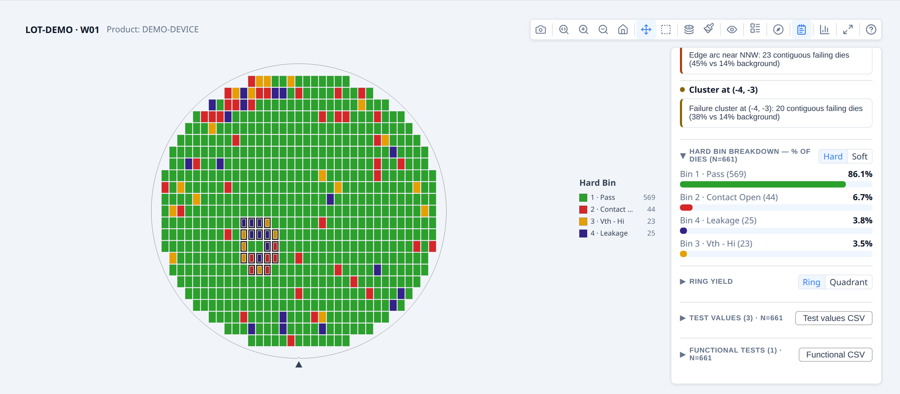

### Reading findings in code

If you need to drive your own UI from findings rather than using the built-in
panel, each finding is a `StatsFinding` with a human-readable `summary` and
structured data:

```ts
for (const finding of summary.findings) {
  console.log(finding.severity);          // 'unusual' | 'notable' | 'info'
  console.log(finding.summary);           // "Ring 3 (edge) yield is lower than the rest of the wafer"
  console.log(finding.variable.kind);     // 'yield' | 'hardBin' | 'softBin' | 'test'
  console.log(finding.effect.absoluteDelta);  // signed magnitude of the effect
  console.log(finding.stats.adjustedPValue);  // BH-adjusted p-value
}
```

`summary.findings` is sorted by severity — `'unusual'` first, then `'notable'`, then `'info'`.
`findings[0]` is always the highest-severity finding; no manual sort needed.

### Updating findings after a data change

```ts
// After replacing die data:
ctrl.setDies(newDies);
const newSummary = analyzeWaferMap({ ...result, dies: newDies });
ctrl.setStatsSummary(newSummary);
```

A finding object in full:

```js
{
  id:       'ring:Ring 4 (edge)',
  level:    'wafer',
  severity: 'unusual',            // 'unusual' > 'notable' > 'info'
  variable: { kind: 'yield', label: 'Yield' },
  comparison: { family: 'ring', left: 'Ring 4 (edge)', right: 'Rest of wafer' },
  effect:   { direction: 'lower', absoluteDelta: -0.18, relativeDelta: -0.62 },
  stats:    { method: 'z', pValue: 0.003, adjustedPValue: 0.009,
              sampleSizeLeft: 48, sampleSizeRight: 412 },
  summary:  'Ring 4 (edge) yield is lower than the rest of the wafer',
  highlight: { kind: 'region', regionFamily: 'ring', regionKeys: ['ring:4'], dieKeys: ['6,0', '6,1', /* … */] },
}
```

Use `finding.summary` for display text. Use `finding.highlight` to programmatically
select or colour dies associated with the finding.

For running the stats engine in Node.js without a browser, see the
[recipe in §18](#analyse-a-lot-in-nodejs-without-a-browser).

**→ [Demo: Statistical findings](examples/findings.html)**


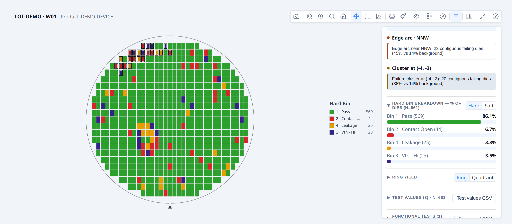

## 11. Summary panel

The summary panel is a persistent results panel that sits alongside the wafer map.
It shows yield, bin distribution, ring and quadrant statistics, test value summaries,
and the full findings list — all in one place without requiring the user to open the
toolbar findings button.

### Adding a summary panel to a single map

Pass `statsSummary` to `renderWaferMap` and the findings button appears in the toolbar
automatically.  The panel is hidden by default; clicking the button toggles it open:

```ts
import { buildWaferMap } from '@paulrobins/wafermap';
import { renderWaferMap } from '@paulrobins/wafermap/render';
import { analyzeWaferMap } from '@paulrobins/wafermap/stats';

const result  = buildWaferMap({ results, waferConfig, dieConfig, passBins: [1] });
const summary = analyzeWaferMap(result);

renderWaferMap(container, result, {
  statsSummary: summary,
});
```

To start with the panel already open (no toolbar click required), add
`summaryPanel: { defaultOpen: true }`:

```ts
renderWaferMap(container, result, {
  statsSummary: summary,
  summaryPanel: { defaultOpen: true },
});
```

The toolbar findings button reflects the current open/closed state, and the user can
still toggle the panel closed via that button.  Combine with a `placement` to pin the
panel to a specific side of the canvas without the toggle behaviour:

```ts
renderWaferMap(container, result, {
  statsSummary: summary,
  summaryPanel: { placement: 'right' },   // always visible; no toggle
});
```

### What the panel shows

The panel is divided into sections:

| Section | Content |
| --- | --- |
| **Yield** | Pass count, fail count, yield %, edge-excluded count |
| **Hard Bins** | Count and percentage per bin; colour-coded |
| **Soft Bins** | Count and percentage per soft bin (when sbin data is present) |
| **Ring analysis** | Per-ring yield breakdown (Ring 1 = centre, Ring N = edge) |
| **Quadrant analysis** | Per-quadrant yield and die count |
| **Test values** | Min, mean, max per test parameter — labelled by `TestDef.name` when provided, otherwise `Test {N}` using the testNumber |
| **Findings** | All `StatsFinding` entries grouped by severity — clicking a finding highlights the affected die zone on the map |

### Updating the panel after data changes

```ts
const ctrl = renderWaferMap(container, result, { statsSummary: summary });

// After a data reload:
ctrl.setDies(newDies);
const newSummary = analyzeWaferMap({ ...result, dies: newDies });
ctrl.setStatsSummary(newSummary);
```

### Summary panel in a gallery

For a gallery, call `analyzeWaferLot` and pass the result as `lotStatsSummary` — that's all you need. `analyzeWaferLot` runs per-wafer analysis internally, so the result contains complete findings for every wafer. A "Findings" button appears in the control bar giving access to:

- **Lot tab** — cross-wafer patterns and yield outliers
- **Wafers tab** — per-wafer findings index; clicking any row opens that wafer's card modal with its summary panel

See [§13 Lot-level statistical findings](#13-lot-level-statistical-findings) for the full example.

If you are building a gallery *without* lot-level analysis — for example, a set of unrelated wafers — you can attach `statsSummary` to each item individually:

```ts
const items = waferResults.map((r, i) => ({
  ...r,
  label:        `Wafer ${i + 1}`,
  statsSummary: analyzeWaferMap(r),
}));

renderWaferGallery(container, items);
// → Wafers findings panel appears in toolbar
// → Each card modal shows its own per-wafer summary
```

**→ [Demo: Summary panel](examples/summary-panel.html)**


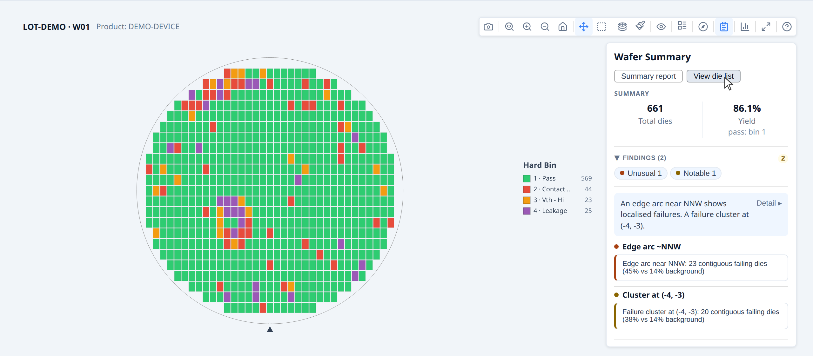

## 12. Building a lot gallery

`renderWaferGallery` renders multiple wafer maps in a responsive card grid.  All cards share a single control bar —
changing mode, colour, rotate, or flip applies to every card at once.

The gallery container needs a width but **not** a fixed height — the grid grows
to fit its cards automatically.  `width: 100%` is the typical choice:

```html
<div id="gallery" style="width: 100%;"></div>
```

### Basic gallery

```ts
import { buildWaferMap } from '@paulrobins/wafermap';
import { renderWaferGallery } from '@paulrobins/wafermap/render';

// Build a result per wafer
const waferResults = waferDatasets.map(data =>
  buildWaferMap({
    results:     data.map(r => ({ x: +r.x, y: +r.y, hbin: +r.hbin, sbin: +r.sbin })),
    waferConfig: { diameter: 300, notch: { type: 'bottom' } },
    dieConfig:   { width: 10, height: 10 },
    hbinDefs,
    sbinDefs,
  })
);

// Build gallery items
const items = waferResults.map((r, i) => ({
  ...r,
  label: `Wafer ${i + 1}`,
}));

const ctrl = renderWaferGallery(
  document.getElementById('gallery'),
  items,
  { viewOptions: { plotMode: 'hardBin' } },
);
```

Cards reflow responsively as the container resizes.  Each card has an expand
button (↗) in its header — clicking it opens a full-screen modal with the
complete toolbar; the card's live canvas is reparented into the modal, so there
is no view rebuild and the toolbar stays fully interactive.


### Sharing bin and test definitions across cards

Pass `hbinDefs`, `sbinDefs`, and `testDefs` to `buildWaferMap` — they are stored
on each `WaferMapResult` and flow automatically to the gallery's shared legend and
tooltips:

```ts
const waferResults = waferDatasets.map(data =>
  buildWaferMap({
    results: data.map(r => ({ x: +r.x, y: +r.y, hbin: +r.hbin, sbin: +r.sbin })),
    hbinDefs: [
      { bin: 1, name: 'Pass',  color: '#2ecc71' },
      { bin: 2, name: 'Fail',  color: '#e74c3c' },
    ],
    sbinDefs: [
      { bin: 10, name: 'Vth - Lo' },
      { bin: 11, name: 'Vth - Hi' },
    ],
    testDefs: [
      { testNumber: 1050, name: 'Idsat', unit: 'A' },
      { testNumber: 1060, name: 'Vth',   unit: 'V' },
    ],
  })
);

renderWaferGallery(container, items, { viewOptions: { plotMode: 'hardBin' } });
```

### Per-card overrides

Each `WaferMapDisplayItem` can override any `viewOptions` field.  The per-card value is
merged on top of the shared options.  Use this sparingly — the main purpose is
providing per-card reticle geometry:

```ts
const items = waferResults.map((r, i) => ({
  ...r,
  label: `Wafer ${i + 1}`,
  // r.reticles is already on the item via the spread — the gallery enables
  // the Reticle toolbar button automatically when any item has reticles
}));
```

### Click and select callbacks

```ts
const items = waferResults.map((r, i) => ({
  ...r,
  label: `W${i + 1}`,
  onClick:  (die) => showDieDetail(die, i),
  onSelect: (dies) => showSelectionPanel(i, dies),
}));
```

### Updating the gallery after data changes

```ts
// Rebuild after the user changes wafer selection:
ctrl.setItems(newItems);

// Sync display mode from an external control:
ctrl.setOptions({ plotMode: 'value', activeTest: 1050 });

// Track state changes back to your UI:
renderWaferGallery(container, items, {
  onViewOptionsChange: (opts) => {
    myModeDropdown.value = opts.plotMode;
  },
});
```

### Stacked lot maps

The gallery toolbar includes three stacked modes that aggregate the full lot into a
single view — one card per bin or per test parameter.  Switch mode via the **mode
picker** in the gallery control bar:

| Mode | What each card shows |
| --- | --- |
| **Stacked Test Values** | Per-die mean (or median, std dev, min, max) across all wafers |
| **Stacked Hard Bins** | Per-die count of wafers on which that hard bin appeared |
| **Stacked Soft Bins** | Per-die count of wafers on which that soft bin appeared |

Switching to a stacked mode rebuilds the card set automatically; switching back
restores the original per-wafer cards.

**Aggregation method.** For Stacked Test Values the default aggregation is `mean`.
Change it via the **Σ button** in the gallery control bar (visible only in this mode),
or programmatically:

```ts
ctrl.setOptions({ aggregationMethod: 'median' });  // re-aggregates immediately
```

**Zero-config discovery.** Even without `testDefs` or `binDefs`, the gallery scans
the lot data to discover unique tests and bins when entering a stacked mode, and
generates default labels (e.g. "Test 1050", "Bin 2") automatically.

**Spatial findings.** Each stacked card automatically gets a spatial analysis
summary — open the card modal and click the findings button to see ring, quadrant,
sector, and cluster findings on the aggregated map.  No extra code is required.

**→ [Demo: Building a lot gallery](examples/gallery.html)**  
See also: [Demo: Lot-level findings with stacked modes](examples/lot-findings.html)

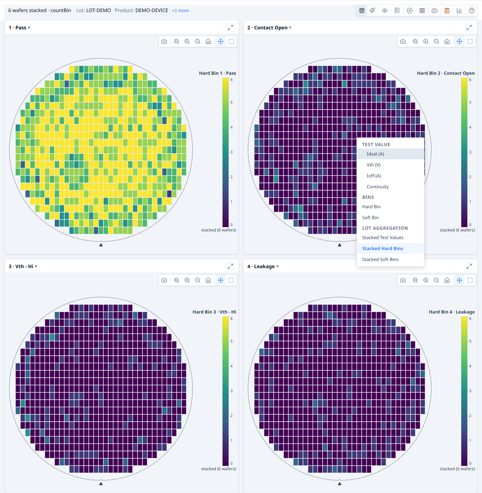

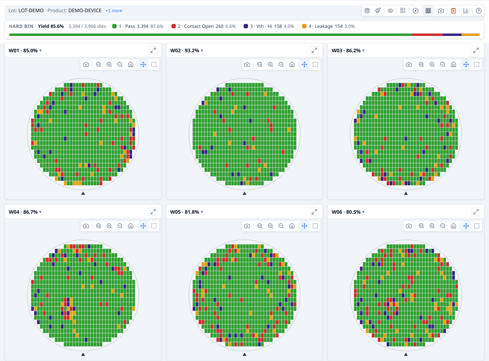


## 13. Lot-level statistical findings

`analyzeWaferLot` detects cross-wafer patterns across a lot:

- **Repeated patterns** — ring, quadrant, or reticle findings that appear on ≥ 2 wafers
- **Inter-wafer yield outliers** — individual wafers whose yield deviates from the lot median

It runs per-wafer analysis internally, so a single call gives you everything — no separate `analyzeWaferMap` per item is needed.

```ts
import { analyzeWaferLot } from '@paulrobins/wafermap/stats';

const lotSummary = analyzeWaferLot(waferResults, { ringCount: 4 });

const items = waferResults.map((r, i) => ({
  ...r,
  label: `Wafer ${i + 1}`,
}));

renderWaferGallery(container, items, {
  viewOptions:     { plotMode: 'hardBin' },
  lotStatsSummary: lotSummary,
});
```

Pass `enableTestValueAnalysis: true` to also populate `lotSummary.perWaferTestStats` — a per-wafer × per-test five-number summary (min/Q1/median/Q3/max plus mean/stddev/count) ready for box-plot rendering. Each entry corresponds to one wafer and has a `tests` array with the same shape as `StatsSummary.stats.perTestStats`.

A "Findings" button appears in the gallery control bar. Clicking it opens a panel with two tabs:

- **Lot** — lot-level yield, bin breakdown, ring/quadrant statistics, cross-wafer findings
- **Wafers** — per-wafer findings index; click any wafer to open its card modal with full per-wafer findings


### What highlighting looks like

- **Repeated pattern finding** (ring/quadrant seen across N wafers): the affected
  wafer cards are outlined; the matching die zone is highlighted on each card using
  that wafer's own per-wafer finding data
- **Yield outlier** (single wafer): the outlier card is outlined
- Clicking the active finding again clears all highlights

### Updating the lot summary at runtime

```ts
const ctrl = renderWaferGallery(container, items, { lotStatsSummary });

// After data changes:
const newLotSummary = analyzeWaferLot(newResults);
ctrl.setLotStatsSummary(newLotSummary);
```

**→ [Demo: Lot-level statistical findings](examples/lot-findings.html)**


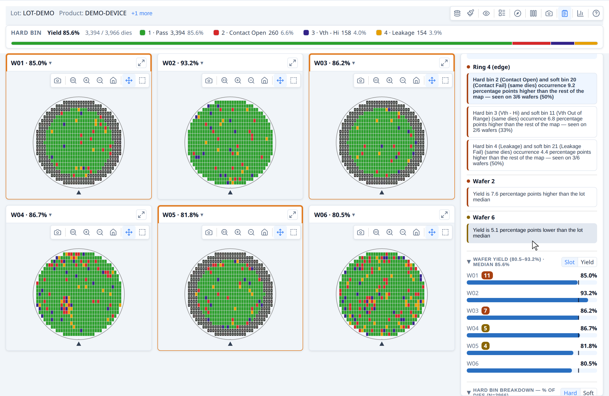

### Exporting reports

The library can generate standalone printable HTML reports that open in a new browser tab and can be saved as PDF.

**Wafer summary report** — everything shown in a single wafer's summary panel (yield, bins, ring/quadrant yield, test stats, findings):

```ts
import { renderSummaryReportHtml, openHtmlReport } from '@paulrobins/wafermap/stats';

const html = renderSummaryReportHtml({
  wafer, dies,
  yieldSummary:  summary.stats,
  dataCoverage:  summary.stats.dataCoverage,
  hbinDefs:      result.hbinDefs,
  sbinDefs:      result.sbinDefs,
  testDefs:      result.testDefs,
  statsSummary:  summary,
  passBins:      [1],
});
openHtmlReport(html);
```

**Lot summary report** — the lot-level equivalent, covering per-wafer yield table, bin breakdown, ring/quadrant yield, lot-level test stats, and lot findings:

```ts
import { renderLotSummaryReportHtml, openHtmlReport } from '@paulrobins/wafermap/stats';

const html = renderLotSummaryReportHtml({
  lotSummary,
  items: waferMapResults.map((r, i) => ({
    label: `W${i + 1}`,
    wafer: r.wafer,
    dies:  r.dies,
  })),
  hbinDefs:  waferMapResults[0].hbinDefs,
  sbinDefs:  waferMapResults[0].sbinDefs,
  testDefs:  waferMapResults[0].testDefs,
  passBins:  [1],
});
openHtmlReport(html);
```

**Findings-only report** — a lighter report with just the severity-coded findings table, works for both wafer and lot summaries:

```ts
import { renderFindingsReportHtml, openHtmlReport } from '@paulrobins/wafermap/stats';

openHtmlReport(renderFindingsReportHtml(lotSummary));
```

The summary panel's "Summary report" button in `renderWaferMap` and `renderWaferGallery` calls the appropriate function automatically — you only need to call these directly when building a custom export flow.

**Embedded hosts (Tauri, Electron, WebView2).** In hosts where `window.open` is blocked, register a custom opener once at startup:

```ts
import { setReportOpener } from '@paulrobins/wafermap/stats';

setReportOpener(html => {
  // route to a host-managed window, IPC call, etc.
  myApp.showReport(html);
});
```

All `openHtmlReport` calls — including the summary panel buttons — then route through your opener automatically.

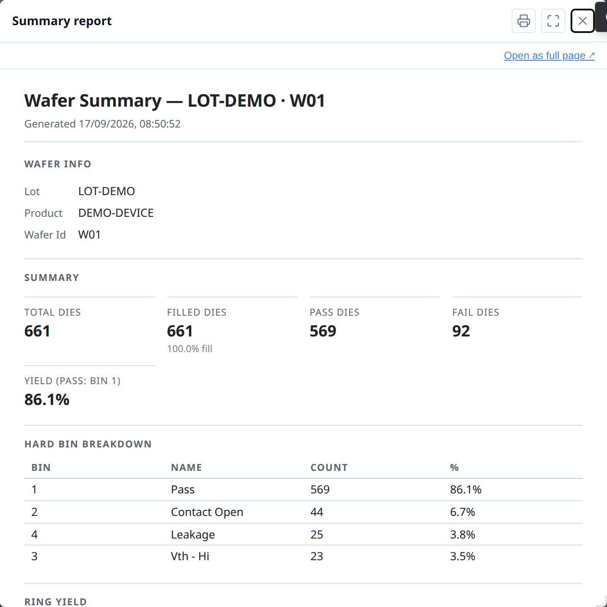

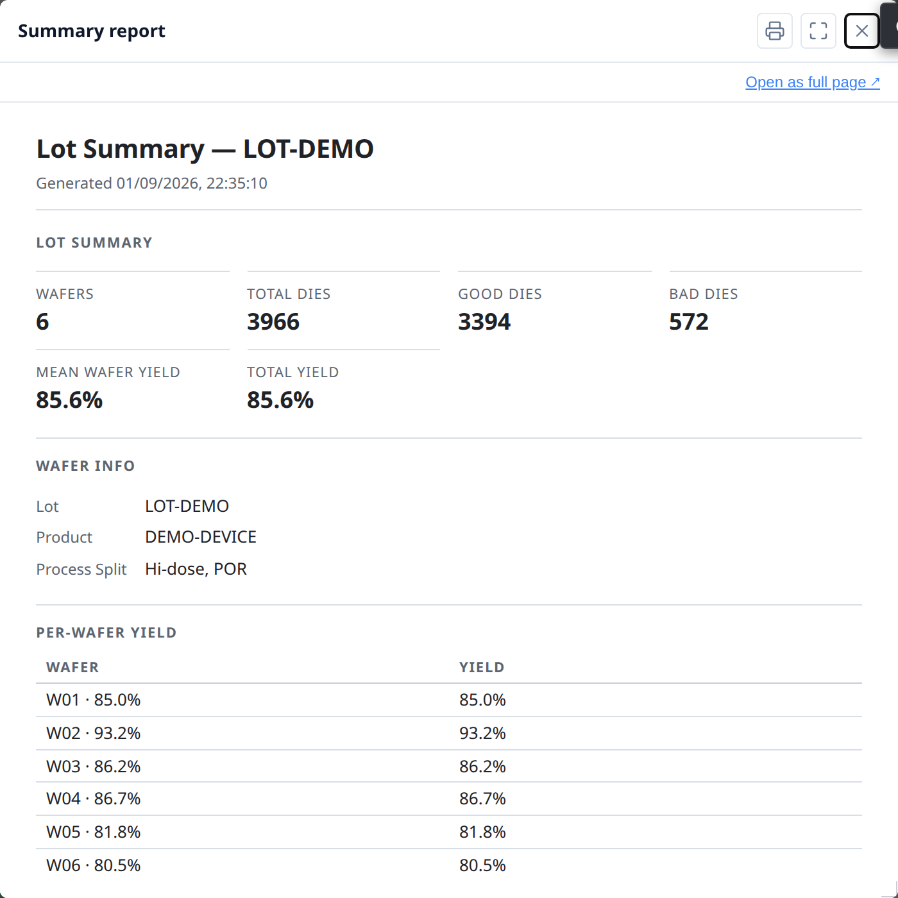

## 14. Reticle overlays

A reticle (stepper field) is a rectangular group of dies that the lithography
tool exposes in a single step.  The reticle overlay draws the field boundaries on
top of the wafer map and enables reticle-position analysis in the stats engine.

### Adding a reticle overlay

```ts
const result = buildWaferMap({
  results,
  dieConfig:     { width: 10, height: 10 },
  reticleConfig: {
    width:  4,    // 4 dies wide per stepper field
    height: 2,    // 2 dies tall per stepper field
    // anchorDie: { x: 1, y: 0 }  // optional: pin a specific die to a field corner
  },
});

renderWaferMap(container, result);
// showReticle defaults to true when result.reticles is non-empty
```

The toolbar shows a Reticle toggle button whenever `reticles` is non-empty.

### Reticle analysis in the stats engine

When a `reticleConfig` was used, `analyzeWaferMap` automatically includes
reticle-position comparisons (die's position within its stepper field vs. rest of reticle).
This surfaces systematic problems from mask defects, focus variation, or lens
aberrations:

```ts
const result  = buildWaferMap({ results, dieConfig, reticleConfig });
const summary = analyzeWaferMap(result, { enableReticlePositionAnalysis: true });
// result.reticleConfig is passed through automatically
```

### Reticle overlay in a gallery

Spread the result directly — `r.reticles` is already part of `WaferMapResult`.
The gallery enables the Reticle toggle button automatically when any item has reticles:

```ts
const items = waferResults.map(r => ({ ...r }));
// or with a label:
const items = waferResults.map((r, i) => ({ ...r, label: `W${i + 1}` }));
```
**→ [Demo: Reticle overlays](examples/reticle.html)**


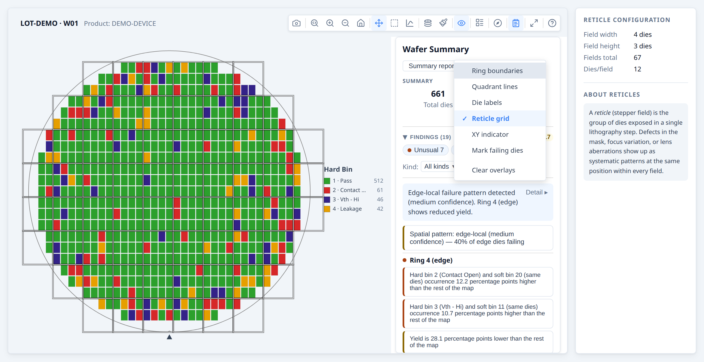

## 15. Multi-site parallel testing

Modern probers test multiple dies simultaneously using a multi-site probe card. Each
site on the card contacts a different die, and the tester records which site produced
each result via the STDF `site_num` field. Supplying `siteNum` on each `DieResult`
enables per-site analysis in the stats engine: the engine compares yield and bin
distributions across sites, surfacing systematic probe card or prober alignment
problems.

### Supplying site numbers

Pass `siteNum` on each die result — it maps directly from the STDF `site_num` field:

```ts
const results = stdfRows.map(row => ({
  x:       row.x_coord,
  y:       row.y_coord,
  hbin:    row.hard_bin,
  siteNum: row.site_num,   // STDF site_num — which parallel site tested this die
}));

const result = buildWaferMap({ results, passBins: [1] });
```

### Test-site analysis in the stats engine

`analyzeWaferMap` enables test-site analysis automatically when the data contains
meaningful site duplication — at least two distinct `siteNum` values each appearing
on three or more dies (the guard that distinguishes a 4-site probe card from a
monotonically-incrementing counter):

```ts
const summary = analyzeWaferMap(result);
// test-site findings appear automatically when the guard passes

// To force-enable or suppress explicitly:
const summary = analyzeWaferMap(result, { enableTestSiteAnalysis: true  });
const summary = analyzeWaferMap(result, { enableTestSiteAnalysis: false });
```

Findings compare each site against all other sites, using the same yield, hard-bin,
soft-bin, and test-value analyses as spatial regions. A finding such as:

```
[unusual] Site 3 yield is 14.2 percentage points lower than other test sites
```

points directly to a probe card contact problem on that site.

### Prober step identifier

The STDF `pir.part_id` field records the tester's identifier for each tested unit —
at most fabs this encodes probe sequence (the order in which the prober stepped across
the wafer). Supply it as `partId` to preserve it through the library for traceability
or custom sequential analysis:

```ts
const results = stdfRows.map(row => ({
  x:      row.x_coord,
  y:      row.y_coord,
  hbin:   row.hard_bin,
  siteNum: row.site_num,
  partId:  row.part_id,   // STDF pir.part_id — 1-based tester step identifier
}));
```

`partId` is carried through to every `Die` and appears in hover tooltips alongside
`x`, `y`, and bin assignments. The field is semantically neutral — its exact meaning
is fab-specific — so the library stores it as-is without interpretation.

**→ [Demo: Multi-site parallel testing](examples/test-sites.html)**

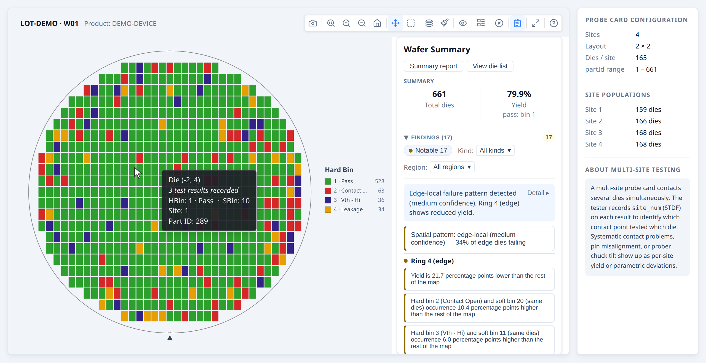

## 16. Processing large datasets with a Web Worker

For lots with many wafers or high die counts, `buildWaferMap` can be moved off the
main thread to avoid blocking the UI.

> **Use the worker for responsiveness, not speed.** The worker runs the same code
> as the main thread, then pays extra to copy the input in and the result out
> across `postMessage` (structured clone). In total wall-clock time it is **always
> slower** than calling `buildWaferMap` directly — what you gain is that the page
> stays interactive instead of freezing during a big build. Only reach for it when
> a single synchronous build is large enough to cause a visible freeze (roughly
> tens of thousands of dies). Below a few thousand dies it just adds latency; build
> on the main thread. See [§8 in the API reference](api.md#8-web-worker) for
> indicative timings and the crossover point.

### Setup

```ts
import { createWafermapWorker } from '@paulrobins/wafermap/worker';

// Vite / webpack — import the pre-built worker script
import workerUrl from '@paulrobins/wafermap/worker-script?url';
const wmWorker = createWafermapWorker(new Worker(workerUrl, { type: 'module' }));

// Plain HTML / CDN
const wmWorker = createWafermapWorker(
  new Worker('https://cdn.jsdelivr.net/npm/@paulrobins/wafermap/dist/packages/worker/wafermap.worker.js', { type: 'module' })
);
```

Create the worker once at app startup and reuse it for all calls.

### Replacing `buildWaferMap` with `worker.run`

```ts
// Before:
const result = buildWaferMap({ results, waferConfig, dieConfig });

// After (same input/output, just async):
const result = await wmWorker.run({ results, waferConfig, dieConfig });

// Everything after is unchanged:
renderWaferMap(container, result);
```

### Processing a lot in parallel

```ts
const waferResults = await Promise.all(
  waferIds.map(id => wmWorker.run({
    results:     dataByWafer[id],
    waferConfig: { diameter: 300 },
    dieConfig:   { width: 10, height: 10 },
  }))
);
```

If you also need the analysis summaries, use `runWithAnalysis` instead of `run`
followed by `runAnalysis` — it builds and analyses in one round-trip so the large
result objects are not cloned back into the worker just to be analysed:

```ts
const { results, waferSummaries, lotSummary } = await wmWorker.runWithAnalysis(
  waferIds.map(id => ({ results: dataByWafer[id], dieConfig: { width: 10, height: 10 } })),
  { passBins: [1] },
  waferIds.length > 1,
);
```

### Cleanup

```ts
// When the app or page unmounts:
wmWorker.terminate();
```

> **Note:** `renderWaferMap` and `renderWaferGallery` require the DOM and must run
> on the main thread. `analyzeWaferMap`/`analyzeWaferLot` and `buildWaferMap` are
> pure functions with no DOM access — they can run in a Web Worker, Node.js, or any
> server-side environment.

**→ [Demo: Processing large datasets with a Web Worker](examples/worker.html)**

## 17. Custom colour schemes

The built-in colour schemes are `'default'`, `'viridis'`, `'greyscale'`, `'accessible'`,
`'plasma'`, `'inferno'`, `'traffic'` (green→yellow→red, low=good), and `'thermal'`
(blue→cyan→yellow→red, low=cold).  You can register additional schemes for brand colours,
thematic colouring, or specialised analysis:

```ts
import { registerColorScheme, listColorSchemes } from '@paulrobins/wafermap';

registerColorScheme('my-brand', {
  label: 'My Brand',

  // Colour for a specific bin number (hardBin / softBin modes)
  forBin: (bin: number) => {
    const palette = ['#003f88', '#e63946', '#2a9d8f', '#e9c46a', '#f4a261'];
    return palette[(bin - 1) % palette.length];
  },

  // Colour for a normalised value t ∈ [0, 1] (value / stackedValues modes)
  forValue: (t: number) => {
    const r = Math.round(t * 0);
    const g = Math.round(t * 100);
    const b = Math.round(80 + t * 175);
    return `rgb(${r},${g},${b})`;
  },

});

// The scheme now appears in every toolbar colour picker automatically:
listColorSchemes();  // [..., { name: 'my-brand', label: 'My Brand' }]

// Apply programmatically:
ctrl.setOptions({ colorScheme: 'my-brand' });
```

Register your schemes once, before any `renderWaferMap` call.
They are global and persist for the lifetime of the page.

**→ [Demo: Custom colour schemes](examples/color-schemes.html)**


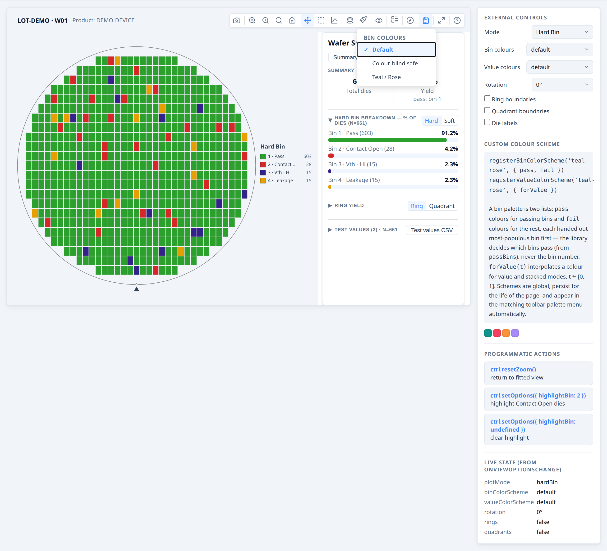

## 18. Recipes

Short, task-focused examples for common integration questions.

### Render a static thumbnail (no toolbar)

Pass `showToolbar: false` for embedded widgets, report thumbnails, or any context
where the interactive toolbar would be intrusive:

```ts
renderWaferMap(container, result, { showToolbar: false });
```

The map still renders at full quality with tooltips disabled. To re-enable
tooltips while keeping the toolbar hidden, pair with `showTooltip: true`.

### Build a gallery from a CSV grouped by wafer ID

The typical first integration: parse a multi-wafer CSV, group rows by wafer, and
render them all as a gallery.

```ts
import { buildWaferMap } from '@paulrobins/wafermap';
import { renderWaferGallery } from '@paulrobins/wafermap/render';

// 1. Parse — cast all numeric fields; CSV parsers return strings
const rows = csvText.trim().split('\n').slice(1).map(line => {
  const [lot, wafer, x, y, hbin, sbin, testA, testB] = line.split(',');
  return { wafer, x: +x, y: +y, hbin: +hbin, sbin: +sbin,
           testValues: { 1010: +testA, 1020: +testB } };
});

// 2. Group by wafer ID — build results as items in one pass
const byWafer = Map.groupBy(rows, r => r.wafer);  // Node 21+ / modern browsers
// or: rows.reduce((m, r) => (m.set(r.wafer, [...(m.get(r.wafer) ?? []), r]), m), new Map())

const items = [...byWafer.entries()].map(([waferId, waferRows]) => ({
  ...buildWaferMap({ results: waferRows, passBins: [1] }),
  label: waferId,
}));

// 3. Render — one call, shared toolbar across all cards
renderWaferGallery(document.getElementById('gallery'), items);
```

### Re-use a single result for both rendering and analysis

`analyzeWaferMap` accepts a `WaferMapResult` directly — no need to call
`buildWaferMap` twice:

```ts
const result  = buildWaferMap({ results, passBins: [1] });
const summary = analyzeWaferMap(result);

// summary panel and findings button appear automatically
renderWaferMap(container, result, { statsSummary: summary });
```

### Fit multiple maps to the same value range

When showing several wafers side-by-side in value mode, lock them all to the same
colour scale so differences in the data are visible rather than hidden by
per-wafer auto-scaling:

```ts
const TEST = 1050;  // the test we lock the scale to

// Compute the shared range across all wafers first
let min = Infinity, max = -Infinity;
for (const r of waferResults) {
  for (const die of r.dies) {
    const v = die.testValues?.[TEST];
    if (v !== undefined) { min = Math.min(min, v); max = Math.max(max, v); }
  }
}

// Apply it as a per-card override so the shared gallery scale doesn't override it.
// Use the test-keyed `{ test, range }` form: the range is bound to the test it was
// computed from. If the active test is ever something other than TEST, the library
// ignores the range and auto-scales rather than colouring the wrong test's data
// against 1050's scale — you cannot accidentally produce a mis-scaled plot.
const items = waferResults.map((r, i) => ({
  ...r,
  label: waferIds[i],
  viewOptions: { valueRange: { test: TEST, range: [min, max] }, activeTest: TEST },
}));

renderWaferGallery(container, items, { viewOptions: { plotMode: 'value' } });
```

> The plain tuple form `valueRange: [min, max]` still works and applies to
> whichever test is active — but then keeping it consistent with `activeTest` is
> your responsibility. Prefer `{ test, range }` whenever the range was derived
> from a specific test.

### Keep `ringCount` consistent between renderer and stats engine

The stats engine partitions dies into rings independently of the renderer. If you
change `ringCount`, change it in both places or the ring boundaries shown on the
map won't match the ring findings:

```ts
const RING_COUNT = 4;

const summary = analyzeWaferMap(result, { ringCount: RING_COUNT });
renderWaferMap(container, result, {
  statsSummary: summary,
  viewOptions: { ringCount: RING_COUNT },
});
```

### Sync toolbar state to your own UI controls

`onViewOptionsChange` fires whenever the toolbar changes a display option. Use
it to reflect the map's current state in external controls — a mode dropdown, a
rotation indicator, or a URL query string:

```ts
const ctrl = renderWaferMap(container, result, {
  viewOptions: { plotMode: 'hardBin' },
  onViewOptionsChange: (opts, changed, category) => {
    modeDropdown.value = opts.plotMode;
    if (category !== 'state') {
      urlParams.set('mode', opts.plotMode);
      history.replaceState(null, '', '?' + urlParams);
    }
  },
});

// Drive the map from external controls in the other direction:
modeDropdown.addEventListener('change', () => {
  ctrl.setOptions({ plotMode: modeDropdown.value });
});
```

### Use gross die yield (edge dies in denominator)

By default, edge-excluded dies are removed from both the numerator and
denominator — they don't affect yield either way. Set
`edgeDieYieldMode: 'denominator-only'` to compute gross die yield instead —
edge dies count against yield but can never pass:

```ts
const result = buildWaferMap({
  results,
  waferConfig: { diameter: 300, edgeExclusion: 3 },
  dieConfig:   { width: 8, height: 12 },
  passBins:    [1],
  edgeDieYieldMode: 'denominator-only',
});

const { yieldPercent, yieldPercentGross } = result.yield;
// yieldPercent      — standard yield: edge dies excluded from both sides
// yieldPercentGross — gross die yield: edge dies in denominator only
```

### Filter findings by severity, kind, or spatial family

`filterFindings` slices the `findings` array from any `StatsSummary` or
`LotStatsSummary`. All criteria are ANDed; each accepts a single value or an
array:

```ts
import { filterFindings } from '@paulrobins/wafermap/stats';

// Only ring or quadrant findings at unusual severity:
const critical = filterFindings(summary, {
  severity: 'unusual',
  family:   ['ring', 'quadrant'],
});

// All yield findings regardless of severity:
const yieldFindings = filterFindings(summary, { kind: 'yield' });
```

### Analyse a lot in Node.js without a browser

`buildWaferMap` and `analyzeWaferMap` have no DOM dependency — run them in a
plain Node.js script for CI checks, batch processing, or quick dataset
exploration:

```js
// analyse-lot.mjs  —  node analyse-lot.mjs
import { readFileSync } from 'node:fs';
import { buildWaferMap }   from '@paulrobins/wafermap';
import { analyzeWaferMap } from '@paulrobins/wafermap/stats';

const csv    = readFileSync('data/wafers.csv', 'utf8');
const lines  = csv.trim().split('\n');
const header = lines[0].split(',');
const col    = (row, name) => row[header.indexOf(name)];

const rows = lines.slice(1).map(line => {
  const r = line.split(',');
  return { wafer: col(r,'wafer'), x: +col(r,'x'), y: +col(r,'y'),
           hbin: +col(r,'hbin'), testValues: { 1010: +col(r,'testA') } };
});

const byWafer = Map.groupBy(rows, r => r.wafer);

for (const [waferId, waferRows] of byWafer) {
  const result  = buildWaferMap({ results: waferRows, passBins: [1] });
  const summary = analyzeWaferMap(result);
  const yld     = summary.stats.yieldPercent;
  const top     = summary.findings[0];
  console.log(
    `${waferId}  yield=${yld !== null ? yld.toFixed(1) + '%' : 'n/a'}` +
    `  findings=${summary.findings.length}` +
    (top ? `  top=[${top.severity}] ${top.summary}` : ''),
  );
}
```


### Keep a gallery responsive when building many maps

`buildWaferMap` and `analyzeWaferMap` are synchronous. Building a large gallery in
a single `.map()` loop blocks the main thread until all items are ready, leaving
the page blank for several seconds.

Pass factory functions instead of pre-built items and the gallery handles the rest
— the control bar and placeholder cards appear immediately, and each card is built
and inserted one per browser task as the factories run:

```ts
const items = fixtures.map(sample => () => {
  const result  = buildWaferMap({ results: sample.results, passBins: [1] });
  const summary = analyzeWaferMap(result,  { passBins: [1] });
  return { ...result, label: sample.label, statsSummary: summary };
});

renderWaferGallery(container, items);
```

The only visible difference is that each card's label is blank until its factory
runs — if the label depends on computed data (e.g. a findings count), it appears
when the card does rather than upfront. If the label is known in advance and you
want it visible immediately, pre-build items as usual for those cards.

### Standalone stacked lot map with programmatic findings access

The gallery's stacked modes cover most use cases. Use `buildWaferMap({ lotStack })`
directly when you need one or more of:

- A **standalone stacked map** outside a gallery (e.g. a dedicated lot-average view)
- **Programmatic access to findings** before rendering (to filter, store, or feed your own UI)
- A **fixed aggregation method** set at build time rather than chosen interactively

```ts
import { buildWaferMap } from '@paulrobins/wafermap';
import { renderWaferMap } from '@paulrobins/wafermap/render';
import { analyzeWaferMap } from '@paulrobins/wafermap/stats';

// Aggregate six wafers into a single mean map
const result = buildWaferMap({
  lotStack:    { results: waferResults, method: 'mean' },
  waferConfig, dieConfig,
  testDefs,    // include limitLow/limitHigh to enable cluster detection
});

// Run spatial analysis on the aggregated result
const summary = analyzeWaferMap(result, {
  ringCount:   4,
  testNumbers: [1060],   // optional: restrict to a specific test
});

// summary.stats.isLotStack        === true
// summary.stats.aggregationMethod === 'mean'

renderWaferMap(container, result, {
  viewOptions:  { plotMode: 'value', activeTest: 1060 },
  statsSummary: summary,
  summaryPanel: { defaultOpen: true },
});
```

Systematic lot patterns (e.g. an NE-quadrant drift present on every wafer) survive
averaging and emerge as clear findings on the lot-average map. The summary panel
labels the view as "N wafers · mean" so it is unambiguous to the reader.

For cluster and edge-arc detection, dies that exceed a test's spec limits
(`limitLow` / `limitHigh` in `testDefs`) are used as the failure proxy. If no spec
limits are defined, cluster detection is skipped automatically.

**→ [Demo: Standalone stacked map with spatial analysis](examples/lot-stack-analysis.html)**


## 19. Advanced: the rendering pipeline

`renderWaferMap` handles the full pipeline for you.  Use
the manual pipeline only when you need control they cannot provide — for example,
to drive a custom canvas renderer, integrate with a non-DOM environment, or step
through the geometry for debugging.

```ts
import {
  createWafer,
  generateDies,
  clipDiesToWafer,
  applyOrientation,
  applyProbeSequence,
  transformDies,
  generateReticleGrid,
  getDieKey,
} from '@paulrobins/wafermap';
import { buildView } from '@paulrobins/wafermap/renderer';
import { toCanvas } from '@paulrobins/wafermap/render';

// 1. Create the wafer geometry
const wafer = createWafer({ diameter: 300, notch: { type: 'bottom' } });

// 2. Generate and clip the die grid
const clipped = clipDiesToWafer(generateDies(wafer, dieSpec), wafer, dieSpec);

// 3. Apply wafer orientation (rotates the data grid to match orientation field)
const oriented = applyOrientation(clipped, wafer);

// 4. Assign probe sequence (sets die.probeIndex in snake order)
const sequenced = applyProbeSequence(oriented, { type: 'snake' });

// 5. Merge DieResult[] onto the die grid by (x, y) position
const resultMap = new Map(results.map(r => [getDieKey(r), r]));
const enriched  = sequenced.map(die => {
  const r = resultMap.get(getDieKey(die));
  return r ? { ...die, hbin: r.hbin, sbin: r.sbin, testValues: r.testValues } : die;
});

// 6. Build the reticle grid (optional)
const reticles = generateReticleGrid(wafer, { width: 4, height: 3, diePitchX: 8, diePitchY: 12 });

// 7. Apply interactive transforms (rotation, flip) on top of the base orientation
const currentDies = transformDies(enriched, { rotation: 90, flipX: false, flipY: false }, wafer.center);

// 8. Build a renderer-agnostic View
const view = buildView(wafer, currentDies, {
  plotMode: 'hardBin',
  reticles,
  showProbePath: true,
  interactiveTransform: { rotation: 90, flipX: false, flipY: false },
});

// 9. Draw to a canvas element (no toolbar, no DOM scaffolding)
toCanvas(document.getElementById('map'), view);
```

**→ [Demo: Advanced — the rendering pipeline](examples/pipeline.html)**
