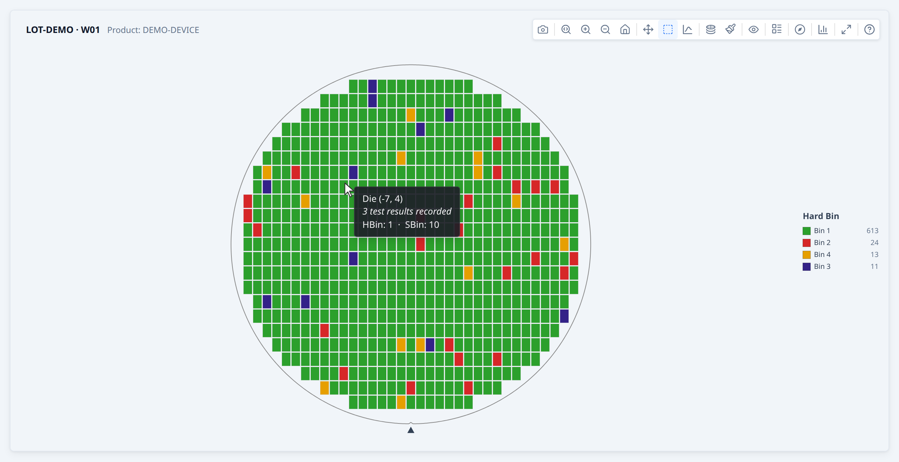
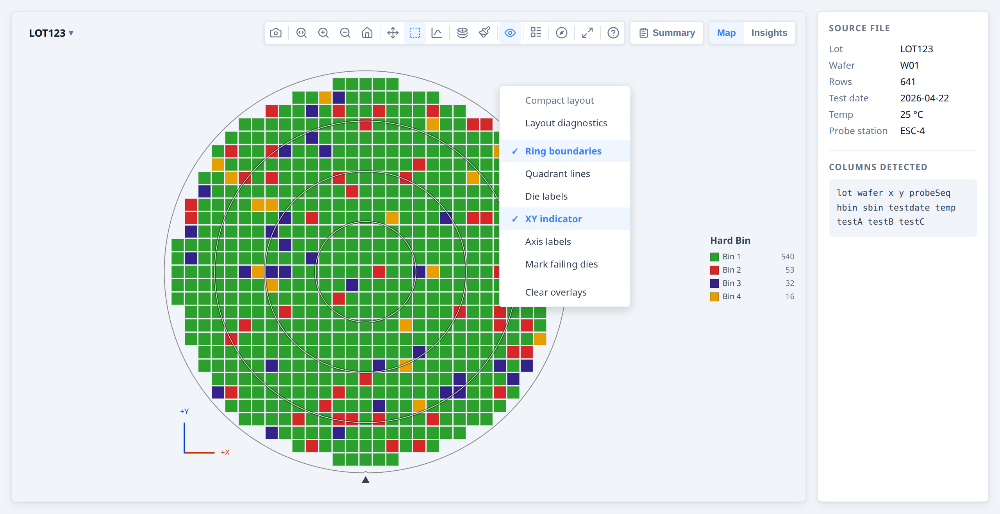
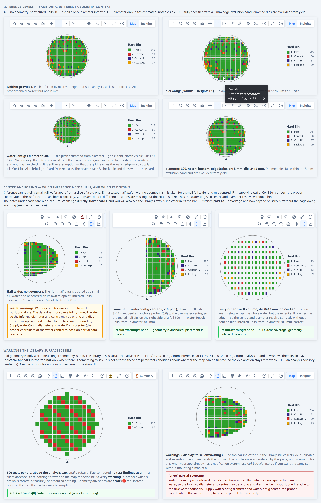
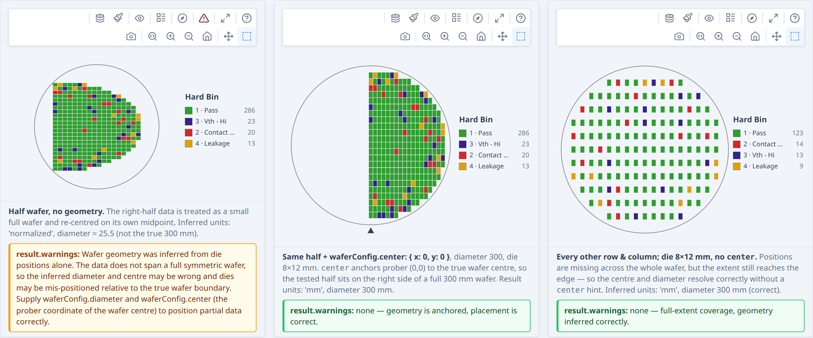

# Developer Guide — wafermap

**For:** developers integrating the library. **Read first:** [Quick Start](quickstart.md). If you're an engineer *using* an app built with wafermap, you want the [Application User Guide](user-guide.md) instead.

This guide walks through building wafer map visualisations in a real application,
from a single interactive map up to a multi-wafer gallery with statistical findings.
It focuses on practical patterns; for the full type reference see [API Reference](api.md).
For a visual overview of how the library fits together, see [Architecture](architecture.md).

**How to read this guide.** The sections from [Installation and setup](#installation-and-setup)
through [Working with test values](guide/data.md#working-with-test-values) are the core path: read them in
order to go from install to a map coloured by bins or test values. Everything after
that is a topic jump: pick the section for the feature you need
([findings](guide/findings.md#adding-statistical-findings), [gallery](guide/galleries.md#building-a-lot-gallery),
[Insights](guide/galleries.md#the-insights-tab), [worker](guide/layouts.md#processing-large-datasets-with-a-web-worker), …). Each feature section ends with a **→ Demo**
link to a live example page showing the same feature as working code.

This page covers installation through geometry. The rest is split by topic:

| Topic | Page |
|---|---|
| Bins, bin colours, test values, metadata, retests | [Bins, test values and metadata](guide/data.md) |
| Display options and interaction callbacks | [Display and interaction](guide/display.md) |
| Statistical findings and the Summary panel | [Findings and the Summary panel](guide/findings.md) |
| Lot galleries, lot findings, Insights, derived tests, sweeps, reports | [Galleries, Insights and reports](guide/galleries.md) |
| Reticle overlays, compact layout, multi-site, Web Worker, die layouts | [Layouts and scale](guide/layouts.md) |
| Worked examples | [Recipes](guide/recipes.md) |

## Architecture at a glance

If you are trying to understand the shape of the library before choosing an API,
start with [Architecture](architecture.md). It shows the top-level flow from raw
wafer data to built maps, rendered views, analysis summaries, and worker-based
execution.

## Installation and setup

Install the package:

```bash
npm install @wafertools/wafermap
```

The preferred canvas renderers have no external dependencies.

### With a bundler (Vite, webpack, etc.)

```ts
import { buildWaferMap } from '@wafertools/wafermap';
import { renderWaferMap } from '@wafertools/wafermap/render';
import { analyzeWaferMap } from '@wafertools/wafermap/stats';
```

### Plain HTML (CDN / script tags)

```html
<script type="module">
  import { buildWaferMap } from 'https://esm.sh/@wafertools/wafermap';
  import { renderWaferMap, renderWaferGallery } from 'https://esm.sh/@wafertools/wafermap/render';
</script>
```


## Your first wafer map

The minimal path is two function calls: `buildWaferMap` to process your data, then
`renderWaferMap` to draw it.

`renderWaferMap` creates and manages its own `<canvas>` — pass any block element
sized to the desired display area:

```html
<!-- Fixed size: -->
<div id="map" style="width:500px; height:500px;"></div>

<!-- Responsive square (fills its container, always square): -->
<div id="map" style="width:100%; aspect-ratio:1;"></div>
```

```ts
import { buildWaferMap } from '@wafertools/wafermap';
import { renderWaferMap } from '@wafertools/wafermap/render';

// Minimum input: x/y die grid positions. The library infers everything else.
const result = buildWaferMap([
  { x:  0, y:  0, hbin: 1 },
  { x:  1, y:  0, hbin: 2 },
  { x:  0, y: -1, hbin: 1 },
  { x:  1, y: -1, hbin: 1 },
  // ... more dies
]);

renderWaferMap(document.getElementById('map'), result);
```

To respond to die clicks, pass an `onClick` callback — the `Die` object has `x`, `y`, `hbin`, `sbin`, and `testValues`:

```ts
renderWaferMap(document.getElementById('map'), result, {
  onClick: (die) => console.log(die.x, die.y, die.hbin),
});
```

`renderWaferMap` returns immediately and mounts a self-contained interactive map.
A toolbar is always shown (top-right), giving users access to all display controls — no extra
HTML or JavaScript required (`showToolbar` defaults to `true`). The toolbar includes an **expand** button (⛶) that
opens the map in an enlarged modal overlay without rebuilding the view.

> **`x` and `y` are always die grid positions (prober step coordinates) — integers
> like −7, 0, 5.  They are NOT millimetre values.**  The library converts to physical
> mm internally when you supply a die size.

**→ [Demo: Your first wafer map](examples/first-map.html)**




## Loading real data from a CSV

In practice your data comes from a wafer prober log, STDF export, or a CSV pulled
from your database.  A typical row has a wafer ID, die grid position, and one or
more test results.

```
lot,wafer,x,y,hbin,sbin,testA,testB,testC
LOT123,W01,-7,-2,3,45,1.098,0.773,5.758
LOT123,W01,-7,-1,1,10,1.099,0.772,5.966
...
```

Parse the CSV and map each row to a `DieResult`. **All numeric fields must be cast to `number` — CSV parsers return strings.** `buildWaferMap` will throw a descriptive error if it detects string `x`/`y` coordinates, but other fields such as `hbin` and `testValues` values must also be cast to avoid silent NaN artefacts.

```ts
import { buildWaferMap } from '@wafertools/wafermap';
import { renderWaferMap } from '@wafertools/wafermap/render';

async function loadAndRender(csvText: string, container: HTMLElement) {
  const rows = parseCsv(csvText);  // your CSV parser of choice

  const results = rows.map(r => ({
    x:          Number(r.x),       // must be number — not string "3"
    y:          Number(r.y),
    hbin:       Number(r.hbin),
    sbin:       Number(r.sbin),
    testValues: { 1010: Number(r.testA), 1020: Number(r.testB), 1030: Number(r.testC) },
  }));

  const result = buildWaferMap({
    results,
    testDefs: [
      { testNumber: 1010, name: 'TestA' },
      { testNumber: 1020, name: 'TestB' },
      { testNumber: 1030, name: 'TestC' },
    ],
  });
  renderWaferMap(container, result);
}
```

`x` and `y` are the prober step positions from your equipment — pass them directly,
no unit conversion needed.

**→ [Demo: Loading real data from a CSV](examples/csv-data.html)**

Here we have toggled some toolbar options on: XY Axis indicator and Ring boundaries. 




For a real-world dataset, see [Demo: Real wafer defect data (WM-811K)](examples/real-data.html), which loads a sample from the WM-811K public dataset and lets you explore the spatial findings engine across known defect pattern types (Center, Donut, Edge-Loc, Scratch, etc.).

## Adding die size and wafer geometry

When you supply physical dimensions, `die.physX` and `die.physY` are in millimetres and the wafer boundary is drawn to scale; `die.x`/`die.y` remain die grid positions (prober step coordinates).

```ts
const result = buildWaferMap({
  results,
  waferConfig: {
    diameter:  300,                       // mm — 200 or 300 are most common
    notch:     { type: 'bottom' },        // physical alignment notch direction
  },
  dieConfig: {
    width:  10,                           // mm — die X pitch
    height: 10,                           // mm — die Y pitch
  },
});
```

The notch renders as a V-notch on 200 mm+ wafers and as a flat on smaller wafers —
you don't need to specify which.

### When you don't know the geometry

Omit any field you don't know — the library infers what it can:

```ts
// Die size known, diameter unknown → diameter inferred from grid extent
buildWaferMap({ results, dieConfig: { width: 10, height: 10 } });

// Diameter known, die size unknown → die size estimated from diameter ÷ grid extent.
// Raises no advisory: the pitch is derived to fit the diameter you gave, so it is
// self-consistent by construction and there is nothing to check it against. It is
// still an assumption — it takes the grid as reaching the wafer edge — so prefer
// supplying `dieConfig.width`/`height` when you know them.
//
// The reverse case IS checkable, and does warn: supply a pitch without a diameter
// and the wafer is sized from the die extent, so a result off the standard ladder
// (100/150/200/300 mm) means the grid did not reach the edge — see
// `non-standard-diameter` in the warnings table.
buildWaferMap({ results, waferConfig: { diameter: 300 } });

// Nothing known → proportionally correct layout in normalised units
buildWaferMap({ results });
```

Check `result.units` to know which case applied: `'mm'` means physical millimetres;
`'normalized'` means grid-relative units.

### Partial data — anchoring the wafer centre

Inference reads geometry from how far your data reaches. That works as long as the
data reaches the true wafer edge — including **sparse** data, where positions are
missing across the whole face (systematic skip-sampling such as 1-in-4, or random
sampling). Sparse data still resolves the diameter and centre correctly with no
hints.

It breaks for **partial** data — a contiguous region that stops short of the edge:
a half wafer, a single quadrant, a slice, or an off-centre cluster. The extent
understates the wafer, so the region is mistaken for a smaller full wafer and
re-centred on its own midpoint. For partial data, give the library the true
diameter and the prober coordinate of the wafer centre:

```ts
// Only the right half of a 300 mm wafer was tested; prober (0,0) is the centre.
const result = buildWaferMap({
  results,
  waferConfig: { diameter: 300, center: { x: 0, y: 0 } },
  dieConfig:   { width: 10, height: 10 },
});
```

`waferConfig.center` anchors placement to the real centre. It does not change the
public `die.x`/`die.y` labels — those stay the original prober coordinates.

When the library detects likely-partial coverage with no `center`, it adds a
structured `WaferWarning` to `result.warnings` (code `'partial-coverage'`) and sets
`result.inference.wafer.method` to `'inferred-partial'`. Detection is heuristic,
so for any partial dataset set `waferConfig.center` explicitly rather than relying
on the warning.

You do not have to display this yourself. `renderWaferMap` and `renderWaferGallery`
show a ⚠ indicator in the toolbar whenever the result carries advisories, so an
engineer looking at a map built on guessed geometry is told so on screen. Geometry
advisories are severity `'error'` — they mean dies may be drawn in the wrong place,
not that a feature is missing. If your app already has its own notification system,
pass `warnings: { display: false, onWarning }` and render them yourself; the library
still does the collecting and de-duplicating. See [API §5.10](api/render-map.md#510-warnings).

**→ [Demo: Warnings the library surfaces](examples/geometry.html#warnings)**

### Edge exclusion

```ts
const result = buildWaferMap({
  results,
  waferConfig: { diameter: 300, edgeExclusion: 3 },  // 3 mm exclusion band
  dieConfig:   { width: 10, height: 10 },
});

console.log(result.yield.yieldPercent);  // excludes edge dies from numerator and denominator
```

Dies within the exclusion band have `die.edgeExcluded = true` and are shown dimmed
on the map.

### Coordinate origins

If your prober uses a non-centred origin, tell the library:

```ts
// All x,y ≥ 0 → auto-detected as lower-left origin (no explicit config needed)
buildWaferMap({ results, dieConfig: { width: 10, height: 10 } });

// Row-based prober: origin at upper-left, Y increases downward
buildWaferMap({
  results,
  dieConfig: { width: 10, height: 10, coordinateOrigin: { type: 'UL' } },
});
```

### A die layout with no test data

When there are no test results yet — to count gross dies per wafer, plan reticle steps, or show the
expected map before data arrives — ask `buildWaferMap` for the layout:

```ts
const layout = buildWaferMap({
  layout:      true,
  waferConfig: { diameter: 300, notch: { type: 'bottom' } },
  dieConfig:   { width: 10, height: 8 },
});

layout.dies.length;                  // gross die per wafer
renderWaferMap(container, layout);   // draws like any map, every die as no-data
```

The layout holds every die site lying **fully** on the wafer, notch or flat included — the sites a
prober can step to, so it never contains edge-straddling dies. Die `(0, 0)` is the site centred on
the wafer, and `x`/`y` count sites in the directions `dieConfig.xAxisDirection`/`yAxisDirection`
give. The diameter and die size are both required: without them `buildWaferMap` throws rather than
guessing. Edge exclusion, reticles and orientation apply as for any map.

**→ [Demo: Die size and wafer geometry](examples/geometry.html)**




**→ [Demo: Partial data](examples/geometry.html#centre-anchoring)**



