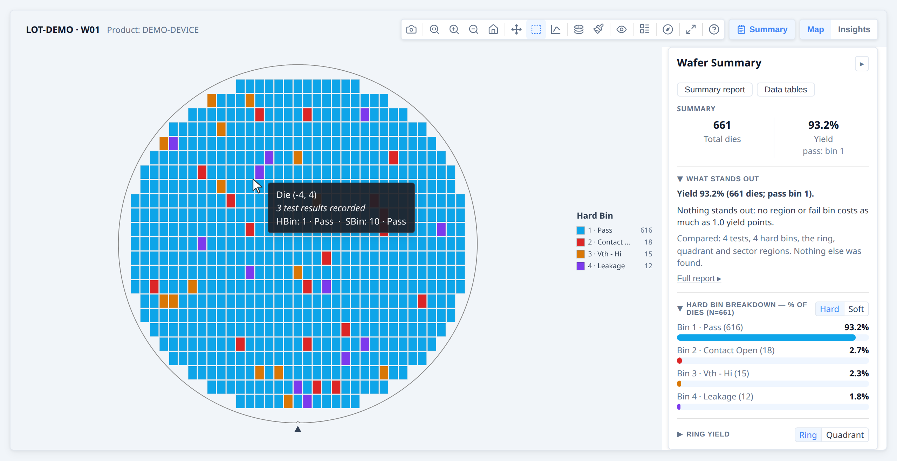
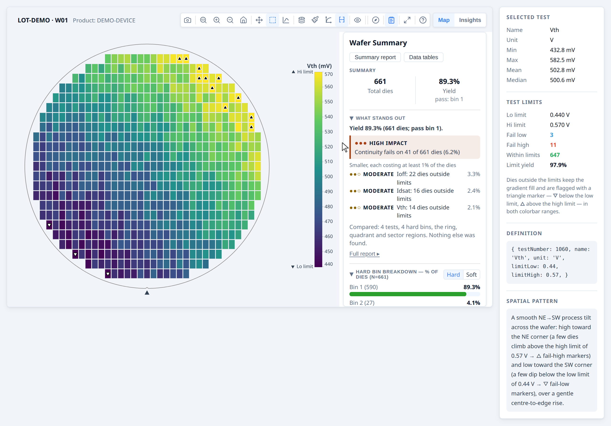
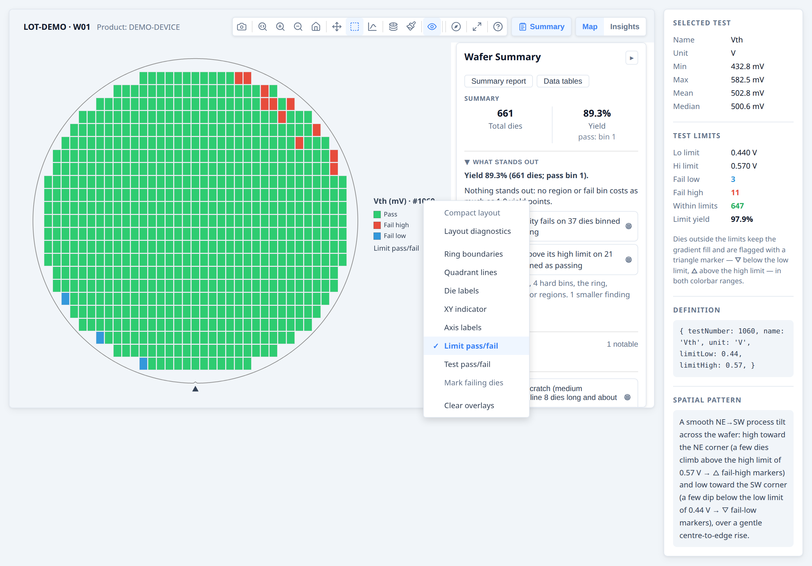
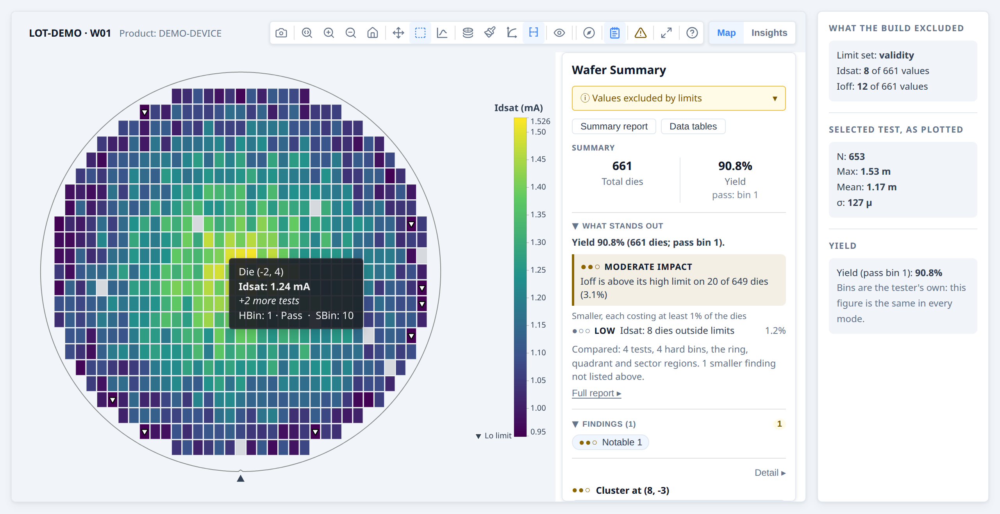
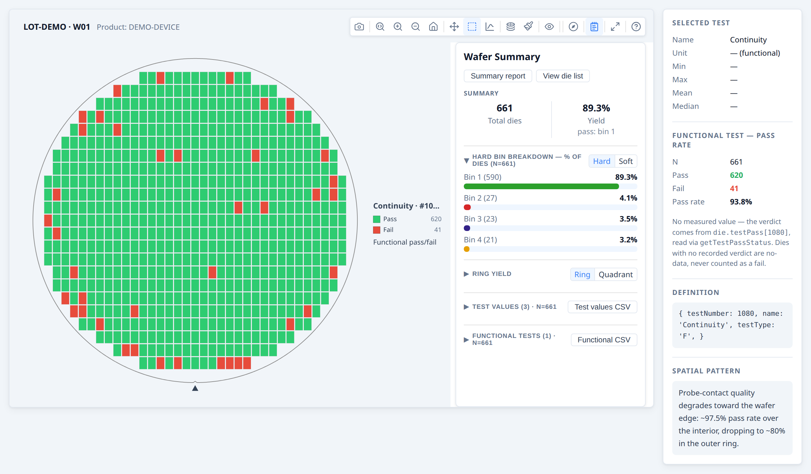
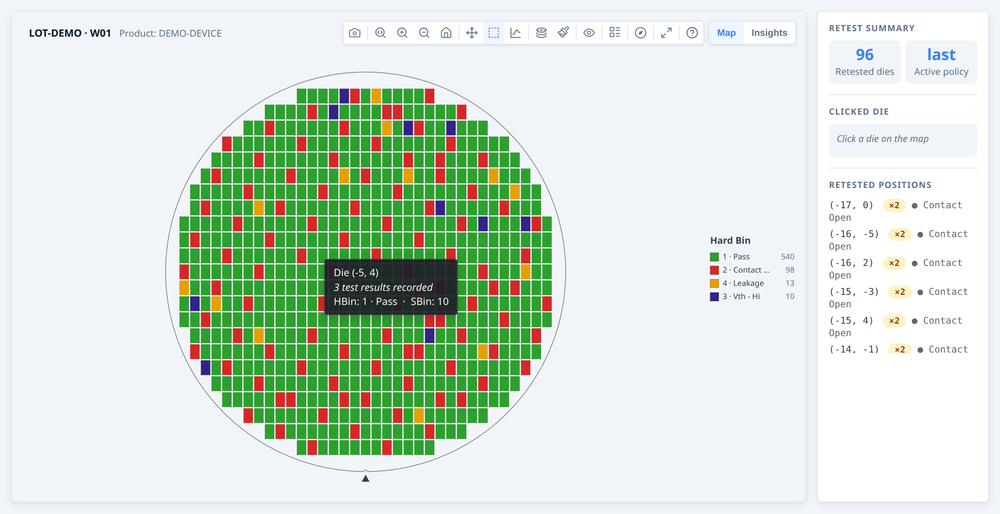

# Developer Guide — Bins, test values and metadata

**Part of the [Developer Guide](../guide.md).**

## Working with bins

Bins are the primary pass/fail classification from wafer test equipment.  Hard bins
are the physical sort result; soft bins are the failure category assigned by the
test program.

### Basic bin map

```ts
const results = rows.map(r => ({
  x:    Number(r.x),
  y:    Number(r.y),
  hbin: Number(r.hbin),
}));

const result = buildWaferMap({ results });
renderWaferMap(container, result);
// Opens in 'hardBin' mode by default
```

### Named bins with custom colours

Without names, bins are labelled "HBin 1", "HBin 2", etc.  Supply `hbinDefs` for
readable labels and optional colour overrides:

```ts
const result = buildWaferMap({
  results,
  hbinDefs: [
    { bin: 1, name: 'Pass',          color: '#2ecc71' },
    { bin: 2, name: 'Contact Open',  color: '#e74c3c' },
    { bin: 3, name: 'Vth - Hi NMOS', color: '#e67e22' },
    { bin: 5, name: 'Continuity',    color: '#9b59b6' },
  ],
});

renderWaferMap(container, result, {
  viewOptions: { plotMode: 'hardBin' },
});
```

> **Tip:** Pass `hbinDefs` into `buildWaferMap`, not just `renderWaferMap`.  The
> stats engine and tooltips both read them from the built result.

### Hard bin and soft bin together

```ts
const results = rows.map(r => ({
  x:    Number(r.x),
  y:    Number(r.y),
  hbin: Number(r.hbin),
  sbin: Number(r.sbin),
}));

const result = buildWaferMap({
  results,
  hbinDefs: [ { bin: 1, name: 'Pass' }, /* ... */ ],
  sbinDefs: [ { bin: 10, name: 'Vth - Lo' }, { bin: 11, name: 'Vth - Hi' }, /* ... */ ],
});

renderWaferMap(container, result);
// hbinDefs and sbinDefs are inherited automatically from the result
// User can switch between Hard Bin and Soft Bin in the toolbar Mode menu
```

### Pass bins and yield

The library counts yield against `passBins` (default `[1]`).  Change this if your
pass bin isn't 1:

```ts
const result = buildWaferMap({
  results,
  passBins: [1, 100],   // bins 1 and 100 are both counted as pass
});

const yld = result.yield.yieldPercent;
console.log(yld !== null ? `${yld.toFixed(1)}%` : 'n/a');
```

Set pass bins **once, here**. The result carries them (`result.passBins`), and every
renderer, analysis, panel, report and chart reads them from it — so bin 100 above is green,
listed with the passing bins and counted as good everywhere, with nothing to repeat. In a
gallery each wafer keeps its own, so a lot mixing test programs is judged wafer by wafer. There is no
`passBins` option on the renderers or on `analyzeWaferMap`; a map you build yourself, without
`buildWaferMap`, states its own `passBins` on the map object.

**→ [Demo: Working with bins](../examples/named-bins.html)**




## How bin colours are assigned

A bin's colour comes from its number and whether it passes, never from how many dies it has, so
bin 7 is the same colour in every lot, gallery and screenshot of a program. One rule
(which every surface uses — map, legend, summary panel, Insights charts) applies it:

- **Pass bins are green, fail bins are not.** Which bins pass comes from `passBins`, so a failing
  bin 1 is never green and a passing bin 3 always is. A soft bin counts as passing when every die
  carrying it passes.
- **The bin number picks the colour.** Bin 1 takes the palette's first pass colour and bin 2 its
  first fail colour, then on through each list, wrapping round. The front of each list is the
  most distinct, so the low bin numbers most programs use get the clearest colours.
- **Hard and soft bins are coloured separately.** Soft bins start half a palette further on, so
  hard bin 3 and soft bin 3 are different colours.
- **Bins a palette-length apart share a colour** (fail bins 2 and 21 in the default palette).
  When both are on screen the map raises a `bin-colors-shared` warning naming them rather than
  letting two bins look identical.
- **Colours from bin definitions win.** A `BinDef.color` (a site's standard bin colour sheet, say)
  overrides the palette for that bin; the viewer can switch that off with **Use colours from bin
  definitions** in the Palette menu, and back on again.

### Using bin colours in your own UI

When your application shows bins next to the map — a table with colour swatches, an exported chart,
a slide — use the colours the map draws rather than picking your own:

```ts
const colors = ctrl.getBinColors();   // a live map or gallery, with the palette the user chose
colors.hard.get(7);                   // hard bin 7's colour
colors.pass.hard.has(2);              // whether hard bin 2 passes on this map

import { binColorsForMaps } from '@wafertools/wafermap';
const exportColors = binColorsForMaps(results, { binColorScheme: 'accessible' });  // no map on screen
```

`binColorsForMaps` judges each map by its own `passBins`, so bins keep the colours they have on
screen, even in a lot that mixes test programs. Hard and soft bins are separate `Map`s.

## Working with test values

Three related terms appear together throughout the API — here is how they fit:

| Term | Where it appears | Purpose |
|------|-----------------|---------|
| `testValues: { 1010: 0.95 }` | `DieResult` (input to `buildWaferMap`) | Per-die measurement; key is the integer test number |
| `testDefs: [{ testNumber: 1010, name: 'Vth', unit: 'V' }]` | `buildWaferMap` options | Connects test numbers to human-readable names and units; optional but recommended |
| `testNumbers: [1010, 1020]` | `analyzeWaferMap` options | Filter — limits which tests the stats engine analyses; required only when the data has more tests than you want to analyse |

The integer key in `testValues` and `testDef.testNumber` must match exactly — the library uses these to link measurements to names and to drive the stats engine.

Continuous test measurements (leakage current, threshold voltage, etc.) go in
`testValues` — a map keyed by a stable integer test identity.  `TestDef` is
optional: without it the library uses `Test {N}` (the testNumber) everywhere a
name would appear — mode dropdown, tooltip, colorbar axis, summary panel.  Add
`TestDef` when you want human-readable names, units, and SI prefix formatting:

```ts
const results = rows.map(r => ({
  x:          Number(r.x),
  y:          Number(r.y),
  testValues: {
    1050: Number(r.idsat),
    1060: Number(r.vth),
    1070: Number(r.ioff),
  },
}));

const result = buildWaferMap({
  results,
  dieConfig: { width: 8, height: 12 },
  testDefs: [
    { testNumber: 1050, name: 'Idsat', unit: 'A' },
    { testNumber: 1060, name: 'Vth',   unit: 'V' },
    { testNumber: 1070, name: 'Ioff',  unit: 'A' },
  ],
});

renderWaferMap(container, result, {
  viewOptions: {
    plotMode:   'value',
    activeTest: 1050,   // testNumber for Idsat — NOT a positional index
    // testDefs inherited automatically from the result
  },
});
```

The `testValues` key is any stable integer that uniquely identifies the test — for
example an STDF TEST_NUM, a database test ID, or an application-defined constant.
The key must match the `testNumber` field in the corresponding `TestDef`.

Always pass the SI base unit in `TestDef.unit` (e.g. `'A'`, `'V'`, `'Ω'`, `'F'`).
The formatter applies SI prefixes automatically — `0.03` with unit `'Ω'` displays as
`30 mΩ`. Passing a pre-scaled unit like `'mA'` would produce incorrect labels
(e.g. `30 µmA` instead of `30 nA`).

With `testDefs` in place:
- The toolbar Mode dropdown shows one entry per test by name ("Idsat", "Vth", …) — without `testDefs` it shows "Test 1050", "Test 1060", etc.
- Hover tooltips show "Idsat: 1.23 mA" — without `testDefs` they show "Test 1050: 1.23 mA"
- The colorbar axis label includes the name and unit — without `testDefs` it shows "Test 1050"
- The summary panel Test Values section uses test names — without `testDefs` it uses "Test 1050", etc.

`TestDef.logScale: true` enables log₁₀ scale for that test by default (silently falls back to linear when any die value ≤ 0). The user can also toggle log scale at any time via the toolbar Log scale button, which overrides the per-test default.

### Spec limits on test parameters

Add `limitLow` and/or `limitHigh` to a `TestDef` to specify the engineering specification window. Both are optional independently — one-sided limits are valid. Once limits are defined, two things happen automatically across all plot modes:

**In `value` mode** — test limits affect both the colorbar and the die colours:

The colorbar always shows "Lo limit" / "Hi limit" labels at the limit positions. Exactly how depends on the colorbar range mode (toggled via the bracket toolbar button):

`colorbarRangeMode` controls **only** the colorbar's numeric range — not how dies outside the limits are shown:

- **`colorbarRangeMode: 'spec'` (default when limits are present)** — the bar spans `[limitLow, limitHigh]`. The limit values appear as "Lo limit" / "Hi limit" labels at the bar endpoints alongside the numeric values.
- **`colorbarRangeMode: 'data'`** — the bar spans the actual data min/max. The limits are shown as marker lines on the bar wherever the limits fall within the data range.

In **both** ranges, all dies are coloured by the gradient so the value distribution stays readable and the bar and die colours agree; dies outside the limits additionally carry a triangle marker — **▽** (below `limitLow`) / **△** (above `limitHigh`), each tagged with a matching key beside the limit labels — so they remain flagged without dropping out of the distribution. The triangle is drawn black or white per die for contrast against its own gradient fill, so it stays visible under any colour scheme, and its **shape** (not colour) carries the below/above-limit meaning — readable even in greyscale or with colour-vision deficiency.

**With `passFailDisplay: 'spec'`** — a categorical pass/fail view instead of the continuous gradient, judged against the test limits:
- Pass (within limits): green (`#2ecc71`)
- Fail low (below the low limit): blue (`#3498db`)
- Fail high (above the high limit): red (`#e74c3c`)
- No data: grey

In this mode the colorbar is replaced by a **Pass/Fail legend** showing the categories that apply (Pass always; Fail high / Fail low only when the test defines that limit) with per-category die counts. The title reads `{test} · #{number}` above the legend and `Limit pass/fail` below it.

```ts
const testDefs = [
  { testNumber: 1050, name: 'Idsat', unit: 'A' },
  {
    testNumber: 1060, name: 'Vth', unit: 'V',
    limitLow:  0.44,  // low test limit — below this fails
    limitHigh: 0.57,  // high test limit — above this fails
  },
  { testNumber: 1070, name: 'Ioff', unit: 'A' },
];

const result = buildWaferMap({ results, waferConfig, dieConfig, testDefs });

// Enable pass/fail colouring for Vth to see spec status at a glance
renderWaferMap(container, result, {
  viewOptions: {
    plotMode:        'value',
    passFailDisplay: 'spec',
    activeTest:      1060,
    // testDefs inherited automatically from the result
  },
});
```

A value exactly equal to a test limit passes by default. A tester that records the limit as exclusive (STDF `PARM_FLG` bits 6 and 7) is stated with
`limitLowInclusive: false` and `limitHighInclusive: false`, and the map and the per-test pass rates then judge a value on the limit as a fail.
The specification limits (`specLow`, `specHigh`, STDF `LO_SPEC` and `HI_SPEC`) are separate from the test limits: they are what process capability (Cp, Cpk, Pp, Ppk)
is measured against when a test has both, and the charts draw them as the long-dashed LSL and USL.

Spec limits also feed the stats engine: `analyzeWaferMap` populates `summary.stats.testSpecYield` with per-test spec yield, fail-low count, and fail-high count for every test that has at least one limit defined.

**→ [Demo: Working with test values](../examples/test-values.html)**




The same map with the view option 'Limit pass/fail' selected. Now the map shows the dies within the test limits in green and the dies out of limits in red, for the given test.



### Validity limits: values that are not measurements

A tester that runs out of range records its rail rather than a reading: `1.0E+38` from an overflowing current, a voltage held at the
supply, an open-circuit value. These are numbers in the file and not measurements, and one of them stretches the colour scale and
moves the mean, the standard deviation and the Cpk of the whole wafer. Give the test the range a real measurement lies in:

```ts
const testDefs = [
  {
    testNumber: 1050, name: 'Idsat', unit: 'A',
    limitLow: 1e-3, limitHigh: 4e-3,   // test limits: good against bad
    validLow: 0,    validHigh: 0.1,    // validity limits: a reading against a clamp
  },
];

const result = buildWaferMap({ results, testDefs });   // valueFilter defaults to 'validity'
```

A value outside the validity limits is **no value for that test on that die**, in the map, the statistics and every chart, and a
derived test is computed from the filtered values. The die is grey on that test's map and its tooltip names the excluded value and
the limit set. Bins and each die's recorded verdict are the tester's own and are unchanged, so yield is the same either way.

The count is never hidden. `result.valueFilter` gives the limit set and, per test, how many values were excluded; the build's
`warnings` carry a `values-excluded` line; and the Summary panel (a total beside N and an **Excl.** column), the histogram and boxplot
captions, the capability chart, the Plot footnote, the report and the CSV exports state it.

`valueFilter` chooses which limit set a value must lie inside: `'validity'` (the default, which only affects tests that define
validity limits), `'spec'` or `'test'` to keep only values inside the specification or test limits, or `'none'`. See
[`buildWaferMap` §4.1.14](../api/core.md#4114-valuefilter-and-validity-limits). **→ [Demo: Validity limits](../examples/validity-limits.html)**



### Functional tests (pass/fail only, no measured value)

Not every test produces a number. A continuity check, a boundary-scan pass, or any go/no-go test has only an outcome — set `testType: 'F'` on that test's `TestDef` (default is `'P'`, parametric) and record the verdict on the die in `testPass`, keyed by `testNumber` the same way `testValues` is:

```ts
const testDefs = [
  { testNumber: 1050, name: 'Idsat', unit: 'A' },
  { testNumber: 1080, name: 'Continuity', testType: 'F' },  // no unit, no limits — verdict only
];

const results = [
  { x: 0, y: 0, hbin: 1, testValues: { 1050: 1.42e-3 }, testPass: { 1080: true } },
  { x: 1, y: 0, hbin: 2, testValues: { 1050: 1.38e-3 }, testPass: { 1080: false } },
  // ...
];

const result = buildWaferMap({ results, testDefs, passBins: [1] });
```

Selecting a functional test as the active test always renders as **Test pass/fail** (`passFailDisplay: 'test'`) — coloured by the tester's *recorded* verdict from `die.testPass`, green pass / red fail, undirected (there is no "which side" the way spec limits have a high/low side). This is forced regardless of the requested display; a functional test has nothing to put on a gradient. The Overlays menu's "Test pass/fail" toggle is also available on a **parametric** test that happens to carry recorded verdicts (e.g. a tester-recorded PTR `TEST_FLG`), as an alternative to spec-limit judgement.

Functional tests are excluded from every parametric statistic — per-test stats, capability, correlation, distribution charts, value stacks, and regional value findings — since a mean or Cpk of a binary outcome is meaningless. They get their own pass-rate analysis instead: `stats.functionalYield` (one entry per functional test, with `passDies`/`failDies`/`totalDies`/`passRatePercent`), a **Functional Tests** table in the [summary panel](findings.md#summary-panel) alongside — not replacing — the parametric Test values table, and regional pass-rate findings (`kind: 'functionalTest'`).

**Legacy encoding.** If your data predates `testPass` and encodes a functional outcome as a `testValues` entry of `1` (pass) / `0` (fail), that keeps working — `getTestPassStatus(die, testNumber, testDef)` is the single read-path for verdicts everywhere in the library (rendering, stats, findings) and falls back to that encoding for a functional test with no `testPass` entry. New code should write `testPass` and leave functional tests out of `testValues` entirely.




## Working with metadata

Metadata is anything describing a wafer or die beyond its test results: the lot and test program a
wafer came from, or the project a die belongs to on a multiproject wafer. It shows in the identity
header, tooltips and die-list exports, and can colour the map itself.

### Wafer vs. per-die metadata

Lot- and wafer-level facts — lot, product, test program, temperature, test date — belong on **`WaferMetadata`**, passed once via `waferConfig.metadata`. A die cannot differ from its wafer on these, so they live on the wafer and the tooltip reads them from there:

```ts
const result = buildWaferMap({
  results: rows.map(r => ({ x: Number(r.x), y: Number(r.y), hbin: Number(r.hbin) })),
  waferConfig: {
    metadata: { lot: 'LOT-001', product: 'NMOS-A', testProgram: 'NM_v3.2', temperature: 25 },
  },
  dieConfig: { width: 10, height: 10 },
});
```

Use the `metadata` field on a `DieResult` only for data that **genuinely varies die-to-die** — any key is accepted via the open index signature and shown in the tooltip:

```ts
results: rows.map(r => ({
  x: Number(r.x), y: Number(r.y), hbin: Number(r.hbin),
  metadata: { probeCard: r.probe_card, inkDate: r.ink_date },
})),
```

**Metadata appears automatically in hover tooltips** — no extra configuration. The tooltip merges the wafer's `WaferMetadata` (base) with the die's `DieMetadata`; a per-die key overrides the wafer value of the same name. `null`/`undefined` values are skipped. wmap renders whatever keys you supply, so you control tooltip content through the metadata you set.

**Metadata also reaches the die-list table and its CSV export** ([API §5.4.4](../api/render-map.md#544-die-list-csv-export)) — not only the tooltip. Die metadata is on by default, one column per key; wafer metadata is CSV-only by default, since it's constant down every row (screen noise) but exactly what makes a detached CSV self-describing enough to concatenate several wafers' exports and still know which wafer each row came from. Column labels use `metadataFields[].label` when declared, else a Title-Cased version of the key, matching the tooltip's own labels.

> **Changed in 0.15.0:** wafer-level fields (`lotId`, `waferId`, `deviceType`, `testProgram`, `temperature`) were removed from `DieMetadata` — set them on `WaferMetadata` instead. See the migration note in the changelog.

Read metadata back from the die in any callback:

```ts
renderWaferMap(container, result, {
  onClick: (die) => {
    console.log(die.metadata?.lotId);      // named field
    console.log(die.metadata?.probeCard);  // custom field
  },
});
```

### Wafer-level metadata

Custom fields work the same way on `waferConfig.metadata` (`WaferMetadata → §12.3`). They appear in the summary panel header alongside the named fields:

```ts
const result = buildWaferMap({
  results: rows.map(r => ({ x: Number(r.x), y: Number(r.y), hbin: Number(r.hbin) })),
  dieConfig: { width: 10, height: 10 },
  waferConfig: {
    metadata: {
      lot:      'LOT123',
      waferId:  1,
      testDate: '2026-04-23',
      // custom fields — shown in summary panel header
      equipmentId: 'P-01',
      recipe:      'NMOS-R2',
    },
  },
});
```

### Metadata / layout plot mode

Sometimes a grid position represents a classification rather than a test result —
which project a die belongs to on a multiproject wafer, vendor/third-party
ownership, or reserved/shared area. Mapping that onto hard bins borrows
pass/fail-flavoured colours and "Hard Bin" terminology for data that isn't a bin
at all. The `'metadata'` plot mode is a generic alternative: it colours and
legends the map from whatever key you already have in `die.metadata`, no new
per-die field required.

#### Opting a field in

A key is only offered in the toolbar's mode menu once it's listed in
`metadataFields` — never auto-detected:

```ts
const result = buildWaferMap({
  results: [
    { x: 4, y: -2, hbin: 1, metadata: { project: 'our-project' } },
    { x: 5, y: -2, metadata: { project: 'vendor' } }, // vendor die — no test data at all
  ],
  metadataFields: [
    { key: 'project', label: 'Project', values: [
      { value: 'our-project', color: '#4e79a7' },
      { value: 'vendor',      label: 'Third-party vendor', color: '#bab0ac' },
    ] },
  ],
});

renderWaferMap(container, result, {
  viewOptions: { plotMode: 'metadata', activeMetadataKey: 'project' },
});
```

`values` is optional per field — distinct values with no override are still
shown, auto-labelled with the raw value and auto-coloured from an ordered
palette (assigned in natural alphanumeric order — `D0, D1, D2, D10`, not the
lexicographic `D0, D1, D10, D2` — so colours are stable across reloads and the
legend reads in the order an engineer expects).

#### Coexists with test/bin data

A die can carry `hbin`/`testValues` *and* a metadata classification at the same
time — `'metadata'` is just another selectable toolbar view of the same die,
the way `hardBin`/`softBin`/`value` already are. `die.metadata` already renders
in every tooltip regardless of plot mode, so switching into `'metadata'` mode
changes the map's colour/legend without changing what the tooltip shows.

#### Click-to-highlight in the legend

Clicking a legend swatch dims every other value, exactly like `hardBin`/
`softBin` — click the same swatch again to clear it. This is
`highlightMetadataValue`, the string-keyed analogue of `highlightBin`:

```ts
renderWaferMap(container, result, {
  viewOptions: { plotMode: 'metadata', activeMetadataKey: 'project', highlightMetadataValue: 'vendor' },
});
```

#### What's deliberately absent

- **No lot-stacking.** A die's layout classification is a constant of the
  design, not a per-wafer measurement — there's nothing meaningful to
  aggregate across a lot, so `'metadata'` has no `stackedX` counterpart.
- **No colour-scheme picker.** The palette control is hidden in this mode —
  colouring always uses the dedicated ordered palette plus `values[].color`
  overrides, never the built-in schemes.
- **Never affects yield.** `die.metadata` was never part of the
  yield-eligibility pipeline, so a die's yield/pass-fail status (if it has
  one) is entirely unaffected by its metadata classification.

Selection, zoom, and PNG export need no special handling — none of them are
plot-mode-aware.

**→ [Demo: Metadata / layout plot mode](../examples/metadata-mode.html)**


## Retests and enriching dies after build

### Handling retests

If your data includes multiple probe results for the same die position (retests),
the library handles them automatically. Four policies are available:

| Policy | Behaviour |
| ------ | --------- |
| `'last'` (default) | Keep the most recent result per position |
| `'first'` | Keep the earliest result per position |
| `'best'` | Keep the best result using `passBins` as the primary criterion: a pass always beats a fail. Within the same pass/fail category, lower `hbin` number wins. Falls back to `'last'` when candidates have no `hbin`. |
| `'worst'` | Keep the worst result: a fail always beats a pass. Within the same category, higher `hbin` number wins. Falls back to `'last'` when candidates have no `hbin`. |

```ts
const result = buildWaferMap({
  results:      rawResults,  // may contain the same (x,y) more than once
  retestPolicy: 'best',      // keep the best bin result per position
});

// Check which dies were retested:
result.dies.filter(d => d.retestCount !== undefined)
           .forEach(d => console.log(`(${d.x},${d.y}) retested ${d.retestCount}×`));
```

A tester that flags a record as replacing an earlier one (STDF `PART_FLG`) can say so with `DieResult.supersedes`: `'position'` for the earlier
record at the same position, `'partId'` for the earlier record with the same `partId`. Such a record always wins, whatever `retestPolicy` says.
[Retests](../examples/retests.html) shows both rules side by side.

Retested dies automatically show "Retests: N" in their hover tooltip. `retestCount` is only set on dies that appeared more than once in the input — non-retested dies have `retestCount === undefined`.

### Post-enrichment (attaching extra values after the map is built)

Sometimes you need to attach data that isn't in the same table as the grid
positions — for example, merging test values from a separate parametric table into
a map already built from a bin summary:

```ts
import { buildWaferMap, getDieKey } from '@wafertools/wafermap';

// Step 1: build the map from the bin data
const result = buildWaferMap({ results: binRows.map(r => ({
  x: Number(r.x), y: Number(r.y), hbin: Number(r.hbin),
})), dieConfig: { width: 10, height: 10 } });

// Step 2: build a lookup from the parametric table
const paramMap = new Map(paramRows.map(r => [getDieKey({ x: Number(r.x), y: Number(r.y) }), r]));

// Step 3: enrich dies in place
const enrichedDies = result.dies.map(die => {
  const row = paramMap.get(getDieKey(die));
  if (!row) return die;
  return { ...die, testValues: { 1050: Number(row.idsat), 1060: Number(row.vth) } };
});

// testDefs must be on the result so the stats engine and tooltips can read them
const testDefs = [
  { testNumber: 1050, name: 'Idsat', unit: 'A' },
  { testNumber: 1060, name: 'Vth',   unit: 'V' },
];

renderWaferMap(container, { ...result, dies: enrichedDies, testDefs });
```

> Always use `getDieKey(die)` for lookups rather than manually formatting `"${die.x},${die.y}"` —
> it guarantees the correct format after any grid offset correction.

**→ [Demo: Working with retested dies](../examples/retests.html)**



