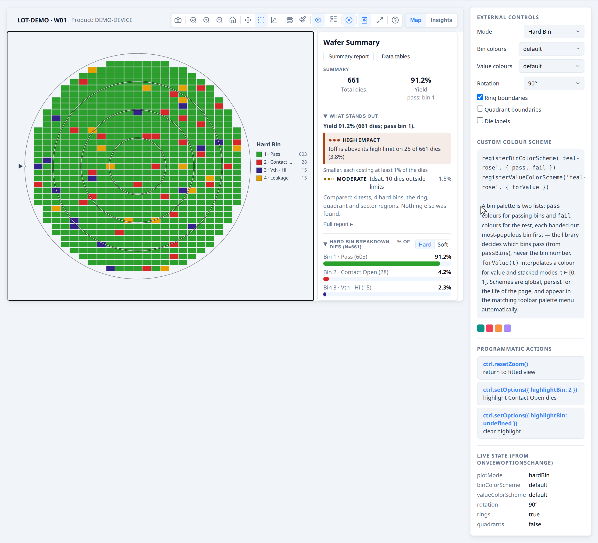
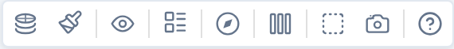
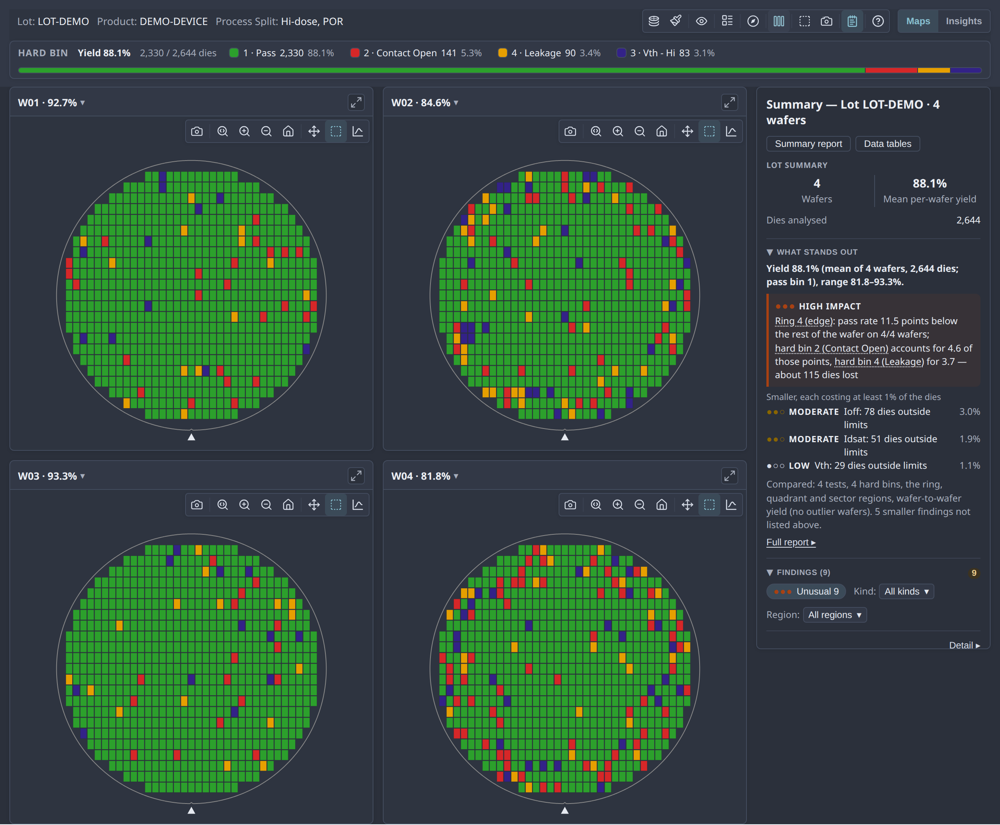
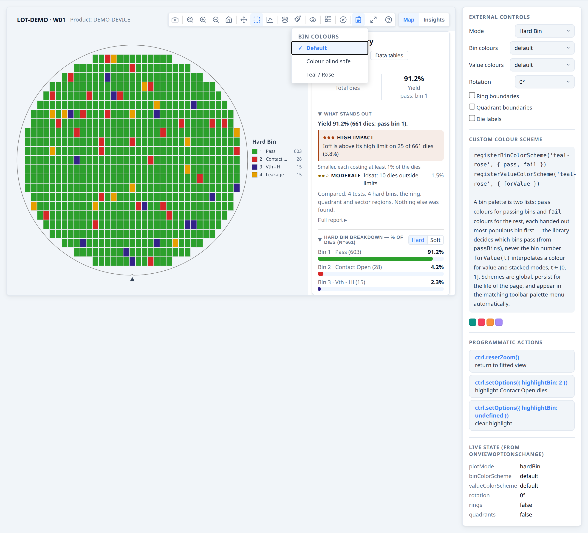
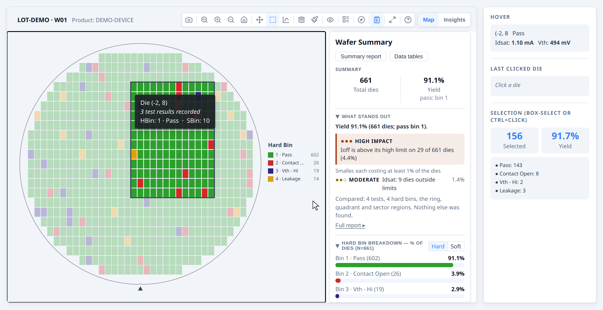
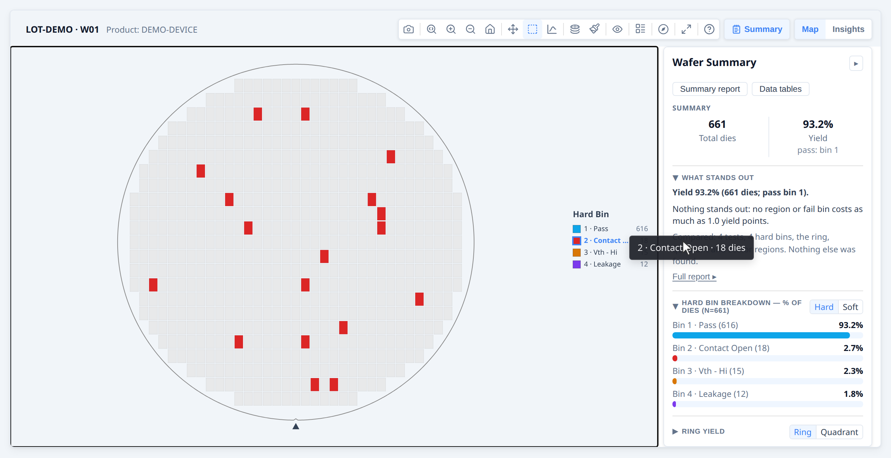

# Developer Guide — Display and interaction

**Part of the [Developer Guide](../guide.md).**

## Controlling the display

### Initial display options

Pass `viewOptions` to `renderWaferMap` to set the initial state:

```ts
renderWaferMap(container, result, {
  viewOptions: {
    plotMode:                'hardBin',
    binColorScheme:          'default',     // bin maps: 'default' | 'accessible' (colour-blind safe)
    valueColorScheme:        'default',     // value maps: 'default' (Viridis) | 'cividis' | 'plasma' | 'mako' | …
    reverseValueScheme:      false,         // flip the gradient end-for-end
    showRingBoundaries:      true,
    showQuadrantBoundaries:  false,
    showDieLabels:           false,         // die index labels
    showXYIndicator:         true,
    rotation:                0,             // 0, 90, 180, 270
    flipX:                   false,
    flipY:                   false,
    legendPosition:             'default',     // 'default'|'compact'|'left'|'top'|'bottom'|'floating'
  },
});
```

All of these can also be changed by the user via the toolbar at any time.

### Programmatic control

`renderWaferMap` returns a controller you can call from application code:

```ts
const ctrl = renderWaferMap(container, result, { viewOptions: { plotMode: 'hardBin' } });

// Switch display mode (activeTest is a testNumber, e.g. from testDefs):
ctrl.setOptions({ plotMode: 'value', activeTest: 1050 });

// Replace the result (e.g. after a data reload) — preserves zoom/pan:
ctrl.setResult(newResult);

// Read current state:
const opts = ctrl.getOptions();
console.log(opts.plotMode, opts.binColorScheme, opts.valueColorScheme);

// Return to default zoom:
ctrl.resetZoom();

// Clean up when the component unmounts:
ctrl.destroy();
```

### Syncing with external UI controls

Use `onViewOptionsChange` to keep your own UI elements in sync with the toolbar:

```ts
const ctrl = renderWaferMap(container, result, {
  viewOptions: { plotMode: 'hardBin' },
  onViewOptionsChange: (opts) => {
    modeDropdown.value     = opts.plotMode;
    schemeDropdown.value   = opts.valueColorScheme ?? 'default';
    ringsCheckbox.checked  = opts.showRingBoundaries ?? false;
  },
});

// When your own control changes, push it back:
modeDropdown.addEventListener('change', () => {
  ctrl.setOptions({ plotMode: modeDropdown.value });
});
```

> `onViewOptionsChange` fires only when the toolbar changes options.  Calling
> `ctrl.setOptions()` programmatically does NOT re-fire it, so there is no
> feedback loop.

### Hiding the toolbar

If you want a static display with no toolbar:

```ts
renderWaferMap(container, result, {
  showToolbar: false,
  viewOptions: { plotMode: 'hardBin' },
});
```

To keep your app's own mode controls in step with the toolbar, listen for changes:

```ts
renderWaferMap(container, result, {
  viewOptions: { plotMode: 'value' },
  onViewOptionsChange: (opts) => syncMyModeUI(opts),
});
```
**→ [Demo: Controlling the display](../examples/display-control.html)**




### Bin legend position

In `hardBin` and `softBin` modes, the bin legend can be placed in six positions via the **Legend style** toolbar button or the `legendPosition` option:

| Value | Behaviour |
| --- | --- |
| `'default'` | Vertical list on the right (full labels + counts). Auto-adapts: switches to `compact` below 280 px canvas width, `floating` below 180 px. |
| `'compact'` | Vertical list on the right (bin numbers only) |
| `'left'` | Vertical list on the left (full labels + counts) |
| `'top'` | Horizontal strip above the wafer (multi-column, auto-fitted) |
| `'bottom'` | Horizontal strip below the wafer (multi-column, auto-fitted) |
| `'floating'` | Draggable overlay, initially bottom-right (full labels + counts) |

Set the initial position via `viewOptions` — the user can change it at any time via the toolbar:

```ts
renderWaferMap(container, result, {
  viewOptions: { plotMode: 'hardBin', legendPosition: 'floating' },
});
```


The Legend style button is automatically disabled when the map is in `value` or stacked mode, since those modes use a continuous colorbar instead of a bin legend.

For galleries, set it the same way; it applies to all cards:

```ts
renderWaferGallery(container, items, {
  viewOptions: { legendPosition: 'floating' },
});
```

### Toolbar reference

The toolbar is always shown — at the top-right of a single map, or as a persistent
bar above the gallery grid.  Which buttons appear depends on the context and the current data.

#### Single map toolbar


| | Button | Condition | What it does |
| --- | --- | --- | --- |
|  | Download PNG | Always | Saves the current canvas at current zoom/rotation |
|  | Zoom mode | Always | Drag to zoom into a region |
|    | Zoom in / Zoom out / Reset | Always | Step zoom; Reset returns to fitted view |
|  | Pan mode | Always | Drag to pan |
|  | Box select | Always | Drag to select a group of dies; fires `onSelect` when provided |
|  | Plot mode | Always | Opens mode menu: Test Value, Hard Bin, Soft Bin, and Stacked modes (only when map was built with `lotStack`) |
|  | Colour palette | Always | Opens colour scheme picker |
|  | Log scale | Value / stacked-values mode only | Toggles log₁₀ colour normalisation; disabled when min ≤ 0; hidden whenever a solid pass/fail display is active or the active test is functional (log scale has no effect on pass/fail colouring) |
|  | Colorbar range | Value mode, test has `limitLow` or `limitHigh`, pass/fail display off | Toggles the colorbar's numeric range between spec-limit range (`[limitLow, limitHigh]`) and data range (actual min/max). Out-of-spec dies are flagged with ▽/△ markers in both. |
|  | Overlays | Always | Dropdown: Ring boundaries, Quadrant lines, Die labels, Reticle grid (when reticles present), XY indicator, Limit pass/fail (value mode, test has limits), Test pass/fail (value mode, active test is functional or has recorded verdicts) |
|  | Legend style | Hard bin or soft bin mode only | Dropdown: legend position (default, compact, left, top, bottom, floating) |
|  | Orientation | Always | Dropdown: Rotate 90° CW, Flip horizontal, Flip vertical |
|  | Summary | Only when `statsSummary` is provided | Toggles the Summary panel (metadata, yield, bins, ring/quadrant, test values, findings) |
|  | Insights | Unless `insights: { enabled: false }` | Swaps the map for this wafer's own chart suite — see [The Insights tab](galleries.md#the-insights-tab) |
|  | Expand | Unless `showExpandButton: false` | Opens the map in an enlarged modal overlay; canvas reparented — no view rebuild. A maximise button in the modal grows it to fill the window (`F`). `E` key shortcut (also disabled when `showExpandButton: false`). Hidden (and `E` disabled) while the Insights tab is open — see below. |
|  | User guide | Only when `showHelpButton: true` | Opens the built-in end-user guide — a real, separate window when available, falling back to an in-page non-modal floating window when `window.open` is blocked (some embedded WebViews). Callable directly via `openUserGuide()` regardless of `showHelpButton`. `userGuideExtension` inserts a host app's own documentation into it, see [API reference](../api/render-map.md#511-user-guide-extension) |

A gallery card's detached window shows the full toolbar. In the gallery, cards show only the navigation controls
(download, zoom, pan, select) — the view controls (mode, overlays, orient, etc.) live in the
shared gallery bar.

**While the Insights tab is open**, every button above except Insights and User guide
is hidden — none of the others (download, zoom/pan/select, mode, palette, overlays, legend,
orientation, Expand) apply to the chart suite underneath, and Findings specifically toggles the
map's own findings panel, which sits behind the Insights tab's opaque overlay with no visible
effect while it's open. Expand is hidden rather than repurposed: each chart panel inside
Insights has its own expand button for enlarging that one chart instead.

#### Gallery control bar



The gallery control bar is always visible above the card grid.

| | Button | Condition | What it does |
| --- | --- | --- | --- |
|  | Plot mode | Always | Same mode menu as single map; stacked modes always available in the gallery |
|  | Colour palette | Always | Colour scheme picker; applies to all cards |
|  | Aggregation method | Stacked Test Values mode only | Selects mean, median, std dev, min, max, or count; re-aggregates all cards immediately |
|  | Log scale | Value / stacked-values mode only | Applies to all cards |
|  | Colorbar range | Value mode, active test has `limitLow` or `limitHigh`, pass/fail display off | Toggles the colorbar's numeric range: spec-limit range ↔ data range. Out-of-spec dies are flagged with ▽/△ markers in both; applies to all cards |
|  | Overlays | Always | Dropdown: Ring boundaries, Quadrant lines, Die labels, Reticle grid (when any card has reticles), XY indicator, Limit pass/fail (value mode, active test has limits), Test pass/fail (value mode, active test is functional or has recorded verdicts) — applies to all cards |
|  | Legend style | Always | Dropdown: **Legend on each map** toggle (off by default — the lot legend strip stands in for it), then the per-card legend position, available only while that toggle is on and in a bin or metadata mode |
|  | Orientation | Always | Dropdown: Rotate 90° CW, Flip horizontal, Flip vertical — applies to all cards |
|  | Columns | Always | Dropdown: fix the column count to 1–5, or choose **Auto** to let the gallery size columns based on die pitch. Cards are size-capped and pack from the left rather than stretching to fill the width |
|  | Download all | Always | Exports all cards as a single tiled PNG |
|  | Summary panel | Only when `lotStatsSummary` is provided | Toggles the summary and findings panel covering every wafer in the gallery |
|  | Insights | Unless `insights: { enabled: false }` | Swaps the grid for a chart suite covering every wafer — see [The Insights tab](galleries.md#the-insights-tab) |
|  | User guide | Only when `showHelpButton: true` | Opens the built-in end-user guide — a real, separate window when available, falling back to an in-page non-modal floating window when `window.open` is blocked (some embedded WebViews). Callable directly via `openUserGuide()` regardless of `showHelpButton`. `userGuideExtension` inserts a host app's own documentation into it, see [API reference](../api/render-map.md#511-user-guide-extension) |

**While the Insights tab is open**, every button above except Insights and User guide is hidden
— none of the others (mode, palette, overlays, columns, download, etc.) apply to the chart
suite underneath, and Summary panel specifically toggles the panel inside the grid body,
which is already hidden while the Insights tab is showing.

### Theming the chrome

wmap's chrome — the toolbar, gallery cards, summary panel, menus, tooltip — and the wafer **canvas** (background, axis labels, grid) are themed through `--wmap-*` CSS custom properties. Set them on any ancestor of the render container and everything wmap draws follows. Every token has a light default, so you override only what differs; a host that sets nothing gets the default light appearance.



```css
/* The Nord theme shown above — set on a wrapper around the render container */
.my-nord-wrap {
  --wmap-canvas-bg:   #2e3440;   /* the wafer canvas */
  --wmap-surface:     #323846;   /* cards, menus, toolbar */
  --wmap-panel-bg:    #2b303b;   /* summary panel */
  --wmap-border:      #434c5e;
  --wmap-text:        #e5e9f0;
  --wmap-text-muted:  #a6adbb;
  --wmap-icon:        #d8dee9;
  --wmap-icon-hover:  #88c0d0;   /* accent — hover/active affordances */
  --wmap-icon-active: #88c0d0;
  --wmap-selected:    #88c0d0;   /* finding-drilldown card outline */
  /* …see the full token table in the API reference… */
}
```

To follow the OS preference, put the light values on `:root` and override in a `@media (prefers-color-scheme: dark)` block. Canvas colours are re-resolved on a theme change or light/dark flip, so the wafer repaints to match.

The **data palette** (the bin/value colours of the dies) is separate — it's controlled by `binColorScheme` and `valueColorScheme` (see [Custom colour schemes](#custom-colour-schemes)), not these tokens, and does not follow the chrome accent.

**→ [Demo: Theming with `--wmap-*` tokens](../examples/theming.html)** · full token reference in the [API docs](../api/render-map.md#541-theming-wmap-custom-properties)


### Custom colour schemes

Bin maps and value maps have **separate** colour schemes, each its own view option and its own
registry, so a user can keep Mako for values and the colour-blind-safe palette for bins
without either resetting the other on a mode switch:

- **`binColorScheme`** — `'default'` or `'accessible'` (colour-blind safe). Used by Hard Bin and
  Soft Bin maps.
- **`valueColorScheme`** — `'default'` (Viridis), `'cividis'` (colour-blind safe), `'greyscale'`,
  `'plasma'`, `'inferno'`, `'mako'`, `'traffic'` (green→yellow→red, low=good) and
  `'jet'` (the MATLAB rainbow). Used by Test Value maps and all three stacked modes — a stacked-bin
  map is a value map, showing how often a bin occurs at each position.
- **`reverseValueScheme`** — flips whichever gradient is selected, offered in the menu as
  **Reverse gradient**. One flag rather than a reversed twin of every ramp, so it works on a
  gradient you registered yourself too.

Every built-in but `'traffic'` and `'jet'` reads **low = dark, high = light** — the direction
matplotlib and seaborn define these ramps with. It is worth knowing why, because it is easy to
assume the opposite is friendlier: on a stacked map the healthy bulk of the wafer (fail count 0)
sits back as dark ground and an edge ring or a scratch lights up. Reversed, the defects become
dark specks on a glowing field, which is the harder read. Set `reverseValueScheme` when your
parameter genuinely has its notable end at the bottom.

#### Registering your own

```ts
import { registerBinColorScheme, registerValueColorScheme } from '@wafertools/wafermap';

registerBinColorScheme('my-brand', {
  label: 'My Brand',
  pass: ['#1b7f3b', '#7cc68a'],                         // passing bins, from bin 1
  fail: ['#c62828', '#1565c0', '#ef6c00', '#6a1b9a'],   // failing bins, from bin 2 — most distinct first, no greens
});

registerValueColorScheme('my-brand', {
  label: 'My Brand',
  forValue: (t: number) => `rgb(0,${Math.round(t * 100)},${Math.round(80 + t * 175)})`,  // t ∈ [0, 1]
});

// Each now appears in the matching toolbar Palette menu automatically. Apply programmatically:
ctrl.setOptions({ binColorScheme: 'my-brand', valueColorScheme: 'my-brand' });
```

Register your schemes once, before any `renderWaferMap` call.
They are global and persist for the lifetime of the page. Both choices are `WaferPreferences`,
so `onViewOptionsChange` reports a change to either with category `'preference'` — save them
there and pass them back in `viewOptions` to remember a user's choice.

**→ [Demo: Custom colour schemes](../examples/display-control.html#custom-schemes)**





## Responding to user interaction

### Click and hover callbacks

```ts
renderWaferMap(container, result, {
  onClick: (die, event) => {
    console.log(`Clicked die (${die.x}, ${die.y})`);
    console.log('Hard bin:', die.hbin);
    console.log('Test values:', die.testValues);
    showDetailPanel(die);
  },
  onHover: (die, event) => {
    if (die) updateStatusBar(`(${die.x}, ${die.y})`);
    else     clearStatusBar();
  },
});
```

`onClick` and `onHover` receive the full `Die` object — `die.x`, `die.y`, `die.testValues`,
`die.hbin`, `die.sbin`, and any metadata you attached.  `onHover` receives `null` when the cursor
leaves a die.

### Box selection

The box-select button is always in the toolbar.  Provide `onSelect` to receive the selected dies when the user finishes a drag selection:

```ts
renderWaferMap(container, result, {
  onSelect: (selectedDies) => {
    console.log(`${selectedDies.length} dies selected`);
    const passing = selectedDies.filter(d => d.hbin === 1).length;
    showSelectionStats({ count: selectedDies.length, passing });
  },
});
```

Users can also click individual dies, Ctrl/Cmd+click to add to the selection, and
press Esc to clear.

### Programmatic selection

```ts
// Highlight a specific set of dies (e.g. from a table click):
const failingDies = result.dies.filter(d => d.hbin === 2);
ctrl.setSelection(failingDies);

// Clear:
ctrl.clearSelection();
```
**→ [Demo: Responding to user interaction](../examples/interaction.html)**




### Bin legend filter

In `hardBin` and `softBin` modes, clicking any row in the bin legend dims all dies that do not belong to that bin — making it easy to isolate a single failure category across the wafer. Click the same row again to clear the filter.

```ts
// Equivalent programmatic control:
ctrl.setOptions({ highlightBin: 2 });   // isolate bin 2
ctrl.setOptions({ highlightBin: undefined }); // clear
```

The filter also works in gallery view — clicking a legend row in the gallery toolbar highlights that bin across every card simultaneously.


