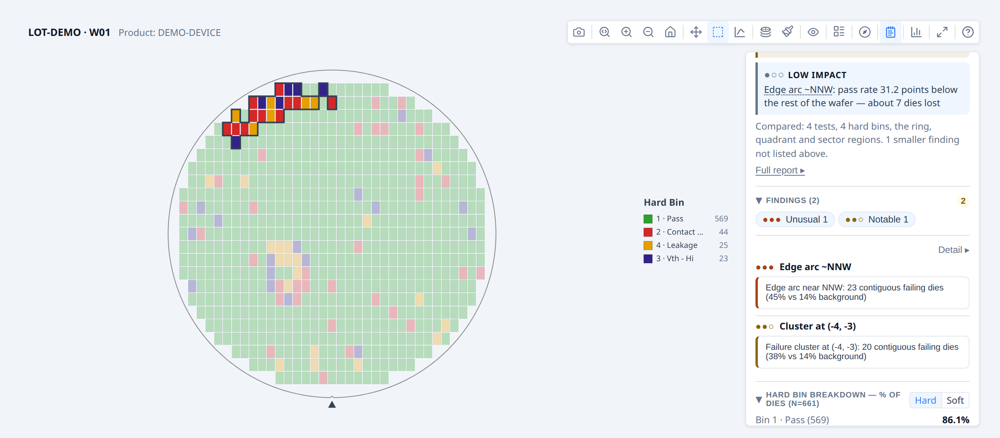
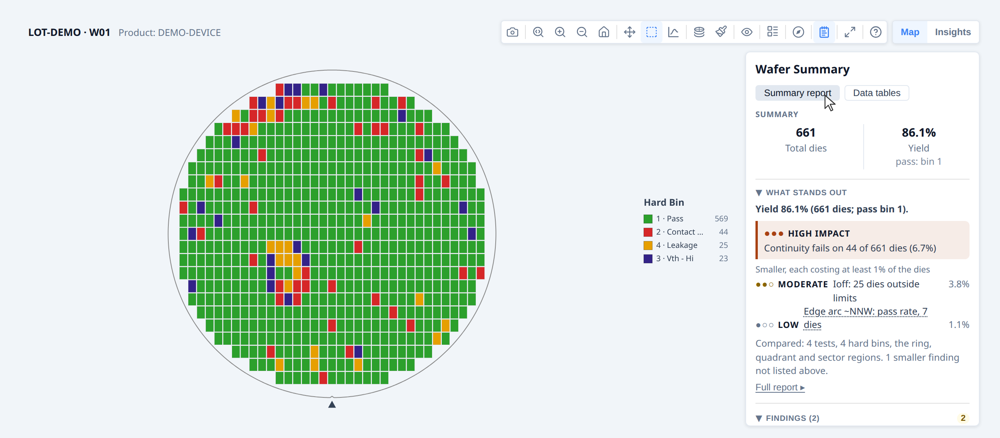

# Developer Guide — Findings and the Summary panel

**Part of the [Developer Guide](../guide.md).**

## Adding statistical findings

The statistics engine (`analyzeWaferMap`) scans for spatial patterns across five families: rings, quadrants, angular sectors, contiguous failure clusters, and edge arcs. For each family it compares the local zone to the rest of the wafer using a statistical test appropriate to the variable type.

It also runs a **spatial pattern classifier** that labels the overall failure signature of the wafer — edge-ring, center cluster, scratch, and so on. This operates separately from the zone-by-zone statistical tests: the statistical findings are the evidence, the pattern label is the interpretation. See [Spatial Pattern Detection](../pattern-detection.md) for how the classifier works, what it was tested on, and its known limitations.

### Basic usage

Pass the result of `analyzeWaferMap` to `renderWaferMap` as `statsSummary`.
That's all most users need — the library handles the rest.

```ts
import { buildWaferMap } from '@wafertools/wafermap';
import { renderWaferMap } from '@wafertools/wafermap/render';
import { analyzeWaferMap } from '@wafertools/wafermap/stats';  // note: /stats subpath, not root

const result  = buildWaferMap({ results, waferConfig, dieConfig, passBins: [1] });
const summary = analyzeWaferMap(result);   // passBins inferred from result — no need to repeat it

renderWaferMap(container, result, {
  statsSummary: summary,
});
```

A "Findings" button (notebook icon) appears in the toolbar. Clicking it opens
the summary panel — a persistent results panel alongside the map showing yield,
bin distribution, ring and quadrant stats, test value summaries, and the full
findings list. Clicking any finding in the panel highlights the affected dies on
the map. See [Summary panel](#summary-panel) for the full panel content
reference and configuration options (auto-open, pinned placement, gallery use).

When you pass a `WaferMapResult` to `analyzeWaferMap`, the `passBins` you gave to
`buildWaferMap` are carried through automatically. `analyzeWaferMap` has no `passBins` option of
its own: pass bins are set once, on `buildWaferMap`.

### What gets analysed

By default the engine checks every combination of:

- **Ring zones** — each concentric ring vs. the rest of the wafer
- **Quadrant zones** — each of NE/NW/SE/SW vs. the rest of the wafer
- **Angular sectors** — 16 compass-direction sectors (N, NNE, NE, …) vs. the rest of the wafer; finer directional resolution than quadrants, catching drift patterns a single quadrant would dilute
- **Reticle-field positions** — each reticle cell vs. other cells (only when a `reticleConfig` was used)
- **Failure clusters** — contiguous groups of failing dies that are denser than the wafer-wide background failure rate; each cluster highlighted as a specific set of dies
- **Edge arcs** — failure clusters whose centroid is near the wafer perimeter and whose angular span is narrow; distinguished from full-ring edge effects (which ring analysis catches separately)

For each spatial family the engine tests: yield, hard bin rate per bin, soft bin rate per bin, and mean test value per test.

**Angular sectors in detail.** Sector analysis divides the wafer into compass-named angular slices — N, NNE, NE, ENE, E, … (8 sectors by default).  Each sector is compared to the rest of the wafer independently, giving finer directional resolution than quadrants: a drift pattern concentrated in the NE corner shows up as a sector finding even if the wider NE quadrant is diluted by clean dies elsewhere in that quarter.  Dies within 0.2 normalised radius of the wafer centre are excluded from sector analysis (they are too close to the centre to be meaningfully attributed to a direction).  The number of sectors is controlled by `sectorCount` (4, 8 or 16).

Findings are suppressed unless they pass both an adjusted p-value threshold and an effect size gate. The effect size gate uses two complementary criteria — absolute and relative — so that meaningful patterns are not missed on wafers with either high or low background failure rates.

### Clicking a finding highlights the map

When the user clicks a finding row in the panel, the map automatically:
1. Switches to the most relevant display mode (value mode for test findings, bin
   mode for bin findings)
2. Highlights the affected die zone with an amber overlay

Clicking the finding again clears the highlight.

### Interpreting findings and severity

The findings list is ranked and filtered by statistical strength and effect size:

These thresholds are **internal constants, not options** — see [§7.3 of the API reference](../api/stats.md#73-analyzewafermapoptions) for why. They are documented here so you can tell why a pattern did or did not produce a finding.

- **p-value correction:** adjusted p-values are used (threshold 0.05), corrected with a Benjamini–Hochberg FDR procedure over every comparison of one kind on the wafer at once: all its yield, bin, functional and limit-fail rates in every region family are one family. Rates whose expected counts are small (a rare bin, a small region, a nearly clean wafer) are tested exactly (Fisher's test) rather than by the normal approximation.
- **A region must hold against the regions that are not themselves deviant:** compared with "the rest of the wafer", the regions beside a strong pattern look deviant the other way (a failing quadrant makes the sectors opposite look good). Each finding is re-tested against the rest without the other findings of the same variable and family, losses first, and a region is called better only than the regions that are not worse. A failing block of rings is reported as the block, never as the rings either side of it being better.
- **Clusters and edge arcs are tested by their size:** a group of failing dies is found because it fails, so its own fail rate proves nothing. Instead the wafer's fails are scattered at random over the same dies (up to 99 times) and a group is reported only when random placement rarely makes a group that large (p ≤ 0.05; the smallest p-value is 0.01). Random failures at a few percent always clump somewhere, and those clumps are no longer reported as clusters.
- **Effect size gate for yield/bin/cluster findings:** a finding passes if it satisfies at least one of:
  - absolute `|delta| ≥ 0.20`, i.e. a 20 percentage-point difference, **or**
  - relative `|delta / background| ≥ 1.0`, i.e. at least a doubling of the wafer-wide background rate

  The relative criterion matters on low-failure-rate wafers. With a 2% background rate, a 4 percentage-point elevation is only 0.04 in absolute terms — well below the 0.20 gate — but is a 200% relative deviation, and is kept. Without the relative criterion that finding would be silently dropped. (A 2-point elevation on the same background is a 100% deviation and only just clears it; a 1-point elevation clears neither gate and produces nothing.)

- **Effect size for test-value findings:** Cohen's d (pooled SD). Only the absolute gate applies; relative effect is not used for continuous measurements.
- **Minimum sample size** per region is auto-scaled to roughly 1% of wafer die count (minimum 5). Regions smaller than this are not tested.

**Severity** is derived from the adjusted p-value and the strongest satisfied effect criterion:

| Severity | p-value | Absolute delta | or Relative delta |
|----------|---------|----------------|-------------------|
| `unusual` | ≤ 0.01 | ≥ 0.30 | ≥ 2.5× background |
| `notable` | ≤ 0.05 | ≥ 0.20 | ≥ 1.5× background |
| `info` | any other passing finding | | |

**Cluster and edge-arc findings** have an additional size criterion applied after the rate-based gate above.  A large contiguous cluster is intrinsically striking even when the background failure rate is elevated (e.g. a 500-die donut ring that forms its own high background).  The size thresholds are:

| Severity | Cluster size (% of eligible wafer dies) |
|----------|-----------------------------------------|
| `unusual` | ≥ 10% |
| `notable` | ≥ 3% |

A cluster qualifies for a severity level if it satisfies **either** the rate criterion **or** the size criterion (both require the p-value gate).

Use the `summary`, `effect`, and `stats` fields on each `StatsFinding` to display numerical details to users.

### Controlling what is analysed

```ts
const summary = analyzeWaferMap(result, {
  // significanceLevel / minimumEffectSize / minimumRelativeEffect were REMOVED in
  // 0.27.0 — they are internal constants now. They set what counts as a finding,
  // so a wrong value made the output wrong rather than merely different, and did
  // so silently. See "Interpreting findings and severity" above for the values.
  enableTestValueAnalysis:   true,   // default FALSE — opt in for regional test-value findings (expensive);
                                     // use computePerTestStats: true for box-plot stats without the Welch pass
  sectorCount:               8,      // 4 | 8 | 16
});
```

#### How the analysis is structured: variable × region

Regional analysis has **two independent axes**, and it helps to keep them separate:

- **What is measured** (the *variable*): yield, hard bin, soft bin, or test value.
- **Where it is measured** (the *region family*): rings, quadrants, sectors, reticle positions, or test sites.

Every enabled variable is compared across **every** enabled region family — they form a grid. Sectors, reticle positions, and test sites are **not** specific to any one variable: if reticle analysis is on, you get yield *and* bin *and* (when enabled) test-value findings broken down by reticle position, exactly as you do for rings.

|                          | Rings | Quadrants | Sectors¹ | Reticle² | Test sites³ |
|--------------------------|:-----:|:---------:|:--------:|:--------:|:-----------:|
| **Yield**        | ✓ | ✓ | ✓ | ✓ | ✓ |
| **Hard bin**   | ✓ | ✓ | ✓ | ✓ | ✓ |
| **Soft bin**   | ✓ | ✓ | ✓ | ✓ | ✓ |
| **Test value** (`enableTestValueAnalysis`) | ✓ | ✓ | ✓ | ✓ | ✓ |

The **column** toggles control which region families are built at all:

1. **Sectors** — always built, with `sectorCount` slices.
2. **Reticle positions** — built only when a reticle configuration is present; otherwise skipped automatically.
3. **Test sites** — built only when the wafer has meaningful site duplication (≥ 2 distinct `siteNum` values, each on ≥ 3 dies).

Rings and quadrants are always built. The **row** toggles control which variables are compared across whatever families exist.

#### Which test-value setting to use

The **test-value row is off by default** because it is the expensive one — it runs a Welch comparison for every test across every region, scaling with regions × tests × dies. Leaving it off costs you **nothing on yield or bins**; you lose only the parametric (measured-value) findings. Choose based on what you need:

| You want…                                                                 | Pass                                | Relative cost |
|---------------------------------------------------------------------------|-------------------------------------|---------------|
| Yield, bin, and spatial (ring/quadrant/sector/cluster) findings only      | *(nothing — this is the default)*   | baseline      |
| …plus per-test descriptive stats (mean, stddev, min, max, median, Q1, Q3) for box plots / histograms | `computePerTestStats: true`         | ~5× baseline  |
| …plus "this test's value differs significantly in this region" findings (and spec-limit region findings) | `enableTestValueAnalysis: true`     | ~12× baseline |

`enableTestValueAnalysis` also produces the per-test descriptive stats, so you never need both. The cost multipliers are illustrative (measured at ~2.8k dies × 200 tests); the absolute numbers scale with your test count.

**→ [Demo: Summary panel](../examples/statistics.html#summary-panel)** uses `computePerTestStats: true` to populate the per-test value section of the panel.  
See also: **[Demo: Standalone stacked map with spatial analysis](../examples/statistics.html#lot-stack)**, which uses `enableTestValueAnalysis: true` to surface regional test-value findings on a lot-averaged map.

#### Cluster and edge-arc highlights

Cluster and edge-arc findings use `{ kind: 'dies' }` highlights — they identify the exact set of failing dies, not a region. Clicking one in the summary panel highlights those specific dies on the map:

```ts
const clusters = filterFindings(summary, { family: 'cluster' });
const arcs     = filterFindings(summary, { family: 'edge-arc' });
const sectors  = filterFindings(summary, { family: 'sector' });

// Each cluster finding's highlight carries the exact die keys:
for (const f of clusters) {
  console.log(f.comparison.left);    // e.g. "Cluster at (3, 2)"
  console.log(f.highlight.dieKeys);  // ['3,2', '4,2', '3,3', ...]
}
```


### Reading findings in code

If you need to drive your own UI from findings rather than using the built-in
panel, each finding is a `StatsFinding` with a human-readable `summary` and
structured data:

```ts
for (const finding of summary.findings) {
  console.log(finding.severity);          // 'unusual' | 'notable' | 'info'
  console.log(finding.summary);           // "Ring 3 (edge) yield is lower than the rest of the wafer"
  console.log(finding.variable.kind);     // 'yield' | 'hardBin' | 'softBin' | 'test'
  console.log(finding.effect.absoluteDelta);  // signed magnitude of the effect
  console.log(finding.stats.adjustedPValue);  // BH-adjusted p-value
}
```

`summary.findings` is sorted by severity — `'unusual'` first, then `'notable'`, then `'info'`.
`findings[0]` is always the highest-severity finding; no manual sort needed.

#### De-duplicating for display

`summary.findings` is the **complete** list, including findings that restate one
another. Several passes legitimately detect the same phenomenon, so one edge
failure can appear as a hard-bin row, its soft-bin twin with an identical delta,
a pass-bin row, and a yield row saying the same thing as the pass-bin row.

The library marks these: a finding's `absorbedIds` names the findings it
restates. The built-in panel and report hide them; if you are driving your own
UI, do the same, or you will show one fact several times:

```ts
const absorbed = new Set(summary.findings.flatMap(f => f.absorbedIds ?? []));
const forDisplay = summary.findings.filter(f => !absorbed.has(f.id));
```

The surviving finding's `summary` names what it absorbed — for example
`"Ring 4 (edge) has hard bin 3 and soft bin 3 (same dies) occurrence 8.8
percentage points higher…"` — so nothing is silently lost from the sentence.
Everything absorbed is still in `summary.findings` and still returned by
`filterFindings`; the collapse is display-only.

Note `relatedIds` is a *different* relationship and is not interchangeable: it
records a finding's finer-grained supporting detail, and some of the ids it names
were replaced by a merge and no longer exist in `findings`.

### Capability, pass rates and region yield

The analysis also returns the numbers behind the Insights charts and the Summary panel, for
exports and your own UI:

```ts
const summary = analyzeWaferMap(result, { computePerTestStats: true });

summary.stats.capability;                   // Cp/Cpk/Pp/Ppk per parametric test, worst first
summary.stats.testSpecYield;                // pass rate by spec limits
summary.stats.testFlagYield;                // pass rate by the tester's own recorded verdict
summary.stats.functionalYield;              // pass rate of functional (pass/fail-only) tests
summary.stats.specVerdictDisagreementDies;  // dies where spec limits and the tester disagree
summary.stats.regionYield;                  // { ring, quadrant } yield, with die and pass counts
```

`analyzeWaferLot` returns the same fields for the whole lot. There, capability treats each wafer
as a subgroup, so Cp (within-wafer spread) and Pp (overall spread) genuinely differ; pass rates and
region yield sum each wafer's counts, and are left out unless every wafer reported them. Read these
rather than computing capability or ring yield yourself: the pooled standard deviation and
per-wafer pass bins are easy to get subtly wrong. `capability` needs `computePerTestStats` (or
`enableTestValueAnalysis`), because it scans every test value.

### Updating findings after a data change

```ts
// After rebuilding the map with new data (newResult = buildWaferMap(...)):
ctrl.setResult(newResult);
const newSummary = analyzeWaferMap(newResult);
ctrl.setStatsSummary(newSummary);
```

A finding object in full:

```js
{
  id:       'ring:Ring 4 (edge)',
  level:    'wafer',
  severity: 'unusual',            // 'unusual' > 'notable' > 'info'
  variable: { kind: 'yield', label: 'Yield' },
  comparison: { family: 'ring', left: 'Ring 4 (edge)', right: 'Rest of wafer' },
  effect:   { direction: 'lower', absoluteDelta: -0.18, relativeDelta: -0.62 },
  stats:    { method: 'z', pValue: 0.003, adjustedPValue: 0.009,
              sampleSizeLeft: 48, sampleSizeRight: 412 },
  summary:  'Ring 4 (edge) yield is lower than the rest of the wafer',
  highlight: { kind: 'region', regionFamily: 'ring', regionKeys: ['ring:4'], dieKeys: ['6,0', '6,1', /* … */] },
}
```

Use `finding.summary` for display text. Use `finding.highlight` to programmatically
select or colour dies associated with the finding.

For running the stats engine in Node.js without a browser, see the
[Analyse a lot in Node.js without a browser](recipes.md#analyse-a-lot-in-nodejs-without-a-browser) recipe.

**→ [Demo: Statistical findings](../examples/statistics.html#findings)**




## Summary panel

The summary panel is a persistent results panel that sits alongside the wafer map.
It shows yield, bin distribution, ring and quadrant statistics, test value summaries,
and the full findings list — all in one place without requiring the user to open the
toolbar findings button.

### Adding a summary panel to a single map

Pass `statsSummary` to `renderWaferMap` and the Summary button appears in the toolbar
automatically.  The panel is hidden by default; clicking the button toggles it open:

```ts
import { buildWaferMap } from '@wafertools/wafermap';
import { renderWaferMap } from '@wafertools/wafermap/render';
import { analyzeWaferMap } from '@wafertools/wafermap/stats';

const result  = buildWaferMap({ results, waferConfig, dieConfig, passBins: [1] });
const summary = analyzeWaferMap(result);

renderWaferMap(container, result, {
  statsSummary: summary,
});
```

To start with the panel already open (no toolbar click required), add
`summaryPanel: { defaultOpen: true }`:

```ts
renderWaferMap(container, result, {
  statsSummary: summary,
  summaryPanel: { defaultOpen: true },
});
```

The toolbar Summary button reflects the current open/closed state, and the user can
still toggle the panel closed via that button.  Combine with a `placement` to pin the
panel to a specific side of the canvas without the toggle behaviour:

```ts
renderWaferMap(container, result, {
  statsSummary: summary,
  summaryPanel: { placement: 'right' },   // always visible; no toggle
});
```

### What the panel shows

The panel is divided into sections:

| Section | Content |
| --- | --- |
| **Yield** | Pass count, fail count, yield %, edge-excluded count |
| **Hard Bins** | Count and percentage per bin; colour-coded |
| **Soft Bins** | Count and percentage per soft bin (when sbin data is present) |
| **Ring analysis** | Per-ring yield breakdown (Ring 1 = centre, Ring N = edge) |
| **Quadrant analysis** | Per-quadrant yield and die count |
| **Test values** | Min, mean, max per **parametric** test parameter (`testType` unset or `'P'`) — labelled by `TestDef.name` when provided, otherwise `Test {N}` using the testNumber |
| **Functional Tests** | Pass/fail counts and pass rate per **functional** test (`testType: 'F'`) — shown instead of mean/max, since a functional test has no measured value; only appears when at least one functional test has data |
| **Findings** | All `StatsFinding` entries grouped by severity — clicking a finding highlights the affected die zone on the map |

### Updating the panel after data changes

```ts
const ctrl = renderWaferMap(container, result, { statsSummary: summary });

// After a data reload (newResult = buildWaferMap(...)):
ctrl.setResult(newResult);
const newSummary = analyzeWaferMap(newResult);
ctrl.setStatsSummary(newSummary);
```

**→ [Demo: Summary panel](../examples/statistics.html#summary-panel)**



