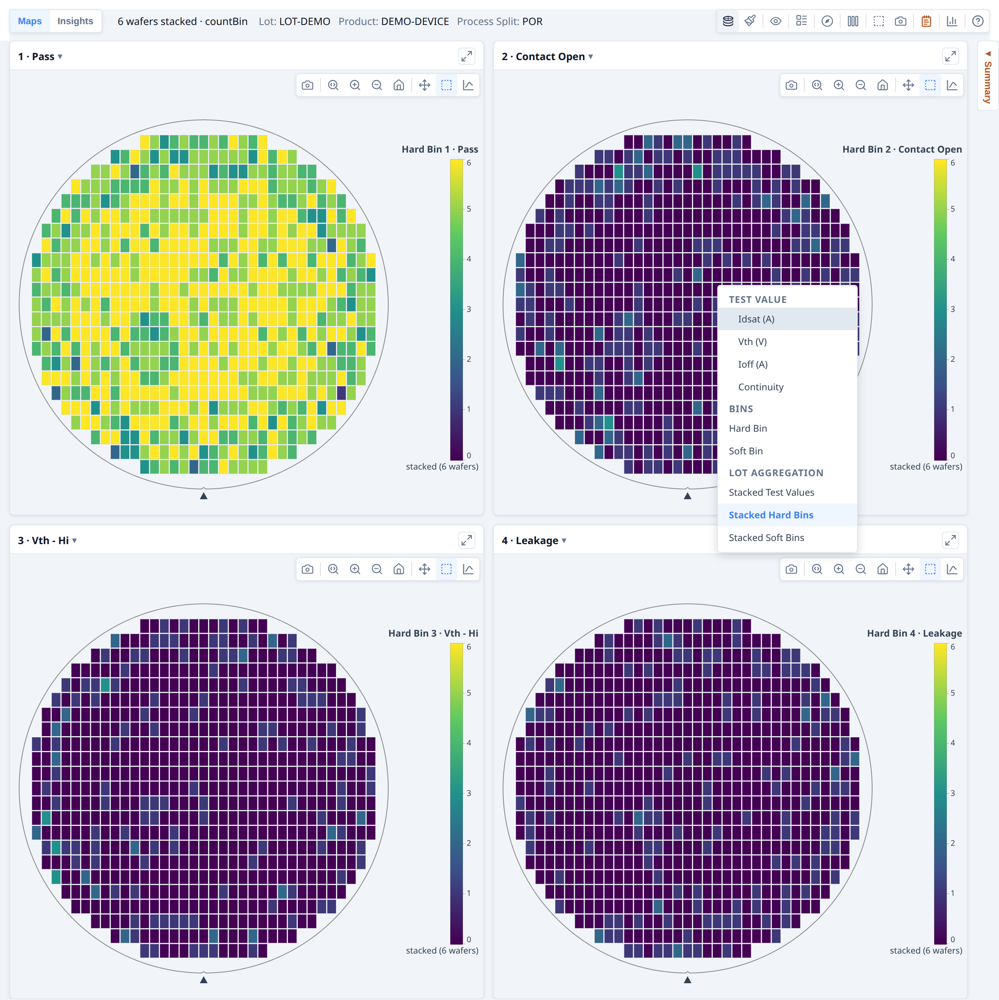
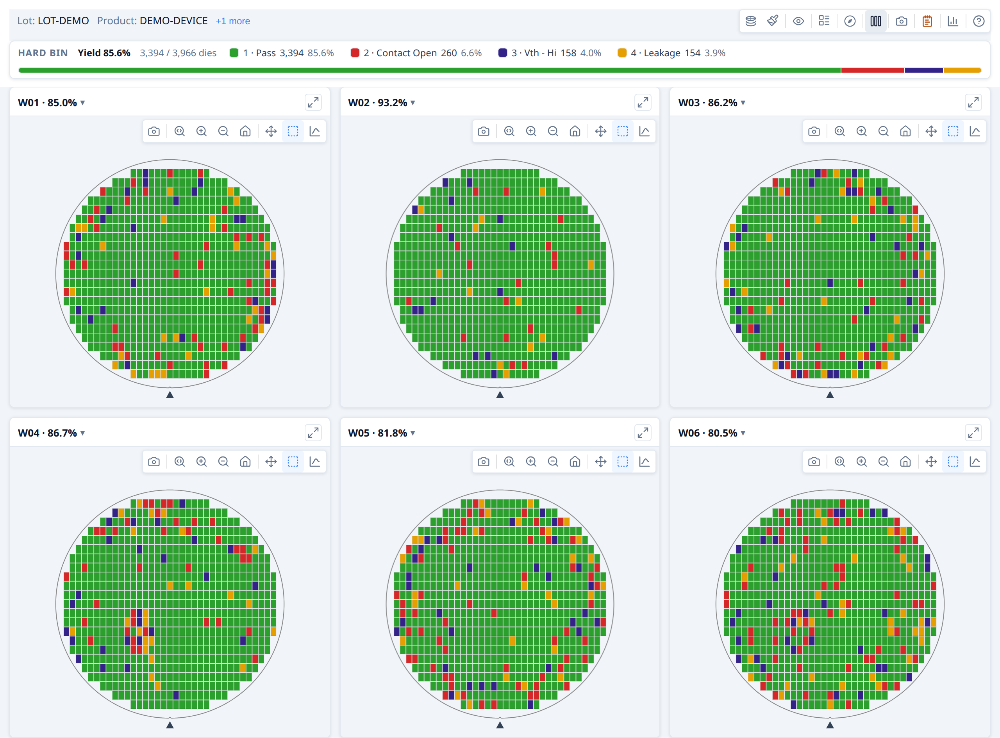
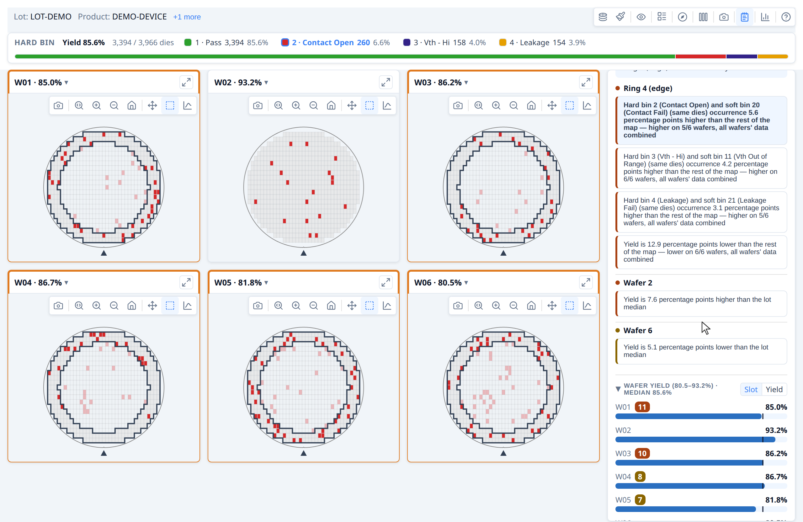
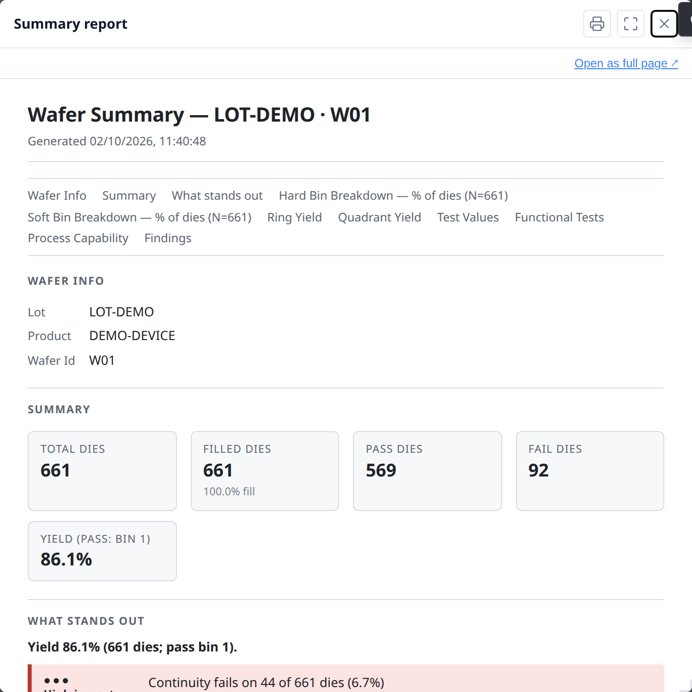
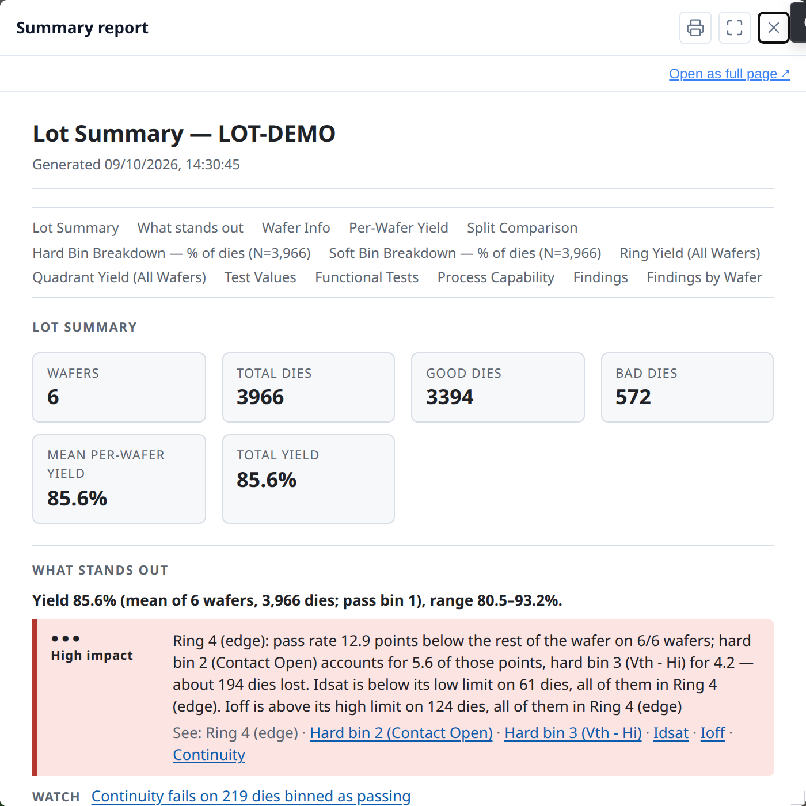

# Developer Guide — Galleries, Insights and reports

**Part of the [Developer Guide](../guide.md).**

## Building a lot gallery

`renderWaferGallery` renders multiple wafer maps in a responsive card grid.  All cards share a single control bar —
changing mode, colour, rotate, or flip applies to every card at once.

The gallery container needs a width but **not** a fixed height — the grid grows
to fit its cards automatically.  `width: 100%` is the typical choice:

```html
<div id="gallery" style="width: 100%;"></div>
```

The toolbar and legend are `position: sticky`, so they stay visible while the grid
scrolls. Stickiness needs a scrolling ancestor with a bounded height and
`overflow-y: auto` (or `scroll`) — the container itself, or any parent. Without one,
the toolbar and legend just scroll away with the grid as before; nothing breaks,
they're simply not sticky.

### Basic gallery

```ts
import { buildWaferMap } from '@wafertools/wafermap';
import { renderWaferGallery } from '@wafertools/wafermap/render';

// Build a result per wafer
const waferResults = waferDatasets.map(data =>
  buildWaferMap({
    results:     data.map(r => ({ x: +r.x, y: +r.y, hbin: +r.hbin, sbin: +r.sbin })),
    waferConfig: { diameter: 300, notch: { type: 'bottom' } },
    dieConfig:   { width: 10, height: 10 },
    hbinDefs,
    sbinDefs,
  })
);

// Build gallery items
const items = waferResults.map((r, i) => ({
  ...r,
  label: `Wafer ${i + 1}`,
}));

const ctrl = renderWaferGallery(
  document.getElementById('gallery'),
  items,
  { viewOptions: { plotMode: 'hardBin' } },
);
```

Cards reflow responsively as the container resizes.  Each card has an expand
button (↗) in its header — clicking it detaches that card into its own real,
separate window (not an in-page overlay), so it can be moved anywhere on
screen, including outside the host app's own window. The gallery grid stays
fully interactive the whole time, and any number of cards can be detached at
once. See [§6.6 Detaching a card into its own window](../api/gallery.md#66-detaching-a-card-into-its-own-window) in the API reference for reattach, multi-window, and embedded-host (Tauri/Electron) details.


### Sharing bin and test definitions across cards

Pass `hbinDefs`, `sbinDefs`, and `testDefs` to `buildWaferMap` — they are stored
on each `WaferMapResult` and flow automatically to the gallery's shared legend and
tooltips:

```ts
const waferResults = waferDatasets.map(data =>
  buildWaferMap({
    results: data.map(r => ({ x: +r.x, y: +r.y, hbin: +r.hbin, sbin: +r.sbin })),
    hbinDefs: [
      { bin: 1, name: 'Pass',  color: '#2ecc71' },
      { bin: 2, name: 'Fail',  color: '#e74c3c' },
    ],
    sbinDefs: [
      { bin: 10, name: 'Vth - Lo' },
      { bin: 11, name: 'Vth - Hi' },
    ],
    testDefs: [
      { testNumber: 1050, name: 'Idsat', unit: 'A' },
      { testNumber: 1060, name: 'Vth',   unit: 'V' },
    ],
  })
);

renderWaferGallery(container, items, { viewOptions: { plotMode: 'hardBin' } });
```

### Per-card overrides

Each `WaferMapDisplayItem` can override any `viewOptions` field.  The per-card value is
merged on top of the shared options.  Use this sparingly — the main purpose is
providing per-card reticle geometry:

```ts
const items = waferResults.map((r, i) => ({
  ...r,
  label: `Wafer ${i + 1}`,
  // r.reticles is already on the item via the spread — the gallery enables
  // the Reticle toolbar button automatically when any item has reticles
}));
```

### Click and select callbacks

```ts
const items = waferResults.map((r, i) => ({
  ...r,
  label: `W${i + 1}`,
  onClick:  (die) => showDieDetail(die, i),
  onSelect: (dies) => showSelectionPanel(i, dies),
}));
```

### Updating the gallery after data changes

```ts
// Rebuild after the user changes wafer selection:
ctrl.setItems(newItems);

// Sync display mode from an external control:
ctrl.setOptions({ plotMode: 'value', activeTest: 1050 });

// Track state changes back to your UI:
renderWaferGallery(container, items, {
  onViewOptionsChange: (opts) => {
    myModeDropdown.value = opts.plotMode;
  },
});
```

### Stacked lot maps

The gallery toolbar includes three stacked modes that aggregate the full lot into a
single view — one card per bin or per test parameter.  Switch mode via the **mode
picker** in the gallery control bar:

| Mode | What each card shows |
| --- | --- |
| **Stacked Test Values** | Per-die mean (or median, std dev, min, max) across all wafers |
| **Stacked Hard Bins** | Per-die count of wafers on which that hard bin appeared |
| **Stacked Soft Bins** | Per-die count of wafers on which that soft bin appeared |

Switching to a stacked mode rebuilds the card set automatically; switching back
restores the original per-wafer cards.

**Aggregation method.** For Stacked Test Values the default aggregation is `mean`.
Change it via the **Σ button** in the gallery control bar (visible only in this mode),
or programmatically:

```ts
ctrl.setOptions({ aggregationMethod: 'median' });  // re-aggregates immediately
```

**Zero-config discovery.** Even without `testDefs` or `binDefs`, the gallery scans
the lot data to discover unique tests and bins when entering a stacked mode, and
generates default labels (e.g. "Test 1050", "Bin 2") automatically.

**Spatial findings.** Each stacked card automatically gets a spatial analysis
summary — detach the card into its own window and click the findings button to
see ring, quadrant, sector, and cluster findings on the aggregated map.  No extra
code is required.

### Summary panel in a gallery

For a gallery, call `analyzeWaferLot` and pass the result as `lotStatsSummary` — that's all you need. `analyzeWaferLot` runs per-wafer analysis internally, so the result contains complete findings for every wafer. A "Summary" button appears in the control bar opening one panel — no tabs — with:

- lot-level findings: cross-wafer patterns and yield outliers
- a **Wafer Yield** section listing every wafer, each row badged with its own findings count; clicking a row detaches that wafer's card into its own window with its summary panel
- a **Findings report** button covering every wafer's findings in one printable document

See [Lot-level statistical findings](#lot-level-statistical-findings) for the full example.

If you are building a gallery *without* lot-level analysis — for example, a set of unrelated wafers — you can attach `statsSummary` to each item individually:

```ts
const items = waferResults.map((r, i) => ({
  ...r,
  label:        `Wafer ${i + 1}`,
  statsSummary: analyzeWaferMap(r),
}));

renderWaferGallery(container, items);
// → Summary panel button appears in the toolbar, listing the wafers with findings
// → Each card's own window shows its own per-wafer summary
```

**→ [Demo: Building a lot gallery](../examples/statistics.html#lot-gallery)**  
See also: [Demo: Lot-level findings with stacked modes](../examples/statistics.html#lot-findings)






## Lot-level statistical findings

`analyzeWaferLot` detects cross-wafer patterns across a lot:

- **Regional patterns across the lot** — a yield, bin, functional pass rate, limit-fail rate
  or test value that differs in a ring, quadrant, sector, reticle position or test site. Each
  comparison is tested on every wafer's data together (Stouffer's Z over each wafer's own
  test, weighted by die count), with the same significance and effect gates as a single
  wafer, so a pattern too faint on some wafers to be reported alone is still found. The
  finding reads, for example, "Ring 4 (edge) has HBin 2 occurrence 11.2 percentage points
  higher than the rest of the map — higher on 8/8 wafers, all wafers' data combined": the
  figure is the lot's, and *N/M* counts the wafers whose region differs in that direction.
- **Repeated patterns** — clusters, edge arcs and spatial-pattern labels reported on ≥ 2
  wafers, counted by the wafers that report them
- **Inter-wafer yield outliers** — wafers whose yield stands apart from the rest, reported
  against the median of the wafers analysed. 3–7 wafers: Dixon's Q test on the lowest and
  highest wafer (95%: notable; 99%: unusual). 8 or more: Tukey's fences over the wafers'
  yields (beyond 1.5 × IQR: notable; beyond 3 × IQR: unusual). Either way the wafer must also
  be at least 3 yield points from the median. The finding calls it the "lot median" only when every wafer records the
  same lot ID; a set pooled from several lots, or with no lot IDs, reads "median of all wafers".

It runs per-wafer analysis internally, so a single call gives you everything — no separate `analyzeWaferMap` per item is needed.

```ts
import { analyzeWaferLot } from '@wafertools/wafermap/stats';

const lotSummary = analyzeWaferLot(waferResults);

const items = waferResults.map((r, i) => ({
  ...r,
  label: `Wafer ${i + 1}`,
}));

renderWaferGallery(container, items, {
  viewOptions:     { plotMode: 'hardBin' },
  lotStatsSummary: lotSummary,
});
```

Pass `computePerTestStats: true` to also populate `lotSummary.perWaferTestStats` — a per-wafer × per-test five-number summary (min/Q1/median/Q3/max plus mean/stddev/count) ready for box-plot rendering. Each entry corresponds to one wafer and has a `tests` array with the same shape as `StatsSummary.stats.perTestStats`. (`enableTestValueAnalysis: true` populates it too, but also runs the much more expensive regional Welch findings pass — prefer `computePerTestStats` when you only need distribution stats for box plots.)

A **Summary panel** button appears in the gallery control bar. Clicking it opens one panel:
yield, bin breakdown and ring/quadrant statistics across all the wafers, cross-wafer findings,
and a Wafer Yield list with each wafer badged by its own findings count — click a wafer to
detach its card into its own window with its full per-wafer findings. The header names the
population: `Lot LOT123 · 13 wafers` when every wafer records one lot ID, otherwise
`26 wafers from 2 lots` (or `13 wafers` with no lot IDs).


### What highlighting looks like

- **Regional pattern finding**: the counted wafer cards are outlined and the region is
  highlighted on each, from the finding's `highlight.dieKeysByWafer`
- **Repeated pattern finding**: the affected wafer cards are outlined; the matching die
  zone is highlighted on each card using that wafer's own finding
- **Yield outlier** (single wafer): the outlier card is outlined
- Clicking the active finding again clears all highlights

### Updating the lot summary at runtime

```ts
const ctrl = renderWaferGallery(container, items, { lotStatsSummary });

// After data changes:
const newLotSummary = analyzeWaferLot(newResults);
ctrl.setLotStatsSummary(newLotSummary);
```

**→ [Demo: Lot-level statistical findings](../examples/statistics.html#lot-findings)**




## The Insights tab

`renderWaferMap` and `renderWaferGallery` both include an **Insights** tab, on by default — a chart suite covering per-test pass rates, process capability, value distributions, wafer-to-wafer drift, and test correlation, computed from the same dies already on screen. Turn it off with `insights: { enabled: false }`; there's no per-chart wiring and no host-computed grouping to set up. The examples below name the option explicitly.

```ts
renderWaferMap(container, result, { insights: { enabled: true } });
```

```ts
renderWaferGallery(container, items, { insights: { enabled: true } });
```

Either way, an **Insights** button appears in the toolbar. Clicking it swaps the map (or gallery grid) for the chart suite; clicking it again — the toolbar stays visible and usable throughout — returns to the map. Pass `defaultOpen: true` to land on the charts instead of the map, for a surface where the analysis is the point rather than an option — the [Insights example](../examples/insights.html) does exactly that. Panels read parametric test values, so pass `testDefs` to `buildWaferMap` if you want the pass-rate chart, capability, box plots, histograms, the trend chart, correlation, and scatter to have data; yield and bin pareto only need `die.hbin`/`die.sbin`.

The toolbar itself adapts: mode, palette, overlay, orientation, Expand, and Findings controls (and, in a gallery, columns/download) are hidden while the Insights tab is open — none of them apply to the chart suite, and Findings specifically toggles the map/gallery findings panel, which sits behind (or inside the now-hidden grid body of) the Insights view with no visible effect. Only Insights and User guide stay visible. Expand has no single view left to enlarge once Insights owns the screen — each chart panel inside Insights has its own expand button instead, for enlarging just that chart.

The tab lays out three chart sub-tabs, then **Data** and **Plot**. Sweeps are cards on the Plot tab (see [Derived tests and sweeps](#derived-tests-and-sweeps)):

- **Overview** — headline tiles naming the population (wafers, dies analysed and excluded, and for a lot the mean wafer yield), a **per-test pass rate** chart (worst test first, one sub-bar per group when grouping is active), a yield bar labelled with the actual pass bins in use and marked with a dashed median reference, and a hard/soft bin pareto.
- **Distributions** — process capability, a test-value box plot, a value histogram, and a **wafer-to-wafer trend** (one point per wafer at its mean, ±1σ whiskers, the die-weighted lot mean as a centre line, and spec limits where the test has them). The trend is always in slot order and has no sort control by design — drift only reads in the population's own sequence.
- **Correlation** — a Pearson-r matrix (each cell carrying its own `n`) and a die-level X/Y scatter that prints `r` and `n` for the pair it is showing.

Clicking a capability box drives the box plot, histogram and trend's selected test in place; clicking a correlation-matrix cell drives the scatter panel's X/Y in place — the same live cross-linking the toolbar's own mode/colour controls give you elsewhere.

### Grouping (gallery only)

With more than one wafer, a **Group by** control appears above the panels whenever wafer metadata actually varies on a groupable field (`lot`, `product`, `testProgram`, `temperature`, `split`, or a custom key) — nothing to configure, it's derived from `wafer.metadata` the same way `renderWaferGallery` already reads it elsewhere:

```ts
renderWaferGallery(container, items, {
  insights: { enabled: true },
  lotStatsSummary: analyzeWaferLot(items),
});
```

The **Data** sub-tab shows the same scope as tables — per-test statistics, every die, and one row per wafer — with **Export CSV** and **Copy** on each, and the Dies table can be written wide (a column per test) or long (a row per die per test). The export hook is the one you already pass: `onSaveText` receives a string, or a `Blob` for a table of a million cells or more, so write `blob.stream()` for that case. Details in the [API reference](../api/render-map.md#59-insights-tab).

Passing `lotStatsSummary` (see [Lot-level statistical findings](#lot-level-statistical-findings)) also makes the yield panel reuse each wafer's already-computed yield instead of recomputing it — so the Insights tab's numbers always agree with the gallery's own Summary panel and any exported report. Each panel consumes an active grouping in whatever way suits that chart type: yield/bin-pareto/box-plot pool one row per group with click-to-drill; histogram overlays one series per group; capability and correlation restrict to one group at a time via their own "Group:" dropdown (pooling either would be statistically misleading); scatter never restricts, colouring every group's points instead. Full behavior for each panel is in the [API reference](../api/gallery.md#610-insights-tab).

For a single wafer, or a gallery where nothing varies, there's simply no "Group by" control to show — every panel already displays that population directly.

### Narrowing to one wafer

Histogram, correlation, and scatter each draw one shared chart rather than one per wafer, so when ungrouped they pool every wafer by default. A "Wafer: `All wafers ▾`" picker on each of those three panels lets you narrow to a single wafer instead — useful when correlation or scatter's "Mixed `<field>`" warning appears (comparing wafers that differ on a groupable field can be misleading, the same Simpson's-paradox concern grouping addresses at the lot level).

### Opening a wafer from a chart

Clicking a leaf row in the yield bar or the box plot — or a point on the trend chart — opens that wafer in a modal. A box-plot click is context-aware: it opens the wafer already in **test-value mode on the test you were looking at**, not the toolbar's default plot mode — so drilling from "Idsat" in the box plot lands you on the Idsat colour map, not a hard-bin view you'd have to switch away from.

**→ [Demo: Your first wafer map](../examples/first-map.html)** and **[Demo: Building a lot gallery](../examples/statistics.html#lot-gallery)** both have the Insights tab enabled — click the toolbar's Insights button in either to try it.

## Derived tests and sweeps

Two features for test data that means more together than test by test. A **derived test** computes a new per-die value from the tests already on the die — a shift, a ratio, a margin — and from the build onwards behaves as an ordinary test. A **sweep** reads an ordered run of tests as one response curve and measures the pair of curves against each other. They pair naturally: a sweep shows you the population's curve, and the per-die view of the same thing is a derived scalar plotted on the map, where position is visible.

**→ [Demo: Derived tests and sweeps](../examples/derived-tests.html)**

### Computing a test from other tests

Pass `derivedTests` to `buildWaferMap` alongside your measured `testDefs`. Each entry is a normal `TestDef` — `unit`, `limitLow`/`limitHigh`, `logScale` all mean what they usually mean — plus an `expression`:

```ts
const result = buildWaferMap({
  results, testDefs, waferConfig, dieConfig,
  derivedTests: [
    { testNumber: 900001, name: 'Leakage Shift', unit: 'uA',
      expression: 'abs(t[1020] - t[1010])', limitHigh: 5 },
  ],
});
```

That is all the wiring there is. Test 900001 now appears in the test-value plot modes, the colorbar, tooltips, `analyzeWaferMap`, the Insights panels and the report, with its `limitHigh` driving spec marks and Cpk exactly as a measured limit would.

Three accessors read the die, and the distinction between the last two matters: `t[1020]` is the measured value, `testPass[1020]` is the verdict the *tester* recorded, and `specPass[1020]` is the verdict *the limits* imply. Those two genuinely disagree in the field — guard bands and dynamic limits routinely cause it — so they are separate accessors rather than one conflated "did it pass". `diePass()` gives the die's bin verdict under the map's `passBins`.

A range accessor reads a block of test numbers and must be reduced to a scalar:

```ts
{ testNumber: 900002, name: 'Sweep All Pass', testType: 'F',
  expression: 'all(testPass[1010..1025])' }
```

Note `testType: 'F'`. A boolean expression is a *verdict* and has to be declared functional, so it lands in `die.testPass` rather than as a 1/0 in `die.testValues` — a 1/0 there would walk straight into the correlation matrix and the Cpk table as if it were a measurement. Declaring a type the expression does not produce is rejected rather than coerced.

Two behaviours worth designing around:

- **Missing input means missing output, never a zero.** If any test the expression needs is absent on a die, the derived value is absent for that die: no-data grey on the map, excluded from every statistic. A non-finite result (`0/0`, `ln(-1)`) is treated the same way. Reducers are the deliberate exception — they skip unknown elements and reduce what is there, which is why `countKnown` exists to let you state the denominator.
- **They are computed on raw probe records** — before lot stacking and before retest resolution — so every derived value comes from one real touchdown. Deriving after a stack would subtract one aggregate from another; deriving after a retest collapse could pair a value from one touchdown with a verdict from another.

A derived test may read another (`t[900001]`), and evaluation follows dependency order rather than declaration order, so you can list them either way round. Anything the library can check statically it checks at build: a parse or type error, a `testNumber` colliding with measured data, `t[n]` on a functional test, an undeclared test number, a cycle. The offending test is **dropped whole** with a `derived-test-invalid` warning naming the character position — never half-applied, because a half-working expression plots wrong numbers rather than no numbers. Read `result.warnings`; the toolbar's advisory indicator surfaces it too.

There is no `eval` and no expression engine behind this — the string is tokenised and walked as a typed tree, with no member access and no way to name a host object, so a set of derived tests is safe to share between teams as plain JSON.

### Reading an ordered run of tests as a curve

A test program that measures one quantity at a series of drive levels records it as a block of consecutive test numbers — often one block sweeping up and another sweeping down. Read as individual tests that is two dozen unrelated distributions. Declare it as a sweep and it becomes a pair of curves, which is the form the actual question takes: where do they cross, and how far apart are they at a given level?

```ts
renderWaferGallery(container, items, {
  insights: {
    enabled: true,
    plots: [{
      id: 'power',
      title: 'Power Sweep — rise vs fall',
      chart: 'sweep',
      sweep: {
        series: [
          { label: 'Rising',  tests: [1200, 1201, 1202], xValues: [0, 3, 6] },
          { label: 'Falling', tests: [1210, 1211, 1212], xValues: [0, 3, 6] },
        ],
        separationAt: [0.45, 0.60],
        xLabel: 'Drive level (dBm)',
      },
    }],
  },
});
```

A sweep is a plot with `chart: 'sweep'`, so it is a card on the **Plot** sub-tab, kept and shared like any other plot (`plots`, `onPlotsChange`, Export and Import) — on a single map or a gallery alike. **+ New sweep** starts one in the app and **Edit** opens a sweep editor beside the curve; pass `defaultView: 'plot'` to open on the tab. `insights.sweeps` still works but is deprecated: each entry is drawn as a sweep plot under its own `id`, and `readPlotsFile` reads a `tsmap-sweeps` file.

**→ [Example: Parametric sweeps](../examples/sweeps.html)** — five characterisation sweeps: temperature inversion, DIBL, data retention, output drive, and an RRAM resistance distribution read from test names on a log axis.

**Give the swept quantity whenever you know it.** Without it the x axis is the ordinal position in the sequence, because test numbers are identifiers — nothing guarantees they are evenly spaced or even ascending, and interpolating a crossing point along them would assume a scale the data never claimed. With it, the crossing is reported in dBm rather than "somewhere between the third and fourth test". There are two ways to give it:

- **`xValues`** — one number per test, in order. Right when the program's documentation gives you the levels.
- **`xFromName`** — read each test's value out of its name, for programs that write the swept quantity only into the test text. See *Swept values in test names* below.

**Name the tests with a range.** `tests` takes numbers and range strings in the derived-test syntax — `'1200..1230'` is every test **declared** in `testDefs` from 1200 to 1230, ascending, so a program numbered in steps of two needs no step syntax. Entries expand in the order written, and order is the x axis: it is never sorted.

```ts
series: [
  { label: 'Rising',  tests: ['1200..1230'], xValues: RISE_DBM },
  // Recorded from the top level down: the test numbers still ascend, and the
  // levels say which way the sweep went.
  { label: 'Falling', tests: ['1240..1270'], xValues: FALL_DBM },
]
```

A range is checked, not trusted: if one test inside it is missing from this lot, the range comes up one short of `xValues`, the card lists the tests it did match, and the crossing and widths are **not measured** — pairing the remaining values with the remaining tests would slide every later x onto the wrong test and report a plausible, wrong crossing.

**A curve that spans decades.** Two different axes, two different tools:

- **Along y** (a transfer curve's current, from 1 nA to 1 mA) — sweep a derived test per step, `log10(t[n])`. The width at a constant log-current is then the constant-current threshold shift: DIBL, for two drain biases.
- **Along x** (thresholds of 1k, 2k, 5k … 1M) — set `xScale: 'log'`. The steps get equal room, the crossing is interpolated along log x, and a width is reported as a **ratio** with both ends, `×2.49 (15.9 kΩ → 39.7 kΩ)`, because on a log axis the same shift is the same multiple anywhere along it. `xUnit` makes the axis and those values read in SI units.

**Swept values in test names.** Some programs record the swept value only in the test text — a resistance CDF with one test per threshold, named `Normalized_LRS= LRS_STATS_12K / Total_LRS= …`. `xFromName` reads it from there with a placeholder pattern:

```ts
sweeps: [{
  id: 'lrs-cdf',
  title: 'LRS CDF — before vs after bake',
  xLabel: 'LRS threshold', xUnit: 'Ω', xScale: 'log',   // thresholds grow by multiples
  yLabel: 'Fraction of cells below',
  separationAt: [0.5],                                   // the median resistance shift
  crossing: false,                                       // two CDFs of one cell population do not meet
  series: [
    // "LRS_STATS_{x}" finds the number after LRS_STATS_ anywhere in the name,
    // with its SI prefix: 12K → 12,000 Ω.
    { label: 'Before bake', tests: ['31200..31230'], xFromName: 'LRS_STATS_{x}' },
    { label: 'After bake',  tests: ['31300..31330'], xFromName: 'LRS_STATS_{x}' },
  ],
}]
```

- `{x}` reads a number, `*` matches any text, `?` matches exactly one character, and everything else must appear in the name — in any case, because test text changes case between programs. The pattern is found anywhere in the name, so it needs only enough text around `{x}` to be unambiguous.
- `{x}` reads an SI prefix with the number, case-sensitively: `m` is milli, `M` mega, and `K` is accepted as kilo. A letter is a prefix only when it stands alone or comes before a unit (`12K`, `12kΩ`, `5us`), so `12Kangaroos` reads 12. In a name written all in capitals the case is gone, so a prefix before a unit is read in any case — except `M`, which could be milli or mega and is reported rather than guessed (`2MV`). Put the letter in the pattern (`'V_{x}MV'`) and the unit in `xLabel` to read those.
- Worked examples (the sweep editor shows the same list under **Pattern examples**, and the preview under the pattern box shows what it reads from the names in your data as you type):

  | Test name | Pattern | Reads | Why |
  | --- | --- | --- | --- |
  | `Fmax @ 0.55 V` | `@ {x}` | 0.55 | the text before the number picks it out; the unit after it is ignored |
  | `1234-5` | `-{x}` | 5 | the number after the dash |
  | `1234-5` | `{x}` | 1234 | with nothing around it, `{x}` takes the first number |
  | `A-1-5` | `A-1-{x}` | 5 | a pattern fits the first place it can, so add more of the name |
  | `VDD=1.2V_IDS` | `VDD={x}` | 1.2 | |
  | `Idsat Vg=0.8 Vd=1.0` | `Vd={x}` | 1 | the second of two levels |
  | `Tj-40C_Vth` | `Tj{x}C` | −40 | a minus sign belongs to the number |
  | `Step 03 of 12` | `Step {x}` | 3 | |
  | `PAT_7_RUN2` | `PAT_{x}_` | 7 | text after `{x}` must follow it, so `RUN2` is not read |
  | `LRS_STATS_12K` | `LRS_STATS_{x}` | 12,000 | `{x}` reads the `K` as kilo |
  | `LRS_STATS_12K` | `LRS_STATS_{x}K` | 12 | write the `K` in the pattern to keep the number as the name shows it |
  | `Fmax_25C_0.55V` | `C_{x}` | 0.55 | the text just before the number, here the end of the temperature |
  | `VCC_1.8V_TEMP_125` | `TEMP_{x}` | 125 | other numbers in the name are ignored |
  | `LRS_RUN3_STATS_12K` | `LRS*STATS_{x}` | 12,000 | `*` skips any length of text between the two parts |
  | `fmax @ 0.55 v` | `FMAX @ {x}` | 0.55 | text matches in any case |
  | `Vth @ 50mV` | `@ {x}` | 0.05 | the `m` of `mV` is read as milli, so 50 mV is 0.05 |
  | `Delay 5ns @ 25C` | `Delay {x}` | 5 × 10⁻⁹ | a unit with a prefix is scaled to its base unit |
  | `Leak I=1e-6A` | `I={x}` | 10⁻⁶ | exponent notation is read |

  | `12314` | `123?{x}` | 4 | `?` is any one character, so names of one shape can be read by position: here the digit after `123` and one more |
  | `12336` | `123?{x}` | 6 | the same pattern on the next name |

  **What a pattern cannot do:** take part of a number, so reading the last digit of `12314` needs the characters before it spelled out or skipped with `?` (`123?{x}`), which suits names of one length. It cannot count back from the end of a name. For names of uneven length, give the X values directly with `xValues`.

- It is **not a regular expression**, deliberately. Sweep definitions are shared, and JavaScript cannot interrupt a runaway regex; this matcher's cost is bounded whatever the pattern says.
- Each value stays attached to its own test, so a missing test costs one point instead of shifting the rest. A name the pattern does not fit is named in the card footer, and nothing is measured.

Each line is the population **median with a p10–p90 band**, never one trace per die — a production lot is thousands of dies and the spaghetti would carry nothing. `crossing` and `separationAt` measure the **first two series**; any further series are drawn for context but not measured, so a single-series sweep is the degenerate case rather than the normal one.

A sweep carries **no population scope of its own**. It names which tests form the curve and nothing about which dies, so one definition stays valid for any lot and portable between hosts — the dies it aggregates are whatever the Insights view is currently scoped to, including the group or wafer picked in the panel above it.

The same plots reach **drilldown**: a user who selects dies on a map, or right-clicks a wafer, gets a menu drawn from just that population — a value histogram, process capability, each saved plot and sweep, and two tables (**Dies** and **Test statistics**, the Data tab's views over those dies; their Export CSV goes through `onSaveText`) — opened in a modal that states how many dies it plots and from which wafer. There is nothing to wire; a single map offers the saved plots and sweeps even with `insights.enabled` off. The menu is always offered, because there are always dies to list: a bins-only map gets **Dies**, with the charts and **Test statistics** greyed and explained. A host that needs its own context menu on a map must handle it before it reaches the canvas. The user guide (§4.4) describes it from the user's side.

The card is explicit about what it cannot measure rather than quietly rounding it off: a crossing that happens more than once says so instead of presenting the first as the only one, a separation level that either curve never reaches reads "not measurable" and names which series rather than reporting `0`, and tests missing from `testDefs`, functional tests inside a sweep, and series carrying different units are all listed in the card footer.

## Exporting reports

The library generates standalone printable HTML reports, which can be shown in wmap's own modal, opened in a browser tab, saved as a file or printed to PDF. They need no DOM, so they also run in Node — a nightly lot report, an archive of each wafer's report.

**Wafer summary report** — everything shown in a single wafer's Summary panel (yield, bins, ring/quadrant yield, test stats, capability, findings). Pass the built map; it carries the pass bins and ring count the report must use:

```ts
import { analyzeWaferMap, renderWaferReportHtml } from '@wafertools/wafermap/stats';
import { openReportModal } from '@wafertools/wafermap/render';

const summary = analyzeWaferMap(result);
openReportModal(renderWaferReportHtml(result, summary));   // summary is optional — omitted, it is computed
```

**Lot summary report** — the lot-level equivalent: per-wafer yield table, bin breakdown, ring/quadrant yield, lot test stats and lot findings. Pass the built maps; bin and test definitions are merged across them, and a load spanning more than one lot, product, program or temperature is split into separate labelled sections rather than pooled:

```ts
import { renderLotReportHtml } from '@wafertools/wafermap/stats';

const html = renderLotReportHtml(waferMapResults);   // each may carry a label and a precomputed statsSummary
fs.writeFileSync('lot-report.html', html);           // or openReportModal(html) in a page
```

The Summary panel's "Summary report" button in `renderWaferMap` and `renderWaferGallery` uses the same builders — you only need to call them yourself for a custom export flow.

**Embedded hosts (Tauri, Electron, WebView2).** The report modal's "Open as full page" link uses `window.open`. In hosts where that is blocked, register a custom opener once at startup:

```ts
import { setReportOpener } from '@wafertools/wafermap/stats';

setReportOpener(html => {
  // route to a host-managed window, IPC call, etc.
  myApp.showReport(html);
});
```

That link then routes through your opener.





### Names of saved files

Every image and CSV the library saves is named for its data — the lot, then the wafer or wafer
count, then the content:

```text
LOT123_W05_hard-bin.png                a map
LOT123_W05_die-list.csv                the die list
LOT123_25-wafers_yield-by-wafer.png    an Insights chart from a gallery
```

A part the data doesn't have is left out, never invented. Your `onSaveImage` and `onSaveText`
hooks receive this name as `suggestedName`. Set `downloadFilename` to put your own prefix in front
of every saved file — see the [API reference](../api/render-map.md#545-saved-file-names).
