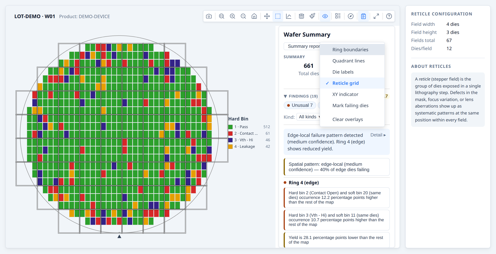
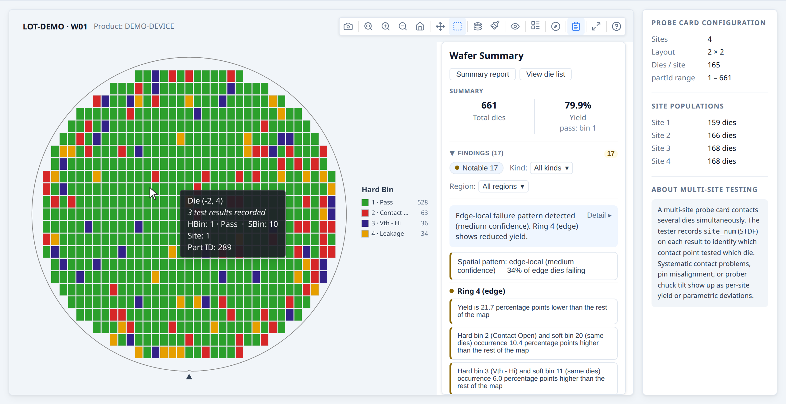

# Developer Guide — Layouts and scale

**Part of the [Developer Guide](../guide.md).**

## Reticle overlays

A reticle (stepper field) is a rectangular group of dies that the lithography
tool exposes in a single step.  The reticle overlay draws the field boundaries on
top of the wafer map and enables reticle-position analysis in the stats engine.

### Adding a reticle overlay

```ts
const result = buildWaferMap({
  results,
  dieConfig:     { width: 10, height: 10 },
  reticleConfig: {
    width:  4,    // 4 dies wide per stepper field
    height: 2,    // 2 dies tall per stepper field
    // anchorDie: { x: 1, y: 0 }  // optional: pin a specific die (die.x/die.y) to a
                                    // field's min-x/min-y corner (bottom-left, since +Y is up)
  },
});

renderWaferMap(container, result);
// showReticle defaults to true when result.reticles is non-empty
```

The toolbar shows a Reticle toggle button whenever `reticles` is non-empty.

Once a `reticleConfig` is set, every die's hover tooltip also gains a
`Reticle (column, row)` line directly below `Die (x, y)`, showing that die's
field-local position (`0`-indexed, relative to `anchorDie`) — independent of
whether the reticle overlay is currently toggled on. This is on by default
with no extra configuration.

### Reticle analysis in the stats engine

When a `reticleConfig` was used, `analyzeWaferMap` automatically includes
reticle-position comparisons (die's position within its stepper field vs. rest of reticle).
This surfaces systematic problems from mask defects, focus variation, or lens
aberrations:

```ts
const result  = buildWaferMap({ results, dieConfig, reticleConfig });
const summary = analyzeWaferMap(result);
// result.reticleConfig is passed through automatically
```

### Reticle overlay in a gallery

Spread the result directly — `r.reticles` is already part of `WaferMapResult`.
The gallery enables the Reticle toggle button automatically when any item has reticles:

```ts
const items = waferResults.map(r => ({ ...r }));
// or with a label:
const items = waferResults.map((r, i) => ({ ...r, label: `W${i + 1}` }));
```
**→ [Demo: Reticle overlays](../examples/reticle.html)**




## Compact layout for multi-project wafers

On a multi-project wafer (MPW) each reticle holds only a few of one product's dies, so the wafer map is mostly empty and
every die is a few pixels wide. The **compact layout** draws the dies on a grid with the empty columns and rows removed
and each group of dies outlined, so the product fills the map.


*The same synthetic wafer: each reticle holds two small groups of dies, so the wafer view is mostly empty. The compact
layout removes the empty rows and columns and outlines each group.*

```ts
renderWaferMap(container, result, {
  viewOptions: { compact: true },
});
```

- **Only the layout changes.** Every die is still drawn and counted, so the legend, yield and every statistic are the
  same as on the wafer view. Hover text and axis labels give original `die.x`/`die.y`.
- **When the toolbar offers it.** The Overlays menu's **Compact layout** row is enabled when the occupied columns and
  rows repeat at a regular pitch (random missing dies do not repeat, so a wafer that merely has holes is not offered
  it). If you pass `reticleConfig`, the dies must repeat at its width and height or a multiple of it (a product on every second reticle repeats at twice the width). `compact: true` applies it regardless.
- **Wafer overlays.** The wafer outline, ring, quadrant and reticle overlays describe the physical wafer and are not
  drawn in this layout. The notch marker and the XY indicator are, and follow rotation and flips.
- **Galleries.** All cards share one layout built from every wafer shown, so wafers compare cell for cell, and a card is
  as tall as its map needs.
- **Axis labels.** `viewOptions: { showAxes: true }` (the Overlays menu's **Axis labels** row) labels the first column
  or row of each group of dies, which marks the reticle boundaries.
- **Layout diagnostics.** The same menu's **Layout diagnostics** row shows what the detector saw as counts and scores
  only (no die positions, bins, values or wafer names), with Copy and Save as file, so someone can report why a layout
  was or was not recognised without sharing their data.

See the [multi-project wafer example](../examples/multi-project-wafer.html).

## Multi-site parallel testing

Modern probers test multiple dies simultaneously using a multi-site probe card. Each
site on the card contacts a different die, and the tester records which site produced
each result via the STDF `site_num` field. Supplying `siteNum` on each `DieResult`
enables per-site analysis in the stats engine: the engine compares yield and bin
distributions across sites, surfacing systematic probe card or prober alignment
problems.

### Supplying site numbers

Pass `siteNum` on each die result — it maps directly from the STDF `site_num` field:

```ts
const results = stdfRows.map(row => ({
  x:       row.x_coord,
  y:       row.y_coord,
  hbin:    row.hard_bin,
  siteNum: row.site_num,   // STDF site_num — which parallel site tested this die
}));

const result = buildWaferMap({ results, passBins: [1] });
```

### Test-site analysis in the stats engine

`analyzeWaferMap` enables test-site analysis automatically when the data contains
meaningful site duplication — at least two distinct `siteNum` values each appearing
on three or more dies (the guard that distinguishes a 4-site probe card from a
monotonically-incrementing counter):

```ts
const summary = analyzeWaferMap(result);
// test-site findings appear automatically when the guard passes

```

Findings compare each site against all other sites, using the same yield, hard-bin,
soft-bin, and test-value analyses as spatial regions. A finding such as:

```
[unusual] Site 3 yield is 14.2 percentage points lower than other test sites
```

points directly to a probe card contact problem on that site.

### Prober step identifier

The STDF `pir.part_id` field records the tester's identifier for each tested unit —
at most fabs this encodes probe sequence (the order in which the prober stepped across
the wafer). Supply it as `partId` to preserve it through the library for traceability
or custom sequential analysis:

```ts
const results = stdfRows.map(row => ({
  x:      row.x_coord,
  y:      row.y_coord,
  hbin:   row.hard_bin,
  siteNum: row.site_num,
  partId:  row.part_id,   // STDF pir.part_id — 1-based tester step identifier
}));
```

`partId` is carried through to every `Die` and appears in hover tooltips alongside
`x`, `y`, and bin assignments. The field is semantically neutral — its exact meaning
is fab-specific — so the library stores it as-is without interpretation.

**→ [Demo: Multi-site parallel testing](../examples/test-sites.html)**



## Processing large datasets with a Web Worker

For lots with many wafers or high die counts, `buildWaferMap` can be moved off the
main thread to avoid blocking the UI.

> **Use the worker for responsiveness, not speed.** The worker runs the same code
> as the main thread, then pays extra to copy the input in and the built dies out
> across `postMessage` (the test values are moved, not copied). In total wall-clock
> time it is **always slower** than calling `buildWaferMap` directly — what you gain
> is that the page stays interactive instead of freezing during a big build. Results
> passed as columns (`DieColumns`) cross without freezing the page; rows are copied
> on the page, which still freezes it for part of the time. Only reach for it when
> a single synchronous build is large enough to cause a visible freeze (roughly
> tens of thousands of dies). Below a few thousand dies it just adds latency; build
> on the main thread. See [§8 in the API reference](../api/worker.md#8-web-worker) for
> indicative timings and the crossover point.

### Setup

```ts
import { createWafermapWorker } from '@wafertools/wafermap/worker';

// Vite / webpack — import the pre-built worker script
import workerUrl from '@wafertools/wafermap/worker-script?url';
const wmWorker = createWafermapWorker(new Worker(workerUrl, { type: 'module' }));

// Plain HTML / CDN
const wmWorker = createWafermapWorker(
  new Worker('https://cdn.jsdelivr.net/npm/@wafertools/wafermap/dist/packages/worker/wafermap.worker.js', { type: 'module' })
);
```

Create the worker once at app startup and reuse it for all calls.

### Replacing `buildWaferMap` with `worker.run`

```ts
// Before:
const result = buildWaferMap({ results, waferConfig, dieConfig });

// After (same input/output, just async):
const result = await wmWorker.run({ results, waferConfig, dieConfig });

// Everything after is unchanged:
renderWaferMap(container, result);
```

### Processing a lot in parallel

```ts
const waferResults = await Promise.all(
  waferIds.map(id => wmWorker.run({
    results:     dataByWafer[id],
    waferConfig: { diameter: 300 },
    dieConfig:   { width: 10, height: 10 },
  }))
);
```

If you also need the analysis summaries, use `runWithAnalysis` instead of `run`
followed by `runAnalysis` — it builds and analyses in one round-trip so the large
result objects are not cloned back into the worker just to be analysed:

```ts
const { results, waferSummaries, lotSummary } = await wmWorker.runWithAnalysis(
  waferIds.map(id => ({ results: dataByWafer[id], dieConfig: { width: 10, height: 10 }, passBins: [1] })),
  {},
  waferIds.length > 1,
);
```

### Cleanup

```ts
// When the app or page unmounts:
wmWorker.terminate();
```

> **Note:** `renderWaferMap` and `renderWaferGallery` require the DOM and must run
> on the main thread. `analyzeWaferMap`/`analyzeWaferLot` and `buildWaferMap` are
> pure functions with no DOM access — they can run in a Web Worker, Node.js, or any
> server-side environment.

**→ [Demo: Processing large datasets with a Web Worker](../examples/worker.html)**

## Die layouts with no test data

For a gross-die-per-wafer count, reticle or step planning, or the expected map before any data
exists, build a layout instead of passing results:

```ts
const layout = buildWaferMap({
  layout: true,
  waferConfig: { diameter: 300, notch: { type: 'bottom' } },
  dieConfig:   { width: 10, height: 10 },
});

layout.dies.length;                 // gross die per wafer: every site lying fully on the wafer
renderWaferMap(container, layout);  // drawn like any other map, every die as no data
```

It needs the diameter and the die size. Orientation, edge exclusion and `reticleConfig` apply
as they do to a map of results. See the [API reference](../api/core.md#41-input) for the details.
