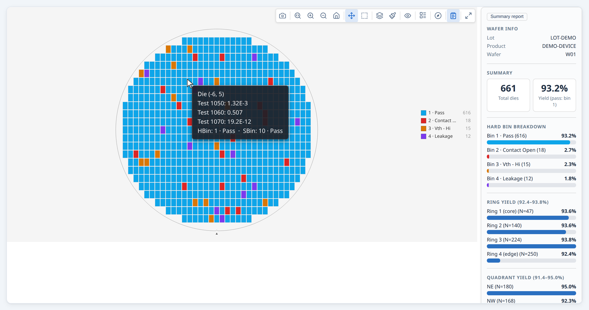

---
hide:
  - navigation
  - toc
---

# wafermap



A JavaScript library for rendering interactive wafer maps from semiconductor test data. Hard bins, soft bins, test values, retest runs, edge exclusion, and spec limits are native inputs — no pre-processing required.

```bash
npm install @paulrobins/wafermap
```

```ts
import { buildWaferMap } from '@paulrobins/wafermap';
import { renderWaferMap } from '@paulrobins/wafermap/canvas-adapter';

const { wafer, dies } = buildWaferMap({ results });
renderWaferMap(document.getElementById('map'), wafer, dies);
```

## What it covers

**Geometry.** Pass full physical dimensions or raw prober step positions — die pitch, wafer diameter, and coordinate origin are inferred when not supplied. Retest policy (`last`, `first`, `best`, `worst`), edge exclusion, and reticle overlays are supported directly.

**Rendering.** `renderWaferMap` produces an interactive canvas map with toolbar, zoom/pan, tooltips, die selection, lot gallery, and summary panel. `renderWaferGallery` renders a full lot as a card grid with shared controls and click-to-expand.

**Analysis.** `analyzeWaferMap` runs spatial analysis across rings, quadrants, sectors, and reticle positions, and detects contiguous failure clusters and edge arcs. `analyzeWaferLot` adds lot-level trend series and cross-wafer patterns. Results wire directly into the summary panel.

**Integration.** Pure ES modules, no server, no runtime dependencies. Works in React, Svelte, Vue, plain HTML, or a Web Worker.

## Documentation

- [User Guide](GUIDE.md) — walkthroughs, usage patterns, and practical integration advice.
- [API Reference](API.md) — the full public API and configuration reference.
- [SvelteKit integration](SVELTEKIT.md)
