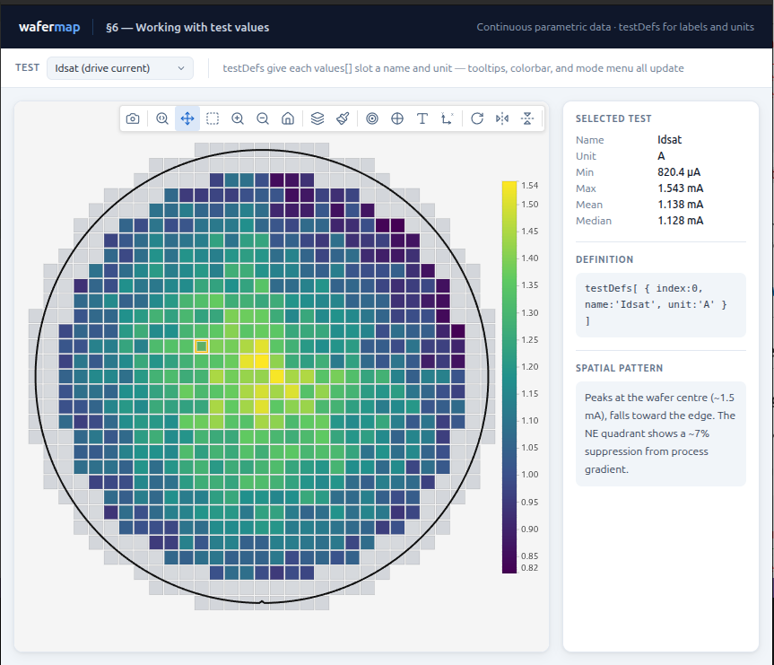

# wafermap



A browser-targeted wafer map visualization library for semiconductor test data. The library's primary renderer uses the HTML Canvas 2D API for high-performance interactive maps; an optional Plotly export is available for SVG/Plotly workflows. wafermap handles real wafer geometry, die grid inference, reticle overlays, and statistical findings.

Install

```bash
npm install @paulrobins/wafermap
```

Quick start

```ts
import { buildWaferMap } from '@paulrobins/wafermap';
import { renderWaferMap } from '@paulrobins/wafermap/canvas-adapter';

const { wafer, dies } = buildWaferMap({ results });
renderWaferMap(document.getElementById('map'), wafer, dies);
```

## Documentation

- [User Guide](GUIDE.md) - walkthroughs, usage patterns, and practical integration advice.
- [API Reference](API.md) - the full public API and configuration reference.
- [Stats (guide & API)](GUIDE.md#10-adding-statistical-findings) — practical usage and [API options](API.md#73-analyzewafermapoptions) for analyzeWaferMap/analyzeWaferLot.

## Live Demos

### Getting started

- [Your first wafer map](examples/01-first-map.html)
- [Loading CSV data](examples/03-csv-data.html)
- [Geometry inference](examples/04-geometry.html)
- [Bins and yield](examples/05-named-bins.html)
- [Test values](examples/06-test-values.html)
- [Retests](examples/07-retests.html)

### Interaction and control

- [Display control](examples/08-display-control.html)
- [Interaction API](examples/09-interaction.html)
- [Lot gallery](examples/12-gallery.html)
- [Web Worker](examples/15-worker.html)
- [Custom colour schemes](examples/16-color-schemes.html)

### Analysis and layout

- [Statistical findings](examples/10-findings.html)
- [Summary panel](examples/11-summary-panel.html)
- [Lot-level findings](examples/13-lot-findings.html)
- [Reticle overlays](examples/14-reticle.html)

### Compatibility and advanced

- [Plotly compatibility](examples/17-plotly.html)
- [Rendering pipeline](examples/18-pipeline.html)

## More

- [SvelteKit integration guide](SVELTEKIT.md)
