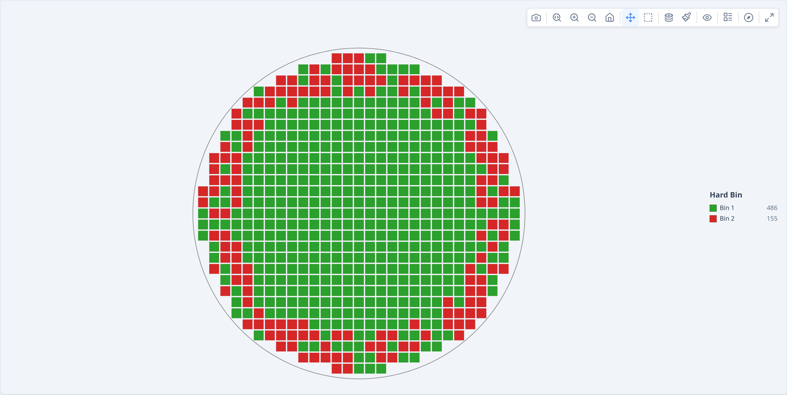

# Quick Start — @paulrobins/wafermap

**For:** developers integrating the library. No wafermap knowledge assumed. **Next:** [Developer Guide](guide.md).

`@paulrobins/wafermap` renders interactive wafer maps from semiconductor die test data — colour-coded by bin or parametric value, with a built-in toolbar, tooltips, and zoom.

## Install

```bash
npm install @paulrobins/wafermap
```

## Minimal example

Copy this into an HTML file and open it in a browser. No bundler required.

```html
<!doctype html>
<html lang="en">
<head>
  <meta charset="utf-8">
  <title>My first wafer map</title>
</head>
<body>
  <!-- A wafer is a circular silicon substrate; dies (individual chips) are arranged in a grid across it. -->
  <!-- Give the container a fixed size — the canvas fills it automatically. -->
  <div id="map" style="width:600px; height:600px;"></div>

  <script type="module">
    import { buildWaferMap }  from 'https://esm.sh/@paulrobins/wafermap';
    import { renderWaferMap } from 'https://esm.sh/@paulrobins/wafermap/render';

    // x, y are integer die grid positions output by the prober — NOT millimetres.
    // hbin is the hard bin: the pass/fail category assigned by the test equipment.
    //
    // Build a synthetic lot with ~640 dies and an edge-ring failure pattern.
    // In production you would load these rows from a CSV or your test data API.
    const results = [];
    for (let x = -14; x <= 14; x++) {
      for (let y = -14; y <= 14; y++) {
        const r = Math.sqrt(x * x + y * y);
        if (r > 14.3) continue;                        // outside wafer boundary
        const h = ((Math.imul(x + 100, 2654435761) ^ Math.imul(y + 100, 2246822519)) >>> 0);
        const edgeFail = r > 11 && (h % 100) < 55;    // edge-ring yield loss
        results.push({ x, y, hbin: edgeFail ? 2 : 1 });
      }
    }
    // results is now an array of objects like:
    //   { x:  0, y:  0, hbin: 1 }   // centre die — pass
    //   { x:  4, y:  3, hbin: 1 }   // mid-wafer  — pass
    //   { x: -14, y:  1, hbin: 2 }  // outer ring — fail

    // buildWaferMap processes die data into a wafer model. Pure function — no DOM access.
    // passBins tells the library which bin numbers count as passing yield.
    const result = buildWaferMap({ results, passBins: [1] });

    // renderWaferMap mounts an interactive canvas into the container div.
    renderWaferMap(document.getElementById('map'), result);
  </script>
</body>
</html>
```

**[Open this example in your browser →](examples/quickstart-live.html)**



## What you just built

The canvas shows your dies colour-coded by bin (green = pass, red = fail by default). The toolbar (top-right) is always shown — use it to switch plot mode, change colour scheme, rotate or flip the wafer, toggle die labels, zoom in, or download a PNG. Hover over any individual die to see a tooltip with its coordinates and bin.

## Partial data needs a wafer centre

The example above passes nothing but die positions, so the library infers the
wafer diameter and centre from the **extent of your data**. That works whenever
the data reaches the true wafer edge — a fully-populated wafer, or a **sparse**
one (skip-sampled or randomly sampled positions missing across the whole face).

It breaks for **partial data** — a contiguous region that stops short of the
edge, such as a half wafer, a single quadrant, or an off-centre cluster.
Inference can't tell that apart from a smaller full wafer, so it picks the wrong
diameter and re-centres the region on its own midpoint.

For partial data, supply the true diameter and the prober coordinate of the
wafer centre:

```js
// Right half of a 300 mm wafer; prober (0,0) is the wafer centre.
const result = buildWaferMap({
  results,
  passBins: [1],
  waferConfig: { diameter: 300, center: { x: 0, y: 0 } },
  dieConfig:   { width: 10, height: 10 },
});
```

If the library detects likely-partial data with no `center`, it adds a structured
warning to `result.warnings` (code `'partial-coverage'`).

## Next steps

- **Load real CSV data** → [guide.md §3](guide.md#3-loading-real-data-from-a-csv)
- **Add a statistical findings panel** → [guide.md §10](guide.md#10-adding-statistical-findings)
- **Show multiple wafers as a gallery** → [guide.md §12](guide.md#12-building-a-lot-gallery)

For the full type and option reference see [api.md](api.md).
