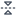

# Wafer Map — User Guide

This guide describes the display and analysis features of the wafer map viewer.
It is written for users who may be semiconductor test engineers, device engineers, and yield engineers
or anyone else who may use a wafer map application — not for developers integrating the wafermap library.

Some features depend on what data the application has loaded (bin names, test
definitions, spec limits, reticle geometry). Where this applies it is noted.

---

## 1. Reading the map

### 1.1 Die grid and coordinates

Each square on the wafer represents one die. The position labels you see — in
tooltips, axis ticks, and selection readouts — are **die grid coordinates**: usually the
X and Y step indices from the prober (integers such as −7, 0, 5). They are not
millimetre values.

These coordinates are always the original grid values. Rotating or flipping the
display does not change the coordinate labels — a die at (3, −2) always reads
(3, −2) regardless of how the wafer is oriented on screen.

### 1.2 Wafer orientation

The notch (shown as a V-notch or flat edge) marks the physical reference edge of
the wafer as configured. Use the **Orientation** toolbar controls to rotate or flip
the display to match your convention; die coordinates are unaffected.

*The same wafer rotated 90°. The notch has moved, but die coordinates — shown in
tooltips — remain their original prober values.*

### 1.3 Die appearance

| Appearance              | Meaning                                                                            |
| ----------------------- | ---------------------------------------------------------------------------------- |
| Solid colour            | Active plot value — bin category or test measurement                               |
| Muted grey at perimeter | Partial die — falls outside the wafer circle boundary                              |
| Neutral grey (interior) | No data — die has no bin or test result in the loaded dataset                      |
| Dimmed fill (interior)  | Edge-excluded die — falls within the edge exclusion band configured for this wafer |

No-data grey and partial-die grey are visually distinct. A no-data die is not a
fail; it simply has no result recorded. Edge-excluded dies are shown dimmed and are
not counted in yield calculations.

### 1.4 Legend and colorbar

**Bin modes** show a discrete colour legend: one swatch per bin, with bin number
and name if the application has supplied bin names.

**Value mode** shows a continuous colorbar: the colour scale runs from the minimum
to maximum value, with units when available. The colorbar is informational only —
clicking it has no effect. To filter by spec status, use the **Colour by spec**
option in the Overlays menu (available when spec limits are defined for the active test).

Clicking a bin swatch in the legend filters the display to that bin
(see [Highlight bin](#3-toolbar-controls)).

---

## 2. Plot modes

The active plot mode determines what the colour of each die represents. Use the
**Plot mode** toolbar dropdown to switch. Available modes depend on what data the
application has loaded.

| Mode                    | Colour represents                                            | Typical use                                    |
| ----------------------- | ------------------------------------------------------------ | ---------------------------------------------- |
| **Hard Bin**            | Physical sort result (hard bin number)                       | Yield categorisation, pass/fail map            |
| **Soft Bin**            | Test-program failure category (soft bin number)              | Failure mode breakdown                         |
| **Test Value**          | A single numeric measurement                                 | Parametric heatmap — leakage, Idsat, Vth, etc. |
| **Stacked Hard Bins**   | Hard bin occurrence counts aggregated across multiple wafers | Lot-level yield patterns                       |
| **Stacked Soft Bins**   | Soft bin occurrence counts aggregated across multiple wafers | Lot-level failure mode patterns                |
| **Stacked Test Values** | Aggregated test values across multiple wafers                | Lot-level parametric trends                    |

Stacked modes are only available on lot-stack maps (multiple wafers combined into
one display). The panel identifies how many wafers were stacked and which
aggregation method is active.

### Test Value mode — colorbar range and spec limits

When spec limits are defined for the active test, two additional display options
become available:

- **Colorbar range — Data / Spec**: switches the colorbar scale between the
  actual data extent and the spec limit bounds. Changing this affects only the
  colour scale; it does not change which dies are flagged as out of spec.
- **Colour by spec**: when active, dies within spec are shown in a pass colour
  and dies outside spec are highlighted — **blue for below the Lower Spec Limit
  (LSL)**, **red for above the Upper Spec Limit (USL)**. Both flags apply
  independently; a die can be flagged on either or both limits.

---

## 3. Toolbar controls

The toolbar appears when you hover over the map (or may be always visible,
depending on the application). Controls that are not applicable to the current
mode are hidden automatically.

### Single map

|                                                               | Control            | Description                                                                                                                                                                                                                  |
| ------------------------------------------------------------- | ------------------ | ---------------------------------------------------------------------------------------------------------------------------------------------------------------------------------------------------------------------------- |
|       | Plot mode          | Switches the active plot mode (see [Section 2](#2-plot-modes)). When multiple tests are available, a test selector appears alongside it.                                                                                     |
|       | Aggregation method | Stacked modes only. Selects how values from multiple wafers are combined per die position: Mean, Median, Std Dev, Min, Max, or Count.                                                                                        |
|   | Overlays           | Check-menu of optional display layers: XY axis indicator, ring boundaries, quadrant lines, die coordinate labels, reticle grid (when geometry is configured), and spec pass/fail highlighting (Test Value mode with limits). |
|    | Colour scheme      | Switches the colour palette used for value and stacked modes. Available schemes depend on what the application has registered.                                                                                               |
|   | Log scale          | Test Value and Stacked Test Values modes only. Applies a log₁₀ scale to the colour mapping. Only active when all displayed values are positive.                                                                              |
|     | Legend style       | Bin modes only. Controls where the bin legend is positioned relative to the map: Default (right), Compact, Left, Top, Bottom, or Floating.                                                                                   |
|   | Rotate 90°         | Rotates the display 90° clockwise. Applies cumulatively. Die coordinates are unaffected.                                                                                                                                     |
|      | Flip horizontal    | Mirrors the display left/right. Die coordinates are unaffected.                                                                                                                                                              |
|      | Flip vertical      | Mirrors the display top/bottom. Die coordinates are unaffected.                                                                                                                                                              |
|   | Zoom mode          | Click and drag to draw a zoom region.                                                                                                                                                                                        |
|     | Zoom in            | Zooms in one step.                                                                                                                                                                                                           |
|    | Zoom out           | Zooms out one step.                                                                                                                                                                                                          |
|      | Reset zoom         | Returns the map to the default fitted view.                                                                                                                                                                                  |
|        | Pan mode           | Click and drag to pan the map.                                                                                                                                                                                               |
|  | Box select         | Click and drag to select a rectangular group of dies (see [Section 4.3](#43-box-select)).                                                                                                                                    |
|     | Expand             | Opens the map full-screen in a modal overlay. Press **Esc** or click outside to close. Useful for detailed inspection without changing the main view.                                                                        |
|   | Save image         | Downloads the current map view as a PNG. Captures the canvas as displayed, including all active overlays and the legend.                                                                                                     |
|   | Summary panel      | Opens or closes the summary panel (see [Section 6](#6-summary-panel)).                                                                                                                                                       |
|       | User guide         | Opens this guide.                                                                                                                                                                                                            |

**Highlight bin** — in bin modes, click any bin swatch in the legend to highlight
that bin and dim all others. Click again to clear. Useful for isolating a specific
failure category across the wafer.

*Bin 2 (Fail) highlighted — all other bins are dimmed.*

### Overlays

Use the **Overlays** menu to toggle optional display layers on and off:

- **XY axis indicator** — shows X and Y axis lines through the wafer centre
- **Ring boundaries** — concentric ring divisions that match the spatial analysis zones
- **Quadrant lines** — divides the wafer into N, S, E, W quadrants
- **Die coordinate labels** — draws the (x, y) grid position inside each die (useful at high zoom)
- **Reticle grid** — stepper field grid (only shown when reticle geometry is configured)
- **Colour by spec** — pass/fail colouring for Test Value mode when spec limits are defined

*Ring boundaries, quadrant lines, and XY indicator all active.*

### Keyboard shortcuts

| Key                    | Action                             |
| ---------------------- | ---------------------------------- |
| **E**                  | Expand the map to full screen      |
| **Esc**                | Close the full-screen modal        |
| **Ctrl / Cmd + click** | Add a die to the current selection |

### Gallery

The gallery control bar applies to all cards simultaneously.

|                                                              | Control       | Description                                           |
| ------------------------------------------------------------ | ------------- | ----------------------------------------------------- |
|      | Plot mode     | Switches the plot mode for all cards.                 |
|  | Overlays      | Toggles display layers for all cards simultaneously.  |
|   | Colour scheme | Switches the colour palette for all cards.            |
|    | Orientation   | Opens the rotate/flip controls, applied to all cards. |
|   | Columns       | Sets the number of columns in the card grid.          |
|  | Save image    | Downloads the full gallery grid as a single PNG.      |
|  | Summary panel | Opens or closes the lot-level summary panel.          |

Click any gallery card to expand it to a full single-wafer view with the complete
single-map toolbar.

---

## 4. Interacting with dies

### 4.1 Hover

Hovering over a die shows a tooltip with:

- Die grid coordinates (x, y)
- Hard bin and/or soft bin (with name, if named)
- Test values for all loaded tests
- Retest count if the die was probed more than once

### 4.2 Zoom and pan

Scroll to zoom in and out. Click and drag to pan when in Pan mode. The toolbar
also provides dedicated **Zoom mode** (drag to draw a zoom region), **Zoom in**,
**Zoom out**, and **Reset zoom** buttons. Tooltips and die selection remain
accurate at all zoom levels.

### 4.3 Box select

Switch to Box select mode in the toolbar, then click and drag to draw a selection
rectangle. The application may display statistics or details for the selected
dies. This is useful for comparing a sub-region against the full wafer.
Use **Ctrl / Cmd + click** to add individual dies to the current selection.
Press **Esc** to clear.

*Box selection: drag to select a rectangular region of dies.*

---

## 5. Findings panel

When spatial analysis has been run, the **Findings** panel lists statistically
detected patterns on the wafer. Open it from the toolbar.

Each finding shows:

- **Severity** — Unusual, Notable, or Info (ordered most to least significant)
- **Description** — plain-language summary of what was detected and where
- **Click to highlight** — clicking a finding highlights the affected dies on
  the map in amber

**Severity** reflects how strong the statistical evidence is. *Unusual* findings
have both a very low adjusted p-value and a large effect size — they are reliably
important. *Notable* findings are statistically significant with a meaningful
effect but not as extreme. *Info* findings pass the significance threshold at
lower strength and are worth reviewing but may reflect smaller or noisier patterns.

*Findings panel open showing a detected edge-ring pattern. Click any row to
highlight the affected dies on the map.*

*Findings panel: click any finding to highlight the affected region on the map.*

*A failure cluster finding: affected dies highlighted in amber.*

### Finding types

| Type                 | What it indicates                                                                                   |
| -------------------- | --------------------------------------------------------------------------------------------------- |
| **Ring**             | Yield or value difference between radial bands — e.g. centre vs edge gradient                       |
| **Quadrant**         | Yield or value difference between N, S, E, or W quadrants                                           |
| **Sector**           | Asymmetry across finer angular slices — rotational bias or directional process variation            |
| **Test-site**        | Yield or value difference between parallel probe sites on the same wafer                            |
| **Reticle position** | Yield signature repeating at specific stepper field grid positions                                  |
| **Cluster**          | Contiguous group of failing dies denser than the background failure rate                            |
| **Edge arc**         | Localised arc of failures near the wafer perimeter                                                  |
| **Spatial pattern**  | Classification of an identified cluster shape — e.g. Donut, Scratch, Centre, Edge-localised, Random |

Which finding types are active depends on the application's analysis
configuration.

When a spatial pattern classification is detected alongside supporting regional
findings (ring, quadrant, sector), the panel groups them together — the pattern
classification is the primary finding and the regional findings provide
supporting detail.

---

## 6. Summary panel

The summary panel shows statistics and metadata for the current wafer or lot.
Open it from the toolbar.

For a **single wafer**, the panel shows:

- Wafer and lot metadata (lot ID, wafer ID, test date — when available)
- Total die count, yield %, and counts of pass, fail, and edge-excluded dies
- Hard bin and soft bin breakdown with percentages
- Per-test descriptive statistics (min, max, mean, std dev, median) when test
  data is loaded
- Spec yield per test when limits are defined — pass die count and yield %
  split by below-limit and above-limit fails
- Findings list — same findings shown in the Findings panel; click to highlight

A **Summary report** button (when present) opens a printable full-detail report
in a new window or tab. The report contains everything shown in the panel —
yield, bin breakdown, ring and quadrant statistics, per-test statistics, and the
full findings list — and can be saved as a PDF from your browser's print dialog.

For **lot-level views** (gallery), the panel shows:

- Lot metadata and wafer count
- Per-wafer yield trend
- Lot-level aggregate bin breakdown
- Cross-wafer comparison findings

---

## 7. Lot-stack maps

A lot-stack map combines multiple individual wafer results into a single
composite view. The display clearly identifies this: the number of wafers
included and the aggregation method in use are shown in the panel header
(for example, "3 wafers · mean") so you know you are not viewing a single
wafer's data.

Individual die coordinates are preserved. For each die grid position, results
from all wafers are aggregated into a single value or bin count according to
the selected aggregation method.

### Stacked plot modes

Switching to a stacked mode changes what each die's colour represents:

| Mode                    | What the colour shows                                                                             |
| ----------------------- | ------------------------------------------------------------------------------------------------- |
| **Stacked Hard Bins**   | For each die position, the count of wafers on which that bin appeared — one card per bin category |
| **Stacked Soft Bins**   | Same as above, for soft bin categories                                                            |
| **Stacked Test Values** | For each die position, an aggregate of the test measurement across all wafers                     |

### Aggregation method

In **Stacked Test Values** mode, use the **Aggregation method** toolbar button (Σ)
to choose how values from each wafer are combined at each die position:

| Method      | Result                                                           |
| ----------- | ---------------------------------------------------------------- |
| **Mean**    | Average value across all wafers                                  |
| **Median**  | Middle value — less sensitive to outliers than mean              |
| **Std Dev** | Standard deviation — shows where values vary most across the lot |
| **Min**     | Lowest value seen at that position                               |
| **Max**     | Highest value seen at that position                              |
| **Count**   | Number of wafers with data at that position                      |

### Gallery stacked modes

In a gallery, stacked modes are always available in the control bar. Switching to
a stacked mode shows one card per bin category or per test parameter, aggregated
across all wafers in the gallery.

*Stacked Hard Bins mode: each die position is coloured by how many wafers had
bin 1 (Pass) or bin 2 (Fail) at that location.*

---

## 8. Reticle overlay

When reticle (stepper field) geometry is configured, the **Reticle grid** overlay
draws the stepper field boundaries on the wafer. Each rectangle represents one
exposure field from the lithography stepper — the group of dies exposed in a
single step. This lets you correlate failure patterns with specific reticle
positions — useful for identifying stepper field signatures, alignment drift, or
mask defects.

Reticle-position findings in the Findings panel highlight the specific field
positions that show elevated failure rates.
