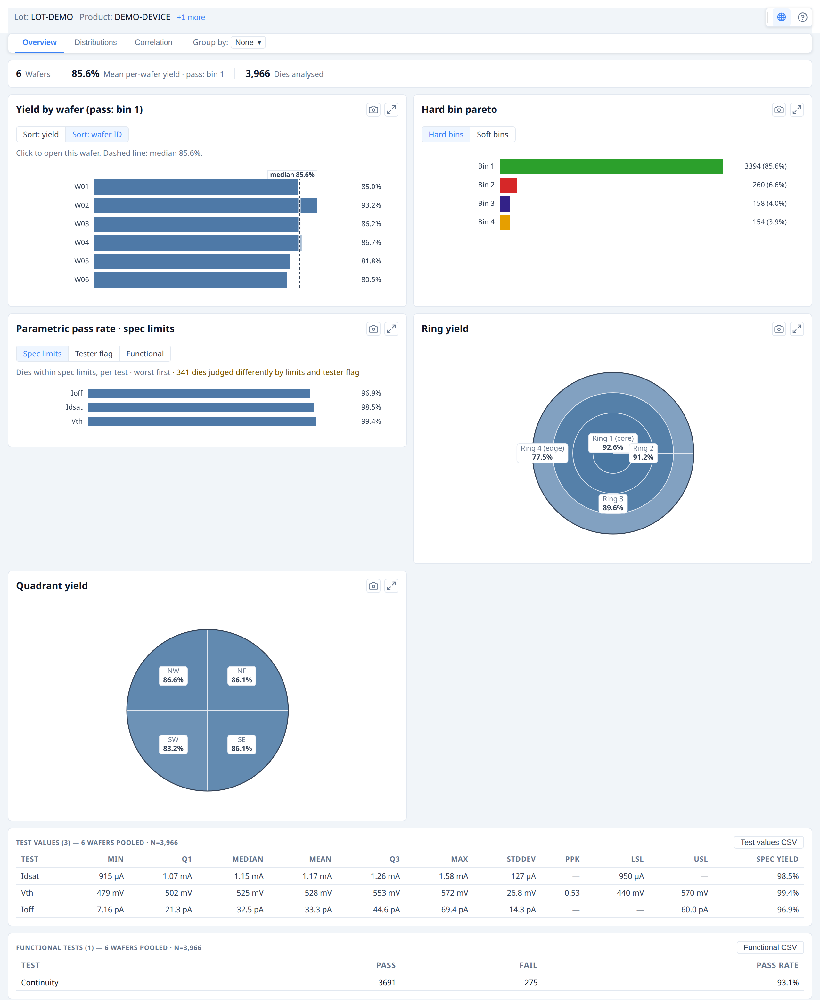
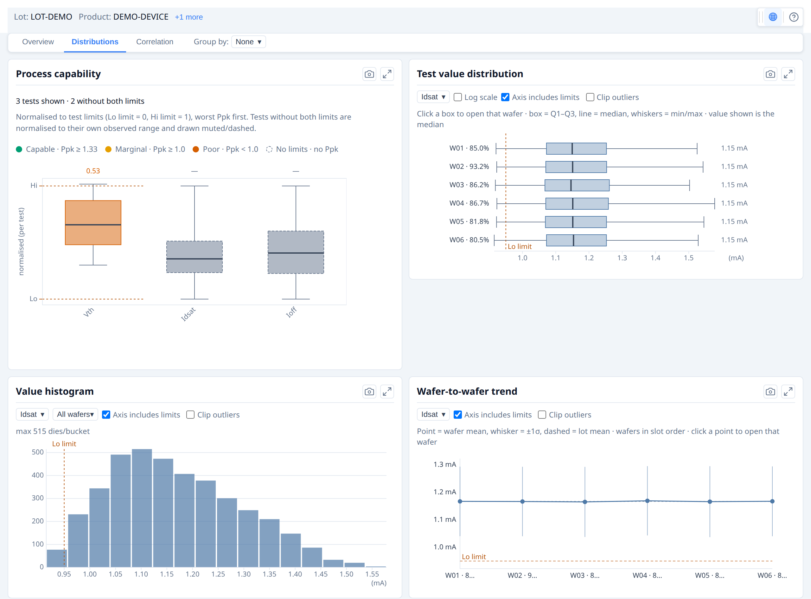
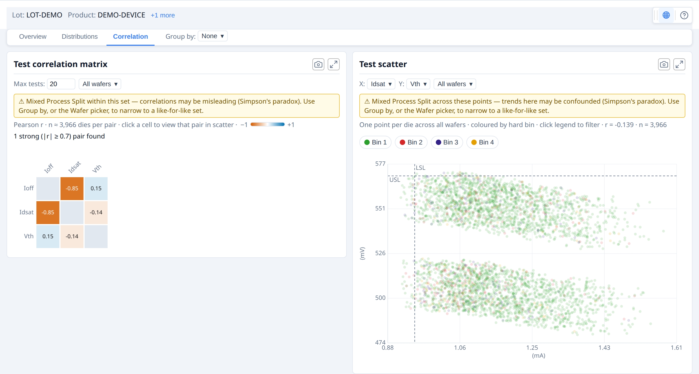

# Wafer Map — User Guide

This guide describes the display and analysis features of the wafer map viewer.
It is written for users who may be semiconductor test engineers, device engineers, and yield engineers
or anyone else who may use a wafer map application — not for developers integrating the wafermap library.

Some features depend on what data the application has loaded (bin names, test
definitions, spec limits, reticle geometry). Where this applies it is noted.

**Getting oriented.** The wafer map is an interactive viewer. A toolbar is always
present at the top-right of the map — use it to change what the colours represent,
toggle overlays, rotate or flip the wafer, zoom, select dies, and open the summary
panel. Hover any die for a tooltip; the panels and tooltips always report the
original die grid coordinates, never the on-screen position after a rotate or flip.

---

## 1. Reading the map

### 1.1 Die grid and coordinates

Each square on the wafer represents one die. The position labels you see — in
tooltips, axis ticks, and selection readouts — are **die grid coordinates**: usually the
X and Y step indices from the prober (integers such as −7, 0, 5). They are not
millimetre values.

These coordinates are always the original grid values. Rotating or flipping the
display does not change the coordinate labels — a die at (3, −2) always reads
(3, −2) regardless of how the wafer is oriented on screen.

### 1.2 Wafer orientation

The notch (shown as a V-notch or flat edge) marks the physical reference edge of
the wafer as configured. Use the **Orientation** toolbar controls to rotate or flip
the display to match your convention; die coordinates are unaffected.

*An example wafer bin map above and below the same wafer rotated 90°. The notch has moved, but die coordinates — shown in tooltips — remain their original grid/prober values.*

### 1.3 Die appearance

| Appearance              | Meaning                                                                            |
| ----------------------- | ---------------------------------------------------------------------------------- |
| Solid colour            | Active plot value — bin category or test measurement                               |
| Muted grey at perimeter | Partial die — falls outside the wafer circle boundary                              |
| Neutral grey (interior) | No data — die has no bin or test result in the loaded dataset                      |
| Dimmed fill (interior)  | Edge-excluded die — falls within the edge exclusion band configured for this wafer |

No-data grey and partial-die grey are visually distinct. A no-data die is not a
fail; it simply has no result recorded. Edge-excluded dies are shown dimmed and are
not counted in yield calculations.

### 1.4 Legend and colorbar

**Bin modes** show a discrete colour legend: one swatch per bin, with bin number
and name if the application has supplied bin names. Passing bins are listed first,
then failing bins from the most dies to the fewest — the same order as the Summary
panel and reports.

**Value mode** shows a continuous colorbar: the colour scale runs from the minimum
to maximum value, with units when available. The colorbar is informational only —
clicking it has no effect. To switch to a pass/fail view, use the **Spec pass/fail**
or **Test pass/fail** option in the Overlays menu (available when spec limits are
defined, or a recorded verdict exists, for the active test).

**Spec pass/fail mode** replaces the colorbar with a small **spec legend**: Pass,
Fail high, and Fail low swatches (only the categories that apply to the test's
limits) with a die count beside each. This judges dies against the test's spec
limits (`limitLow` / `limitHigh`).

**Test pass/fail mode** replaces the colorbar with a **Pass / Fail legend** and die
counts, coloured by the tester's own **recorded** verdict for that test — not a
spec-limit judgement. A test with no measured value (a functional, go/no-go test)
always displays this way; selecting it switches the map into Test pass/fail
automatically, since there is nothing to plot on a gradient.

Every map also shows a short **title** by the colorbar or legend naming what is
displayed — the test name (and number, in spec mode), the bin type, or the stacked
wafer count.

Clicking a bin swatch in the legend filters the display to that bin
(see [Highlight bin](#3-toolbar-controls)).

### 1.5 Wafers and dies with no position data

Not every die necessarily has a reported grid position — some data sources supply bin or test
results with no X/Y coordinates at all, for some or every die on a wafer.

**A fully positionless wafer** never renders as a map or gallery card — showing dies at
fabricated positions would risk being misread as real spatial layout. Instead the card shows a
compact summary matching the active plot mode: a **bin breakdown** (coloured the same as a
positioned card's own bin legend) for hard/soft-bin modes, or a **histogram** for value mode —
coloured through the same colour scheme, log-scale, and spec/data-range settings the map itself
uses, so switching those in the toolbar updates the chart the same way it would a real map. A
**View die list** toggle switches to the full per-die table (position/site, hard bin, soft bin,
every test value) with its own CSV export; **View chart** switches back.

**A mixed wafer** — some dies positioned, some not — renders its normal map for the positioned
dies, plus an expandable **"+N dies without position data"** footer beneath the card. Expanding
it (click the footer or its chevron) shows the same chart/die-list toggle, scoped to just the
unpositioned subset.

The toolbar's spatial-only controls (zoom, pan, box select, save image, orientation, overlays,
legend position) are hidden on a fully positionless card, since there's no map for them to act
on. Plot mode and colour scheme stay available — both still drive what the summary shows.

Findings that depend on physical layout — edge ring, quadrants, sectors, reticle position,
cluster and pattern detection — only ever consider positioned dies, so a positionless wafer
contributes none of these. Everything else — yield, bin counts, per-test statistics, and the
Insights tab's histograms/correlation/scatter — still includes every die, positioned or not.

---

## 2. Plot modes

The active plot mode determines what the colour of each die represents. Use the
**Plot mode** toolbar dropdown to switch. Available modes depend on what data the
application has loaded.

| Mode                    | Colour represents                                            | Typical use                                    |
| ----------------------- | ------------------------------------------------------------ | ---------------------------------------------- |
| **Hard Bin**            | Physical sort result (hard bin number)                       | Yield categorisation, pass/fail map            |
| **Soft Bin**            | Test-program failure category (soft bin number)              | Failure mode breakdown                         |
| **Test Value**          | A single numeric measurement                                 | Parametric heatmap — leakage, Idsat, Vth, etc. |
| **Stacked Hard Bins**   | Hard bin occurrence counts aggregated across multiple wafers | Lot-level yield patterns                       |
| **Stacked Soft Bins**   | Soft bin occurrence counts aggregated across multiple wafers | Lot-level failure mode patterns                |
| **Stacked Test Values** | Aggregated test values across multiple wafers                | Lot-level parametric trends                    |

Stacked modes are only available on lot-stack maps (multiple wafers combined into
one display). The panel identifies how many wafers were stacked and which
aggregation method is active.

### Test Value mode — colorbar range and spec limits

When spec limits are defined for the active test, two additional display options
become available:

- **Colorbar range — Data / Spec**: switches the colorbar scale between the
  actual data extent and the spec limit bounds. This affects only the colorbar's
  range, never how out-of-spec dies are shown. In **both** ranges every die is
  coloured by the gradient so you can read the value distribution, and out-of-spec
  dies are marked with a triangle — pointing **down (▽) for below LSL**, **up (△)
  for above USL** — so they stand out without leaving the distribution. The
  triangle is drawn black or white per die for contrast against its own colour, so
  it stays visible under any colour scheme, and its shape (not colour) carries the
  below/above-limit meaning.
- **Spec pass/fail**: when active, dies within spec are shown in a pass colour
  and dies outside spec are highlighted — **blue for below the Lower Spec Limit
  (LSL)**, **red for above the Upper Spec Limit (USL)**. Both flags apply
  independently; a die can be flagged on either or both limits. A spec legend
  replaces the colorbar, listing each applicable category with its die count.

Some tests have no measured value at all — a continuity check or any other
go/no-go test, where the only result is a recorded pass or fail. Selecting one
of these **functional tests** as the active test switches the map into
**Test pass/fail** automatically: a Pass/Fail legend by die count, coloured by
the tester's own recorded verdict rather than a spec-limit judgement (there is
no gradient to fall back to). **Test pass/fail** is also available as an
Overlays option on an ordinary parametric test when it carries recorded
verdicts, as an alternative to spec-limit judgement.

---

## 3. Toolbar controls

The toolbar sits at the top-right of the map and is always visible. Controls that
are not applicable to the current mode are hidden automatically. (Hovering the map
shows die tooltips — a separate thing from the toolbar, which is always present.)

### Single map

|                                                               | Control            | Description                                                                                                                                                                                                                                                                                            |
| ------------------------------------------------------------- | ------------------ | ------------------------------------------------------------------------------------------------------------------------------------------------------------------------------------------------------------------------------------------------------------------------------------------------------ |
|       | Plot mode          | Switches the active plot mode (see [Section 2](#2-plot-modes)). When multiple tests are available, a test selector appears alongside it.                                                                                                                                                               |
|   | Overlays           | Check-menu of optional display layers: XY axis indicator, ring boundaries, quadrant lines, die coordinate labels, reticle grid (when geometry is configured), Spec pass/fail (Test Value mode with limits), Test pass/fail (Test Value mode, active test is functional or has recorded verdicts), and **Mark failing dies** (bin modes only). **Clear overlays** at the foot turns off everything in the menu at once, and is greyed when nothing is on — so the menu also answers "is anything active?" without you auditing every row. |
|    | Colour scheme      | Picks the colours for the map on screen. In Hard Bin and Soft Bin modes it lists **bin colours** (Default, Colour-blind safe); in every other mode — including the stacked modes, which show values — it lists **value colours**. The two are separate choices, so changing one never resets the other. Value gradients run dark at the low end and bright at the high end, so on a stacked map the healthy wafer sits back and a defect ring or scratch stands out; **Reverse gradient** flips that when the low end is the one you care about. When bin definitions carry their own colours, **Use colours from bin definitions** turns them on or off. (**Mark failing dies** is in Overlays, beside the pass/fail display it belongs with.) |
|   | Log scale          | Test Value and Stacked Test Values modes only. Applies a log₁₀ scale to the colour mapping. Only active when all displayed values are positive. Hidden whenever a pass/fail display is active or the active test is functional.                                                                       |
|  | Colorbar range     | Test Value mode with spec limits only. Toggles the colorbar between the **spec-limit range** (default — the colours mean the same thing on every wafer, so maps are comparable) and the **data range** (stretches the scale to the values actually present, which shows more contrast but is not comparable between wafers). |
|     | Legend style       | Bin modes only. Controls where the bin legend is positioned relative to the map: Default (right), Compact, Left, Top, Bottom, or Floating.                                                                                                                                                             |
|    | Orientation        | Menu of display transforms: **Rotate 90° clockwise** (applies cumulatively), **Flip horizontal**, **Flip vertical**, and **Reset orientation**. These change only how the wafer is drawn — die coordinates in tooltips and labels are always the original values, whatever the orientation. Reset is worth knowing about: rotation and mirroring do not combine in the order you applied them, so undoing a few clicks by clicking again does not reliably get you back — Reset does, and is greyed when you are already there. |
|   | Zoom mode          | Click and drag to draw a zoom region.                                                                                                                                                                                                                                                                  |
|     | Zoom in            | Zooms in one step.                                                                                                                                                                                                                                                                                     |
|    | Zoom out           | Zooms out one step.                                                                                                                                                                                                                                                                                    |
|      | Reset zoom         | Returns the map to the default fitted view.                                                                                                                                                                                                                                                            |
|        | Pan mode           | Click and drag to pan the map.                                                                                                                                                                                                                                                                         |
|  | Box select         | Click and drag to select a rectangular group of dies (see [Section 4.3](#43-box-select)).                                                                                                                                                                                                              |
|   | Insights           | Swaps the map for this wafer's own chart suite — yield, bin breakdown, process capability, and more (see [Section 8](#8-insights-tab)). Only shown when the application has enabled it.                                                                                                                |
|     | Expand             | Opens the map in an enlarged modal overlay. A maximise button in the modal grows it to fill the window (or press **F**). Press **Esc** or click outside to close. Useful for detailed inspection without changing the main view. Works in the Insights view too, where it opens the whole chart suite in a wide modal — useful because those charts interact and are best read side by side. Individual charts also have their own expand button. |
|   | Save image         | Downloads the current map view as a PNG. Captures the canvas as displayed, including all active overlays and the legend.                                                                                                                                                                               |
|   | Findings           | Opens or closes the Summary panel (see [Section 6](#6-summary-panel)).                                                                                                                                                                                                                           |
|    | Data warnings      | Appears **only when there is something to report** about the data behind the map. Click it for the details. A red ⛔ means the map may be positionally wrong — usually that wafer geometry was guessed rather than supplied, so dies may not sit where they appear to. An amber ⚠ means something expected is missing or was skipped, but what is drawn is correct. |
|       | User guide         | Opens this guide.                                                                                                                                                                                                                                                                                      |

**This guide's own window** (and a gallery card detached into its own window,
see [Section 3 — Gallery](#gallery) below) is a floating window, not a modal —
its header shows minimize, maximize, and close buttons, and it can be dragged
and resized by its corner grip. Minimizing collapses it to a small title strip
without closing it; click it again to restore.

**Highlight bin** — in bin modes, click any bin swatch in the legend to highlight
that bin and dim all others. Click again to clear. Useful for isolating a specific
failure category across the wafer.

*Bin 2 (Fail) highlighted — all other bins are dimmed.*

**Bin colours** — a bin's colour tells you whether it passed before you read the legend:
passing bins are always shades of green and failing bins never are, whichever bin numbers
your test program uses. Each bin number keeps its colour: bin 7 is the same colour in every
lot, every gallery and every screenshot, however many dies it holds, so you can learn your
program's colours. Hard and soft bins are coloured separately, so hard bin 3 and soft bin 3
are different colours. A colour scheme has a limited number of colours, so bins far enough
apart in number repeat one — when two of them are on screen together a **Data warnings**
entry names them, and you can tell them apart with the legend, the tooltip, or by
highlighting one bin at a time.

### Overlays

Use the **Overlays** menu to toggle optional display layers on and off:

- **XY axis indicator** — shows X and Y axis lines through the wafer centre
- **Ring boundaries** — concentric ring divisions that match the spatial analysis zones
- **Quadrant lines** — divides the wafer into N, S, E, W quadrants
- **Die coordinate labels** — draws the (x, y) grid position inside each die (useful at high zoom)
- **Reticle grid** — stepper field grid (only shown when reticle geometry is configured)
- **Spec pass/fail** — pass/fail colouring for Test Value mode, judged against spec limits, when the active test defines them
- **Test pass/fail** — pass/fail colouring for Test Value mode, coloured by the tester's recorded verdict; always on for a functional (no measured value) active test

*Ring boundaries, quadrant lines, and XY indicator all active.*

### Keyboard shortcuts

| Key                      | Action                                                  |
| ------------------------ | ------------------------------------------------------- |
| **E**                    | Open the map in an enlarged modal overlay               |
| **F**                    | Maximise / restore the modal (when expanded)            |
| **Esc**                  | Close the expanded modal, or clear the die selection    |
| **Ctrl / Cmd + click**   | Add a die to the current selection                      |
| **Mouse wheel / scroll** | Zoom in and out at the cursor                           |
| **Ctrl / Cmd + `+`** / **`-`** | Zoom in / zoom out                                |
| **Ctrl / Cmd + `0`**     | Reset zoom to the fitted view                           |
| **Arrow keys**           | Pan the map                                             |
| **Space (hold) + drag**  | Temporarily pan without leaving the current tool        |

### Gallery

The gallery control bar applies to all cards simultaneously.

|                                                              | Control       | Description                                                                                                                                                                        |
| ------------------------------------------------------------ | ------------- | ---------------------------------------------------------------------------------------------------------------------------------------------------------------------------------- |
|      | Plot mode     | Switches the plot mode for all cards.                                                                                                                                              |
|  | Overlays      | Toggles display layers for all cards simultaneously.                                                                                                                               |
|   | Colour scheme | Picks bin colours (bin modes) or value colours (other modes) for all cards, including **Reverse gradient**.                                                                                                         |
|    | Orientation   | Opens the rotate/flip controls, applied to all cards.                                                                                                                              |
|   | Columns       | Sets the number of columns in the card grid.                                                                                                                                       |
|  | Save image    | Downloads the full gallery grid as a single PNG.                                                                                                                                   |
|  | Aggregation method | Stacked modes only. Selects how values from multiple wafers are combined per die position: Mean, Median, Std Dev, Min, Max, or Count. |
|  | Log scale     | Test Value and Stacked Test Values modes only. Applies a log₁₀ scale to the colour mapping for all cards. |
|  | Legend style  | **Legend on each map** adds a legend to every card as well as the shared one above the grid (off by default). While it is on, bin modes also let you choose where that legend sits on each card. |
|  | Colorbar range | Test Value mode with spec limits only. Toggles all cards between the spec-limit range and the data range. Leave it on spec limits when comparing wafers — the data range rescales per view. |
|  | Summary panel | Opens or closes the Summary panel covering every wafer in the gallery.                                                                                                           |
|  | Insights      | Swaps the grid for a chart suite covering every wafer — yield, bin breakdown, process capability, and more (see [Section 8](#8-insights-tab)). Only shown when the application has enabled it. |
|  | Data warnings | Appears only when something is worth reporting about the wafers shown. Collected across every wafer and de-duplicated, so a problem affecting all of them is stated once rather than repeated per card. |
|  | User guide    | Opens this guide. |

Click a card's expand button to detach it into its own separate window with the
complete single-map toolbar (falls back to a floating window inside the page if
separate windows aren't available in your environment). The vacated grid card
becomes a placeholder whose own button reattaches it; closing the detached
window does the same.

---

## 4. Interacting with dies

### 4.1 Hover

Hovering over a die shows a compact tooltip. It always includes the die grid
coordinates (x, y), and a retest count if the die was probed more than once.
The rest depends on the active plot mode:

- **Bin modes** — the die's bin verdict (number and name, if named), plus a
  note of how many test values are recorded for the die
- **Test Value mode** — the active test's value in bold, flagged when it is
  out of spec, with the remaining tests summarised as "+N more tests"
- **Stacked modes** — the single aggregated value or count at that position

### 4.2 Zoom and pan

Scroll to zoom in and out. Click and drag to pan when in Pan mode. The toolbar
also provides dedicated **Zoom mode** (drag to draw a zoom region), **Zoom in**,
**Zoom out**, and **Reset zoom** buttons. Tooltips and die selection remain
accurate at all zoom levels.

### 4.3 Box select

Switch to Box select mode in the toolbar, then click and drag to draw a selection
rectangle. The application may display statistics or details for the selected
dies. This is useful for comparing a sub-region against the full wafer.
Use **Ctrl / Cmd + click** to add individual dies to the current selection.
Press **Esc** to clear.

*A block of dies near the centre is shown pre-selected. Choose Box select in the
toolbar and drag to make your own selection, or Ctrl/Cmd + click individual dies.*

---

## 5. Findings panel

When spatial analysis has been run, the **Findings** panel lists statistically
detected patterns on the wafer. Open it from the toolbar.

Each finding shows:

- **Severity** — Unusual, Notable, or Info (ordered most to least significant)
- **Description** — plain-language summary of what was detected and where
- **Click to highlight** — clicking a finding highlights the affected dies on
  the map with a black-and-white outline, visible against every colour scheme

**Severity** reflects how strong the statistical evidence is. *Unusual* findings
have both a very low adjusted p-value and a large effect size — they are reliably
important. *Notable* findings are statistically significant with a meaningful
effect but not as extreme. *Info* findings pass the significance threshold at
lower strength and are worth reviewing but may reflect smaller or noisier patterns.

*Findings panel open showing a detected edge-ring pattern. Click any row to
highlight the affected dies on the map.*

*A failure cluster finding: affected dies highlighted with a white-and-black outline.*

### Finding types

| Type                 | What it indicates                                                                                   |
| -------------------- | --------------------------------------------------------------------------------------------------- |
| **Ring**             | Yield or value difference between radial bands — e.g. centre vs edge gradient                       |
| **Quadrant**         | Yield or value difference between N, S, E, or W quadrants                                           |
| **Sector**           | Asymmetry across finer angular slices — rotational bias or directional process variation            |
| **Test-site**        | Yield or value difference between parallel probe sites on the same wafer                            |
| **Reticle position** | Yield signature repeating at specific stepper field grid positions                                  |
| **Cluster**          | Contiguous group of failing dies denser than the background failure rate                            |
| **Edge arc**         | Localised arc of failures near the wafer perimeter                                                  |
| **Spatial pattern**  | Classification of an identified cluster shape — e.g. Donut, Scratch, Centre, Edge-localised, Random |

Which finding types are active depends on the application's analysis
configuration.

When a spatial pattern classification is detected alongside supporting regional
findings (ring, quadrant, sector), the panel groups them together — the pattern
classification is the primary finding and the regional findings provide
supporting detail.

---

## 6. Summary panel

The Summary panel docks next to the map and gives you the wafer or lot at a
glance, with findings sitting directly under the headline numbers so a clicked
finding can highlight the affected dies right there. Open it from the toolbar.

*The Summary panel open alongside a single wafer. Click any finding to
highlight the affected dies.*

Sections, top to bottom:

- **Summary** — die and wafer counts, yield, and the population the rest of the
  panel is computed over. For several wafers the heading names them: **Lot
  LOT123 · 13 wafers** when every wafer comes from that one lot, otherwise
  **26 wafers from 2 lots** (or just **13 wafers** when the data records no lot).
  The panel only says "lot" when it really is one lot. "Mean wafer yield" is an
  *unweighted* mean of each wafer's own yield; it is deliberately not the same
  statistic as the bin breakdown's pass-bin share, which weights every die
  equally. The two agree only when die counts are even across the wafers.
- **Findings** — detected anomalies, most severe first. Severity chips narrow
  the list; Kind and Region dropdowns appear once there are enough findings to
  be worth narrowing.
- **Bin breakdown** — bars as a share of dies, pass bins first and then failing
  bins by descending count, so the dominant failure mode is at the top. It
  follows the map's plot mode: a soft-bin map gets a soft-bin breakdown. When a
  wafer carries both bin types, a **Hard / Soft** selector in the section header
  overrides that.
- **Region yield** — ring yield by default, with a **Ring / Quadrant** selector.
  Ring is the default because edge roll-off is the pattern that dominates real
  wafer maps; a genuinely asymmetric quadrant is reported as a finding above,
  with a significance test behind it.
- **Wafer yield** (several wafers only) — one bar per wafer with the median
  marked. Wafers are in slot order by default, since that is what makes a
  slot-correlated pattern visible; a **Slot / Yield** selector re-sorts. Wafers
  far below the rest are labelled "low outlier".
- **Test values** — per test: mean, **Ppk**, and spec yield. Ppk (not Cpk)
  because it measures against the *overall* spread, including wafer-to-wafer
  variation, which is what the dies actually ship against. The full descriptive
  statistics — min, quartiles, median, max, σ, both spec limits, and all four
  capability indices — are in the summary report and the CSV export.
- **Functional tests** — pass/fail counts and pass rate per functional test.

Every section header can be collapsed, and stays collapsed as the panel
re-renders.

A **Summary report** button (when present) opens a printable full-detail
report — yield, bin breakdown, ring and quadrant statistics, the full per-test
table with Cp/Cpk/Pp/Ppk, and the findings list — and can be saved as a PDF
from your browser's print dialog.

### Why some findings name two bins

A finding may read **"hard bin and soft bin 3 (Fail) (same dies)"**. That is one
group of dies counted in two bin spaces, not two separate groups added together.
(When the two bins carry different names, both are spelled out in full.)
Hard and soft bins are independent numbering systems, so this wording appears
only when the two happen to cover exactly the same dies — reporting it twice
would look like two independent problems.

For the same reason, when a single pass bin is configured you will see the
**yield** finding for a region but not a separate finding for the pass bin
itself: "pass-bin occurrence is 22 points lower" and "yield is 22 points lower"
are the same sentence.

Nothing is discarded — an application reading the findings programmatically
still receives every one of them.

For **lot-level views** (gallery), the panel shows lot-level findings, and the
**Wafer Yield** section badges each wafer with its own findings count — click a
row to open that wafer. There is no separate wafers tab: every wafer appears in
that one list, including the ones with no findings, which is what lets you see a
low-yielding wafer that nothing flagged.

---

## 7. Lot-stack maps

A lot-stack map combines multiple individual wafer results into a single
composite view. The display clearly identifies this: the number of wafers
included and the aggregation method in use are shown in the panel header
(for example, "3 wafers · mean") so you know you are not viewing a single
wafer's data.

Individual die coordinates are preserved. For each die grid position, results
from all wafers are aggregated into a single value or bin count according to
the selected aggregation method.

### Stacked plot modes

Switching to a stacked mode changes what each die's colour represents:

| Mode                    | What the colour shows                                                                             |
| ----------------------- | ------------------------------------------------------------------------------------------------- |
| **Stacked Hard Bins**   | For each die position, the count of wafers on which that bin appeared — one card per bin category |
| **Stacked Soft Bins**   | Same as above, for soft bin categories                                                            |
| **Stacked Test Values** | For each die position, an aggregate of the test measurement across all wafers                     |

### Aggregation method

In **Stacked Test Values** mode, use the **Aggregation method** toolbar button (Σ)
to choose how values from each wafer are combined at each die position:

| Method      | Result                                                           |
| ----------- | ---------------------------------------------------------------- |
| **Mean**    | Average value across all wafers                                  |
| **Median**  | Middle value — less sensitive to outliers than mean              |
| **Std Dev** | Standard deviation — shows where values vary most across the lot |
| **Min**     | Lowest value seen at that position                               |
| **Max**     | Highest value seen at that position                              |
| **Count**   | Number of wafers with data at that position                      |

### Gallery stacked modes

In a gallery, stacked modes are always available in the control bar. Switching to
a stacked mode shows one card per bin category or per test parameter, aggregated
across all wafers in the gallery.

*Stacked Hard Bins mode: each die position is coloured by how many wafers had
bin 1 (Pass) or bin 2 (Fail) at that location.*

---

## 8. Insights tab

The **Insights** toolbar button (single map or gallery) swaps the wafer view
for a chart suite computed from the same die data — without leaving the
toolbar. Click it again to return to the map. Independent of the Findings
sidebar (Section 6) — the two toggle independently, and opening one never
hides the other's toolbar button, since Findings has nothing to highlight
against once the map is replaced.

Insights is organized into three sub-tabs:

- **Overview** — a **test pass rate** chart showing which test fails most (and,
  with "Group by" active, whether it fails more in one split than another). It
  offers up to three ways of judging, whichever the data supports: **Spec
  limits** (the value against its limits), **Tester flag** (the pass/fail the
  tester itself recorded, which a parametric test carries whether or not limits
  were exported), and **Functional** for pass/fail-only tests. The two
  parametric views can disagree — guard bands and dynamic limits routinely cause
  it — so the card reports how many dies the two judged differently rather than
  picking one for you. Alongside it, headline tiles stating the population (wafers, dies analysed,
  and for a lot the mean wafer yield — an *unweighted* mean of each wafer's own
  yield, not the die-weighted figure), a yield bar labelled with the pass bins
  actually in use and marked with the median, a hard/soft bin pareto, and
  ring/quadrant regional yield plus the full per-test statistics table.
- **Distributions** — process capability (Cp/Cpk/Pp/Ppk for tests with both a
  lower and upper spec limit; tests missing a spec still appear, normalized
  onto their own range and sorted by variability), a test-value box plot, a
  value histogram, and a **wafer-to-wafer trend** — one point per wafer at its
  mean, ±1σ whiskers, the mean of all wafers dashed across (labelled the "lot
  mean" when they all come from one lot), and spec limits where the
  test has them. The trend is always in slot order, deliberately: drift across
  a cassette only reads in the physical sequence, so there is no sort control
  to destroy it. Clicking a capability box drives the box plot, histogram and
  trend onto that same test automatically.

  The box plot, histogram and trend share one row of axis controls, kept in
  sync across all three so switching between them never re-reads the same
  data on a different scale: **Axis includes limits** widens the axis to cover
  LSL/USL even where the data sits well clear of them (on by default only when
  doing so still leaves the data at least a third of the axis — otherwise a
  generous spec window would squash a perfectly capable distribution into a
  sliver), and **Clip outliers** narrows the axis to a robust range (the
  Tukey fence, 1.5× IQR beyond Q1/Q3) so a handful of extreme values don't
  stretch the axis until the rest of the distribution reads as a flat line.
  Clipping affects the AXIS only — every reported statistic (mean, σ, Cpk,
  the box's own five-number summary) is computed from every value; nothing is
  excluded from the numbers, and the panel states how many points sit outside
  the visible range when some do. The box plot additionally has its own
  **Log scale** toggle, independent of the shared pair above (available once
  every plotted value is positive) — the histogram and trend charts do not
  offer one.
- **Correlation** — a test-to-test correlation matrix and a die-level scatter
  plot, both stating the sample size the coefficients are computed over.
  Clicking a matrix cell drives the scatter plot onto that pair, where `r` and
  `n` for that pair are printed and update as you filter the legend.

In a gallery with more than one wafer, a **Group by** control appears whenever
wafer metadata (lot, product, test program, temperature, split, or a custom
field) actually varies across the loaded wafers — grouping pools or restricts
each panel differently depending on what makes sense for that chart type.
Histogram, correlation, and scatter also offer a **Wafer** picker to narrow
from "all wafers pooled" down to one wafer at a time. Clicking a yield bar or
box-plot row for one wafer opens that wafer's own map — a box-plot click opens
directly on the test you were looking at.

*Insights tab open on a single wafer, Overview sub-tab: yield and bin pareto,
ring/quadrant yield, and per-test statistics — all computed from this wafer's
own dies. The Distributions sub-tab has process capability, a test-value box
plot and histogram; Correlation has a correlation matrix with scatter plot.
In a gallery, Overview also gains a "Group by" control and per-wafer
yield/box-plot rows.*

*Gallery Insights, Overview sub-tab: lot-wide yield by wafer (click a bar to
open that wafer's map), hard/soft bin pareto, ring and quadrant yield, and
pooled per-test statistics. The "‹ Gallery" tab returns to the card grid.*

*Distributions sub-tab: process capability (coloured by Ppk — green capable,
orange marginal, red poor; tests without spec limits are muted and dashed), a
per-wafer test-value box plot, and a value histogram. Clicking a capability
box drives the box plot and histogram onto that test.*

*Correlation sub-tab: test-to-test Pearson correlation matrix (blue =
positive, orange = negative; intensity = strength) and a die-level scatter
plot coloured by hard bin. Clicking a matrix cell drives the scatter plot
onto that pair.*

### Exporting a chart

Every chart panel has a **camera** button that saves the current view as a PNG at the displayed
resolution. To get a clean full-resolution render, use the panel's expand (corner-arrows)
button first to open it in the fullscreen modal, then click the camera button.

Each exported PNG includes a header strip above the chart with the panel title, source
filename, wafer and die counts, the active test name (where applicable), and the time of
export. The live card is unchanged — the header appears only in the saved file.

---

## 9. Reticle overlay

When reticle (stepper field) geometry is configured, the **Reticle grid** overlay
draws the stepper field boundaries on the wafer. Each rectangle represents one
exposure field from the lithography stepper — the group of dies exposed in a
single step. This lets you correlate failure patterns with specific reticle
positions — useful for identifying stepper field signatures, alignment drift, or
mask defects.

Reticle-position findings in the Findings panel highlight the specific field
positions that show elevated failure rates. Hovering any die also shows its
**Reticle (column, row)** position — its location within its own stepper
field — just below the die's coordinate in the tooltip.
