# Wafer Map — User Guide

This guide describes the display and analysis features of the wafer map viewer.
It is written for users who may be semiconductor test engineers, device engineers, and yield engineers
or anyone else who may use a wafer map application — not for developers integrating the wafermap library.

Some features depend on what data the application has loaded (bin names, test
definitions, test limits, reticle geometry). Where this applies it is noted.

**Getting oriented.** The wafer map is an interactive viewer. A toolbar is always
present above the map, at the right of its title row — use it to change what the colours represent,
toggle overlays, rotate or flip the wafer, zoom, select dies, and open the summary
panel. Hover any die for a tooltip; the panels and tooltips always report the
original die grid coordinates, never the on-screen position after a rotate or flip.

---

## 1. Reading the map

### 1.1 Die grid and coordinates

Each square on the wafer represents one die. The position labels you see — in
tooltips, axis ticks, and selection readouts — are **die grid coordinates**: usually the
X and Y step indices from the prober (integers such as −7, 0, 5). They are not
millimetre values.

These coordinates are always the original grid values. Rotating or flipping the
display does not change the coordinate labels — a die at (3, −2) always reads
(3, −2) regardless of how the wafer is oriented on screen.

### 1.2 Wafer orientation

The notch (shown as a V-notch or flat edge) marks the physical reference edge of
the wafer as configured. Use the **Orientation** toolbar controls to rotate or flip
the display to match your convention; die coordinates are unaffected. The first rotate
or flip also switches on the **XY indicator** (the +X/+Y arrows in the Overlays menu), so
you can see which way the die coordinates now run. It stays on until you switch it off
there; **Reset orientation** leaves it as it is.

*An example wafer bin map above and below the same wafer rotated 90°. The notch has moved, but die coordinates — shown in tooltips — remain their original grid/prober values.*

### 1.3 Die appearance

| Appearance              | Meaning                                                                            |
| ----------------------- | ---------------------------------------------------------------------------------- |
| Solid colour            | Active plot value — bin category or test measurement                               |
| Neutral grey (interior) | No data — die has no bin or test result in the loaded dataset                      |
| Dimmed fill (interior)  | Edge-excluded die — falls within the edge exclusion band configured for this wafer |

A no-data die is not a fail; it simply has no result recorded. Edge-excluded dies are shown dimmed and are
not counted in yield calculations.

### 1.4 Legend and colorbar

**Bin modes** show a discrete colour legend: one swatch per bin, with bin number
and name if the application has supplied bin names. Passing bins are listed first,
then failing bins from the most dies to the fewest — the same order as the Summary
panel and reports.

**Value mode** shows a continuous colorbar: the colour scale runs from the minimum
to maximum value, with units when available. The colorbar is informational only —
clicking it has no effect. To switch to a pass/fail view, use the **Limit pass/fail**
or **Test pass/fail** option in the Overlays menu (available when test limits are
defined, or a recorded verdict exists, for the active test).

**Limit pass/fail mode** replaces the colorbar with a small legend: Pass,
Fail high, and Fail low swatches (only the categories that apply to the test's
limits) with a die count beside each. This judges dies against the test's lower
and upper test limits.

**Test pass/fail mode** replaces the colorbar with a **Pass / Fail legend** and die
counts, coloured by the tester's own **recorded** verdict for that test — not a
limit judgement. A test with no measured value (a functional, go/no-go test)
always displays this way; selecting it switches the map into Test pass/fail
automatically, since there is nothing to plot on a gradient.

Every map also shows a short **title** by the colorbar or legend naming what is
displayed — the test name (and number, in limit pass/fail mode), the bin type, or the stacked
wafer count.

Clicking a bin swatch in the legend filters the display to that bin: every other bin is
greyed out. **Ctrl / Cmd + click** adds or removes further bins, so several can be shown
together. Clicking the only bin shown again clears the filter
(see [Highlight bin](#3-toolbar-controls)).

### 1.5 Wafers and dies with no position data

Not every die necessarily has a reported grid position — some data sources supply bin or test
results with no X/Y coordinates at all, for some or every die on a wafer.

**A fully positionless wafer** never renders as a map or gallery card — showing dies at
fabricated positions would risk being misread as real spatial layout. Instead the card shows a
compact summary matching the active plot mode: a **bin breakdown** (coloured the same as a
positioned card's own bin legend) for hard/soft-bin modes, or a **histogram** for value mode —
coloured through the same colour scheme, log-scale, and spec/data-range settings the map itself
uses, so switching those in the toolbar updates the chart the same way it would a real map. A
**View die list** toggle switches to the full per-die table (position/site, hard bin, soft bin,
every test value) with its own CSV export; **View chart** switches back.

**A mixed wafer** — some dies positioned, some not — renders its normal map for the positioned
dies, plus an expandable **"+N dies without position data"** footer beneath the card. Expanding
it (click the footer or its chevron) shows the same chart/die-list toggle, scoped to just the
unpositioned subset.

The toolbar's spatial-only controls (zoom, pan, box select, save image, orientation, overlays,
legend position) are hidden on a fully positionless card, since there's no map for them to act
on. Plot mode and colour scheme stay available — both still drive what the summary shows.

Findings that depend on physical layout — edge ring, quadrants, sectors, reticle position,
cluster and pattern detection — only ever consider positioned dies, so a positionless wafer
contributes none of these. Everything else — yield, bin counts, per-test statistics, and the
Insights tab's histograms/correlation/scatter — still includes every die, positioned or not.

---

## 2. Plot modes

The active plot mode determines what the colour of each die represents. Use the
**Plot mode** toolbar dropdown to switch. Available modes depend on what data the
application has loaded.

| Mode                    | Colour represents                                            | Typical use                                    |
| ----------------------- | ------------------------------------------------------------ | ---------------------------------------------- |
| **Hard Bin**            | Physical sort result (hard bin number)                       | Yield categorisation, pass/fail map            |
| **Soft Bin**            | Test-program failure category (soft bin number)              | Failure mode breakdown                         |
| **Test Value**          | A single numeric measurement                                 | Parametric heatmap — leakage, Idsat, Vth, etc. |
| **Stacked Hard Bins**   | Hard bin occurrence counts aggregated across multiple wafers | Lot-level yield patterns                       |
| **Stacked Soft Bins**   | Soft bin occurrence counts aggregated across multiple wafers | Lot-level failure mode patterns                |
| **Stacked Test Values** | Aggregated test values across multiple wafers                | Lot-level parametric trends                    |

Stacked modes are only available on lot-stack maps (multiple wafers combined into
one display). The panel identifies how many wafers were stacked and which
aggregation method is active.

### Test Value mode — colorbar range and test limits

When test limits are defined for the active test, two additional display options
become available:

- **Colorbar range — Data / Limits**: switches the colorbar scale between the
  actual data extent and the test limits. This affects only the colorbar's
  range, never how failing dies are shown. In **both** ranges every die is
  coloured by the gradient so you can read the value distribution, and dies
  outside the test limits are marked with a triangle — pointing **down (▽) for below the low limit**, **up (△)
  for above the high limit** — so they stand out without leaving the distribution. The
  triangle is drawn black or white per die for contrast against its own colour, so
  it stays visible under any colour scheme, and its shape (not colour) carries the
  below/above-limit meaning.
- **Limit pass/fail**: when active, dies within the test limits are shown in
  a pass colour and dies outside them are highlighted — **blue for below the
  low limit**, **red for above the high limit**. Both flags apply
  independently; a die can be flagged on either or both limits. A Pass/Fail legend
  replaces the colorbar, listing each applicable category with its die count.

Some tests have no measured value at all — a continuity check or any other
go/no-go test, where the only result is a recorded pass or fail. Selecting one
of these **functional tests** as the active test switches the map into
**Test pass/fail** automatically: a Pass/Fail legend by die count, coloured by
the tester's own recorded verdict rather than a limit judgement (there is
no gradient to fall back to). **Test pass/fail** is also available as an
Overlays option on an ordinary parametric test when it carries recorded
verdicts, as an alternative to limit judgement.

---

### Derived tests (†)

A test name marked **†** in front is a *derived* test: its value was calculated
from other tests on the same die — a difference, a ratio, a margin — rather
than measured by the tester. It behaves like any other test: you can map it,
chart it and find patterns in it.

The dagger appears wherever the test is named — the map title, tooltips, the
plot-mode test list, Insights charts and their test pickers, findings, the
Summary panel, the die list and reports — always in front of the name, so in a
list the derived tests line up in a column down the left edge. The words
**† Derived, not measured** always appear nearby. Hovering over a derived
value, or reading the key line under a table or findings list, shows the
expression it was computed from, e.g. `t[1020] - t[1010]`. The numbers in
square brackets are the test numbers it reads. In a CSV export the expression
appears in a **Derived from** column instead.

## 3. Toolbar controls

The toolbar sits above the map, at the right of its title row (each card in a gallery has its own), and is always visible. Controls that
are not applicable to the current mode are hidden automatically. (Hovering the map
shows die tooltips — a separate thing from the toolbar, which is always present.)

### Single map

|                                                               | Control            | Description                                                                                                                                                                                                                                                                                            |
| ------------------------------------------------------------- | ------------------ | ------------------------------------------------------------------------------------------------------------------------------------------------------------------------------------------------------------------------------------------------------------------------------------------------------ |
|       | Plot mode          | Switches the active plot mode (see [Section 2](#2-plot-modes)). When multiple tests are available, a test selector appears alongside it.                                                                                                                                                               |
|   | Overlays           | Check-menu of optional display layers: axis labels, XY axis indicator, ring boundaries, quadrant lines, die coordinate labels, reticle grid (when geometry is configured), Limit pass/fail (Test Value mode with limits), Test pass/fail (Test Value mode, active test is functional or has recorded verdicts), and **Mark failing dies** (bin modes only). **Compact layout** and **Layout diagnostics** sit at the top of the menu (see [Compact layout](#compact-layout)). **Clear overlays** at the foot turns off everything in the menu at once, and is greyed when nothing is on — so the menu also answers "is anything active?" without you auditing every row. |
|    | Colour scheme      | Picks the colours for the map on screen. In Hard Bin and Soft Bin modes it lists **bin colours** (Default, Colour-blind safe); in every other mode — including the stacked modes, which show values — it lists **value colours**. The two are separate choices, so changing one never resets the other. Value gradients run dark at the low end and bright at the high end, so on a stacked map the healthy wafer sits back and a defect ring or scratch stands out; **Reverse gradient** flips that when the low end is the one you care about. When bin definitions carry their own colours, **Use colours from bin definitions** turns them on or off. (**Mark failing dies** is in Overlays, beside the pass/fail display it belongs with.) |
|   | Log scale          | Test Value and Stacked Test Values modes only. Applies a log₁₀ scale to the colour mapping. Only active when all displayed values are positive. Hidden whenever a pass/fail display is active or the active test is functional.                                                                       |
|  | Colorbar range     | Test Value mode with test limits only. Toggles the colorbar between the **limit range** (default — the colours mean the same thing on every wafer, so maps are comparable) and the **data range** (stretches the scale to the values actually present, which shows more contrast but is not comparable between wafers). |
|     | Legend style       | Bin modes only. Controls where the bin legend is positioned relative to the map: Default (right), Compact, Left, Top, Bottom, or Floating.                                                                                                                                                             |
|    | Orientation        | Menu of display transforms: **Rotate 90° clockwise** (applies cumulatively), **Flip horizontal**, **Flip vertical**, and **Reset orientation**. The first rotate or flip also switches on the XY indicator (see Overlays), which stays on until you switch it off. These change only how the wafer is drawn — die coordinates in tooltips and labels are always the original values, whatever the orientation. Reset is worth knowing about: rotation and mirroring do not combine in the order you applied them, so undoing a few clicks by clicking again does not reliably get you back — Reset does, and is greyed when you are already there. |
|   | Zoom mode          | Click and drag to draw a zoom region.                                                                                                                                                                                                                                                                  |
|     | Zoom in            | Zooms in one step.                                                                                                                                                                                                                                                                                     |
|    | Zoom out           | Zooms out one step.                                                                                                                                                                                                                                                                                    |
|      | Reset zoom         | Returns the map to the default fitted view.                                                                                                                                                                                                                                                            |
|        | Pan mode           | Click and drag to pan the map.                                                                                                                                                                                                                                                                         |
|  | Box select         | Click and drag to select a rectangular group of dies (see [Section 4.3](#43-box-select)). This is the mode a map opens in.                                                                                                                                                                             |
|  | Chart | Opens a menu of charts drawn from the selected dies, or from the whole wafer when nothing is selected (see [Section 4.4](#44-charting-dies-and-wafers)). Only shown when there is something to chart. |
|     | Expand             | Opens the map in an enlarged modal overlay. Opening the Summary panel in it widens the modal by the panel's width, so the map keeps its size. A maximise button in the modal grows it to fill the window (or press **F**). Press **Esc** or click outside to close. Useful for detailed inspection without changing the main view. Works in the Insights view too, where it opens the whole chart suite in a wide modal — useful because those charts interact and are best read side by side. Individual charts also have their own expand button. |
|   | Save image         | Downloads the current map view as a PNG. Captures the canvas as displayed, including all active overlays and the legend.                                                                                                                                                                               |
|   | Findings           | Opens or closes the Summary panel (see [Section 6](#6-summary-panel)).                                                                                                                                                                                                                           |
|    | Data warnings      | Appears **only when there is something to report** about the data behind the map. Click it for the details. A red ⛔ means the map may be positionally wrong — usually that wafer geometry was guessed rather than supplied, so dies may not sit where they appear to. An amber ⚠ means something expected is missing or was skipped, but what is drawn is correct. |
|       | User guide         | Opens this guide.                                                                                                                                                                                                                                                                                      |

**This guide's own window** (and a gallery card detached into its own window,
see [Section 3 — Gallery](#gallery) below) is a floating window, not a modal —
its header shows collapse, maximize, and close buttons, and it can be dragged
and resized by its corner grip. Collapse shrinks it to a small title strip
without closing it; click the same button (now **Show contents**) to restore it.
While the window is maximized only restore and close are shown.

**Highlight bin** — in bin modes, click any bin swatch in the legend to highlight
that bin and dim all others. Click again to clear. Useful for isolating a specific
failure category across the wafer.

*Bin 2 (Fail) highlighted — all other bins are dimmed.*

**Bin colours** — a bin's colour tells you whether it passed before you read the legend:
passing bins are always shades of green and failing bins never are, whichever bin numbers
your test program uses. Each bin number keeps its colour: bin 7 is the same colour in every
lot, every gallery and every screenshot, however many dies it holds, so you can learn your
program's colours. Hard and soft bins are coloured separately, so hard bin 3 and soft bin 3
are different colours. A colour scheme has a limited number of colours, so bins far enough
apart in number repeat one — when two of them are on screen together a **Data warnings**
entry names them, and you can tell them apart with the legend, the tooltip, or by
highlighting one bin at a time.

### Overlays

Use the **Overlays** menu to toggle optional display layers on and off:

- **Axis labels** — the die coordinates along the bottom and left edges. They appear when you zoom; this row shows
  them all the time, or hides them. **Clear overlays** returns to showing them on zoom
- **XY axis indicator** — shows X and Y axis lines through the wafer centre
- **Ring boundaries** — concentric ring divisions that match the spatial analysis zones
- **Quadrant lines** — divides the wafer into N, S, E, W quadrants
- **Die coordinate labels** — draws the (x, y) grid position inside each die (useful at high zoom)
- **Reticle grid** — stepper field grid (only shown when reticle geometry is configured)
- **Limit pass/fail** — pass/fail colouring for Test Value mode, judged against the test limits, when the active test defines them
- **Test pass/fail** — pass/fail colouring for Test Value mode, coloured by the tester's recorded verdict; always on for a functional (no measured value) active test

*Ring boundaries, quadrant lines, and XY indicator all active.*

### Compact layout

On a multi-project wafer, each reticle holds only a few of your dies, so the map is mostly empty and the dies you care
about are small. When the occupied columns and rows repeat at a regular pitch, the Overlays menu offers
**Compact layout**. Switch it on and the empty rows and columns disappear, so your dies are drawn as one grid at a
much larger size, with each group of dies outlined so you can still see the reticles they came from.

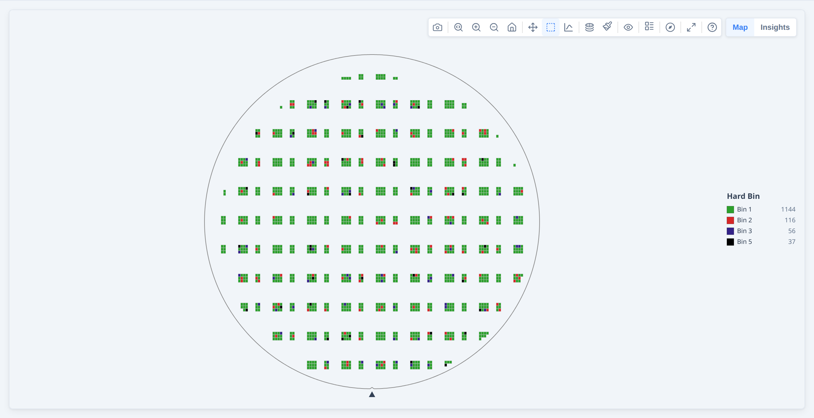

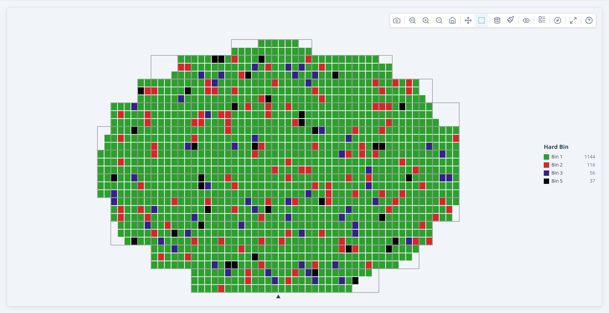

*The same synthetic wafer in the wafer view and in the compact layout.*

- **Nothing is left out.** Only the arrangement changes. Every die is still drawn and counted, so the legend, yield
  and statistics are the same as in the wafer view. A die that has no bin (for example one that carries metadata only)
  keeps its place, shown in the no-data grey.
- **Coordinates stay original.** Hovering a die and the axis labels give its real die coordinates, not its position
  in the compact grid.
- **Orientation.** The notch marker shows the wafer orientation and follows rotation and flips. The **XY indicator**
  works as it does on the wafer view, drawn in a margin beside the grid.
- **No wafer outline.** The wafer circle, ring boundaries, quadrant lines and reticle grid describe the physical
  wafer, which the compact grid no longer follows, so those rows are greyed out while the layout is on.
- **Galleries.** All cards share one layout, built from every wafer shown, so wafers can be compared cell for cell.
  Each card is as tall as its map needs, so more of them fit on screen; a quarter turn swaps a card's width and height.
- **Axis labels.** With the Axis labels row on, the first column of each group of dies is labelled with its real die
  coordinate, which marks the reticle boundaries; zoom in far enough and every die is labelled.
- **When it is offered.** The layout is offered when the occupied columns and rows repeat. If you supply
  `reticleConfig`, it is offered when they repeat at the reticle width and height or a multiple of it (a product on every second reticle repeats at twice the width). Random missing dies do not repeat, so
  a wafer that merely has holes is not offered it. Developers can switch it on regardless with
  `viewOptions: { compact: true }`.

**Layout diagnostics** (also in the Overlays menu) shows what the detector saw as counts and scores only: it holds no
die positions, bins, test values or wafer names. If a layout is not recognised the way you expect, copy the text or save
it as a file and send it to whoever supports this software.

### Keyboard shortcuts

| Key                      | Action                                                  |
| ------------------------ | ------------------------------------------------------- |
| **E**                    | Open the map in an enlarged modal overlay               |
| **F**                    | Maximise / restore the modal (when expanded)            |
| **Esc**                  | Close the expanded modal, or clear the die selection    |
| **Ctrl / Cmd + click**   | Add a die to the current selection                      |
| **Right-click**, **Menu key** or **Shift + F10** | Chart the selected dies, or the whole wafer (see [Section 4.4](#44-charting-dies-and-wafers)) |
| **Mouse wheel / scroll** | Zoom in and out at the cursor                           |
| **Ctrl / Cmd + `+`** / **`-`** | Zoom in / zoom out                                |
| **Ctrl / Cmd + `0`**     | Reset zoom to the fitted view                           |
| **Arrow keys**           | Pan the map                                             |
| **Space (hold) + drag**  | Temporarily pan without leaving the current tool        |

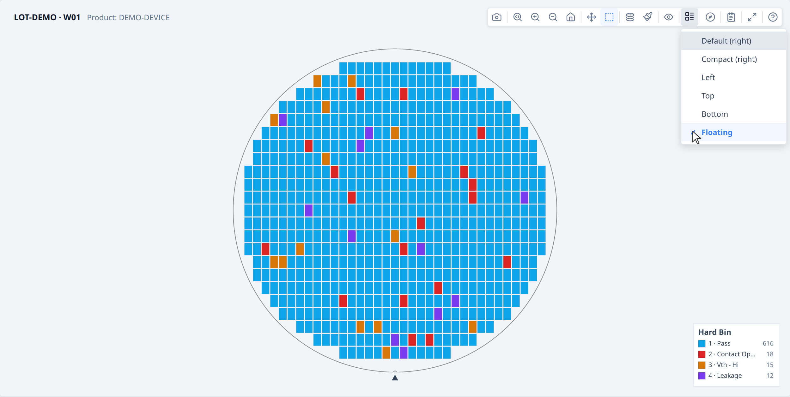

### Gallery

The gallery control bar applies to all cards simultaneously.

|                                                              | Control       | Description                                                                                                                                                                        |
| ------------------------------------------------------------ | ------------- | ---------------------------------------------------------------------------------------------------------------------------------------------------------------------------------- |
|      | Plot mode     | Switches the plot mode for all cards.                                                                                                                                              |
|  | Overlays      | Toggles display layers for all cards simultaneously.                                                                                                                               |
|   | Colour scheme | Picks bin colours (bin modes) or value colours (other modes) for all cards, including **Reverse gradient**.                                                                                                         |
|    | Orientation   | Opens the rotate/flip controls, applied to all cards.                                                                                                                              |
|   | Columns       | Sets the number of columns. **Auto** fits as many cards as stay readable; a number divides the full width between that many columns.                                             |
|  | Select on every wafer | A toggle. Off (the default), each card selects on its own. A badge counts the selected die positions; clicking the button while something is selected clears it. On, a box, a click or a clear on any card applies to every card at the same die positions, so a region is read lot-wide; right-click then opens charts and tables of those dies across all the wafers (see [Section 4.3](#43-box-select)). |
|  | Save image    | Downloads the full gallery grid as a single PNG.                                                                                                                                   |
|  | Aggregation method | Stacked modes only. Selects how values from multiple wafers are combined per die position: Mean, Median, Std Dev, Min, Max, or Count. |
|  | Log scale     | Test Value and Stacked Test Values modes only. Applies a log₁₀ scale to the colour mapping for all cards. |
|  | Legend style  | **Legend on each map** adds a legend to every card as well as the shared one above the grid (off by default). While it is on, bin modes also let you choose where that legend sits on each card. |
|  | Colorbar range | Test Value mode with test limits only. Toggles all cards between the limit range and the data range. Leave it on the test limits when comparing wafers — the data range rescales per view. |
|  | Summary panel | Opens or closes the Summary panel covering every wafer in the gallery.                                                                                                           |
|  | Data warnings | Appears only when something is worth reporting about the wafers shown. Collected across every wafer and de-duplicated, so a problem affecting all of them is stated once rather than repeated per card. |
|  | User guide    | Opens this guide. |

Right-click a card anywhere outside its map to chart that wafer on its own — a
histogram, process capability or a sweep (see
[Section 4.4](#44-charting-dies-and-wafers)).

Click a card's expand button to detach it into its own separate window with the
complete single-map toolbar (falls back to a floating window inside the page if
separate windows aren't available in your environment). The vacated grid card
becomes a placeholder whose own button reattaches it; closing the detached
window does the same.

---

## 4. Interacting with dies

### 4.1 Hover

Hovering over a die shows a compact tooltip. It always includes the die grid
coordinates (x, y), and a retest count if the die was probed more than once.
The rest depends on the active plot mode:

- **Bin modes** — the die's bin verdict (number and name, if named), plus a
  note of how many test values are recorded for the die
- **Test Value mode** — the active test's value in bold, flagged when it is
  outside the test limits, with the remaining tests summarised as "+N more tests"
- **Stacked modes** — the single aggregated value or count at that position

### 4.2 Zoom and pan

Scroll to zoom in and out. To pan, hold **Space** and drag, use the arrow keys,
or choose Pan mode in the toolbar so that a plain drag pans. The toolbar also
provides dedicated **Zoom mode** (drag to draw a zoom region), **Zoom in**,
**Zoom out**, and **Reset zoom** buttons. Tooltips and die selection remain
accurate at all zoom levels.

### 4.3 Box select

Click and drag on the map to draw a selection rectangle — Box select is the mode
a map opens in. Click a die to select just that die, and click it again to clear
it. The application may display statistics or details for the selected dies.
This is useful for comparing a sub-region against the full wafer.

Selected dies keep their full colour and every other die is faded, with an
outline round the selection, so it is clear which dies are selected whatever
their shape — a block, a ring or scattered dies. A finding highlighted from the
Summary panel is shown the same way.

Use **Ctrl / Cmd + click** to add or remove individual dies. Press **Esc**, or
click outside the wafer, to clear the selection.

**In a gallery**, each card selects on its own unless you turn on **Select on every
wafer** in the toolbar. Then a selection made on one card is made at the same die
positions on every card — draw a box round the edge ring, a scratch zone or a
reticle corner once, and see that region on all the wafers. Right-click (or use
the **Chart** menu) and the charts and tables open on those dies across the whole
lot: **Dies**, **Test statistics** and a **Wafers** table with one row per wafer,
each stating "selected at the same die positions on N wafers".

**Pick whole wafers instead** with **Ctrl / Cmd + click** on a card's header: the card is
outlined and the toolbar counts "N wafers picked ✕" (click it to clear). Right-click
one of the picked cards and the charts and tables open on every die of every picked
wafer, with a **Wafers** table. Dies selected on a map take precedence over a pick.

The button shows how many die positions are selected. **Clear it** by clicking an
empty part of any map, pressing **Esc**, or clicking the button itself (it clears
the selection and stays on); a second click turns the mode off. Turning it off
always clears the selection on every card.

*A block of dies near the centre is shown pre-selected. Drag on the map to make
your own selection, or Ctrl/Cmd + click individual dies.*

### 4.4 Charting dies and wafers

**Right-click** a population to open a menu of charts and tables drawn from just
those dies. Picking one opens it in a window over the map. This is how you look at a
cluster, a scratch or an edge region on its own, or at one wafer out of a lot.

What you right-click decides the population:

- **Selected dies** — select some dies, then right-click on the map. Right-
  clicking a die that is **not** selected selects that die alone first;
  right-clicking a selected die, or empty space, keeps the selection.
- **Dies selected on several wafers of a gallery** — by clicking a finding, or by selecting on more than one card.
  Right-click a selected die on any of those cards and the menu opens on every selected die, with a first row,
  **Only this wafer**, that narrows it to the dies selected on the card you clicked (and **All selected** to go back).
- **A bin in the legend** — right-click its entry, on a map's legend or the gallery's lot legend. The menu opens on that
  bin's dies (on this wafer, or on every wafer for the lot legend), and nothing is selected: the legend only filters what
  is drawn. With several bins filtered in, right-clicking one of them opens on all of them, with an **Only bin N** row to
  narrow it (and **All filtered bins** to go back). On the lot legend the Menu key or Shift + F10 works on a focused entry.
- **Plots and sweeps you have saved** — they open in their editor over just those dies, so you can change one there; the
  change is saved to the plot.
- **A finding** — right-click it in the Summary panel. If it is not already shown, its dies are selected first, then
  the menu opens on them: on all the wafers of a gallery that the finding selects dies on. A finding that is about
  whole wafers and selects no dies (a wafer's yield) opens the menu on those wafers.
- **A whole wafer** — right-click empty map space with nothing selected, a
  gallery card anywhere outside its map (its header, the space around the map),
  or one wafer's bar, box or point in an Insights chart (*Yield by wafer*,
  *Test value distribution*, *Wafer-to-wafer trend* — their tooltips say
  "right-click to chart this wafer").
- **Dies dragged out of the Correlation scatter** — across any number of wafers.
  The menu then also offers a **Wafers** table, one row per wafer the dies fall on.

On the map you can also press the **Menu** key or **Shift + F10**, or use the
**Chart** toolbar button, which charts the selection when there is one and the
wafer otherwise.

The menu offers:

- **Value histogram** — one test's distribution, opening on the test the map
  is showing. **Edit as new plot** beside its population line closes it and
  opens the same test as a draft plot over the same dies, to change its axes, colour or limits and keep it if you want.
- **Process capability** — every test normalised to its spec limits, or its
  test limits when it has none, with its
  Ppk. Below 30 dies the chart says each Ppk is a rough estimate: a Ppk from a
  handful of dies can be far from the process's real capability.
- **Plots** you have saved, sweeps included (see [Plots](#plots) and [Sweep cards](#sweep-cards)), and **New plot…** and **New sweep…**.
- **Dies** and **Test statistics** — the same tables as Insights' Data tab (see
  [Data tables](#data-tables)), over just these dies: every die as a row, or the
  Test Values and Functional Tests tables. Each has Export CSV and Copy, and a
  saved file carries the population ("selected on W03") in its name and in a
  Wafer column, so it cannot be mistaken for the whole lot.

What every chart opened this way does:

- It states its population — how many dies and which wafer they came from — in
  its title and above the plot, so it cannot be mistaken for a chart of the
  whole lot. Partial and edge-excluded dies are left out, as they are
  everywhere else, and the chart says how many that was.
- It is a **snapshot**: changing the selection afterwards does not change a
  chart that is already open.
- A chart that cannot be drawn from the population stays in the menu, greyed,
  with the reason — for instance when none of the dies has values for its tests,
  or when the map is a lot stack, whose dies are averages across wafers rather
  than measured dies.

A map with only bin data has no charts to draw, but its menu still opens with
**Dies**: the selected dies, or the whole wafer, as a table.

---

## 5. Findings panel

When spatial analysis has been run, the **Findings** panel lists statistically
detected patterns on the wafer. Open it from the toolbar.

Each finding shows:

- **Severity** — Unusual, Notable, or Minor (ordered most to least significant)
- **Description** — plain-language summary of what was detected and where
- **Click to highlight** — clicking a finding fades the rest of the wafer and outlines the
  affected dies. A finding about a bin also filters the legend to that bin, so the legend
  always names what the finding describes; a finding about yield or a test clears the
  filter. Changing the selection or the legend filter yourself releases the finding.

**Severity** reflects how strong the statistical evidence is. *Unusual* findings
have both a very low adjusted p-value and a large effect size — they are reliably
important. *Notable* findings are statistically significant with a meaningful
effect but not as extreme. *Info* findings pass the significance threshold at
lower strength and are worth reviewing but may reflect smaller or noisier patterns.

*Findings panel open showing a detected edge-ring pattern. Click any row to
highlight the affected dies on the map.*

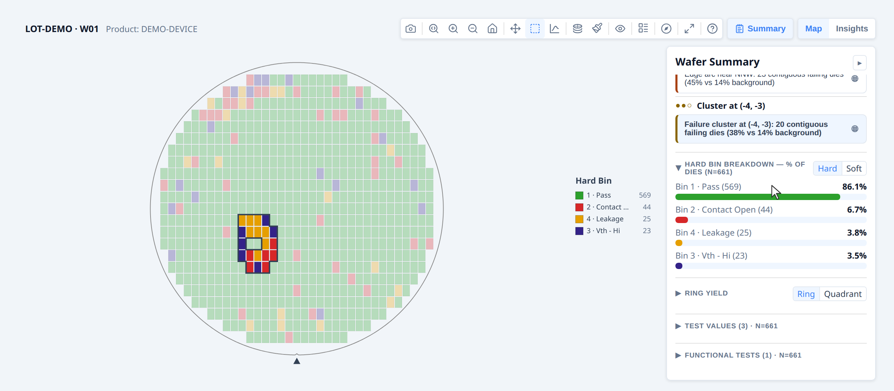

*A failure cluster finding: the rest of the wafer is faded, so the affected dies stand out, with an outline round them.*

### Finding types

| Type                 | What it indicates                                                                                   |
| -------------------- | --------------------------------------------------------------------------------------------------- |
| **Ring**             | Yield or value difference between radial bands — e.g. centre vs edge gradient                       |
| **Quadrant**         | Yield or value difference between N, S, E, or W quadrants                                           |
| **Sector**           | Asymmetry across finer angular slices — rotational bias or directional process variation            |
| **Test-site**        | Yield or value difference between parallel probe sites on the same wafer                            |
| **Reticle position** | Yield signature repeating at specific stepper field grid positions                                  |
| **Cluster**          | Contiguous group of failing dies denser than the background failure rate                            |
| **Edge arc**         | Localised arc of failures near the wafer perimeter                                                  |
| **Spatial pattern**  | Classification of an identified cluster shape — e.g. Donut, Scratch, Centre, Edge-localised, Random |

Which finding types are active depends on the application's analysis
configuration.

When a spatial pattern classification is detected alongside supporting regional
findings (ring, quadrant, sector), the panel groups them together — the pattern
classification is the primary finding and the regional findings provide
supporting detail.

---

## 6. Summary panel

The Summary panel docks next to the map and gives you the wafer or lot at a
glance, with findings sitting directly under the headline numbers so a clicked
finding can highlight the affected dies right there. Open it from the toolbar, or from
the **Summary** tab on the edge of the map area, which shows while the panel is closed.

*The Summary panel open alongside a single wafer. Click any finding to
highlight the affected dies.*

Sections, top to bottom:

- **Summary** — die and wafer counts, yield, and the population the rest of the
  panel is computed over. For several wafers the heading names them: **Lot
  LOT123 · 13 wafers** when every wafer comes from that one lot, otherwise
  **26 wafers from 2 lots** (or just **13 wafers** when the data records no lot).
  The panel only says "lot" when it really is one lot. "Mean per-wafer yield" is an
  *unweighted* mean of each wafer's own yield; it is deliberately not the same
  statistic as the bin breakdown's pass-bin share, which weights every die
  equally. The two agree only when die counts are even across the wafers.
- **What stands out** — the headline (the yield, and for a lot its spread across
  wafers), then the items ranked by how many dies each costs: the largest in a tinted
  box with its full sentence, the others as a compact list (impact, name, and share of the dies).
  Anything costing less than 1% of the dies is left to the findings list. A line says what
  was compared. An item names a region, a wafer or a test and, for a region, the failing bins that make up
  its shortfall; a test is an item when it is outside its limits (or a functional test
  fails) on a share of the dies that clears the same floor. Its three dots and word (High, Moderate or Low impact) say how
  much of the lot it costs: the higher of its share of all the dies (2% moderate, 4% high)
  and its share of the dies that fail (15% moderate, 40% high), so a small area that is most
  of a good lot's loss still reads as high. Click a name to highlight that finding on the map.
  A **Watch** line (at most two) follows for things that cost no dies yet: a lot of five or more
  wafers whose yield, or a test's mean, trends up or down across the wafers *in the order given*
  (said as "input order": the order is only a physical one if you know it is), and a test whose
  Ppk against its limits is under 1.0.
  A wafer or lot with nothing over a yield point says so: "Nothing stands out".
  The reports open with the same section, and **Full report** at the foot of it opens the
  report; in a report opened from the panel, clicking a finding's row shows it on the map.
- **Findings** — detected anomalies, most severe first, each group marked with
  three dots filled by severity (Unusual, Notable, Minor). Severity chips narrow
  the list; Kind and Region dropdowns appear once there are enough findings to
  be worth narrowing. **Detail** opens the same sentences above a readable list.
- **Bin breakdown** — bars as a share of dies, pass bins first and then failing
  bins by descending count, so the dominant failure mode is at the top. It
  follows the map's plot mode: a soft-bin map gets a soft-bin breakdown. When a
  wafer carries both bin types, a **Hard / Soft** selector in the section header
  overrides that.
- **Region yield** — ring yield by default, with a **Ring / Quadrant** selector.
  Each row prints its difference from the wafer's yield in points and is tinted
  when it is 1, 2 or 4 or more points below it (nothing above is tinted).
  Ring is the default because edge roll-off is the pattern that dominates real
  wafer maps; a genuinely asymmetric quadrant is reported as a finding above,
  with a significance test behind it.
- **Wafer yield** (several wafers only) — one bar per wafer with the median
  marked, each row's difference from the median in points, and a tint when it is
  1, 2 or 4 or more points below it. Wafers are in slot order by default, since that is what makes a
  slot-correlated pattern visible; a **Slot / Yield** selector re-sorts. Wafers
  well below or above the rest are labelled "low outlier" or "high outlier"
  (3 or more wafers, and at least 3 points from the median — the same rule as the
  outlier-wafer findings).
- **Test values** — per test: mean, **Ppk**, and limit yield. Ppk (not Cpk)
  because it measures against the *overall* spread, including wafer-to-wafer
  variation, which is what the dies actually ship against. The full descriptive
  statistics — min, quartiles, median, max, σ, both test limits, and all four
  capability indices — are in the CSV export, and the wafer summary report shows
  N, min, quartiles, median, mean, max, σ and limit yield (a lot's report has N, min, mean,
  max, σ and limit yield: quartiles cannot be combined from each wafer's own). Both reports
  also carry the full Cp, Cpk, Pp and Ppk table.
- **Functional tests** — pass/fail counts and pass rate per functional test.

Every section header can be collapsed, and stays collapsed as the panel
re-renders.

A **Summary report** button (when present) opens a printable full-detail
report — yield, bin breakdown, ring and quadrant statistics, the full per-test
table with Cp/Cpk/Pp/Ppk, and the findings list — and can be saved as a PDF
from your browser's print dialog. It opens with **What stands out**: the yield,
up to three regions, fail bins or wafers ranked by how many dies each costs, and a
line saying what was compared. An item is listed only when it costs at least one
yield point of the dies analysed; a lot with none says so. Each figure links to its
row in the Findings table below. Severity is drawn as three dots and a word, so it reads in a
black-and-white print; yields carry a bar, and a wafer or region is tinted only when it is
at least a point below the rest.

A **Data tables** button beside it opens the same tables as Insights' Data tab ([Data tables](#data-tables)) over this wafer, or over the whole lot in a gallery: Statistics, every die, and, for a lot, one row per wafer — each with Export CSV and Copy. It does not need Insights to be switched on.

### Why some findings name two bins

A finding may read **"hard bin and soft bin 3 (Fail) (same dies)"**. That is one
group of dies counted in two bin spaces, not two separate groups added together.
(When the two bins carry different names, both are spelled out in full.)
Hard and soft bins are independent numbering systems, so this wording appears
only when the two happen to cover exactly the same dies — reporting it twice
would look like two independent problems.

For the same reason, when a single pass bin is configured you will see the
**yield** finding for a region but not a separate finding for the pass bin
itself: "pass-bin occurrence is 22 points lower" and "yield is 22 points lower"
are the same sentence.

Nothing is discarded — an application reading the findings programmatically
still receives every one of them.

For **lot-level views** (gallery), the panel shows lot-level findings, and the
**Wafer Yield** section badges each wafer with its own findings count — click a
row to open that wafer. There is no separate wafers tab: every wafer appears in
that one list, including the ones with no findings, which is what lets you see a
low-yielding wafer that nothing flagged.

---

## 7. Lot-stack maps

A lot-stack map combines multiple individual wafer results into a single
composite view. The display clearly identifies this: the number of wafers
included and the aggregation method in use are shown in the panel header
(for example, "3 wafers · mean") so you know you are not viewing a single
wafer's data.

Individual die coordinates are preserved. For each die grid position, results
from all wafers are aggregated into a single value or bin count according to
the selected aggregation method.

### Stacked plot modes

Switching to a stacked mode changes what each die's colour represents:

| Mode                    | What the colour shows                                                                             |
| ----------------------- | ------------------------------------------------------------------------------------------------- |
| **Stacked Hard Bins**   | For each die position, the count of wafers on which that bin appeared — one card per bin category |
| **Stacked Soft Bins**   | Same as above, for soft bin categories                                                            |
| **Stacked Test Values** | For each die position, an aggregate of the test measurement across all wafers                     |

### Aggregation method

In **Stacked Test Values** mode, use the **Aggregation method** toolbar button (Σ)
to choose how values from each wafer are combined at each die position:

| Method      | Result                                                           |
| ----------- | ---------------------------------------------------------------- |
| **Mean**    | Average value across all wafers                                  |
| **Median**  | Middle value — less sensitive to outliers than mean              |
| **Std Dev** | Standard deviation — shows where values vary most across the lot |
| **Min**     | Lowest value seen at that position                               |
| **Max**     | Highest value seen at that position                              |
| **Count**   | Number of wafers with data at that position                      |

### Gallery stacked modes

In a gallery, stacked modes are always available in the control bar. Switching to
a stacked mode shows one card per bin category or per test parameter, aggregated
across all wafers in the gallery.

*Stacked Hard Bins mode: each die position is coloured by how many wafers had
bin 1 (Pass) or bin 2 (Fail) at that location.*

---

## 8. Insights tab

The **Insights** side of the **Maps | Insights** switch (at the far right of the toolbar row, single map or
gallery) swaps the wafer view for a chart suite computed from the same die data — without leaving the
toolbar. Choose **Maps** to return to the map; the switch stays where it is. Independent of the Findings
sidebar (Section 6) — the two toggle independently, and opening one never
hides the other's toolbar button, since Findings has nothing to highlight
against once the map is replaced.

Any chart mark that stands for one wafer — a bar in *Yield by wafer*, a box in
*Test value distribution*, a point in *Wafer-to-wafer trend* — can be
right-clicked to chart that wafer on its own (see
[Section 4.4](#44-charting-dies-and-wafers)); its tooltip says so.

Insights is organised into three chart sub-tabs, a **Data** sub-tab holding the
same numbers as tables (see *Data tables* below), and a **Plot** sub-tab for your
own charts and sweeps (see *Plots* and *Sweep cards* below):

- **Overview** — a **test pass rate** chart showing which test fails most (and,
  with "Group by" active, whether it fails more in one split than another). It
  offers up to three ways of judging, whichever the data supports: **Spec
  limits** (the value against its limits), **Tester flag** (the pass/fail the
  tester itself recorded, which a parametric test carries whether or not limits
  were exported), and **Functional** for pass/fail-only tests. The two
  parametric views can disagree — guard bands and dynamic limits routinely cause
  it — so the card reports how many dies the two judged differently rather than
  picking one for you. Alongside it, headline tiles stating the population (wafers, dies analysed,
  and for a lot the mean wafer yield — an *unweighted* mean of each wafer's own
  yield, not the die-weighted figure), a yield bar labelled with the pass bins
  actually in use and marked with the median, a hard/soft bin pareto, and
  ring/quadrant regional yield.
- **Distributions** — process capability (Cp/Cpk/Pp/Ppk for tests with both a
  lower and upper limit — spec limits where given, otherwise test limits; tests
  without both still appear, normalized
  onto their own range and sorted by variability), a test-value box plot, a
  value histogram, and a **wafer-to-wafer trend** — one point per wafer at its
  mean, ±1σ whiskers, the mean of all wafers dashed across (labelled the "lot
  mean" when they all come from one lot), and the test's limits. The trend is always in slot order, deliberately: drift across
  a cassette only reads in the physical sequence, so there is no sort control
  to destroy it. Clicking a capability box drives the box plot, histogram and
  trend onto that same test automatically.

  The box plot, histogram, trend and the Correlation tab's scatter draw the
  test's limits as dashed lines. A test can have two kinds: **test limits**
  (labelled *Lo limit* / *Hi limit*, short dashes) — what each die was judged
  pass/fail by — and **spec limits** (labelled *LSL* / *USL*, long dashes) —
  the process specification that capability is measured against. When a test
  has both, a **Limits** choice appears — *Test + spec* (the default), *Test
  limits*, *Spec limits* or *None* — and it applies to all four charts at
  once. A test that lacks the kind you chose shows the kind it has, so it
  never looks as if it had no limits; a limit that falls outside the plotted
  range is marked at the edge of the chart with an arrow.

  The box plot, histogram and trend share one row of axis controls, kept in
  sync across all three so switching between them never re-reads the same
  data on a different scale: **Axis includes limits** widens the axis to cover
  every limit shown even where the data sits well clear of them (on by default only when
  doing so still leaves the data at least a third of the axis — otherwise a
  generous limit window would squash a perfectly capable distribution into a
  sliver), and **Clip outliers** narrows the axis to a robust range (the
  Tukey fence, 1.5× IQR beyond Q1/Q3) so a handful of extreme values don't
  stretch the axis until the rest of the distribution reads as a flat line.
  Clipping affects the AXIS only — every reported statistic (mean, σ, Cpk,
  the box's own five-number summary) is computed from every value; nothing is
  excluded from the numbers, and the panel states how many points sit outside
  the visible range when some do. The box plot additionally has its own
  **Log scale** toggle, independent of the shared pair above (available once
  every plotted value is positive) — the histogram and trend charts do not
  offer one.
- **Correlation** — a test-to-test correlation matrix and a die-level scatter
  plot, both stating the sample size the coefficients are computed over.
  Clicking a matrix cell drives the scatter plot onto that pair, where `r` and
  `n` for that pair are printed and update as you filter the legend. Hover a
  point to see which wafer and die it is; **click** it to open that wafer on the
  X test. **Drag** a rectangle over the plot to select the dies inside it — across
  as many wafers as they fall on — and a menu opens with charts and tables of
  just those dies (see [Section 4.4](#44-charting-dies-and-wafers)). The
  selection stays ringed until you change the X or Y test or click empty space.

In a gallery with more than one wafer, a **Group by** control appears whenever
wafer metadata (lot, product, test program, temperature, split, or a custom
field) actually varies across the loaded wafers — grouping pools or restricts
each panel differently depending on what makes sense for that chart type.
Histogram, correlation, and scatter also offer a **Wafer** picker to narrow
from "all wafers pooled" down to one wafer at a time. Clicking a yield bar or
box-plot row for one wafer opens that wafer's own map — a box-plot click opens
directly on the test you were looking at.

*Insights tab open on a single wafer, Overview sub-tab: yield and bin pareto and
ring/quadrant yield — all computed from this wafer's own dies. The Distributions sub-tab has process capability, a test-value box
plot and histogram; Correlation has a correlation matrix with scatter plot.
In a gallery, Overview also gains a "Group by" control and per-wafer
yield/box-plot rows.*

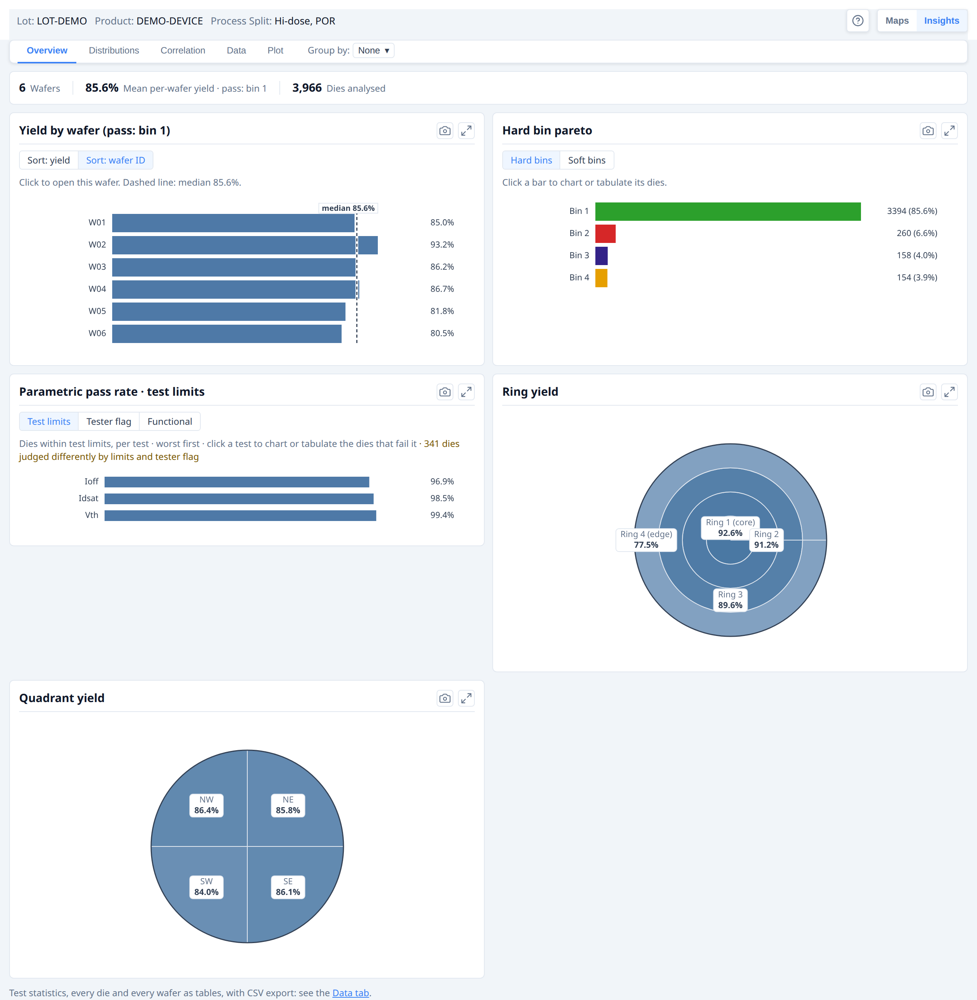

*Gallery Insights, Overview sub-tab: lot-wide yield by wafer (click a bar to
open that wafer's map), hard/soft bin pareto, and ring and quadrant yield. The **Maps | Insights** switch at the top left (it does not move between the two views) returns to the card grid.*

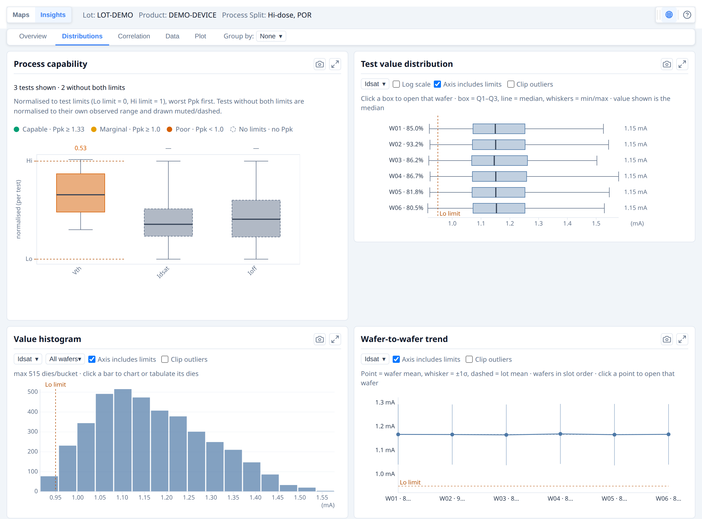

*Distributions sub-tab: process capability (coloured by Ppk — green capable,
orange marginal, red poor; tests without limits are muted and dashed), a
per-wafer test-value box plot, and a value histogram. Clicking a capability
box drives the box plot and histogram onto that test.*

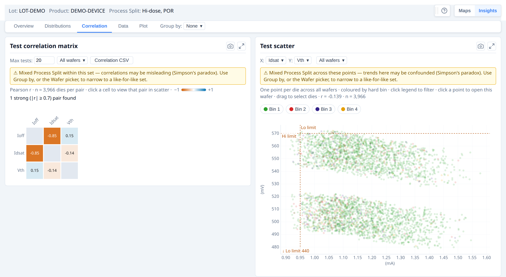

*Correlation sub-tab: test-to-test Pearson correlation matrix (blue =
positive, orange = negative; intensity = strength) and a die-level scatter
plot coloured by hard bin. Clicking a matrix cell drives the scatter plot
onto that pair.*

### What a click does

Every mark on an Insights chart stands for something, and a click opens it:

| Click | Opens |
| --- | --- |
| A wafer's bar, box or point (Yield by wafer, the box plot, the trend, the scatter, a Plot-tab chart) | that wafer's map, on the test the chart is about (the bins, for Yield by wafer) |
| A **bin** in the bin pareto (or a sub-bar of the grouped one) | the right-click menu on the dies in that bin |
| A **test** in a pass-rate chart | the menu on the dies that fail that test, judged as the card is |
| A bar of the **value histogram** (with Group by on, a column of it) | the menu on the dies whose values fall in that bar, across the groups, or in the one group the legend has emphasised |
| A level of a **sweep** curve | the menu on the dies measured at that level |
| A **drag** across the wafer-to-wafer **trend** | the menu on the dies of the wafers whose points the drag crossed (a click on a point still opens that wafer) |
| A **ring** or **quadrant** of the yield diagrams | the menu on the dies it counts |
| A cell of the correlation matrix | that pair in the scatter |
| A test in the process-capability chart | that test in the other distribution charts |
| A row of the **Wafers** table | that wafer's map |
| A row of the **Dies** table | that die, ringed on its wafer's map |

The menu offers the charts and tables for just those dies (and your own plots), and its heading names
them, for example "412 dies in hard bin 3, across 13 wafers". A mark that has no dies behind it does nothing.
Right-click on any wafer's bar, box or point opens the same menu for the whole wafer.

### Data tables

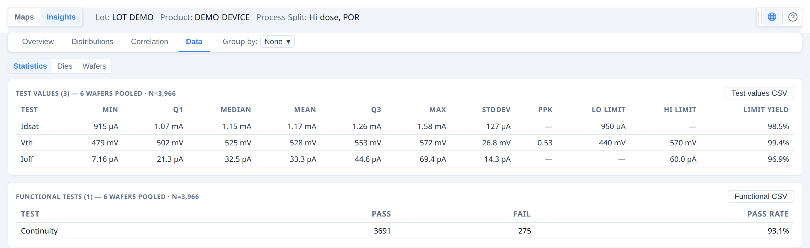

*Data sub-tab, Statistics view: the Test Values and Functional Tests tables for the lot, each with its own CSV button; **Dies** and **Wafers** are one click away.*

The **Data** sub-tab shows the wafers Insights is scoped to as tables, one at a
time, chosen with the **Statistics | Dies | Wafers** control. It follows the
same "Group by" and "Show" scope as the charts.

- **Statistics** — the **Test Values** table (count, min, quartiles, mean, σ,
  Ppk, limits and the limit yield for each test, with its N stated) and the
  **Functional Tests** pass-rate table. With "Group by" active there is one set
  per group.
- **Dies** — one row per die: wafer, X, Y, ring, quadrant, site, bins, a column
  for each test, and the wafer's metadata. Only the rows in view are drawn, so a
  lot of hundreds of thousands of dies scrolls smoothly. Click a column heading
  to sort by it (again to reverse; a die with no value sorts last).
- **Wafers** — one row per wafer: lot, split and any other metadata, the die
  counts, the yield (the same figure as the yield chart), and the mean of each
  test (the first 50).

In the Dies table, **click a row** to show that die on its map: the table steps
aside (or Insights closes) and the die is ringed, on its own card in a gallery. The
ring goes with the next click on the map, or Esc.

**Export CSV** saves the table as shown, in the order shown. Numbers are written
in full, as plain numbers, not as the formatted text on screen (`0.5123457`, not
`512 mV`), with the unit in the column heading. **Copy** puts the table on the
clipboard as tab-separated text, ready to paste into a spreadsheet; it is offered
for tables up to about 200,000 cells. For the Dies table, **Export format** (Wide | Long) chooses
the layout of the file: wide has a column per test, long has a row per die per
test (a die with no result for a test has no row), the shape statistics tools
prefer. The note under the buttons says how many rows the file will have, and
warns when that is more than a spreadsheet can open (1,048,576).

### Plots

The **Plot** sub-tab is where you build your own charts. **+ New plot** starts one,
already filled in with the first two tests of the lot, and opens it beside a large
copy of the chart. **Add examples** draws one plot of each chart type the lot can
show (a scatter of the first two tests, a histogram, a box, a bar of yield by the
first lot field that divides the wafers, a line over wafer order, and a sweep of the
first tests in test order), to start from
or to see what each type is for; pressing it again adds only what is missing. Every change you make there is drawn at once; there is no Apply
button, and the plot is kept as you go.

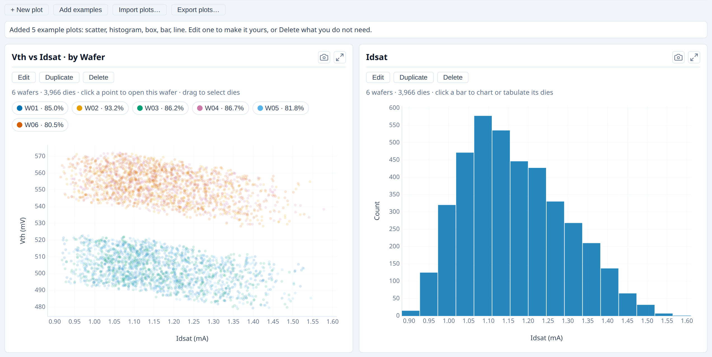

*The Plot tab after **Add examples**: each card is a plot, with Edit, Duplicate and Delete.*

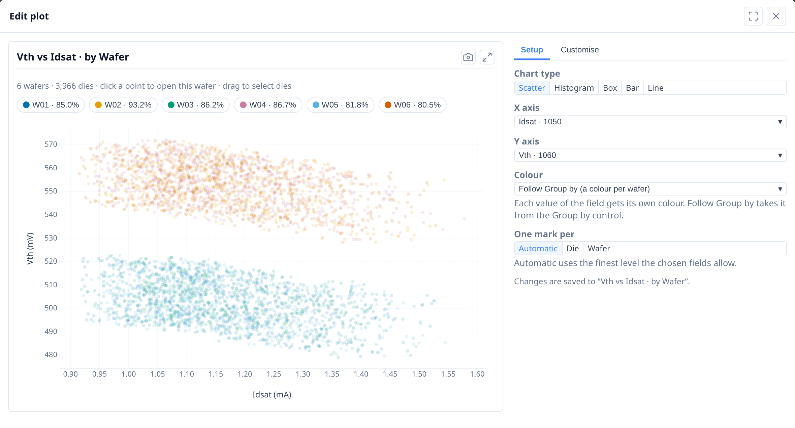

*Edit opens the plot large, beside its settings. Every change is drawn at once.*

In **Setup**, choose the **chart type**, then the field for each role:

| Chart type | What it shows | Fields |
| --- | --- | --- |
| **Scatter** | one point per die (or per wafer) | X and Y, both numbers |
| **Histogram** | how often each value occurs | the values |
| **Box** | quartiles, with whiskers to the minimum and maximum, for each category | categories (wafer by default), values |
| **Bar** | one aggregated value for each category (or a count) | categories, values (optional), how to combine them |
| **Line** | one aggregated value at each X, joined | X, Y, how to combine them |

- **X axis** and **Y axis** (a histogram has one **Values** field; a box or bar has
  **Categories** instead of a numeric X). Any measured test, a die's X or Y position,
  a wafer's yield or die count, or a lot field with numbers in it (slot, temperature).
  The list is grouped Tests · Die · Wafer and filters by name or test number, so with
  a few hundred tests you type `1050` or `vth` rather than scrolling. A field the chart
  type cannot use is not offered; switching type keeps your fields where they still
  apply and brings back the ones that did not when you switch back.
- **Colour**: a category such as wafer, split, hard bin, site or ring, or, on a
  scatter, a measured value or wafer figure drawn on a gradient (a colour bar under
  the title states its range). **Follow Group by** (the default) takes the colours from
  the Group by control above, so changing it recolours every plot that follows it;
  **None** draws one colour.
- **Combine values by** (bar and line, and any plot with one mark per wafer): mean,
  median, minimum, maximum, sum or count. **Pooled yield** is offered for Yield: it is
  the passing dies over the judged dies of all the wafers in a bar, not an average of
  their percentages (the plain mean of Yield is the mean of per-wafer yields, and is
  labelled so).
- **One mark per**: Automatic uses the finest level the fields allow. **Wafer** makes
  every mark a wafer, combining its dies' values as chosen above, which is how "mean
  Idsat per wafer against slot" is drawn. Yield can be split by a per-die field
  (ring, quadrant, bin, die position) in a **bar** (pooled yield per ring) or a **line**, which take the pass verdict of each die; a box,
  scatter or histogram of yield cannot, and says why.

When fields do not go together, the list says so before you choose: a field that would leave a plot that cannot be
drawn is dimmed in the **X**, **Y** and **Colour** lists with the reason after it, and does nothing when picked. A plot
that cannot be drawn says in words what is wrong and what to use instead.

In **Customise**, the **title** and each **axis title** are written for you until
you type your own (the box shows what it would say, and clearing it brings that
back). If you type a title and later change the fields, the plot says when the title
still names a test it no longer shows, or names only one of the two it does, with a
button to go back to the automatic title; a title that names none of the fields ("Process
check") is yours and is left alone. Each axis can have a **minimum**, a **maximum**, a **log scale** (offered
whatever the values, but it stays linear, and says so, if any value is zero or
negative) and **reverse direction**. A histogram also has a number of **bins**. A category axis has a title only.

When a plotted test has limits they are drawn as dashed lines on the axis that measures it (a histogram's values, a scatter's X or
Y, a box, bar or line's values when they are measured values or their mean, median, minimum or maximum): short dashes for the
test's own limits, long for its specification limits, each labelled with its value. The axis widens to include them when that
leaves the data at least a third of it, as in Insights, and a limit off the edge is marked there instead of vanishing. Choose
which are drawn under **Limits** in Customise. Where the wafers in view disagree about a test's limits none are drawn, as in
Insights: the reconciled test list drops conflicting limits.

Under every plot is a line stating what it shows: the wafers and dies, how values
were combined ("median of Vth per wafer"), and how many dies were left out for
having no value ("12 dies without Idsat not plotted"). A plot never drops a die
without saying so.

**Hover** a point, bar, box or line to see its values and how many dies or wafers it
stands for. **Click** a point (or a wafer's bar or box) to open that wafer, on the plot's own
test, so its map shows the values the plot is about and not the bins (a plot with no test in it,
like yield against wafer order, opens the default map). Click any other bar, box, histogram bar or
line point to open the right-click menu on the dies it counts, and **drag** a rectangle over a
scatter to select the dies (or wafers) inside it. The selection opens the same
right-click menu as on a map, so a few dies from a plot can be charted and tabulated
in turn.

**Keeping your plots.** A plot is a recipe, not a picture: it says which fields go
where, and nothing about which wafers. It is therefore kept by your application
between sessions and drawn again on the next lot. If you open a lot that lacks a
test a plot needs, the plot stays in the list, dimmed, with the reason ("Needs test
3001 (Leak), which is not in these dies"); it is not removed. **Export plots…**
writes them all to a file, and **Import plots…** adds the plots of such a file to
yours, as copies where a plot with the same identity already exists, never
replacing one. Each card has **Edit**, **Duplicate** and **Delete**; a deleted plot
can be restored with **Undo** for ten seconds. **Delete all plots…** removes every
plot, sweeps included, after asking you to confirm (the question says how many, and
that **Export plots…** first keeps a copy); **Undo** restores the whole list for ten
seconds. It is dimmed while there are no plots.

**Three different ways to divide the data, kept apart.** A plot divides data in
three places, and they do different jobs, so neighbouring plots can ask different
questions:

| What it decides | Where | Kept with the plot? |
| --- | --- | --- |
| The categories on an axis | the plot's own **X** field | yes |
| The colour series within it | the plot's own **Colour** field | yes |
| Which wafers are in view | the **Show** control above | no, it is the scope |

**Plots in the right-click menu.** Every saved plot is also a row in the menu that
opens on a selection or a wafer (**Plots** section), drawn over just those dies and
captioned with them.

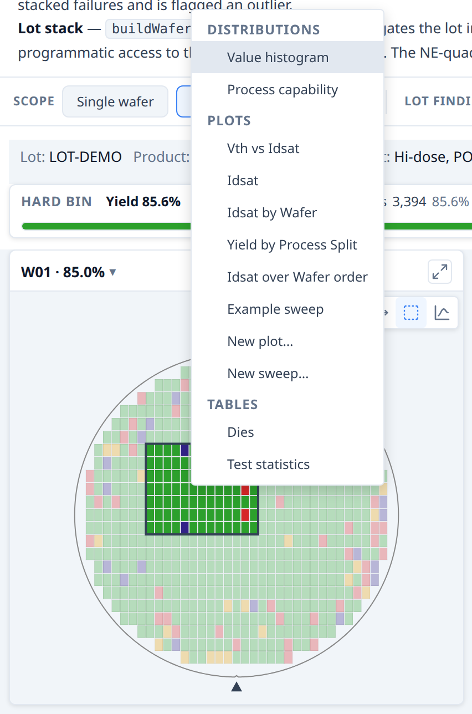 **New plot…** and **New sweep…** in the same menu start a draft on the selection;
a draft is kept only if you press **Add to my plots**.

Every change is kept as you make it. If you make a mistake, **Reset** (under the settings) puts the plot back as it was
when you opened the editor, and **Cancel** does the same and closes it. Closing the window with its own button keeps what
you changed.

### Sweep cards

A **sweep** is a card on the **Plot** sub-tab, beside your other plots. **+ New
sweep** starts one on the first tests of the lot, and **Edit** opens it beside a
live copy of the curve. A sweep is kept, duplicated, deleted, exported and
imported like any plot, and is offered in the right-click menu's **Plots**
section. It exists for a test program that measures the same quantity at a
series of drive levels and records each level as its own test number — often one
block sweeping up and another sweeping down. Read one test at a time that is a
row of unrelated distributions; read as a sweep it is a pair of response curves,
and the card measures the pair.

**Each line is the population median, with a shaded p10–p90 band** — not one
trace per die. A lot is thousands of dies, so per-die traces would be a solid
block of ink. The band is the spread across the dies currently in scope, so a
band that widens at one end of the sweep is telling you the population disagrees
most at that level.

**The dies behind it are whatever Insights is scoped to.** A sweep names tests,
not dies — so the group or wafer selected in the panels above it decides the
population, and the card's die count states what that came to. To sweep a
hand-picked set of dies instead, select them on a map and right-click (see
[Section 4.4](#44-charting-dies-and-wafers)).

Two measurements are drawn on the plot and restated underneath:

- **Crossing** — where the first two curves meet. If they cross more than once
  the card says so rather than reporting the first as though it were the only
  one.
- **Separation** — the horizontal distance between the two curves at the levels
  the application asked about. With one curve rising and one falling the pair
  traces a V, and this is the width of that V. A level that one of the curves
  never reaches reads **not measurable**, naming the curve — never `0`, which
  would read as "they meet here".

Only the **first two** curves are measured. Any further ones are drawn for
context.

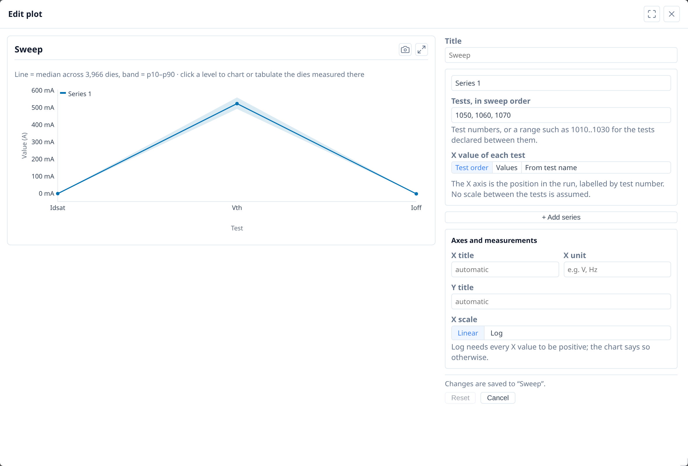

**Editing a sweep.** The editor has a title, one block per series, and the axis
and measurement settings. For each series, type its **tests in sweep order**:
test numbers and ranges, such as `1010, 1011, 1020..1030` (a range means the
tests declared between its ends). Then choose where each test's X comes from:
**Test order** (the position in the run, labelled by test), **Values** (one
number per test, in the same order) or **From test name** (a pattern such as
`LRS_STATS_{x}`, for programs that record the swept value only in the test
text). The editor lists the first few test names with what your pattern reads
from each as you type, and **Pattern examples** shows worked ones: `@ {x}`
reads 0.55 from `Fmax @ 0.55 V`, and `-{x}` reads 5 from `1234-5`). Text that is not a test number or a range is flagged under the box,
naming the word, and is not applied, so the curve beside it never shows
something you did not mean. **+ Add series** adds a curve and **Remove** drops
one; the crossing and widths appear once there are two.

**A sweep remembers what its tests were called.** The editor and **+ New sweep** record each test's name
alongside its number. Open the sweep on a lot where a number now carries a different name (a test program that
reuses numbers for other measurements) and that test is not drawn: the card names it, and the crossing and widths
are not measured, rather than presenting another quantity as the original curve. Renaming a test in the selector
has the same effect. A sweep written by hand, or imported from a file without names, is not checked.

**The x axis is the sweep, not the lot** — that is what distinguishes this card
from the wafer-to-wafer trend, which walks one test across wafers. If the
application supplied the real swept quantity, the axis is in those units (dBm,
volts, °C) and the crossing is reported in them. If it did not, the axis is the
position in the sequence, labelled by test, because test numbers are identifiers
— treating them as a scale would invent spacing the data never claimed.

Some sweeps step by multiples — thresholds of 1k, 2k, 5k … 1M — and are drawn
on a **logarithmic** x axis, so each step gets the same room. There the crossing
is found along the log axis, and a width is given as a **ratio** between the two
curves, with the level each reaches: *×2.49 (15.9 kΩ → 39.7 kΩ)*. On a log axis
the same shift is the same multiple anywhere along it, which a difference in Ω
would hide.

The card footer reports anything that limits what you are seeing: tests in the
sweep that have no definition, functional (pass/fail) tests inside a sweep,
which have no value to plot, and series whose tests carry different units.

If the swept values no longer line up with the tests — usually because a test in
the sweep is missing from this data — the footer lists the tests it did find, and
the card is drawn in test order with **the crossing and widths not measured**.
Pairing the remaining values with the remaining tests would put every later point
at the wrong level, which gives a plausible curve and a wrong crossing.

### Exporting a chart

Every chart panel has a **camera** button that saves the current view as a PNG at the displayed
resolution. To get a clean full-resolution render, use the panel's expand (corner-arrows)
button first to open it in the fullscreen modal, then click the camera button.

The saved image is the chart as shown, under a header that says what it is: its **title**,
what its controls are set to (**Test: vth_n_mV · 1001**, **Wafer: W03**, **Sort: yield**), the
lines the chart states about itself (the population and N, how values were combined, what
the box and whiskers mean, how the bars are normalised), and its colour key (the legend, or
the colour bar's name and range). The instructions that only make sense on screen ("click a
point to open this wafer") are left out. A chart on the **Plot** tab carries the line stating
its wafers and dies in the same place. The image takes the card's own background, so a dark
theme saves a dark chart. The file name identifies the lot, wafers and chart (see below).

**Printing.** The dropdowns, toggles and buttons (camera, expand and, on the Plot tab, New
plot, Add examples, Import, Export, Delete all, Edit, Duplicate and Delete) are left off the printed page.
In their place each chart prints a small block under its title giving the same settings and
lines as the saved image, so a printed histogram says which test it is of.

### Names of saved files

Every image and CSV you save is named for what it shows: the lot, then the wafer (or how many
wafers), then the content. For example, `LOT123_W05_hard-bin.png`, `LOT123_W05_die-list.csv` or
`LOT123_25-wafers_yield-by-wafer.png`. Saving the same export from different wafers gives
different names, so files don't overwrite each other or need renaming. A part is left out when
the data doesn't have it, for example a wafer with no ID. Your application may choose its own
name for map images instead.

---

## 9. Reticle overlay

When reticle (stepper field) geometry is configured, the **Reticle grid** overlay
draws the stepper field boundaries on the wafer. Each rectangle represents one
exposure field from the lithography stepper — the group of dies exposed in a
single step. This lets you correlate failure patterns with specific reticle
positions — useful for identifying stepper field signatures, alignment drift, or
mask defects.

Reticle-position findings in the Findings panel highlight the specific field
positions that show elevated failure rates. Hovering any die also shows its
**Reticle (column, row)** position — its location within its own stepper
field — just below the die's coordinate in the tooltip.
